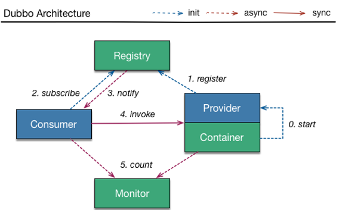
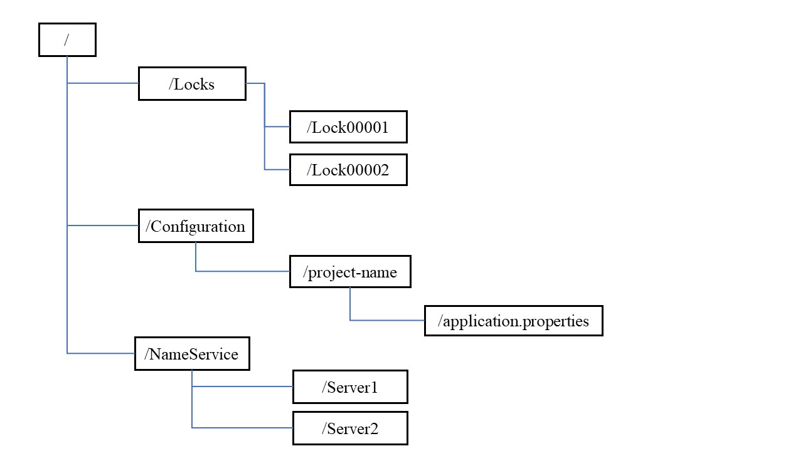
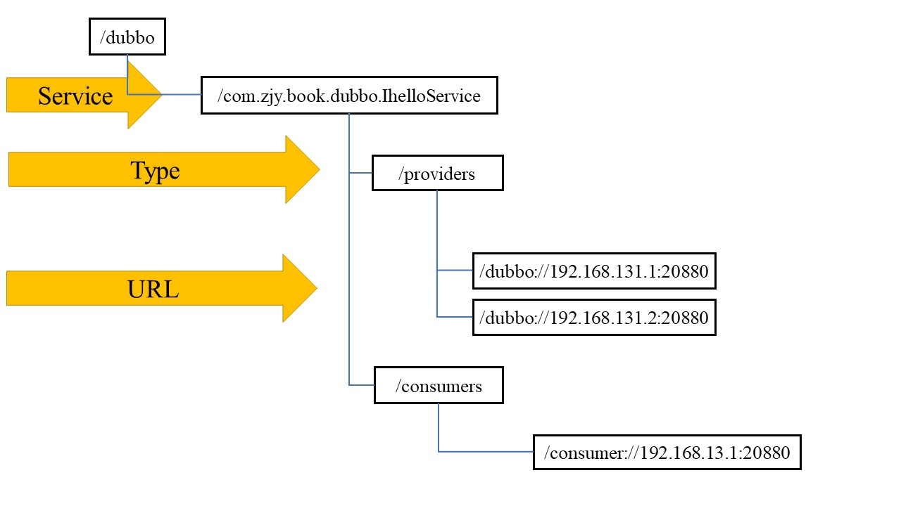

# Dubbo、Zookeeper功能

内容来自《Spring Cloud Alibaba 微服务原理与实战》，第四章，微服务架构下的服务治理

5.12号人生中第一次互联网面试，美团的暑期实习，面试官问了我关于Dubbo和Zookeeper的相关作用，特别是zookeeper，感觉答得不是特别好，特此看看书记录一下

[TOC]


## Dubbo

Apache Dubbo是一个分布式服务框架，主要实现多个系统之间的高性能、透明化调用、简单来说它就是一个RPC框架，但是和简单的RPC框架不同的是，它提供了服务治理功能，比如服务注册、监控、路由、容错等

促使Dubbo产生有两个原因：

1. 大规模服务化之后，服务越来越多，服务消费者在调用服务提供者的服务时，需要在配置文件中维护服务提供者的URL地址，当服务提供者出现故障或者动态扩容时，所有相关的服务消费者都需要更新本地配置的URL地址，维护程本很高；**这时，实现服务的上下线动态感知及服务地址的动态维护就显得非常重要了**
2. 随着用户访问量增大，后端服务为了支撑更大的访问量，会通过增加服务器来扩容；但是，哪些服务需要扩容，哪些服务需要缩容，需要有一个判断依据，也就是说需要直到每个服务的调用量及响应时间；**这时就需要一种监控手段，使用监控的数据作为容量规划的参考值，从而实现根据不同服务的访问情况来合理地调控服务器资源，提高机器的利用率**

从架构图可以看出，除了基本的RPC框架的职能，它的核心功能便是==监控及服务注册==




##  ZooKeeper

zookeeper是一个高性能的分布式协调中间件，作用类似于多线程环境中通过并发包来协调线程的访问控制，只是分布式协调中间件主要解决分布式环境种各个服务进程的访问控制问题，比如访问顺序控制；**需要强调的是，zookeeper并不是注册中心，只是基于zookeeper本身的特性可以实现注册中心这个场景而已**

### zookeeper的数据结构

zookeeper的数据模型和分布式文件系统类似，但不同的是zookeeper的数据是结构化存储的，并没有在物理上体现出文件和目录

```
1.分布式文件系统
分布式文件系统（Distributed File System，DFS）是指文件系统管理的物理存储资源不一定直接连接在本地节点上，而是通过计算机网络与节点（可简单的理解为一台计算机）相连；或是若干不同的逻辑磁盘分区或卷标组合在一起而形成的完整的有层次的文件系统。DFS为分布在网络上任意位置的资源提供一个逻辑上的树形文件系统结构，从而使用户访问分布在网络上的共享文件更加简便。单独的 DFS共享文件夹的作用是相对于通过网络上的其他共享文件夹的访问点。
2.结构化存储
结构化存储方法，是把树状文件系统的原理应用到单个的文件中，使得单个文件也能象文件系统一样包含"子目录"，"子目录"还可以包含更深层次的"子目录"，各个"目录"可以含多个文件，把原来需要多个文件存储的内容按树状结构和层次保存到一个文件中去的一种方法。
```

zookeeper树中的每个节点称为Znode，Znode维护了一个stat状态信息，其中包含数据变化的时间和版本等；每个Znode可以设置一个value值，zookeeper并不用于通用的数据库或较大容量的对象存储，它只是管理和协调有关的数据，所以value的数据大小不建议设置的很大

每个节点上的数据都是允许读写的；节点的创建规则和文件系统的创建规则类似，必须按照层级创建



### ZooKeeper特性

Znode创建时，需要指定节点类型。节点类型有：

1. 持久化节点，节点的数据会被持久化到磁盘
2. 临时节点，节点的生命周期和创建该节点的客户端生命周期一致
3. 有序节点，在创建的节点后面会增加一个递增的序列，该序列在同一级父结点之下是唯一的；持久化节点和临时节点都可以设置为有序节点
4. 容器节点，党容器节点下的最后一个子节点被删除时，容器节点就会被自动删除
5. TTL节点，针对持久化节点，设置一个存活时间，如果在存活时间之内该节点没有任何修改并且没有任何子节点，自动删除

### Watch机制

zookeeper提供了一种针对Znode的订阅/通知机制，就是当Znode节点状态发生变化或者zookeeper客户端连接状态发生变化时，会触发事件通知；这个机制在服务注册与发现中，对服务调用者及时感知服务提供者的变化提供了非常好的解决方案

### 常见应用场景

#### 分布式锁

Synchronized或者Lock主要解决多线程环境下资源访问的数据安全问题，但他们的处理范围是**线程**级别的；分布式架构中，是多个进程对同一个共享资源的访问，也存在数据安全问题，也需要用锁的形式来解决，就是分布式锁；锁的本质是排他性的，也就是避免在同一个时刻多个进程同时访问某一个共享资源

利用临时节点、同级节点的唯一性，来实现分布式锁

1. 获得锁

   获得排他锁锁时，所有客户端可以去zookeeper服务器上的`/Exclusive_Locks`节点下创建一个临时节点`/lock`，因为同级节点唯一性，会保证所有客户端中只有一个客户端能够创建成功，创建成功的客户端就获得排他锁，没有获得锁的客户端就要通过watch机制监听`/Exclusive_Locks`节点下子节点的变更事件，用于实时监听`/lock`节点的变化情况做出反应

2. 释放锁

   获得锁时，定义的锁节点为临时节点，一下两种情况可以触发锁的释放

   - 获得锁的客户端因为异常断开了和服务端的连接，基于临时节点的特性，`/lock`节点自动删除
   - 获得锁的客户端业务逻辑执行完毕之后，主动删除创建的`/lock`节点

当`/lcok`节点被删除之后，zookeeper服务器会通知所有监听`/Exclusive_Locks`子节点变化的客户端，这些客户端收到通知后，再次发起创建`/lock`节点的操作来获得排他锁

#### Master选举

分布式架构中， 为了保证服务的可用性，通常会采用集群模式：其中一个机器宕机后，集群中的其他节点会接替故障节点继续工作；这种场景中，需要从集群中选择一个节点作为Master节点，剩余的其他节点作为备份节点随时待命；当原有的Master节点出现故障之后，还需要从备份节点中选择一个节点作为Master节点继续服务

zookeeper中有两种方式实现Master选举

1. 类似于分布式锁的原理：假设集群中有3个节点，需要选举出master，那么这三个节点都去zookeeper服务器创建一个临时节点`/master-election`，由于节点的特性，只有一个会成功，创建成功的客户端所在的机器称为master；其他的客户端会针对该节点注册Wacher事件，监控当前master机器是否存活
2. 利用有序节点的特性：所有参与选举的客户端在zookeeper服务器的`/master`节点下创建一个临时有序节点，编号最小的节点表示master，后续的节点监听前一个节点的删除事件，用于触发重新选举

### Dubbo集成ZooKeeker实现服务注册

大规模服务化后，在远程RPC通信过程中，有两个尖锐的问题：

1. 服务动态上下限感知

   需要一个第三方软件来统一管理服务提供者的URL地址，服务调用者从这个软件中获得目标服务的相关地址，并且第三方软件需要动态地感知服务提供者状态地变化来维护所管理地URL

2. 负载均衡

   服务提供者是由多个节点组成的集群环境时，服务调用这需要通过负载均衡来动态选择一台目标服务器进行远程通信；负载均衡的目的是通过多个节点的进群来均衡服务器的访问压力，提升整体性能；实现负载均衡的前提是，得到目标服务集群的所有地址，在服务调用段进行计算，地址的获取也同样依赖第三方软件

第三方软件的主要功能就是服务注册和发现

### 注册中心原理

假设IHelloService设置的端口为20080，有两个节点，ip分别为192.168.13.1,192.138.13.2，注册到了zookeeper上

Dubbo服务启动时，会去zookeeper服务器上的`/dubbo/com.zjy.book.dubbo.IHelloService/providers`目录下创建当前服务的URL；URL是临时节点，其他为持久化节点，使用临时节点的好处是：如果注册该节点的服务器下线了，那么这个服务器的URL地址就会从zookeeper服务器上被移除



Dubbo服务消费者启动时，会对`/dubbo/com.zjy.book.dubbo.IHelloService/providers`节点下的子节点注册Watcher监听，这样可以感知服务提供节点的上下线变化，从而防止请求发送到已经下线的服务器造成访问失败；同时，消费者会在`dubbo/com.zjy.book.dubbo.IHelloService/consumers`下写入自己的URL，便于让监控平台看到某个Dubbo服务正在被哪些消费者调用；消费者调用`IHelloService`服务时，会先去`/dubbo/com.zjy.book.dubbo.IHelloService/providers`路径下获取所有的服务提供方URL列表，然后通过负载均衡算法计算出一个地址进行远程访问

1. 基于临时节点的特性，当服务提供者宕机或者下线时，注册中心会自动删除该服务提供者信息
2. 注册中心重启时，Dubbo能够自动恢复注册数据及订阅请求
3. zookeeper提供了ACL权限控制，保证节点操作的安全性
4. 注册中心默认的根节点是`/dubbo`，可以使用`dubbo.registry.group`修改根节点名称