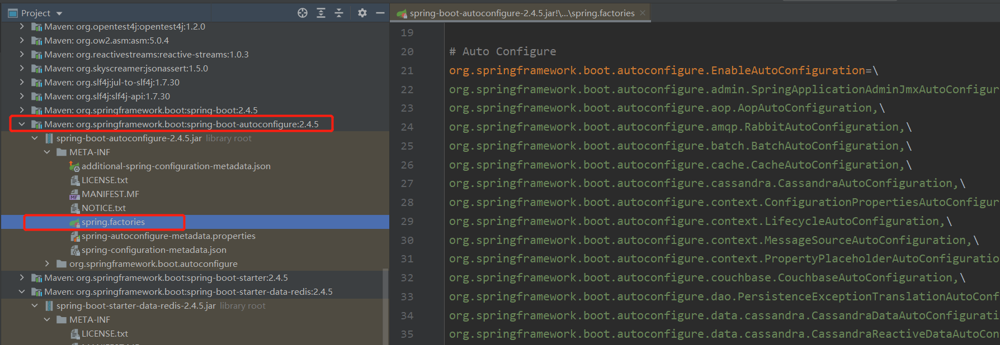
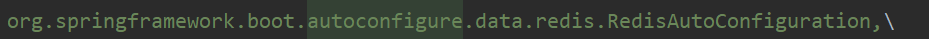

内容来自《springboot cloud Alibaba微服务原理与实战》

#### 装配什么？

SpringBoot中自动装配，装配的是Bean对象，即把注册的Bean放入容器中，且是自动的（pom中引入的starter,自动装配进容器）

Spring中有一个重要的概念——IOC，也就是容器。要使用对象时，不需要通过new的形式，而是直接去容器中获取，那么怎么将对象放入容器中呢，传统的方法有xml配置文件和注解

如今，xml基本被取代了，取而代之的是JavaConfig，通过Java代码的方式来完成Bean的注入

- @Configuration，这个注解的功能和xml头一样
- @Bean，类似于<bean id = "", class = "">，默认用方法名称作为该Bean的id
- 依赖注入的方式，直接在@Bean注解的方法中采用Java代码的形式注入
- @Import，对应于<import resource="">，导入其他配置文件
- @ComponentScan，对应<context:component-scan base-packge="">，扫描指定路径下采用注解的类，加载到IOC容器

```java
@Configuration
public class SpringConfigClass {
    //Bean的描述
    @Bean
    public BeanDefine beanDefine() {
        return new BeanDefine();
    }
    
    @Bean
    public BeanDi beanDi() {
        BeanDi beanDi = new BeanDi();
        beanDi.setBeanDependency(beanDefine());
        return beanDefine;
    }
}
```

#### 自动装配的实现

自动装配注解@EnableAutoConfiguration在主启动类的@SpringBootApplication内

首先讲一下@Enable注解，该注解是对@Configuration和@Bean注解的封装，常见的如@EnableWebMvc，@EnableScheduling等

看一下@EnableScheduling

```java
@Target(ElementType.TYPE)
@Retention(RetentionPolicy.RUNTIME)
@Import(SchedulingConfiguration.class)
@Documented
public @interface EnableScheduling {

}
```

发现其中有一个`@import(SchedulingConfiguration.class)`，Spring会解析到@import导入的配置类，从而根据这个配置类中的描述来实现Bean的装配

点进去看看`SchedulingConfiguration.class`

```java
@Configuration
@Role(BeanDefinition.ROLE_INFRASTRUCTURE)
public class SchedulingConfiguration {

	@Bean(name = TaskManagementConfigUtils.SCHEDULED_ANNOTATION_PROCESSOR_BEAN_NAME)
	@Role(BeanDefinition.ROLE_INFRASTRUCTURE)
	public ScheduledAnnotationBeanPostProcessor scheduledAnnotationProcessor() {
		return new ScheduledAnnotationBeanPostProcessor();
	}

}
```

发现这个类正如前面所说的，使用了@Configuration和@Bean，即相当于一个xml配置

看到这可以思考一下@EnableAutoConfiguration的实现原理

#### @EnableAutoConfiguration

点进去看看@EnableAutoConfiguration

```java
@Target(ElementType.TYPE)
@Retention(RetentionPolicy.RUNTIME)
@Documented
@Inherited
@AutoConfigurationPackage
@Import(AutoConfigurationImportSelector.class)
public @interface EnableAutoConfiguration {...}
```

@AutoConfigurationPackge：将该类所在的包及其子包下所有组件扫描放入Spring IoC容器中

不过@Import导入的并不是一个Configuration类，不过不管导入的是什么，肯定会实现配置类的导入

#### AutoConfigurationImportSelector.class

```java
public class AutoConfigurationImportSelector 
        implements 
    	DeferredImportSelector, BeanClassLoaderAware, ResourceLoaderAware,
		BeanFactoryAware, EnvironmentAware, Ordered {...}
```

可以看到`AutoConfigurationImportSelector`实现了`DeferredImportSelector`接口

```
public interface DeferredImportSelector extends ImportSelector {...}
```

`DeferredImportSelector`接口继承了类`ImportSelector`

```java
public interface ImportSelector {

	/**
	 * Select and return the names of which class(es) should be imported based on
	 * the {@link AnnotationMetadata} of the importing @{@link Configuration} class.
	 */
	String[] selectImports(AnnotationMetadata importingClassMetadata);

}
```

`ImportSelector`类中的selectImports方法返回一个Stirng[]数组

**当在@Import中导入一个ImportSelector实现类之后，会把实现类中返回的Class名称都装在到Ioc容器中**

#### 自动装配原理分析

看一下AutoConfigurationImportSelector中是如何重写selectImports()方法的

```java
	@Override
	public String[] selectImports(AnnotationMetadata annotationMetadata) {
		if (!isEnabled(annotationMetadata)) {
			return NO_IMPORTS;
		}
        //主要工作通过这个完成
		AutoConfigurationEntry autoConfigurationEntry = getAutoConfigurationEntry(annotationMetadata);
        //最后返回需要自动装配的类名
		return StringUtils.toStringArray(autoConfigurationEntry.getConfigurations());
	}

	protected AutoConfigurationEntry getAutoConfigurationEntry(AnnotationMetadata annotationMetadata) {
		if (!isEnabled(annotationMetadata)) {
			return EMPTY_ENTRY;
		}
        //获得EnableAutoConfiguration注解中的属性：exclude、excludeName等
		AnnotationAttributes attributes = getAttributes(annotationMetadata);
        //获取所有自动装配的配置类
		List<String> configurations = getCandidateConfigurations(annotationMetadata, attributes);
        //对配置类去重
		configurations = removeDuplicates(configurations);
        //根据@EnableAutoConfiguration注解中的exclude等属性，排除不需要自动装配的类
		Set<String> exclusions = getExclusions(annotationMetadata, attributes);
		checkExcludedClasses(configurations, exclusions);
		configurations.removeAll(exclusions);
        //过滤
		configurations = getConfigurationClassFilter().filter(configurations);
        //广播事件
		fireAutoConfigurationImportEvents(configurations, exclusions);
		return new AutoConfigurationEntry(configurations, exclusions);
	}
```

获取需要自动装配的类，由函数getAutoConfigurationEntry完成，具体工作见注释

其中需要重点关注getCandidateConfigurations方法，它是获取配置类的核心方法

```java
	protected List<String> getCandidateConfigurations(AnnotationMetadata metadata, AnnotationAttributes attributes) {
		List<String> configurations = SpringFactoriesLoader.loadFactoryNames(getSpringFactoriesLoaderFactoryClass(),
				getBeanClassLoader());
		Assert.notEmpty(configurations, "No auto configuration classes found in META-INF/spring.factories. If you "
				+ "are using a custom packaging, make sure that file is correct.");
		return configurations;
	}
```

SpringFactoriesLoader，是Spring内部提供的一种约定俗成的加载方式，它会扫描classpath下的META-INF/spring.factories文件，该文件中的数据以Key=Value形式存储，SpringFactoriesLoader.loadFactoryNames会根据Key得到对应的value；Key对应为EnableAutoConfiguration，value是多个配置类



从上图中找到redis的自动配置看看，



```java
@Configuration(proxyBeanMethods = false)
//判断classpath下是否存在RedisOperations.class类，如果存在就将当前配置类注册到IoC容器
@ConditionalOnClass(RedisOperations.class)
//可以通过application.properties配置redis的参数，而这些配置会加载到RedisProperties中
@EnableConfigurationProperties(RedisProperties.class)
@Import({ LettuceConnectionConfiguration.class, JedisConnectionConfiguration.class })
public class RedisAutoConfiguration {

	@Bean
    //如果没有redisTemplate的Bean，则加载
	@ConditionalOnMissingBean(name = "redisTemplate")
	@ConditionalOnSingleCandidate(RedisConnectionFactory.class)
	public RedisTemplate<Object, Object> redisTemplate(RedisConnectionFactory redisConnectionFactory) {
		RedisTemplate<Object, Object> template = new RedisTemplate<>();
		template.setConnectionFactory(redisConnectionFactory);
		return template;
	}

	@Bean
	@ConditionalOnMissingBean
	@ConditionalOnSingleCandidate(RedisConnectionFactory.class)
	public StringRedisTemplate stringRedisTemplate(RedisConnectionFactory redisConnectionFactory) {
		StringRedisTemplate template = new StringRedisTemplate();
		template.setConnectionFactory(redisConnectionFactory);
		return template;
	}

}
```

看！这里是不是就是@Configuration和@Bean的使用了，等同于一个xml配置文件

#### @Condition

Condition是一个函数式接口，提供了一个matches方法，提供一个规则，若满足则返回true，表示可以注入Bean，反之不注入

```java
@FunctionalInterface
public interface Condition {

	/**
	 * Determine if the condition matches.
	 * @param context the condition context
	 * @param metadata the metadata of the {@link org.springframework.core.type.AnnotationMetadata class}
	 * or {@link org.springframework.core.type.MethodMetadata method} being checked
	 * @return {@code true} if the condition matches and the component can be registered,
	 * or {@code false} to veto the annotated component's registration
	 */
	boolean matches(ConditionContext context, AnnotatedTypeMetadata metadata);

}
```

SpringBoot中的@ConditionOnBean/@ConditonOnMissingBean都是对@Condition的封装，便于使用

#### 总结

核心过程：

1. 通过Import(AutoConfigurationImportSelector.class)实现配置类的导入
2. AutoConfigurationImportSelector实现了ImportSelector接口，重写了selectImports方法，用于选择需要批量加载的类
3. 通过Spring的SpringFactoriesLoader机制，扫描classpath路径下的META-INF/spring.factories，根据Key获取配置类
4. 通过条件过滤，排除不自动加载的类，最终完成装配