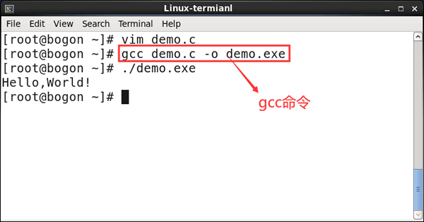

简单介绍一下docker

Docker是一个开源的应用容器引擎；是一个轻量级容器技术； Docker支持将软件编译成一个镜像；然后在镜像中各种软件做好配置，将镜像发布出去，其他使用者可以直接使 用这个镜像；

运行中的这个镜像称为容器，容器启动是非常快速的。

#### 核心概念

docker主机(Host)：安装了Docker程序的机器（Docker直接安装在操作系统之上）；

docker客户端(Client)：连接docker主机进行操作；

docker仓库(Registry)：用来保存各种打包好的软件镜像；

docker镜像(Images)：软件打包好的镜像；放在docker仓库中；

docker容器(Container)：镜像启动后的实例称为一个容器；容器是独立运行的一个或一组应用

#### Docker的三个概念

1. 镜像（Image）：类似于虚拟机中的镜像，是一个包含有文件系统的面向Docker引擎的只读模板。任何应用程序运行都需要环境，而镜像就是用来提供这种运行环境的。例如一个Ubuntu镜像就是一个包含Ubuntu操作系统环境的模板，同理在该镜像上装上Apache软件，就可以称为Apache镜像。
2. 容器（Container）：类似于一个轻量级的沙盒，可以将其看作一个极简的Linux系统环境（包括root权限、进程空间、用户空间和网络空间等），以及运行在其中的应用程序。Docker引擎利用容器来运行、隔离各个应用。容器是镜像创建的应用实例，可以创建、启动、停止、删除容器，各个容器之间是是相互隔离的，互不影响。注意：镜像本身是只读的，容器从镜像启动时，Docker在镜像的上层创建一个可写层，镜像本身不变。
3. 仓库（Repository）：类似于代码仓库，这里是镜像仓库，是Docker用来集中存放镜像文件的地方。注意与注册服务器（Registry）的区别：注册服务器是存放仓库的地方，一般会有多个仓库；而仓库是存放镜像的地方，一般每个仓库存放一类镜像，每个镜像利用tag进行区分，比如Ubuntu仓库存放有多个版本（12.04、14.04等）的Ubuntu镜像。

#### docker和传统方式安装redis的例子

```bash
//1.拉取镜像
docker pull redis:latest
//2.运行容器
docker run -itd --name redis-test -p 6379:6379 redis
-p 宿主机端口:容器服务端口
-i 以交互模式运行容器，通常与 -t 同时使用
-t 为容器重新分配一个伪输入终端，通常与 -i 同时使用
-d 后台运行容器，并返回容器ID
//3.通过 redis-cli 连接测试使用 redis 服务
docker exec -it redis-test /bin/bash
```

##### 传统linux安装

这里复制了我之前做秒杀项目时安装redis的笔记

传统的安装，需要先解压tar.gz文件，然后make(编译)，make install安装

编译还需要配置好gcc

GCC 编译器是 Linux 系统下最常用的 C/C++ 编译器

例如在linux里面vim一个c函数

```vim
#include<stdio.h>
int main() {
	puts("hello world");
	return 0;
}
```

使用如下gcc命令

```bash
gcc demo.c -o demo.exe
```




1. 到redis官网，复制下载链接

   这里我使用了之前做项目的时候的版本，6.06

   ```bash
   wget https://download.redis.io/releases/redis-5.0.4.tar.gz   换成老师的版本，以免后续出问题
   wget https://download.redis.io/releases/redis-6.0.6.tar.gz 	 第一次做项目时候用的版本
   ```

   

   

2. 解压

   ```bash
   tar -xvzf redis-5.0.4.tar.gz
   ```

3. 进入解压好的redis文件，编译

   ```bash
   make
   ```

   这里有可能提示没有安装gcc，可以采用4.4.4里面安装的方法

   ```bash
   yum install perl gcc kernel-devel
   yum upgrade kernel kernel-devel
   yum install pcre-devel openssl-devel gcc curl
   ```

   或者参考我之前的博客：https://blog.csdn.net/qq_32816723/article/details/108038541

   这里我采用的4.4.4节中的方法，然而make会出现错误，我又把博客里的内容输了一遍，解决

   ```bash
   yum -y install centos-release-scl
   yum -y install devtoolset-9-gcc devtoolset-9-gcc-c++ devtoolset-9-binutils
   echo "source /opt/rh/devtoolset-9/enable" >>/etc/profile
   重启服务器 执行make
   ```

4. 安装

   ```bash
   make install
   ```

5. 启动服务

   进入redis/src/目录，启动进程

   ```bash
   ./redis-server
   ```

   

   出现这个界面，表示安装成功

6. 实际开发中，应该用后台启动的方式

   ```bash
   ./redis-server &
   ```

7. 操作

   在src/目录下，进入控制界面

   ```bash
   ./redis-cli
   ```

   

   

   当然我一般都是用redis-gui的那个app，在win10上操作