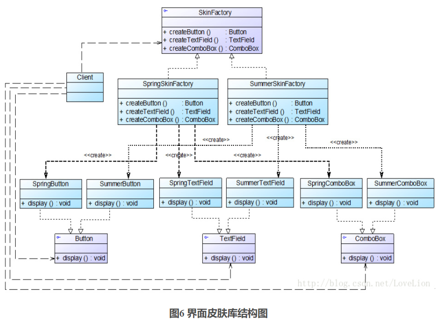
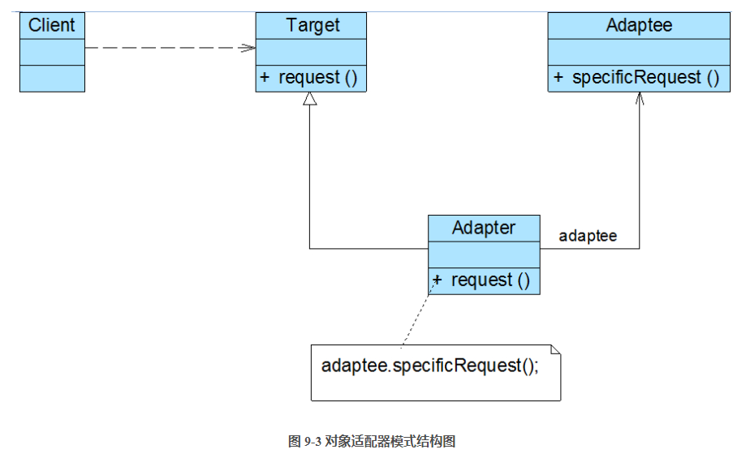
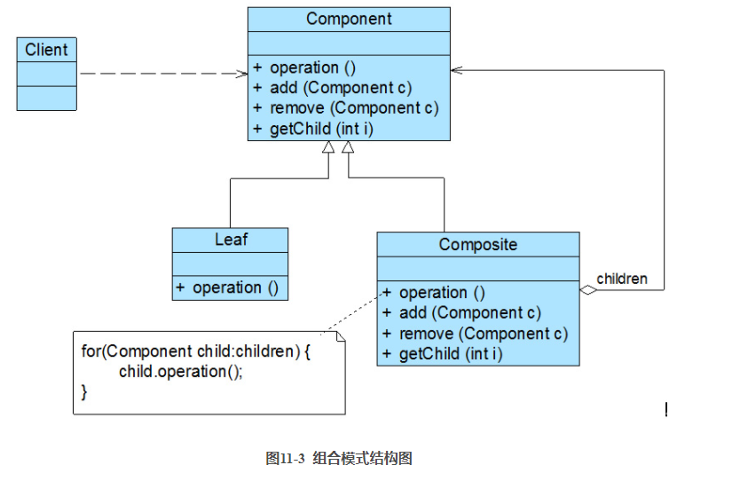

# JavaSE——笔记

------

## 1 面向对象

### 1.1 对象之间的关系

1. 依赖（uses-a）

   dependence——一个类的方法使用或操纵另一个类的对象。应当尽可能减少依赖的使用，降低类之间的耦合。

2. 聚合（has-a）

   aggregation——一个对象中包含另一个对象。可以理解为A的类变量中有B对象的数据。

3. 继承（is-a）

   inheritance——继承，A继承B，如果没有显示定义，则A继承自Object，

## 2 IO 流

### 2.1 IO流定义

可以从其中读入一个字节序列的对象称作**输入流**，而可以向其中写入一个字节序列的对象称作**输出流**。抽象类`inputStream`和`OutputStream`构成了IO类层次结构的基础。

### 2.2 文件路径

在对本地文件进行IO操作时，可以使用`System.getProperty("user.dir")`来获取该项目的本地绝对路径，`File.separator`来获取文件分隔符。

行结束符，windows中是"\r\n"，可以通过`System.getProperty("line.separator")`获得。

### 2.3 序列化

希望用IO流处理对象时，需要将类序列化，一般来说是`serilization`接口，当然还可以实现json等等的序列化方式。以`serilization`接口为例：

1. out时
   - 对每一个对象引用都关联一个序列号
   - 对于每个对象，第一次遇到时，保存其对象数据到输出流中
   - 如果某个对象之前已经保存过，那么写出之前保存的那个对象（序列号相同）。
2. input时
   - 第一次遇到序列号时，构建这个对象，使用流中的数据来初始化，然后记录这个顺序号和新对象之间的关联。
   - 遇到之前保存过的序列号时，获取与这个顺序号相关联的对象。

序列化对于拥有聚合关系的对象，尤其重要。

## 3 反射


## 4 数据结构

### 4.1 二叉搜索树

基本的性值就不介绍了，自认为已经比较熟练。记录一下之前不怎么用到的知识，参考《算法导论》

记树的高度为h

#### 最小关键字元素

返回树中最小的元素，这个对后面求节点的后继非常有用。

书中的伪代码（以下简称伪代码）

```java
TREE-MINIMUM(x)
    while x.left != NIL
        x = x.left
    return x
```

时间复杂度：O(h)

#### 最大关键字元素

返回树中最大的元素。

伪代码：

```java
TREE-MAXIMUM
    while x.right != NIL
        x = x.right
    return x
```

时间复杂度：O(h)

#### 后继

找到节点x的后继，相当于二叉树链表化后x的下一个元素，在树中是大于x.key的节点中key最小的那个节点

查找方法：如果x有右子树，则后继就是x右子树中最小的那个节点；若没有，则从**x**开始查找，直到遇到某个节点是其父节点的左儿子为止，返回其父节点

伪代码：

```java
TREE-SUCCESSOR(X)
    if x.right != null	//x的右节点存在时
        return TREE-MINIMUM(x.right)
    y = x.p			   //x的右节点不存在，需要在上一层去寻找
    while y != NIL and x == y.right
        x = y
        y = y.p
    return y
        
```


#### 前驱

x的前驱，相当于二叉树链表化之后，x前面一个元素，即树中小于x.key的节点中key最大的那个节点

查找过程：如果x有左子树，则寻找x左子树中最大的节点；若没有，从**x**开始查找，直到遇到某个节点是其父节点的右儿子，返回其父节点

伪代码(自己写的)：

```java
TREE-QianQu(x)
    if x.left != null
        return TREE-MAXIMUM
    y = x.p
    while y != NIL and x == y.left
        x = y
        y = y.p
    return y
```


#### 删除

删除稍微复杂一点，可以分为几种情况讨论。这里的删除主要是为后文红黑树的删除做铺垫

先定义一个辅助方法，将一棵子树替换另一棵子树，并正确修改其父节点的关系，比如用根为v的子树替换根为u的子树时，u的父节点就变成v的父节点，且v成为它的相应儿子。注意这里没有修改u，v儿子的节点关系，这个关系在外部手动实现

```java
TRANSPLANT(T,u,v)
    if u.p == NIL
        T.root = v
    else if u == u.p.left
        u.p.left = v
    else u.p.right = v
    if v != NIL
        v.p = u.p
```

假设二叉搜索树T需要删除节点z：

伪代码：

```java
TREE-DELETE(T,z)
    if z.left == NIL
        TRANSPLANT(T,z,z.right)
    else if z.right == NIL
        TRANSPLANT(T,z,z.left)
    else y = TREE-MINIMUM(z.right)
        if y.p != z
            TRANSPLANT(T,y,y.right)
            y.right = z.right
            y.right.p = y
        TRANSPLANT(T,z,y)
            y.left = z.left
            y.left.p = y
```


1. 如果z没有左孩子，直接用其右孩子来替换z，右孩子可以为NIL，也可以不是。当NIL时，就等价于z没有孩子节点的情况，否则就是z只有一个孩子，且该孩子是右孩子

   

2. 如果z仅有一个孩子且是左孩子，就用左孩子来替换z

   

3. 否则，z有两个孩子，需要查找z的后继y，y位于z的右子树种且没有左孩子，需要将y移除原来的位置进行拼接，并替换z的位置

   1. 如果y是z的右孩子，y替换z，仅留下y的右孩子

      

   2. 否则，y位于z的右子树中但不是z的右孩子。此时，用y的右孩子x替换y，用y替换z

      

##### 时间复杂度

与插入操作一样，O(h)

### 4.2 红黑树

参考博客：https://www.cnblogs.com/skywang12345/archive/2004/01/13/3245399.html

R-B Tree，全称Red-Black Tree，又称红黑树。它是一种特殊的二叉搜索树。红黑树上的每个节点有存储颜色的信息，可以为红色或者黑色。

既然已经有了二叉搜索树，为什么还需要红黑树这种特殊的二叉搜索树？因为二叉搜索树在特殊情况下会变成链表，一些列的操作时间复杂度会从O(logN)变成O(N)，而红黑树是能够保证时间复杂度O(logN)。**HashMap中就使用了红黑树这种数据结构**。

红黑树的特性：

1. 每个节点要么是红色，要么是黑色
2. 根节点是黑色的
3. 每个叶子节点(NIL,NULL节点)是黑色。**这里的叶子节点指的是传统意义叶子节点的左右节点**
4. 如果一个节点是红色的，则它的子节点必须是黑色的
5. 从一个节点到它的子孙节点的所有路径，包含的黑节点数目相同。**这个特性确保了没有一条路径比其他路径长出两倍，因此红黑树是接近平衡的二叉树**


#### 左旋

指定红黑树中的一个节点，让它向左下移动，严格成为其父结点的左子结点。若假设需要移动的节点为target，则需要让target的右子节点right替代target原本的位置，让target成为right的左子节点，同时，right的左子节点要成为target的右子节点。


《算法导论》中的伪代码：

```java
LEFT-ROTATE(T, x)  
01  y ← right[x]            // 前提：这里假设x的右孩子为y。下面开始正式操作
02  right[x] ← left[y]      // 将 “y的左孩子” 设为 “x的右孩子”，即 将β设为x的右孩子
03  p[left[y]] ← x          // 将 “x” 设为 “y的左孩子的父亲”，即 将β的父亲设为x
04  p[y] ← p[x]             // 将 “x的父亲” 设为 “y的父亲”
05  if p[x] = nil[T]       
06  then root[T] ← y                 // 情况1：如果 “x的父亲” 是空节点，则将y设为根节点
07  else if x = left[p[x]]  
08            then left[p[x]] ← y    // 情况2：如果 x是它父节点的左孩子，则将y设为“x的父节点的左孩子”
09            else right[p[x]] ← y   // 情况3：(x是它父节点的右孩子) 将y设为“x的父节点的右孩子”
10  left[y] ← x             // 将 “x” 设为 “y的左孩子”
11  p[x] ← y                // 将 “x的父节点” 设为 “y”
```

HashMap中的红黑树实现代码：

```java
        static <K,V> TreeNode<K,V> rotateLeft(TreeNode<K,V> root,
                                              TreeNode<K,V> p) {
            TreeNode<K,V> r, pp, rl;
            if (p != null && (r = p.right) != null) {
                if ((rl = p.right = r.left) != null)
                    rl.parent = p;
                if ((pp = r.parent = p.parent) == null)
                    (root = r).red = false;
                else if (pp.left == p)
                    pp.left = r;
                else
                    pp.right = r;
                r.left = p;
                p.parent = r;
            }
            return root;
        }
```

#### 右旋

指定红黑树中的一个节点，让它向右下移动，严格成为其父结点的右子结点。若假设需要移动的节点为target，则需要让target的左子节点left替代target原本的位置，让target成为left的右子节点，同时，left的右子节点要成为target的左子节点。


《算法导论》中的伪代码：

```java
RIGHT-ROTATE(T, y)  
01  x ← left[y]             // 前提：这里假设y的左孩子为x。下面开始正式操作
02  left[y] ← right[x]      // 将 “x的右孩子” 设为 “y的左孩子”，即 将β设为y的左孩子
03  p[right[x]] ← y         // 将 “y” 设为 “x的右孩子的父亲”，即 将β的父亲设为y
04  p[x] ← p[y]             // 将 “y的父亲” 设为 “x的父亲”
05  if p[y] = nil[T]       
06  then root[T] ← x                 // 情况1：如果 “y的父亲” 是空节点，则将x设为根节点
07  else if y = right[p[y]]  
08            then right[p[y]] ← x   // 情况2：如果 y是它父节点的右孩子，则将x设为“y的父节点的左孩子”
09            else left[p[y]] ← x    // 情况3：(y是它父节点的左孩子) 将x设为“y的父节点的左孩子”
10  right[x] ← y            // 将 “y” 设为 “x的右孩子”
11  p[y] ← x                // 将 “y的父节点” 设为 “x”
```

HashMap中的红黑树实现代码：

```java
        static <K,V> TreeNode<K,V> rotateRight(TreeNode<K,V> root,
                                               TreeNode<K,V> p) {
            TreeNode<K,V> l, pp, lr;
            if (p != null && (l = p.left) != null) {
                if ((lr = p.left = l.right) != null)
                    lr.parent = p;
                if ((pp = l.parent = p.parent) == null)
                    (root = l).red = false;
                else if (pp.right == p)
                    pp.right = l;
                else
                    pp.left = l;
                l.right = p;
                p.parent = l;
            }
            return root;
        }
```

#### 添加

添加的步骤如下：

1. **通过一系列的旋转或着色等操作，使之重新成为一颗红黑树**

2. **将插入的节点设置为红色**，为什么要设置成红色呢？在这里温习一下二叉树的特性

   1. 每个节点要么是红色，要么是黑色
   2. 根节点是黑色的
   3. 每个叶子节点(NIL,NULL节点)是黑色。**这里的叶子节点指的是传统意义叶子节点的左右节点**
   4. 如果一个节点是红色的，则它的子节点必须是黑色的
   5. 从一个节点到它的子孙节点的所有路径，包含的黑节点数目相同。**这个特性确保了没有一条路径比其他路径长出两倍，因此红黑树是接近平衡的二叉树**

   将插入的节点着色为红色，不会违背"特性(5)"！少违背一条特性，就意味着我们需要处理的情况越少。接下来，就要努力的让这棵树满足其它性质即可；满足了的话，它就又是一颗红黑树了。o(∩∩)o...哈哈

3. **通过一系列的旋转或着色等操作，使之重新成为一颗红黑树**

《算法导论》伪代码：

1. 添加到普通的二叉搜索树

   ```java
   RB-INSERT(T, z)  
   01  y ← nil[T]                        // 新建节点“y”，将y设为空节点。
   02  x ← root[T]                       // 设“红黑树T”的根节点为“x”
   03  while x ≠ nil[T]                  // 找出要插入的节点“z”在二叉树T中的位置“y”
   04      do y ← x                      
   05         if key[z] < key[x]  
   06            then x ← left[x]  
   07            else x ← right[x]  
   08  p[z] ← y                          // 设置 “z的父亲” 为 “y”
   09  if y = nil[T]                     
   10     then root[T] ← z               // 情况1：若y是空节点，则将z设为根
   11     else if key[z] < key[y]        
   12             then left[y] ← z       // 情况2：若“z所包含的值” < “y所包含的值”，则将z设为“y的左孩子”
   13             else right[y] ← z      // 情况3：(“z所包含的值” >= “y所包含的值”)将z设为“y的右孩子” 
   14  left[z] ← nil[T]                  // z的左孩子设为空
   15  right[z] ← nil[T]                 // z的右孩子设为空。至此，已经完成将“节点z插入到二叉树”中了。
   16  color[z] ← RED                    // 将z着色为“红色”
   17  RB-INSERT-FIXUP(T, z)             // 通过RB-INSERT-FIXUP对红黑树的节点进行颜色修改以及旋转，让树T仍然是一颗红黑树
   ```

   和我之前做过的题目一样，就是利用二叉搜索树的数值大小特性，和一个前驱节点来寻找到插入的位置

   #### [701. 二叉搜索树中的插入操作](https://leetcode-cn.com/problems/insert-into-a-binary-search-tree/)

2. 插入之后，核心点还是保持红黑树的特性。插入一个红节点之后，可能破坏的特性只有两点：

   1. 之前为空树，插入红节点之后红节点就为根，此时就把该节点设置为黑色即可
   
2. 该节点的父节点是红色，因此违背了红色节点的子节点都是黑色的特性，需要进行更正
   
      这种情况又可以细分为3种进行详细处理：
   
      1. z的叔叔节点y是红色；只需将z的父节点和y设置为红色，将z的爷节点设置为黑色，并以z的爷节点作为研究对象，来判断是否保持了红黑树的特性，进行下一步操作
      2. y是黑色，且z是其父节点的右节点；将z指向z的父节点之后，对z进行左旋操作，变成情况3处理
      3. y是黑色，且z是其父节点的左结点，将z父节点设置为黑色，将z的爷节点设置为红色，并将z的爷节点进行右旋操作，此时`z.p.color == RED`，会跳出while循环
      
   ```java
   RB-INSERT-FIXUP(T, z)
       while z.p.color == READ
           if z.p == z.p.p.left		    
               y = z.p.p.right			    
               if y.color == RED		   
                   z.p.color = BLACK		
                   y.color = BLACK		
                   z.p.p.color = RED		
                   z = z.p.p			   
               else if z == z.p.right	
                   z = z.p				  
                   LEFT-ROTATE(T,z)		
               z.p.color = BLACK			
               z.p.p.color = RED
               RIGHT-ROTATE(T,z.p.p)
            else (same as then clause with "right" and "left" exchanged)
            
   ```
   
   
   
   
   
   

##### 时间复杂度分析

RB-INSERT的运行时间怎么样呢？由于一棵有n个节点的红黑树的高度为O(lgn)，因此RB-INSERT的第1-16行(普通的二叉搜索树添加)要花费O(lgn)时间。在RB-INSERT-FIXUP中，仅当情况1发生，然后指针z沿着树上升2层，while循环才会重复执行。所以while循环可能被执行的总次数为O(lgn)。因此，RB-INSERT总共花费O(lgn)时间。此外，该程序所做的旋转从不超过2次，因为只要执行了情况2或情况3，while循环就结束了

#### 删除

首页编写一个子过程RB-TRANSPLANT，其实与二叉树的TRANSPLANT基本类似，只是对v.p的赋值是无条件的

伪代码：

```java
RB-TRANSPLANT(T,u,v)
    if u.p == T.nil
        T.root = v
    else if u == u.p.left
        u.p.left = v
    else u.p.right = v
    v.p = u.p
```

RB-DELETE与TREE-DELETE其实大部分是类似的，但是红黑树中的删除，可能会对性质造成破坏，需要记录删除过程中的一些信息，最后修复

伪代码：

```java
RB-DELETE(T,z)
    y = z
    y-original-color = y.color
    if z.left == T.nil
        x = z.right
        RB-TRANSPLANT(T,z,z.right)
    else if z.right == T.nil
        x = z.left
        RB-TRANSPLANT(T,z,z.left)
    else y = TREE-MINIMUM(z.right)
        y-original-color = y.color
        x = y.right
        if y.p == z
            x.p = y		//不知道这里是不是有必要写？x.p==y不是已经成立了吗，上面没有需要改动的要求
        else RB-TRANSPLANT(T,y,y.right)
            y.right = z.right
            y.right.p = y
        RB-TRANSPLANT(T,z,y)
        y.left = z.left
        y.left.p = y
        y.color = z.color
        if y-original-color = BLACK
            RB-DELETE-FIXUP(T,x)
```

如果节点y是黑色的，会产生3个问题：

1. 如果y是原来的根节点，则y的子节点必定是红色，因此此时根节点是红色，违反了性质2（性质5黑高呢？）
2. 如果x和x.p是红色的，违反性质4
3. 在树中移动y将导致先前包含y的路径上，黑高减一，因此所有y的任何祖先都不满足性质5黑高

解决办法：当黑节点y删除或者移动时，将其黑色“下推”给x。现在问题变成，x既有黑色，也有红色，违反了性质1。但是认为x的color属性仍然是红色(红色并存时)的，换句话说，节点额外的黑色是针对x节点的，而不是反应在它的color属性上

RB-DELETE-FIXUP伪代码：

```java
RB-DELETE-FIXUP(T,x)
    while x != T.root and x.color == BLACK
        if x == x.p.left	//x是左结点
            w = x.p.right	//记w是x的兄弟节点
            if w.color == RED	//如果w是红色   case1
                w.color = Black	//将w设置为黑色
                x.p.color = RED	//x的父节点设置为红色
                LEFT-ROTATE(T,x.p)	//将x父节点左旋
                w = x.p.right	//更新x的兄弟节点
            if w.left.color == BLACK and w.right.color == BLACK	//如果w是黑色，且w的儿子节点也是黑色 case2
                w.color = RED	//将w设置为红色
                x = x.p	将x指向x的父节点
            else if w.right.color == BLACK	//w黑色，w.left红色，w.right黑色 case3
                w.left.color = BLACK
                w.color = RED
                RIGHT-ROTATE(T,w)
                w = x.p.right
            w.color = x.p.color	//case4
            x.p.color = BLACK
            w.right.color = BLACK
            LEFT-ROTATE(T,x.p)
            x = T.root
        else (same as then clause with "right" and "left" exchanged)
    x.color = BLACK
```

《算法导论》只重点介绍了如何恢复性质1，性质2，4作为了思考题

while循环中的目的是将额外的黑色沿树上移，直到;

1. x指向红黑节点，在最后一行，将x着为(单个)黑色
2. x指向根节点，此时可以简单地“移除”额外的黑色
3. 执行适当的旋转和重新着色，退出循环

**具体分析：**

说明：白色表示为未知单层颜色，可能是BLACK，也可能是RED；橙色表示双重颜色，可能是RED，也可能是BLACK；x指向的任何节点都具有额外的一重黑色，使之成为双重黑色或者红黑；只有情况2引起循环

1. **x的兄弟节点w是红色**

   

   w为红色，由性质可知w的子节点不为NIL且均为黑色。将w改成黑色，x.p改为红色，再对x.p做一次左旋，更新w，这样就能将情况1转换为2，3，4（根据此时w子节点的颜色来区分）

2. **x的兄弟节点w是黑色，且w的两个子节点都是黑色**

   

   x，w，w的子孩子均为黑色，去掉x和w的黑色，w变为红色，为了补偿丢失的黑色，给x.p设置额外的一个黑色，并让x指向x.p，继续循环。可以注意到，如果通过情况1进入到情况2，则新x是红色，会跳出while循环，并且在最后，将新x设置为单层黑色。

3. **w黑色，且w的左孩子是红色，右孩子是黑色**

   

   交换w和w.left的颜色，然后对w进行右旋操作，更新w。这样就将情况3转化为了情况4

4. **w黑色，w的右孩子是红色**

   

   将w的颜色设置为x.p的未知颜色，将x.p设置为黑色，将w.right设置为黑色，然后对x.p进行一次左旋。可以去掉x的额外黑色，使他变为单黑色，而且不破坏红黑树的任何性质。将x设置为根后，会终止while循环。

   **难道此时不会违背性质5吗？？**

### 4.3 优先队列

### 4.4 并查集（unionFind）


## 5 集合

### 4.1 概览


### 4.2 精读

#### 4.2.1 ArrayList

ArrayList底层就是由数组构成的，当容量不够时，数组会进行扩容，然后进行拷贝；或者调用insert(int index，E e)时，数组会进行一次数值调整，花费O(n)的时间。

##### 类变量

```java
//序列化ID，这里不是重点
	private static final long serialVersionUID = 8683452581122892189L;
//默认的容量大小
	private static final int DEFAULT_CAPACITY = 10;
//空数组
	private static final Object[] EMPTY_ELEMENTDATA = {};
//默认的长度为0的数组，当使用无参构造时，底层数组就等于这个
    private static final Object[] DEFAULTCAPACITY_EMPTY_ELEMENTDATA = {};
//!!!只是真正用于存放数据的数组，它会随着使用改变
    transient Object[] elementData; // non-private to simplify nested class access
//数组中元素的个数
    private int size;
//默认的数组最大长度
    private static final int MAX_ARRAY_SIZE = Integer.MAX_VALUE - 8;
```

##### 构造函数

1. 无参构造函数

   ```java
       /**
        * Constructs an empty list with an initial capacity of ten.
        * 此时是长度为0的数组，但是添加元素的时候，就会赋予一个长度为10的数组
        */
       public ArrayList() {
           this.elementData = DEFAULTCAPACITY_EMPTY_ELEMENTDATA;
       }
   ```

2. 传递一个数组长度

   ```java
       /**
        * Constructs an empty list with the specified initial capacity.
        *
        * @param  initialCapacity  the initial capacity of the list
        * @throws IllegalArgumentException if the specified initial capacity
        *         is negative
        */
       public ArrayList(int initialCapacity) {
           if (initialCapacity > 0) {
               this.elementData = new Object[initialCapacity];
           } else if (initialCapacity == 0) {
               this.elementData = EMPTY_ELEMENTDATA;
           } else {
               throw new IllegalArgumentException("Illegal Capacity: "+
                                                  initialCapacity);
           }
       }
   ```

3. 传入一个Collection，将这个Collection中的数据复制到初始数组中

   ```java
       /**
        * Constructs a list containing the elements of the specified
        * collection, in the order they are returned by the collection's
        * iterator.
        *
        * @param c the collection whose elements are to be placed into this list
        * @throws NullPointerException if the specified collection is null
        */
       public ArrayList(Collection<? extends E> c) {
           Object[] a = c.toArray();
           if ((size = a.length) != 0) {
               if (c.getClass() == ArrayList.class) {
                   elementData = a;
               } else {
                   elementData = Arrays.copyOf(a, size, Object[].class);
               }
           } else {
               // replace with empty array.
               elementData = EMPTY_ELEMENTDATA;
           }
       }
   ```

##### add()方法

1. 直接将元素添加到数组末尾

   用一个流程图来说明添加元素的过程：

   

   ```java
       /**
        * Appends the specified element to the end of this list.
        *
        * @param e element to be appended to this list
        * @return <tt>true</tt> (as specified by {@link Collection#add})
        */
       public boolean add(E e) {
           ensureCapacityInternal(size + 1);  // Increments modCount!!
           elementData[size++] = e;
           return true;
       }
   ```

   ```java
       private void ensureCapacityInternal(int minCapacity) {
           ensureExplicitCapacity(calculateCapacity(elementData, minCapacity));
       }
   ```

   ```java
       private static int calculateCapacity(Object[] elementData, int minCapacity) {
           if (elementData == DEFAULTCAPACITY_EMPTY_ELEMENTDATA) {
               return Math.max(DEFAULT_CAPACITY, minCapacity);
           }
           return minCapacity;
       }
   ```

   ```java
       private void ensureExplicitCapacity(int minCapacity) {
           modCount++;
   
           // overflow-conscious code
           if (minCapacity - elementData.length > 0)
               grow(minCapacity);
       }
   ```

   ```java
       /**
        * Increases the capacity to ensure that it can hold at least the
        * number of elements specified by the minimum capacity argument.
        *
        * @param minCapacity the desired minimum capacity
        */
       private void grow(int minCapacity) {
           // overflow-conscious code
           int oldCapacity = elementData.length;
           int newCapacity = oldCapacity + (oldCapacity >> 1);
           if (newCapacity - minCapacity < 0)
               newCapacity = minCapacity;
           if (newCapacity - MAX_ARRAY_SIZE > 0)
               newCapacity = hugeCapacity(minCapacity);
           // minCapacity is usually close to size, so this is a win:
           elementData = Arrays.copyOf(elementData, newCapacity);
       }
   ```

   ```java
       private static int hugeCapacity(int minCapacity) {
           if (minCapacity < 0) // overflow
               throw new OutOfMemoryError();
           return (minCapacity > MAX_ARRAY_SIZE) ?
               Integer.MAX_VALUE :
               MAX_ARRAY_SIZE;
       }
   ```

2. add(int index, E element)，将元素添加到指定位置

   ```java
       public void add(int index, E element) {
           rangeCheckForAdd(index);
   
           ensureCapacityInternal(size + 1);  // Increments modCount!!
           //调用native的复制方法，把index位置开始的元素都往后挪一位
           System.arraycopy(elementData, index, elementData, index + 1,
                            size - index);
           elementData[index] = element;
           size++;
       }
   ```

##### 总结

1. ArrayList无参构造初始大小为0，加入第一个元素时，进行一次扩容，默认扩容容量大小为10
2. ArrayList通常情况下都是以当前数组大小的1.5倍取扩容
3. Vector创建时默认大小为10
4. Vector每次扩容都是以当前大小的2倍扩充，当指定了capacityIncrement之后，每次扩容仅增加capacityIncrement个空间
5. ArratList和Vector的get，add，size方法的复杂度都是O(1)，remove方法的复杂度为O(n)
6. ArrayList是非线程安全的，Vector是线程安全的。

#### 4.2.2 LinkedList


##### 类变量

```java
    //表示链表中节点数
	transient int size = 0;
	//指向头节点的指针
    transient Node<E> first;
	//指向尾节点的指针
    transient Node<E> last;
```

##### 节点结构

```java
    private static class Node<E> {
        E item;
        Node<E> next;
        Node<E> prev;

        Node(Node<E> prev, E element, Node<E> next) {
            this.item = element;
            this.next = next;
            this.prev = prev;
        }
    }
```

##### 总结

1. LinkedList的底层结构是一个带头/尾指针的双向链表，可以快速的对头/尾节点进行操作。
2. 相比数组，链表的特点就是在指定位置插入和删除元素的效率较高，但是查找的效率就不如数组了。（其实我感觉也不是绝对的，只有对头/尾节点操作时一定是O(1)复杂度，插在链表中间，很有可能是O(n)复杂度）

#### 4.2.3 HashMap


##### 类变量

```java
//默认初始容量：16
static final int DEFAULT_INITIAL_CAPACITY = 1 << 4; // aka 16
//最大的容量上限：2^30
static final int MAXIMUM_CAPACITY = 1 << 30;
//默认的负载因子：0.75
static final float DEFAULT_LOAD_FACTOR = 0.75f;
//变成树形结构的临界值：8
static final int TREEIFY_THRESHOLD = 8;
//恢复链式结构的临界值：6
static final int UNTREEIFY_THRESHOLD = 6;
//当哈希表的大小超过这个阈值，才会把链式结构转化为树形结构，否则仅采取扩容来尝试减少冲突
static final int MIN_TREEIFY_CAPACITY = 64;
//哈希表
transient Node<K,V>[] table;
//哈希表的中键值对的个数
transient int size;
//哈希表被修改的次数
transient int modCount;
//通过capacity * loadFactor计算出来，当size达到这个值时，就会进行扩容操作
int threshold;
//负载因子
final float loadFactor;
```

##### 内部类Node

HashMap中的一个静态内部类，哈希表中的每一个节点都是Node类型。

```java
    static class Node<K,V> implements Map.Entry<K,V> {
        //key的哈希值
        final int hash;
        final K key;
        V value;
        //构建链表时，用于指向后继节点
        Node<K,V> next;

        Node(int hash, K key, V value, Node<K,V> next) {
            this.hash = hash;
            this.key = key;
            this.value = value;
            this.next = next;
        }

        public final K getKey()        { return key; }
        public final V getValue()      { return value; }
        public final String toString() { return key + "=" + value; }

        public final int hashCode() {
            return Objects.hashCode(key) ^ Objects.hashCode(value);
        }

        public final V setValue(V newValue) {
            V oldValue = value;
            value = newValue;
            return oldValue;
        }

        public final boolean equals(Object o) {
            if (o == this)
                return true;
            if (o instanceof Map.Entry) {
                Map.Entry<?,?> e = (Map.Entry<?,?>)o;
                if (Objects.equals(key, e.getKey()) &&
                    Objects.equals(value, e.getValue()))
                    return true;
            }
            return false;
        }
    }
```

##### hash方法

在get和put方法中都计算了需要使用的数组下标，确定映射到哪个桶上，计算下标用到了：

```java
//n是数组的长度，hash是hash方法得到的一个哈希值
(n - 1) & hash
```

hash方法主要用来辅助确定桶的下标，通俗地说就是数组的下标

```java
    static final int hash(Object key) {
        int h;
        return (key == null) ? 0 : (h = key.hashCode()) ^ (h >>> 16);
    }
```

key的hashCode()方法是一个native方法。这个方法采用了二次哈希的方式

首页调用hashCode本地方法，然后再异或上hashCode的无符号右移16位，为什么需要这么做呢？

注释中是这么解释的：

如果n很小，假设位64的话，n-1=63，这样的值跟hashCode直接做与操作，实际上只使用了hashCode的后6位。如果哈希值的高位变化很大，低位变化很小，这样容易造成冲突，所以这里把高低位都利用起来。


因此，通过上面可以看出，n的大小只能是2的整数次幂的大小最好，因为2^n-1，n-1位后面全都是1，这样其实得到的hash就是hashCode^(hashCode >>> 16)。即使我们在创建HashMap的时候，指定的大小不是2的幂次方，HashMap内部也会通过下面这个方法来自动调整大小。

```java
    static final int tableSizeFor(int cap) {
        int n = cap - 1;
        n |= n >>> 1;
        n |= n >>> 2;
        n |= n >>> 4;
        n |= n >>> 8;
        n |= n >>> 16;
        return (n < 0) ? 1 : (n >= MAXIMUM_CAPACITY) ? MAXIMUM_CAPACITY : n + 1;
    }
```

tableSizeFor方法就是把cap变成第一个大于等于2的幂次方的数。例如16还是16，17就会调整为32。

##### resize方法

HashMap在扩容时，使用的rehash方式非常巧妙，因为每次扩容都是翻一倍，与原来计算(n-1)&hash的结果相比，只是多了一个bit位，所以节点要么就在原来的位置，要么就被分配到“原位置+旧容量”的位置。

例如，原来的容量32，那么应该拿hash跟31做与运算；扩容到64之后，应该拿hash和63做与操作。新容量跟原来相比只是多了一个bit位，假设原来的位置在23，那么新增的那个bit位计算结果为0时，该节点新位置还是在23，计算结果为1时，该节点会被分配到23+31的桶上。

正是因为这样巧妙地rehash方式，保证了rehash之后每个桶上的节点数必定小于等于原来桶上的节点数，即保证了rehash之后不会出现更严重的冲突。

```java
    final Node<K,V>[] resize() {
        Node<K,V>[] oldTab = table;
        int oldCap = (oldTab == null) ? 0 : oldTab.length;
        int oldThr = threshold;
        int newCap, newThr = 0;
        if (oldCap > 0) {
            超过最大容量，不扩容
            if (oldCap >= MAXIMUM_CAPACITY) {
                threshold = Integer.MAX_VALUE;
                return oldTab;
            }
            //这里有优先级的知识，=的优先级>位运算，所以此时newCap = oldCap * 2
            else if ((newCap = oldCap << 1) < MAXIMUM_CAPACITY &&
                     oldCap >= DEFAULT_INITIAL_CAPACITY)
                newThr = oldThr << 1; // double threshold
        }
        else if (oldThr > 0) // initial capacity was placed in threshold
            newCap = oldThr;
        else {               // zero initial threshold signifies using defaults
            newCap = DEFAULT_INITIAL_CAPACITY;
            newThr = (int)(DEFAULT_LOAD_FACTOR * DEFAULT_INITIAL_CAPACITY);
        }
        if (newThr == 0) {
            float ft = (float)newCap * loadFactor;
            newThr = (newCap < MAXIMUM_CAPACITY && ft < (float)MAXIMUM_CAPACITY ?
                      (int)ft : Integer.MAX_VALUE);
        }
        //更新新的阈值
        threshold = newThr;
        @SuppressWarnings({"rawtypes","unchecked"})
        //创建一个新的数组
        Node<K,V>[] newTab = (Node<K,V>[])new Node[newCap];
        table = newTab;
        if (oldTab != null) {
            for (int j = 0; j < oldCap; ++j) {
                Node<K,V> e;
                if ((e = oldTab[j]) != null) {
                    oldTab[j] = null;
                    //如果e没有后继节点，很简单，直接拷贝即可
                    if (e.next == null)
                        newTab[e.hash & (newCap - 1)] = e;
                    //如果e有后继节点，且结构是树
                    else if (e instanceof TreeNode)
                        ((TreeNode<K,V>)e).split(this, newTab, j, oldCap);
                    else { // preserve order
                        Node<K,V> loHead = null, loTail = null;
                        Node<K,V> hiHead = null, hiTail = null;
                        Node<K,V> next;
                        do {
                            next = e.next;
                            if ((e.hash & oldCap) == 0) {
                                if (loTail == null)
                                    loHead = e;
                                else
                                    loTail.next = e;
                                loTail = e;
                            }
                            else {
                                if (hiTail == null)
                                    hiHead = e;
                                else
                                    hiTail.next = e;
                                hiTail = e;
                            }
                        } while ((e = next) != null);
                        if (loTail != null) {
                            loTail.next = null;
                            newTab[j] = loHead;
                        }
                        if (hiTail != null) {
                            hiTail.next = null;
                            newTab[j + oldCap] = hiHead;
                        }
                    }
                }
            }
        }
        return newTab;
    }
```


##### Get方法

通过key获取对应的value

```java
    public V get(Object key) {
        Node<K,V> e;
        return (e = getNode(hash(key), key)) == null ? null : e.value;
    }
```

重点是getNode函数，先找到key对应的Node，然后再返回Node对应的value值

```java
    final Node<K,V> getNode(int hash, Object key) {
        //tab就是桶，e是当前的节点，n是数组的长度，k是当前节点的key
        Node<K,V>[] tab; Node<K,V> first, e; int n; K k;
        if ((tab = table) != null && (n = tab.length) > 0 &&
            (first = tab[(n - 1) & hash]) != null) {//判断是否能够直接命中
            if (first.hash == hash && // always check first node
                ((k = first.key) == key || (key != null && key.equals(k))))
                return first;
            if ((e = first.next) != null) {查看first的后继节点，通过树和链表的形式继续查找
                if (first instanceof TreeNode)
                    return ((TreeNode<K,V>)first).getTreeNode(hash, key);
                do {
                    if (e.hash == hash &&
                        ((k = e.key) == key || (key != null && key.equals(k))))
                        return e;
                } while ((e = e.next) != null);
            }
        }
        return null;
    }
```

1. 通过哈希值获取该key对应的桶
2. 若桶上的key就是要查找的key，则直接返回
3. 桶上的key不是要查找的key，则查看后续节点
   1. 若后续节点是树节点，通过调用树的方法查找该key，getTreeNode
   2. 若后续节点是链式节点，则通过后继节点查找，do {} while ((e = e.next) != null)

##### Put方法

```java
    public V put(K key, V value) {
        return putVal(hash(key), key, value, false, true);
    }
```

重点是内部调用的putVal方法

```java
    final V putVal(int hash, K key, V value, boolean onlyIfAbsent,
                   boolean evict) {
        Node<K,V>[] tab; Node<K,V> p; int n, i;
        if ((tab = table) == null || (n = tab.length) == 0)
            n = (tab = resize()).length;
        //如果对应的桶没有存放Node，则new一个Node，来存放K-V数据
        if ((p = tab[i = (n - 1) & hash]) == null)
            tab[i] = newNode(hash, key, value, null);
        //如果此时桶上已经有了Node
        else {
            Node<K,V> e; K k;
            if (p.hash == hash &&
                ((k = p.key) == key || (key != null && key.equals(k))))
                e = p;
            else if (p instanceof TreeNode)
                e = ((TreeNode<K,V>)p).putTreeVal(this, tab, hash, key, value);
            else {
                for (int binCount = 0; ; ++binCount) {
                    if ((e = p.next) == null) {
                        p.next = newNode(hash, key, value, null);
                        if (binCount >= TREEIFY_THRESHOLD - 1) // -1 for 1st
                            treeifyBin(tab, hash);
                        break;
                    }
                    if (e.hash == hash &&
                        ((k = e.key) == key || (key != null && key.equals(k))))
                        break;
                    p = e;
                }
            }
            if (e != null) { // existing mapping for key
                V oldValue = e.value;
                if (!onlyIfAbsent || oldValue == null)
                    e.value = value;
                afterNodeAccess(e);
                return oldValue;
            }
        }
        ++modCount;
        if (++size > threshold)
            resize();
        afterNodeInsertion(evict);
        return null;
    }
```

## 6 算法

### 6.1 排序算法

#### 归并排序

```java
    public void guibingSort(int[] nums) {
        sort(nums, 0, nums.length - 1, new int[nums.length]);
    }
    private void sort(int[] nums, int low, int high, int[] tmp) {
        if (low >= high) return;
        int mid = (low + high) / 2;
        sort(nums, low, mid, tmp);
        sort(nums, mid + 1, high, tmp);
        merge(nums, low, mid, high, tmp);
    }

    private void merge(int[] nums, int low, int mid, int high, int[] tmp) {
        int i = low, j = mid + 1, index = 0;
        while (i <= mid && j <= high) {
            if (nums[j] <= nums[i]) tmp[index++] = nums[j++];
            else tmp[index++] = nums[i++];
        }
        while (i <= mid) tmp[index++] = nums[i++];
        while (j <= high) tmp[index++] = nums[j++];
        index = 0;
        int left = low;
        while (left <= high) {
            nums[left++] = tmp[index++];
        }
    }
```

#### 快速排序

```java
    public void quickSort(int[] nums) {
        sort(nums, 0, nums.length - 1);
    }
    private void sort(int[] nums, int i, int j) {
        if (i >= j) return;
        int low = i, high = j;
        int tmp = nums[i];
        while (low < high) {
            while (low < high && nums[high] >= tmp) high--;
            nums[low] = nums[high];
            while (low < high && nums[low] <= tmp) low++;
            nums[high] = nums[low];
        }
        nums[low] = tmp;
        sort(nums, i, low - 1);
        sort(nums, low + 1, j);
    }
```

#### 冒泡排序

从左到右，依次让数值大的数，冒泡到顶面

```java
    public void bobSort(int[] nums) {
        for (int i = 0; i < nums.length - 1; i++) {
            for (int j = 0; j < nums.length - i - 1; j++) {
                if (nums[j] > nums[j + 1]) {
                    int tmp = nums[j + 1];
                    nums[j + 1] = nums[j];
                    nums[j] = tmp;
                }
            }
        }
    }
```

#### 选择排序

每次在范围中选择最小的数，放在判断范围的最前面

```java
    public void selectSort(int[] nums) {
        for (int i = 0; i < nums.length - 1; i++) {
            int tmp = i;
            for (int j = i + 1; j < nums.length; j++) {
                if (nums[j] < nums[tmp]) {
                    tmp = j;
                }
            }
            if (tmp != i) {
                int temp = nums[i];
                nums[i] = nums[tmp];
                nums[tmp] = temp;
            }
        }
    }
```

### 6.2 查询算法

#### 二分查找

注意j的取值和i <= j的关系

```java
    public int binarySearch(int[] nums, int target) {
        int i = 0, j = nums.length - 1;
        while (i <= j) {
            int mid = (i + j) >>> 1, tmp = nums[mid];	//aka / 2
            if (tmp == target) return mid;
            else if (tmp < target) i = mid + 1;
            else j = mid - 1;
        }
    }
```

### 6.3 背包问题

## 7 设计模式

参考：https://blog.csdn.net/LoveLion/article/details/17517213

设计模式的一般定义：***设计模式\\*(Design Pattern)\是一套被反复使用、多数人知晓的、经过分类编目的、代码设计经验的总结，使用设计模式是为了可重用代码、让代码更容易被他人理解并且保证代码可靠性。\****

根据用途，可以将设计模式分为：创建型、结构型、行为型三种；也可以根据关系分为：类模式、对象模式

**创建型模式主要用于描述如何创建对象**，**结构型模式主要用于描述如何实现类或对象的组合**，**行为型模式主要用于描述类或对象怎样交互以及怎样分配职责**

学习设计模式，要着重掌握这四点：

1. 这个设计模式的意图是什么，它要解决一个什么问题，什么时候可以使用它
2. 它是如何解决的，掌握它的结构图，记住它的关键代码
3. 能够想到至少两个它的应用实例，一个生活中的，一个软件中的
4. 这个模式的优缺点是什么，在使用时要注意什么


### 7.1 简单工厂模式

为什么需要利用工厂来创建对象：https://blog.csdn.net/lovelion/article/details/7523392（可以理解为维护单一职责原则、开闭原则、便于给构造函数取名吗？）


简单工厂模式，就是利用一个静态的创建方法，根据需要创建的对象传入参数，通过if逻辑调用下层的构造函数，创建对象。有点low，仅仅作为入门引子

优点：

1. 工厂类包含必要的判断逻辑，可以决定在什么时候创建哪一个产品类的实例，客户端可以免除直接创建产品对象的职责，而仅仅“消费”产品，简单工厂模式实现了对象创建和使用的分离
2. 客户端无须知道所创建的具体产品类的类名，只需要知道具体产品类所对应的参数即可，对于一些复杂的类名，通过简单工厂模式可以在一定程度减少使用者的记忆量
3.  通过引入配置文件，可以在不修改任何客户端代码的情况下更换和增加新的具体产品类，在一定程度上提高了系统的灵活性

缺点：

1. 由于工厂类集中了所有产品的创建逻辑，职责过重，一旦不能正常工作，整个系统都要受到影响
2. 使用简单工厂模式势必会增加系统中类的个数（引入了新的工厂类），增加了系统的复杂度和理解难度
3. 系统扩展困难，一旦添加新产品就不得不修改工厂逻辑，在产品类型较多时，有可能造成工厂逻辑过于复杂，不利于系统的扩展和维护
4. 简单工厂模式由于使用了静态工厂方法，造成工厂角色无法形成基于继承的等级结构

### 7.2 工厂方法模式

简单工厂模式中，添加新的产品时需要修改工厂源代码（因为用了if-else逻辑），破坏了开闭原则。由此诞生了工厂方法模式，其实就是给工厂加一层抽象类


优点：

1. 在工厂方法模式中，工厂方法用来创建客户所需要的产品，同时还向客户隐藏了哪种具体产品类将被实例化这一细节，用户只需要关心所需产品对应的工厂，无须关心创建细节，甚至无须知道具体产品类的类名
2. 基于工厂角色和产品角色的多态性设计是工厂方法模式的关键。它能够让工厂可以自主确定创建何种产品对象，而如何创建这个对象的细节则完全封装在具体工厂内部。工厂方法模式之所以又被称为多态工厂模式，就正是因为所有的具体工厂类都具有同一抽象父类
3. 使用工厂方法模式的另一个优点是在系统中加入新产品时，无须修改抽象工厂和抽象产品提供的接口，无须修改客户端，也无须修改其他的具体工厂和具体产品，而只要添加一个具体工厂和具体产品就可以了，这样，系统的可扩展性也就变得非常好，完全符合“开闭原则”

缺点：

1. 在添加新产品时，需要编写新的具体产品类，而且还要提供与之对应的具体工厂类，系统中类的个数将成对增加，在一定程度上增加了系统的复杂度，有更多的类需要编译和运行，会给系统带来一些额外的开销
2. 由于考虑到系统的可扩展性，需要引入抽象层，在客户端代码中均使用抽象层进行定义，增加了系统的抽象性和理解难度，且在实现时可能需要用到DOM、反射等技术，增加了系统的实现难度

### 7.3 抽象工厂模式

工厂方法模式中，每一个具体产品都对应有一个具体的工厂，这样可能会造成工厂过多，且产品杂乱无章，就像杂货铺里的无牌商品一样。抽象工厂模式对具有同一类特征的产品进行了归类，大大减少了工厂的数量，比如生产手机的行为，如果华为和小米的每一个型号的手机都需要一个特定的工厂来生产，那么工厂数量会十分巨大，但是如果只开设两个工厂，各自生产华为和小米的手机，这样工厂数量大幅减少，且对产品进行了归类

抽象工厂模式的“开闭原则”具有倾斜性，对于产品族满足，对于产品结构不满足。比如上文中华为公司还生产水杯了，那么这时需要在抽象工厂层进行修改，同时还需要对小米工厂修改，即使小米不生产水杯

优点：

1. 抽象工厂模式隔离了具体类的生成，使得客户并不需要知道什么被创建。由于这种隔离，更换一个具体工厂就变得相对容易，所有的具体工厂都实现了抽象工厂中定义的那些公共接口，因此只需改变具体工厂的实例，就可以在某种程度上改变整个软件系统的行为
2. 当一个产品族中的多个对象被设计成一起工作时，它能够保证客户端始终只使用同一个产品族中的对象
3. 增加新的产品族很方便，无须修改已有系统，符合“开闭原则”

缺点：

1. 增加新的产品等级结构麻烦，需要对原有系统进行较大的修改，甚至需要修改抽象层代码，这显然会带来较大的不便，违背了“开闭原则”




### 7.4 单例模式

**单例模式\(Singleton Pattern)：确保某一个类只有一个实例，而且自行实例化并向整个系统提供这个实例，这个类称为单例类，它提供全局访问的方法。单例模式是一种对象创建型模式**

单例模式有三个要点：一是某个类只能有一个实例；二是它必须自行创建这个实例；三是它必须自行向整个系统提供这个实例

单例模式确保一个对象在系统中的唯一性，比如win10中的任务管理器，无论你点击多少次任务管理器，只会弹出一个。

先来看看入门级别的单例模式设计（懒汉式）：

```java
class TaskManager {//任务管理器单例实现
    private TaskManager(){...}//私有的构造函数，防止通过new生成新的对象
    private void displayProcess(){...}//显示进程
    private void displayServices(){...}//显示服务
    
    //因为构造函数是私有的，需要提供如何创建对象的方法
    private static TaskManager tm = null;
    
    public static TaskManager getInstance() {
        if (tm == null) {
            tm = new TaskManager();
        }
        return tm;
    }
}
```

#### 7.4.1 饿汉式

在类加载（此处需要复习jvm）的时候就初始化对象

```java
class EagerSingleton { 
    private static final EagerSingleton instance = new EagerSingleton(); 
    private EagerSingleton() { } 
 
    public static EagerSingleton getInstance() {
        return instance; 
    }   
}
```

#### 7.4.2 懒汉式

在需要使用对象的时候再进行初始化，只不过简单的懒汉式可能在并发情况下失效，需要采用双重加锁保证唯一性，或者是最好的懒汉色——静态加载

```java
//没有任何锁保护，并发情况下极容易出错
class LazySingleton { 
    private static LazySingleton instance = null; 
 
    private LazySingleton() { } 
 
    synchronized public static LazySingleton getInstance() { 
        if (instance == null) {
            instance = new LazySingleton(); 
        }
        return instance; 
    }
}

//即使加了一个锁，也不能保证唯一性
public static LazySingleton getInstance() { 
    if (instance == null) {
        synchronized (LazySingleton.class) {
            instance = new LazySingleton(); 
        }
    }
    return instance; 
}

//双重判断能够保证唯一性
public static LazySingleton getInstance() { 
    //此时instance要用volatile修饰，确保其可见性
    //第一重判断
    if (instance == null) {
        //锁定代码块
        synchronized (LazySingleton.class) {
            //第二重判断
            if (instance == null) {
                instance = new LazySingleton(); //创建单例实例
            }
        }
    }
    return instance; 
}
```

静态加载（Initialization Demand Holder -IoDH技术）具有懒汉式和饿汉式的优点；由于静态单例对象没有作为Singleton的成员变量直接实例化，因此类加载时不会实例化Singleton，第一次调用getInstance()时将加载内部类HolderClass，在该内部类中定义了一个static类型的变量instance，此时会首先初始化这个成员变量，由Java虚拟机来保证其线程安全性，确保该成员变量只能初始化一次。由于getInstance()方法没有任何线程锁定，因此其性能不会造成任何影响。

通过使用IoDH，我们既可以实现延迟加载，又可以保证线程安全，不影响系统性能，不失为一种最好的Java语言单例模式实现方式

```java
//Initialization on Demand Holder
class Singleton {
	private Singleton() {
	}
	
	private static class HolderClass {
            private final static Singleton instance = new Singleton();
	}
	
	public static Singleton getInstance() {
	    return HolderClass.instance;
	}
}
```

### 7.5 原型模式

#### 浅克隆（ShallowClone）

  在浅克隆中，如果原型对象的成员变量是值类型，将复制一份给克隆对象；如果原型对象的成员变量是引用类型，则将引用对象的地址复制一份给克隆对象，也就是说原型对象和克隆对象的成员变量指向相同的内存地址。简单来说，在浅克隆中，当对象被复制时只复制它本身和其中包含的值类型的成员变量，而引用类型的成员对象并没有复制

Object.clone()方法是浅克隆

#### 深克隆（DeepClone）

在深克隆中，无论原型对象的成员变量是值类型还是引用类型，都将复制一份给克隆对象，深克隆将原型对象的所有引用对象也复制一份给克隆对象。简单来说，在深克隆中，除了对象本身被复制外，对象所包含的所有成员变量也将复制

在Java语言中，如果需要实现深克隆，可以通过序列化(Serialization)等方式来实现。序列化就是将对象写到流的过程，写到流中的对象是原有对象的一个拷贝，而原对象仍然存在于内存中。通过序列化实现的拷贝不仅可以复制对象本身，而且可以复制其引用的成员对象，因此通过序列化将对象写到一个流中，再从流里将其读出来，可以实现深克隆。需要注意的是能够实现序列化的对象其类必须实现Serializable接口，否则无法实现序列化操作

```java
//使用序列化技术实现深克隆

   public WeeklyLog deepClone() throws  IOException, ClassNotFoundException, OptionalDataException

   {

          //将对象写入流中

          ByteArrayOutputStream bao=new  ByteArrayOutputStream();

          ObjectOutputStream oos=new  ObjectOutputStream(bao);

          oos.writeObject(this);


          //将对象从流中取出

          ByteArrayInputStream bis=new  ByteArrayInputStream(bao.toByteArray());

          ObjectInputStream ois=new  ObjectInputStream(bis);

          return  (WeeklyLog)ois.readObject();

   }
```

#### 标识接口

Java语言提供的Cloneable接口和Serializable接口的代码非常简单，它们都是空接口，这种空接口也称为标识接口，标识接口中没有任何方法的定义，其作用是告诉JRE这些接口的实现类是否具有某个功能，如是否支持克隆、是否支持序列化等

#### 定义

原型模式(Prototype Pattern)：使用原型实例指定创建对象的种类，并且通过拷贝这些原型创建新的对象。原型模式是一种对象创建型模式

需要注意的是通过克隆方法所创建的对象是全新的对象，它们在内存中拥有新的地址，通常对克隆所产生的对象进行修改对原型对象不会造成任何影响，每一个克隆对象都是相互独立的


实现：

1. 通用实现方法

   ```java
   class ConcretePrototype implements Prototype
   
   {
   
   private String  attr; //成员属性
   
   public void  setAttr(String attr)
   
   {
   
       this.attr = attr;
   
   }
   
   public String  getAttr()
   
   {
   
       return this.attr;
   
   }
   
   public Prototype  clone() //克隆方法
   
   {
   
       Prototype  prototype = new ConcretePrototype(); //创建新对象
   
       prototype.setAttr(this.attr);
   
       return prototype;
   
   }
   }
   ```

2. java的Object提供的方法，使用时需要实现Cloneable接口

   ```java
   class ConcretePrototype implements  Cloneable
   
   {
   
   ……
   
   public Prototype  clone()
   
   {
   
   　　Object object = null;
   
   　　try {
   
   　　　　　object = super.clone();
   
   　　} catch (CloneNotSupportedException exception) {
   
   　　　　　System.err.println("Not support cloneable");
   
   　　}
   
   　　return (Prototype )object;
   
   }
   
   ……
   
   }
   ```

### 7.6 适配器模式


一张图，简介明了：适配器是干嘛的

适配器模式(Adapter Pattern)：将一个接口转换成客户希望的另一个接口，使接口不兼容的那些类可以一起工作，其别名为包装器(Wrapper)；适配器模式既可以作为类结构型模式，也可以作为对象结构型模式

在适配器模式定义中所提及的接口是指广义的接口，它可以表示一个方法或者方法的集合



```java
//对象适配器模式
class Adapter extends (implements) Target {
	private Adaptee adaptee; //维持一个对适配者对象的引用
	
	public Adapter(Adaptee adaptee) {
		this.adaptee=adaptee;
	}
	
	public void request() {
		adaptee.specificRequest(); //转发调用
	}
}
```

类适配器模式和对象适配器模式最大的区别在于适配器和适配者之间的关系不同，对象适配器模式中适配器和适配者之间是关联关系，而类适配器模式中适配器和适配者是继承关系

```java
class Adapter extends Adaptee implements Target {
	public void request() {
		specificRequest();
	}
}
```

优点：

1. 将目标类和适配者类解耦，通过引入一个适配器类来重用现有的适配者类，无须修改原有结构
2. 增加了类的透明性和复用性，将具体的业务实现过程封装在适配者类中，对于客户端类而言是透明的，而且提高了适配者的复用性，同一个适配者类可以在多个不同的系统中复用
3. 灵活性和扩展性都非常好，通过使用配置文件，可以很方便地更换适配器，也可以在不修改原有代码的基础上增加新的适配器类，完全符合“开闭原则”
4. 类适配器模式可以在适配器类中置换一些适配者的方法，使得适配器的灵活性更强
5. 对象适配器模式可以把多个不同的适配者适配到同一个目标
6. 对象适配器模式可以适配一个适配者的子类，由于适配器和适配者之间是关联关系，根据“里氏代换原则”，适配者的子类也可通过该适配器进行适配

类适配器模式的缺点：

1.  对于Java、C#等不支持多重类继承的语言，一次最多只能适配一个适配者类，不能同时适配多个适配者
2. 适配者类不能为最终类，如在Java中不能为final类，C#中不能为sealed类
3. 在Java、C#等语言中，类适配器模式中的目标抽象类只能为接口，不能为类，其使用有一定的局限性

### 7.7 组合模式

组合模式(Composite Pattern)：组合多个对象形成树形结构以表示具有“整体—部分”关系的层次结构。组合模式对单个对象（即叶子对象）和组合对象（即容器对象）的使用具有一致性，组合模式又可以称为“整体—部分”(Part-Whole)模式，它是一种对象结构型模式



**透明组合模式**


**安全组合模式**


### 7.8 装饰器模式

装饰器模式(Decorator Pattern)：动态地给一个对象增加一些额外的职责，就增加对象功能来说，装饰模式比生成子类实现更为灵活。装饰模式是一种对象结构型模式


透明装饰模式与半透明装饰模式的区别：

声明对象不同，透明装饰模式中装饰类的声明是高层的抽象类型，而半透明装饰模式是具体类型，就像List<> list 和ArratList<> list 声明一样，半透明装饰模式可以使用自己新增的方法

### 7.9 外观模式

外观模式：为子系统中的一组接口提供一个统一的入口。外观模式定义了一个高层接口，这个接口使得这一子系统更加容易使用。

比如开车，你踩油门，汽车就会提供动力，但是汽车各个系统的协调工作你并不知道，你只需要踩油门，这就是外观模式带来的好处

外观模式没有统一的结构

有时候开可以让客户端面向抽象外观类编程，定义一个抽象外观类

### 7.10 代理模式

代理模式：给某一个对象提供一个代理或占位符，并由代理对象来控制对原对象的访问


**动态代理**

### 7.11 命令模式

命令模式就是将命令发送者与命令执行者解耦，利用一个命令类传递命令


```java
abstract class Command {
	public abstract void execute();
}

class Invoker {
	private Command command;
	
    //构造注入
	public Invoker(Command command) {
		this.command = command;
	}
	
    //设值注入
	public void setCommand(Command command) {
		this.command = command;
	}
	
	//业务方法，用于调用命令类的execute()方法
	public void call() {
		command.execute();
	}
}

class ConcreteCommand extends Command {
	private Receiver receiver; //维持一个对请求接收者对象的引用
 
	public void execute() {
		receiver.action(); //调用请求接收者的业务处理方法action()
	}
}

class Receiver {
	public void action() {
		//具体操作
	}
}
```

### 7.12 迭代器模式

迭代器模式将一个对象的存储功能与遍历数据的功能分开，例如ArrayList可以利用Iterator迭代器遍历其中存储的数据

也可以在抽象聚合类中写一个迭代器的内部类，ArrayList集合类就是采用这种的形式


```java
interface Iterator {
	public void first(); //将游标指向第一个元素
	public void next(); //将游标指向下一个元素
	public boolean hasNext(); //判断是否存在下一个元素
	public Object currentItem(); //获取游标指向的当前元素
}
```

```java
class ConcreteIterator implements Iterator {
	private ConcreteAggregate objects; //维持一个对具体聚合对象的引用，以便于访问存储在聚合对象中的数据
	private int cursor; //定义一个游标，用于记录当前访问位置
	public ConcreteIterator(ConcreteAggregate objects) {
		this.objects=objects;
	}
 
	public void first() {  ......  }
		
	public void next() {  ......  }
 
	public boolean hasNext() {  ......  }
	
	public Object currentItem() {  ......  }
}
```

```java
interface Aggregate {
	Iterator createIterator();
}
```

```java
class ConcreteAggregate implements Aggregate {	
    ......	
    public Iterator createIterator() {
	return new ConcreteIterator(this);
    }
	......
}
```

### 7.13 观察者模式

观察者模式(Observer Pattern)：定义对象之间的一种一对多依赖关系，使得每当一个对象状态发生改变时，其相关依赖对象皆得到通知并被自动更新。观察者模式的别名包括发布-订阅（Publish/Subscribe）模式、模型-视图（Model/View）模式、源-监听器（Source/Listener）模式或从属者（Dependents）模式。观察者模式是一种对象行为型模式。

```java
import java.util.*;
abstract class Subject {
    //定义一个观察者集合用于存储所有观察者对象
protected ArrayList observers<Observer> = new ArrayList();
 
//注册方法，用于向观察者集合中增加一个观察者
	public void attach(Observer observer) {
    observers.add(observer);
}
 
    //注销方法，用于在观察者集合中删除一个观察者
	public void detach(Observer observer) {
    observers.remove(observer);
}
 
    //声明抽象通知方法
	public abstract void notify();
}
```

```java
class ConcreteSubject extends Subject {
    //实现通知方法
	public void notify() {
        //遍历观察者集合，调用每一个观察者的响应方法
		for(Object obs:observers) {
			((Observer)obs).update();
		}
	}	
}
```

```java
interface Observer {
    //声明响应方法
	public void update();
}
```

```java
class ConcreteObserver implements Observer {
    //实现响应方法
	public void update() {
		//具体响应代码
	}
}
```

### 7.14 策略模式

策略模式(Strategy Pattern)：定义一系列算法类，将每一个算法封装起来，并让它们可以相互替换，策略模式让算法独立于使用它的客户而变化，也称为政策模式(Policy)。策略模式是一种对象行为型模式


 ```java
//电影票类：环境类
class MovieTicket {
	private double price;
	private Discount discount; //维持一个对抽象折扣类的引用
 
	public void setPrice(double price) {
		this.price = price;
	}
 
    //注入一个折扣类对象
	public void setDiscount(Discount discount) {
		this.discount = discount;
	}
 
	public double getPrice() {
        //调用折扣类的折扣价计算方法
		return discount.calculate(this.price);
	}
}
 
//折扣类：抽象策略类
interface Discount {
	public double calculate(double price);
}
 
//学生票折扣类：具体策略类
class StudentDiscount implements Discount {
	public double calculate(double price) {
		System.out.println("学生票：");
		return price * 0.8;
	}
} 
 
//儿童票折扣类：具体策略类
class ChildrenDiscount implements Discount {
	public double calculate(double price) {
		System.out.println("儿童票：");
		return price - 10;
	}
} 
 
//VIP会员票折扣类：具体策略类
class VIPDiscount implements Discount {
	public double calculate(double price) {
		System.out.println("VIP票：");
		System.out.println("增加积分！");
		return price * 0.5;
	}
}
 ```

## 8 多线程

### 8.1 BlockingQueue

BlockingQueue是一个接口，用于在多线程开发中进行多个线程间的数据共享，比如生产者消费者模式


主要介绍ArrayBlockingQueue和LinkedBlockingQueue，ArrayBlockingQueue基于数组实现，LinkedBlockingQueue基于链表，因此Array~适合做有界队列，Linked~适合做无界队列或者队列边界值很大的队列，因为内部元素是动态增加的，不会因为初始容量很大，浪费内存

BlockingQueue的精髓体现在Blocking，Queue的传统入队出队方法为offer()、poll()，当操作失败时分别会返回false、null；而BlockingQueue使用put()、take()

put()方法在队列满时，并不会像offer()一样返回false，而是会一直等待，直到队列中有空闲的位置

take()方法在队列为空时，并不会像poll()一样返回null，而是会一直等待，直到队列内有可用元素

以ArrayBlockingQueue为例，讲解一下具体的实现

```java
//实际存放数据的数组
final Object[] items;
//队列的底层是数组，长度是不能动态调整的，因此采用takeIndex和putIndex来做指针
int takeIndex;
int putIndex;

//重入锁
final ReentrantLock lock;
//实现Object.wait()和Object.notify()
private final Condition notEmpty;
private final Condition notFull;
```

```java
    public void put(E e) throws InterruptedException {
        checkNotNull(e);
        final ReentrantLock lock = this.lock;
        lock.lockInterruptibly();
        try {
            while (count == items.length)
                //当队列满时，要求当前线程进行等待
                notFull.await();
            enqueue(e);
        } finally {
            lock.unlock();
        }
    }
```

```java
    public E take() throws InterruptedException {
        final ReentrantLock lock = this.lock;
        lock.lockInterruptibly();
        try {
            while (count == 0)
                //当队列为空时，让线程进行等待
                notEmpty.await();
            return dequeue();
        } finally {
            lock.unlock();
        }
    }
```

```java
    private void enqueue(E x) {
        // assert lock.getHoldCount() == 1;
        // assert items[putIndex] == null;
        final Object[] items = this.items;
        items[putIndex] = x;
        if (++putIndex == items.length)
            putIndex = 0;
        count++;
        //当插入元素时，唤醒阻塞在take()上的线程，取走队列中的数据
        notEmpty.signal();
    }
```

```java
    private E dequeue() {
        // assert lock.getHoldCount() == 1;
        // assert items[takeIndex] != null;
        final Object[] items = this.items;
        @SuppressWarnings("unchecked")
        E x = (E) items[takeIndex];
        items[takeIndex] = null;
        if (++takeIndex == items.length)
            takeIndex = 0;
        count--;
        if (itrs != null)
            itrs.elementDequeued();
        //当有元素被取走时，唤醒阻塞在put()上的线程，放入新的数据
        notFull.signal();
        return x;
    }
```

