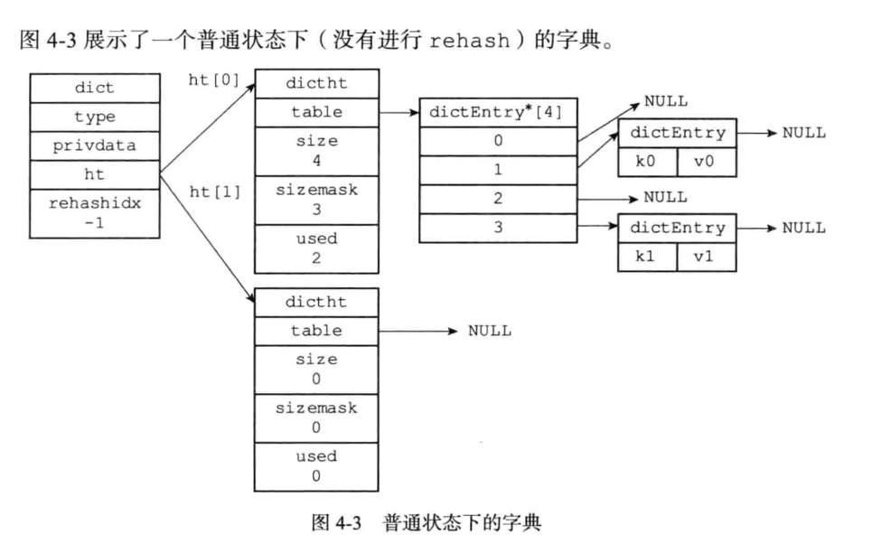
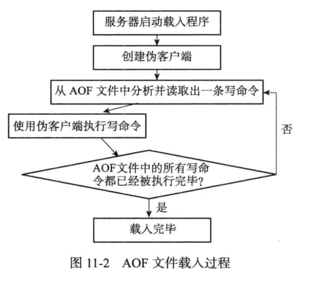
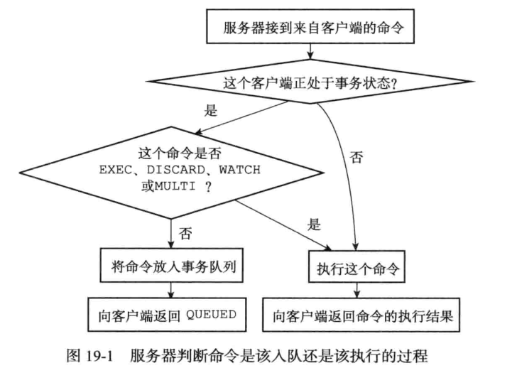
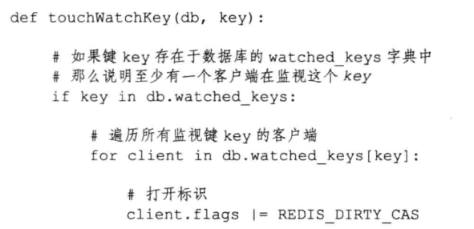

# Redis设计与实现——笔记

------

## 第一部分 数据结构与对象

### 第2章 简单动态字符串

Redis中的字符串没有使用C中的字符串，而是自己用C的结构体自定义了一个名为`simple dynamic string`(SDS，简单动态字符串)的结构。SDS也可以调用C字符串函数库里的函数

Redis中，C字符串只作为字符串字面量用在一些无需进行修改的地方，例如打印日志：

`redisLog(REDIS_WARNING,"Redis ready to exit, bye bye ...")`

SDS用在可能被修改的字符串值，例如输入以下命令：

```
redis > SET msg "hello world"
OK
```

Redis会在数据库中创建一个新的键值对，其中：

1. 键是一个字符串对象，底层实现是一个保存着字符串"msg"的SDS
2. 值也是一个字符串对象，底层实现是一个保存着字符串"hello world"的SDS

#### 2.1 SDS的定义

```c
struct sdshdr {
    int len;	//记录sds的长度
    int free;	//记录buf数组中空闲长度
    char[] buf;	//保存数据
}
```


#### 2.2 SDS与C字符串的区别(优点)

##### 2.2.1 常数复杂度获取字符串的长度

C中获取长度的方法，是通过一个O(N)的循环计算出来的，而SDS直接将长度len作为属性保存了，所以SDS的时间复杂度是O(1)；设置和更新len完全是由SDS的API自动完成的；这确保了获取字符串长度的工作不会成为Redis的性能瓶颈

JAVA中数组长度的获取：https://blog.csdn.net/personbing/article/details/51394286

##### 2.2.2 杜绝缓冲区溢出

使用`<string.h>/strcat`函数时有可能`des`的剩余长度不足以容纳`src`的长度，会造成缓冲区溢出

例如，以下两个在内存中紧挨着的C字符串s1和s2，执行`strcat(s1," Cluster")`


可以看到s1的数据溢出到了s2所在的空间，导致s2的内容意外被修改

SDS完全杜绝了缓冲区溢出的现象：当SDS被修改时，API首先会检查SDS的空间是否满足操作要求，若不满足则会对SDS的空间进行操作(扩展)。

上述同样的例子，在SDS操作则会是这样：


可以看到len变化为13，同时free也调整到了13，这是SDS空间分配策略决定的

##### 2.2.3 减少修改字符串时内存重分配的次数

SDS通过free属性解除了字符串长度与底层数组长度的关联。通过free属性，设计了空间与分配和惰性空间释放两种优化策略

###### 1 空间预分配

对空间进行增长操作时，不仅对buf进行扩容到刚好容量的那个空间，还会增加额外的free空间，以减少后续的空间增长次数，free的大小决定方式为：

1. 增长之后，若len<1mb，则free = len
2. 增长之后，若len >= 1mb，则free = 1mb

采用这个策略之后，SDS将连续增长N次字符串所需的内存重分配次数从必定N次降低为最多N次

###### 2 惰性空间释放

主要用于优化字符串缩短操作，缩短时不立刻释放剩余的空间，而用free记录下来，以待将来使用。

例如：


SDS也有对应的API，在有需要时真正地释放SDS未使用空间，避免内存浪费

##### 2.2.4 二进制安全

只要靠len属性记录何时终止，因此虽然也采用了C中的以'\0'结尾，如果中间有'\0'的话，并不会误读。并且可以存放二进制数据，不仅仅是文本数据


##### 2.2.5 兼容C字符串函数

可以使用部分C字符串的函数，比如将SDS的buf数组添加到C字符串的末尾

`strcat(c_string, sds->buf)`

避免了代码的重写

### 第3章 链表

Redis中链表的运用非常广泛，列表键的底层就是链表，发布与订阅、慢查询、监视器等功能也用到了链表

Redis链表实现的特性：

1. 双端
2. 无环
3. 有头节点指针和尾节点指针
4. 有长度计数器(类似于Java中的size()函数作用)
5. 多态：链表节点使用void*指针保存节点值，可以通过List结构的dup、free、match三个属性为节点值设置类型特定函数，所以链表用于保存各种不同类型的值

每个节点的实现结构：

```c
adlist.h/listNode
typedef struct listNode {
    //前置节点
    struct listNode *prev;
    //后置节点
    struct listNode *next;
    //节点的值
    void *value;
} listNode;
```

使用adlist.h/list来持有链表：

```c
typedef struct list {
    //表头节点
    listNode *head;
    //表尾节点
    listNode *tail;
    //链表所包含的节点数量
    unsigned long len;
    //节点值复制函数
    void *(*dup) (void *ptr);
    //节点值释放函数
    void (*free) (void *ptr);
    //节点值对比函数
    int (*match) (void *ptr, void *key)
} list;
```

### 第4章 字典

字典类似于Java中的Map，存储键值对。Redis基本的存储功能就是字典，例如:

```
redis -> SET msg "hello world"
OK
```

数据库中就会创建一个键为"msg"，值为"hello world"的键值对。除此之外，字典也是哈希键的底层实现之一

#### 4.1 字典的实现



##### 4.1.1 字典

由`dict.h/dict`结构表示：

```c
typedef struct dict {
    //类型特定函数
    dictType *type;
    //私有数据
    void *privdata;
    //哈希表
    dictht ht[2];
    //rehash索引
    //当rehash不在进行时，值为-1
    in trehashidx
} dict;
```

一般情况下，字典只使用ht[0]这个哈希表，h[1]只在rehash时使用

type属性是一个指向dictType结构的指针，每个dictType结构保存了一簇用于操作特定类型键值对的函数，Redis会为用途不同的字典设置不同的类型特定函数

privdata属性保存了需要传给那些类型特定函数的可选参数

```c
typedef struct dictType {
    //计算哈希值的函数
    unsigned int (*hashFunction) (const void *key);
    //复制键的函数
    void *(*keyDup) (void *privdata, const void *key);
    //复制值得函数
    void *(*valDup) (void *privdata, const void obj);
    //对比键的函数
    int (*keyCompare) (void *privdata, const void *key1, const void key2);
    //销毁键的函数
    int (*keyDestructor) (void *privdata, void *key);
    //销毁值得函数
    void (*valDestructor) (void *privdata, void *obj);
} dictType;
```

##### 4.1.2 哈希表

Redis字典使用得哈希表由`dict.h/dictht`结构定义：

```c
typedef struct dictht {
    //哈希表数组
    dictEntry **table;
    //哈希表大小，
    unsigned long size;
    //哈希表掩码，用于计算索引，总时等于size-1，和Java中的Map一样
    unsigned long sizemask;
    //该哈希表已有的节点数量
    unsigned long used;
} dictht;
```

table属性是一个数组，数组中的每个元素都是一个指向`dict.h/dictEntry`结构的指针，每个dictEntry结构保存一个键值对。

##### 4.1.3 哈希表节点

哈希表节点使用dictEntry结构表示，每个dictEntry结构都保存一个键值对：

```c
typedft struct dictEntry {
    //键
    void *key;
    //值
    union {
        void *val;
        uint64_tu64;
        int64_ts64;
    } v;
    //指向下个哈希表节点，形成链表
    struct dictEntry *next;
} dictEntry;
```

值可以是指针、uint64_t整数、int64_t整数

next*指针和Map一样，解决冲突问题


#### 4.2 哈希算法

与HashMap步骤一样，可能只是计算hash的算法不同而已，步骤如下：

1. 使用MurmurHash算法，根据传入的key计算得到hash值；MurmurHash的优点在于，即使输入的是有规律的，算法仍然能给出一个很好的随机分布性，计算速度也非常快，Redis使用的是MurmurHash2(Redis版本3.0)
2. 根据掩码mask，即数组长度-1，&运算得到下标

#### 4.3 解决键冲突

与jdk1.7的HashMap一样，采用链地址法(separate chaining)，即冲突的节点采用链表的形式链接起来

dictEntry节点组成的链表没有指向链表表尾的指针，为了速度考虑，添加新节点时将新节点直接添加到链表头部，复杂度O(1)

#### 4.4 渐进式rehash

哈希表保存的键值对数量太多或者太少时，程序需要对哈希表的大小进行相应的扩展或收缩

通过rehash(重新散列)操作来实现扩展收缩功能，步骤如下：

1. 给字典ht[1]分配空间，策略如下：
   1. 扩展操作，ht[1]的大小为第一个>=ht[0].used*2的2^n
   2. 收缩操作，ht[1]的大小为第一个>=ht[0].used的2^n
2. 将保存在ht[0]上的所有键值对，通过**渐进式rehash和维持一个rehashidx**的方式，完全移动到ht[1]上；rehash是指重新计算键的哈希值和索引值，然后放入ht[1]哈希表的指定位置
3. 当所有移动完成时，将ht[0]释放，设置ht[1]为ht[0]，并在ht[1]新创建一个空白哈希表，为下一次rehash做准备

**渐进式rehash详细过程**：

1. 为ht[1]分配空间，让字典同时持有ht[0]和ht[1]两个哈希表
2. 在字典中维持一个索引计数器变量rehashidx，初始值为0，表示rehash正式开始
3. 在rehash期间，每次对字典执行**添加、删除、查找、更新**操作时，额外执行一次移动操作——将ht[0]上rehashidx索引上的所有键值对rehash到ht[1]上，rehash完成之后，rehashidx++
4. ht[0]所有键值对移动完成后，rehashidx=-1，表示完成

添加操作只会添加到ht[1]上，ht[0]只减不增

渐进式rehash的好处在于：采用了分而治之的方式，将rehash键值对所需的计算工作均摊到对字典的每个添加、删除、查找和更新操作上，从而避免了集中式rehash而带来的庞大计算量

### 第5章 跳跃表

跳跃表是一种有序的数据结构(升序)，支持平均O(logN)，最坏O(N)复杂度的节点查找，还可以通过顺序性操作来批量处理节点；大部分情况下，跳跃表的效率可以和平衡树相媲美，但是实现简单，不少程序都是用跳跃表来代替平衡树

Redis使用跳跃表作为有序集合键的底层实现之一，如果一个有序集合包含的元素数量比较多，又或者有序集合中元素的成员是比较长的字符串时，Redis使用跳跃表来作为有序集合键的底层实现。

#### 5.1 实现

由`redis.h/zskiplistNode`和`redis.h/zskiplist`两个结构定义，其中`zskiplistNode`表示节点，`zskiplist`保存整体的信息，比如节点数量、指向表头节点和表尾指针等等


##### 5.1.1 节点

跳跃表节点由`redis.h/zskiplistNode`结构定义：

```c
typedef struct zskiplistNode {
    //层
    struct zskiplistLevel {
        //前进指针
        struct zskiplistNode *forward;
        //跨度
        unsigned int span;
    } level[];
    
    //后退指针
    struct zskiplistNode *backward;
    //分值
    double score;
    robj *obj;
} zskiplistNode;
```

**层**

一般来说，层的数量越多，访问其他节点的速度也就越快，不仅仅像链表那样只能访问下一个节点，可以有跨度的访问

每次创建一个新的跳跃表节点时，程序根据幂次定律(power law，越大的数出现的概率越小)随机生成一个介于1和32之间的值作为level数组的大小，这个大小就是“高度”

**前进指针**

每层都有一个指向表尾方向的前进指针，用于从表头向表尾方向访问节点

**跨度**

层的跨度用于记录两个节点之间的距离

1. 两个节点之间的跨度很大，说明距离远
2. 指向NULL的所有前进指针跨度均为0，因为它们没有连接任何节点

跨度主要用来计算排位(Rank)：在查找某个节点的时候，将沿途访问的所有层的跨度累计起来，得到的结果就是目标节点在跳跃表中的排位

**后退指针**

用于从表尾向表头访问节点，一次只能访问一个节点，不能向前进指针那样有跨度。第一个节点没有指向头结点的后退指针

**分值和成员**

节点的分值(score属性)是一个double类型的浮点数，跳跃表中所有的节点都按照score升序排列

节点的成员对象是一个指针，指向一个字符串对象，字符串对象保存着一个SDS值

同一个跳跃表中，成员对象必须是唯一的，分值是可以相同的；分值相同的节点按照成员对象在字典序中的大小来排序，也是升序排列

##### 5.1.2 zskiplist结构

通过一个zskiplist结构来持有这些节点，程序可以更方便地对整个跳跃表进行处理，比如快算访问表头节点和表尾节点，或者快速获得跳跃表节点的总数量等信息

```c
typedef struct zskiplist {
    //表头节点和表尾节点
    struct skiplistNode *header, *tail;
    //节点数量
    unsigned long length;
    //最高层数
    int level;
} zskiplist;
```

level属性只是针对有数据的节点，并不将表头节点包含在内


### 第6章 整数集合

整数集合(intset)是Redis用于保存整数值的集合抽象数据结构，可以保存类型为int16_t，int32_t，int64_t的整数值，并且不存储重复元素(16位的x，和32位的x，算是重复吗？)

#### 6.1 整数集合的实现

每个`intset.h/intset`结构表示一个整数集合：

```c
typedef struct intset {
    //编码方式
    uint32_t encoding;
    //集合包含的元素数量
    uint32_t length;
    //保存元素的数组
    int8_t contents[];
} intset;
```

contents数组是整数集合的底层实现：整数集合的每个元素都放置在contents数组中，称为(item，数组项)，各个项在数组中按升序排列，且没有重复项

length记录了整数集合的元素数量，也即是contents数组长度

虽然intset结构将contents数组声明为int8_t类型的数组，但实际上contents数组并不保存任何int8_t类型的值，contents数组真正的类型取决于encoding属性的值

#### 6.2 升级

将一个新元素添加到整数集合，且新元素的类型比当前元素属性要长，要对整数集合进行升级，然后再将新元素添加到整数集合中

步骤如下：

1. 根据新元素的类型，扩展整数集合底层数组大小，并为新元素分配空间
2. 将底层数组现有的所有元素都转换成与新元素相同的类型，并且将类型转换后的元素放到正确的位置上，需要保持有序性不变
3. 将新元素添加到底层数组中

注意：是没有降级操作的

#### 6.3 升级的好处

1. 提升灵活性
2. 节省内存

### 第7章 压缩列表

压缩列表(ziplist)是Redis为了节约内存而开发的，是由一系列特殊编码的连续内存块组成的顺序性(sequential)数据结构。一个压缩列表可以包含任意多个节点(entry)，每个节点可以保存一个字节数组或者一个整数值

压缩列表是列表键和哈希键的底层实现之一

#### 7.1 压缩列表的构成


​	

#### 7.2 压缩列表节点的构成


##### 7.2.1 previous_entry_length

previous_entry_length属性以子节为单位，记录了压缩列表前一个节点的长度；previous_entry_length的长度可以是1子节或者5子节

1. 如果前一个节点的长度<254子节，那么previous_entry_length长度为1子节，前一个节点的长度就保存在这一个子节里面
2. 如果前一个节点的长度>=254子节，那么previous_entry_length的长度为5子节，属性的第一个子节设置为0xFE(254)，后四个子节保存前一个节点的长度

程序可以通过指针运算，根据当前节点的起始地址和previous_entry_length算出前一个节点的起始地址

##### 7.2.2 encoding

节点的encoding记录了节点的content属性所保存的数据的类型和长度

1. 1子节，2子节或者5子节长，值的最高位为00，01或者10的是字节数组编码：这种编码表示节点的content属性保存着字节数组，数组的长度由编码除去最高2位之后的其他位记录
2. 1字节长，值得最高位以11开头的是整数编码：这种编码的content属性保存着整数值，整数值的类型和长度由编码除去最高2位之后的其他位记录

##### 7.2.3 content

节点的content属性负责保存节点的值，节点值可以是一个字节数组或者一个整数值，值的类型和长度由节点的encoding属性决定


#### 7.3 连锁更新

当前部分的entry发生变化时，后续的节点的previous_entry_length的大小有可能变化(例如从1子节扩充到5子节)，因此后续的所有节点都可能需要重新分配内存，这种现象叫做连锁更新

连锁更新在最坏的情况下需要对压缩链表执行N次的空间重分配，而每次空间重分配最坏复杂度为O(N)，所以连锁更新最坏复杂度为O(N^2)

实际上连锁更新出现的概率很小，不必担心连锁更新影响压缩列表的性能


### 第8章 对象

Redis并没有直接使用前面的数据结构来实现键值对数据库，而是利用这些数据结构创建了一个对象系统：字符串对象、列表对象、哈希对象、集合对象、有序集合对象。每种对象至少利用了1种数据结构

Redis对象系统实现了基于引用计数技术的内存回收机制，当程序不再使用某个对象时，这个对象所占的内存就会被自动释放；此外还通过引用计数技术实现了对象共享机制，这一机制可以在适当的条件下，通过让多个数据库键共享同一个对象来节约内存

Redis对象带有访问时间记录信息，该信息可以用于计算数据库键的空转时长，在服务器启用了maxmemory功能的情况下，空转时长比较大的那些键可能会优先被服务器删除。

Redis中的每个对象都由一个redisObject结构表示，该结构中和保存数据有关的三个属性分别是type、encoding、ptr

```c
typedef struct redisObject {
    //类型
    unsigned type:4;
    //编码
    unsigned encoding:4;
    //指向底层实现数据结构的指针
    void *ptr;
}
```

#### 8.1 对象的类型与编码

##### 8.1.1 类型

键总是一个字符串对象，值可以任意一种，因此xx数据库键称为"列表键"的时候，代表这个数据库键的值为列表对象


##### 8.1.2 编码和底层实现

encoding属性记录了对象使用的编码，也即是说这个对象使用了什么数据结构作为对象的底层实现，见下表：


ptr指针指向对象的底层实现数据结构

#### 8.2 字符串对象

字符串对象的编码可以是int、raw、embstr

1. 如果一个字符串对象保存的是整数值，并且这个整数值可以用long类型来表示，那么字符串对象会将整数值保存在字符串对象结构的ptr属性里面(将void*转换成long)，并将字符串对象的编码设置为int

   

2. 如果字符串对象保存的是一个字符串值，并且这个字符串值的长度<=32子节，那么字符串使用embstr编码的方式来保存这个字符串值

   embstr是专门用来保存短字符串的一种优化编码方式，这种编码和raw编码一样，都使用redisObject和sdshdr结构来表示字符串对象，但raw编码会调用两次内存分配分别创建redisObject和sdshdr结构，而embstr编码通过调用一次内存分配函数来分配一块连续的空间，空间中依次包括redisObject和sdshdr两个结构

   

   

3. 保存一个字符串，并且这个字符串值的长度>32子节，那么字符串对象使用一个简单动态字符串SDS来保存这个字符串值，并将编码设置为raw

   

可以用long double保存的浮点数也是作为字符串值保存的


##### 8.2.1 编码转换

int编码和embstr编码在条件符合下会转化为raw

1. int编码，如果向对象执行了一些命令，使得这个对象保存的不再是整数值，而是一个字符串值，那么编码会从int变为raw
2. embstr编码的字符串对象实际上是只读的，对embstr字符串执行任何修改命令时，程序会将embstr转换为raw，然后再进行修改

#### 8.3 列表对象

列表对象的编码可以是ziplist、linkedlist

1. ziplist编码的列表对象采用压缩列表作为底层实现，每个压缩列表节点(entry)保存一个元素

   

2. linkedlst编码的列表对象采用双端链表作为底层实现，每个双端链表节点(node)都保存了一个字符串对象，每个字符串对象都保存了一个列表元素，这是一种被对象嵌套的对象

   

   

##### 8.3.1 编码转换

当列表对象同时满足以下两个条件时，列表对象使用ziplist编码：

1. 列表对象保存的所有字符串元素的长度都小于64子节
2. 列表对象保存的元素数量<=512个

不能同时满足这两个要求的列表对象需要使用linkedlist编码

**这两个条件都是可以修改的，可以看配置文件中关于list-max-ziplist-value和list-max-ziplist-entries选项的说明**

#### 8.4 哈希对象

哈希对象的编码可以是ziplist或者hashtable

1. ziplist编码的哈希对象使用压缩列表作为底层实现，每当有新的键值对要加入到哈希对象时，程序会将先保存了键的压缩列表节点推入到压缩列表末尾，然后将保存了值得压缩列表节点推入到压缩列表末尾

   

   

2. hashtable编码的哈希对象使用字典作为底层实现，哈希对象中的每个键值对都使用一个字典键值对来保存

   字典的每个键都是一个字符串对象，对象中保存了键值对的键

   字典的每个值都是一个字符串对象，对象中保存了键值对的值

   

##### 8.4.1 编码转换

当哈希对象同时满足以下两个条件时，哈希对象使用ziplist编码：

1. 哈希对象保存的所有键值对的键和值的字符串长度都<64子节
2. 哈希对象保存的键值对数量<=512个

不满足这两个条件的哈希对象，使用hashtable编码

**这两个条件都是可以修改的，可以看配置文件中关于hash-max-ziplist-value和hash-max-ziplist-entries选项的说明**

#### 8.5 集合对象

集合对象的编码可以是intset或者hashtable

1. intset编码的集合对象使用整数集合作为底层实现，集合对象包含的所有元素都被保存在整数集合里面

   

2. hashtable编码的集合对象使用字典作为底层实现，字典的每个键都是一个字符串对象，每个字符串对象包含了一个集合元素，而字典的值全部设置为NULL

   

##### 8.5.1 编码转换

集合对象同时满足以下两个条件时，对象使用intset编码：

1. 集合对象保存的所有元素都是整数值
2. 集合对象保存的元素数量<=512

不能满足这两个条件的集合对象使用hashtable编码

**第二个条件的上限值是可以修改的，看配置文件中关于set-max-intsetentries选项说明**

#### 8.6 有序集合对象

有序集合的编码可以是ziplist或者skiplist

1. ziplist编码的压缩列表对象使用压缩列表作为底层实现，每个集合元素使用两个紧挨在一起的压缩列表节点来保存，第一个节点保存元素的成员(member)，而第二个保存元素的分值(score)

   压缩列表内的集合元素按分值从小到大进行排序，分值较小的元素靠近表头，分值较大的靠近末尾

   

   

2. skiplist编码的有序集合对象使用zset结构作为底层实现，一个zset包含一个字典和跳跃表：

   ```c
   typedef struct zset {
       zskiplist *zsl;
       dict *dict;
   } zset;
   ```

   zsl跳跃表按分值从小到大保存了所有集合元素，每个跳跃表节点都保存了一个集合元素：跳跃表节点的object属性保存了元素的成员，score属性保存了元素的分值。通过这个跳跃表，程序可以对有序集合进行范围型操作，比如ZRANK、ZRANGE

   dict字典创建了一个从成员到分值的映射，字典中的每个键值对都保存了一个集合元素：字典的键保存了元素的成员，字典的值保存了元素的分值。通过这个字典，程序可以用O(1)复杂度查找给定成员的分值，ZSCORE命令就是根据这一特性实现的

   有序集合每个元素的成员都是一个字符串对象，分值都是一个double类型的浮点数

   跳跃表和字典两种数据结构会通过指针共享相同元素的成员和属性，因此不会造成内存浪费

   

   

   **上图是为了展示方便，跳跃表和字典中都有成员和分值出现，实际上两个数据结构是通过指针共享元素的成员和分值的，不会产生数据重复和内存的浪费**

##### 8.6.1 编码的转换

有序集合对象同时满足以下两个条件时，对象使用ziplist编码：

1. 有序集合保存的元素数量<=128个
2. 有序集合保存的所有元素成员的长度都<64子节

不满足以上两个条件的有序集合对象使用skiplist编码

**这两个条件都是可以修改的，可以看配置文件中关于zset-max-ziplist-entries和zset-max-ziplist-value选项的说明**

#### 8.7.1 & 8.7.2 类型检查、多态

可以用一张图来说明这个过程：


#### 8.8 内存回收

C语言不具备自动内存回收功能，所以Redis利用了**引用计数技术**实现了内存的回收机制。通过这一机制，程序可以通过跟踪对象的引用计数信息，在适当的时候自动释放对象并进行内存回收

每个对象的引用计数信息由redisObject结构的refcount属性记录：

```c
typedef struct redisObject {
    ...
        
    //引用计数
    int refcount;
    
    ...
} robj;
```

对象的引用计数信息会随着对象的使用状态而不断变化：

1. 创建一个新对象时，引用计数的值会被初始化为1
2. 对象被一个新程序使用时，引用计数值+1
3. 对象不被一个程序使用时，引用计数值-1
4. 计数值==0时，对象所占的内存会被释放


#### 8.9 对象共享

引用计数技术还有对象共享的作用

Redis在初始化服务器时，创建一万个字符串对象，这些对象包含了从0到9999的所有整数值，当服务器需要用到0到9999的字符串对象时，服务器会共享这些对象，而不是新建(类似于Integer的-128—127的缓存)


Redis只对包含整数值的字符串对象进行共享

8.10 对象的空转时长

redisObject最后一个属性，lru，记录了对象最后一次被命令程序访问的时间：

```c
typedef struct redisObject {
    ...
    
    unsigned lru:22;
    
    ...
} robj;
```

OBJECT IDLETIME计算空转时长：当前时间-lru记录的时间，且这个命令不更新lru

如果服务器打开了maxmemory选项，并且服务器用于回收内存的算法为volatile-lru或者allkeys-lru，当服务器占用的内存数超过了maxmemory选项的设置时，空转时长较高的那部分键会优先被服务器释放，回收内存

可以查阅配置文件的maxmemory选项和maxmemory-policy选项，获取更多信息


## 第二部分 单机数据库的实现

### 第9章 数据库

#### 9.1 服务器中的数据库

Redis服务器将所有的数据库都保存在服务器状态`redis.h/redisServer`结构的db-数组中，db数组的每个项都是一个`redis.h/redisDb`结构，每个redisDb结构代表一个数据库：

```c
struct redisServer {
    ...
    //一个数组，保存着服务器中的所有数据库
    redisDb *db;
    
    //这个属性决定了，初始化服务器时，应该创建多少个数据库，默认16
    int dbnum;
    ...
}
```


#### 9.2 切换数据库

使用select命令切换数据库

redisClient结构的db属性，记录了客户端当前的目标数据库，这个属性是一个指向redisDb结构的指针：

```c
typedef struct redisClient {
    ...
    //记录客户端当前正在使用的数据库
    redisDb *db;
    ...
} redisClient;
```

redisClient.db指针指向redisServer.db数组中的一个元素，select的原理就是改变Client的db指针的指向


#### 9.3 数据库键空间

Redis是一个键值对(key-value pair)数据库服务器，服务器中每个数据库都由一个`redis.h/redisDb`结构表示，其中redisDb结构的dict字典保存了数据库中的所有键值对，这个字典称之为键空间(key space)

```c
typedef struct redisDb {
    ...
    //数据库键空间，保存着数据库中所有的键值对
    dict *dict;
    ...
} redisDb;
```

1. 键空间的键也就是数据库的键，每个键都是一个字符串对象
2. 键空间的值也就是数据库的值，可以是字符串对象、列表对象、哈希表对象、集合对象、有序集合对象中的任意一种


#### 9.4 设置键的生存时间或过期时间

##### 9.4.1 设置过期时间

1. expire <key> <ttl> 给指定的key设置**ttl秒**的生存时间
2. pexpire <key> <ttl> 给指定的key设置**ttl毫秒**的生存时间
3. expireat <key> <timestamp> 给指定的key设置直到timestamp时间戳后销毁，单位**秒**
4. pexpireat <key> <timestamp>给指定的key设置直到timestamp时间戳后销毁，单位**毫秒**

expire、pexpire、expireat底层都是pexpireat的实现


##### 9.4.2 保存过期时间

redisDb结构的expires字典保存了数据库中所有键的过期时间，称之为过期字典

1. 过期字典的键是一个指针，指向键空间中的对应的键对象(数据库键)
2. 过期字典的值是一个long long 类型的整数，保存了键所指向的数据库键的过期时间——一个毫秒精度的UNIX时间戳

```c
typedef struct redisDb {
    ...
    //过期字典，保存过期时间
    dict *expires;
    ...
}
```


PEXPIREAT伪代码：

```c
def PEXPIREAT(key, expire_time_in_ms) {
    //如果给定的键不存在于键空间，不能设置过期时间
    if key not in redisDb.dict:
        return 0
    //在过期字典中关联键和过期时间
    redisDb.expires[key] = expire_time_in_ms
    //过期时间设置成功
    return 1
}
```

9.4.3 移除过期时间

PERSIST命令移除一个键设置的过期时间

伪代码：

```c
def PERSIST(key) {
    //如果键不存在，或者键没有设置过期时间，那么直接返回
    if key not in redisDb.expires:
        return 0
    //移除过期字典中给定键的键值对关联
    redisDb.expires.remove(key)
    //键的过期时间移除成功
    return 1
}
```

##### 9.4.3 得到剩余生存时间

TTL和PTTL分别以秒和毫秒返回key的剩余生存时间；都是通过过期时间-当前时间计算得到的

#### 9.5 过期键删除策略

过期时间到了，系统如何删除过期的键呢？有三种策略：

1. 定时删除：过期时间一到，马上删除；对CPU时间不友好
2. 惰性删除：过期时间到了，并不立刻删除，当下一次获取到该键的时候，先进行判断，如果判断已过期，则删除，没有过期就返回键；对CPU时间最友好，对内存最不友好
3. 定期删除：每隔一段时间，程序就会对数据库进行一次检查，删除里面的过期键；至于要删除多少个，检查多少个数据库，由算法决定；需要合理地设置操作时长和执行频率，否则严重时会变化为策略1和策略2的情况

#### 9.6 Redis过期键删除策略

Redis服务器使用了惰性删除和定期删除两种策略：通过配合使用这两种删除策略，服务器可以很好地在合理使用CPU时间和避免浪费内存空间之间取得平衡

##### 9.6.1 惰性删除策略实现

过期键的惰性删除策略由`db.c/expireIfNeeded`函数实现，这个函数就像一个过滤器，过滤掉已经过期的键：所有读写数据库的命令执行之前都会调用该函数进行检查


##### 9.6.2 定期删除策略的实现

过期键的定期删除策略由`redis.c/activeExpireCycle`函数实现，每当Redis的周期性操作`redis.c/serverCron`函数执行时，`activeExpireCycle`函数就会被调用，它在规定的时间内，分多次遍历服务器中的各个数据库，从过期字典中随机检查一部分键的过期时间，并删除其中的过期键

#### 9.7 AOF、RDB和复制功能对过期键的处理

##### 9.7.1 生成RDB文件

在执行SAVE命令或者BGSAVE命令创建一个新的RDB文件时，程序会对数据库中的键进行检查，已过期的键不会被保存到新创建的RDB文件中，因此过期键不会对新的RDB文件造成影响

##### 9.7.2 载入RDB文件

1. 如果服务器以主服务器模式运行，载入RDB文件时，过期键将被忽略，所以过期键对载入RDB文件的主服务器不会有影响
2. 如果服务器以服务器模式运行，所有键包括过期键都会被载入；不过主从服务器在进行数据同步时，从服务器的数据库会被清空，所以一般来讲，过期键对载入RDB文件的从服务器也不会造成影响

##### 9.7.3 AOF文件写入

服务器以AOF持久化模式运行时，如果过期键还没有被惰性删除或者定期删除，那么这个过期键不会造成任何影响

过期键被删除之后，程序会向AOF文件追加(append)一条DEL命令，显示记录该键已经被删除

##### 9.7.4 AOF重写

执行AOF重写时，过期键不会被保存到重写后的AOF文件

##### 9.7.5 复制

当服务器运行在复制模型下时，从服务器的过期键删除动作由主服务器决定：

1. 主服务器删除一个过期键之后，显示地发送给所有从服务器一个DEL命令，通知从服务器删除这个过期键
2. 从服务器不会主动对过期键操作，当访问从服务器地过期键时，就像访问一个正常键一样
3. 从服务器只有收到主服务器的DEL命令后，才会删除过期键；主要是为了主从服务器的数据一致性

#### 9.8 数据库通知

主要有两类通知：

1. 关注“某个键执行了什么命令”的通知称为键空间通知(key-space notification)
2. 关注“某个命令被什么键执行了”的通知称为键事件通知(key-event notification)


### 第10 章 RDB持久化

服务器中的非空数据库和其中的键值对称为数据库状态

Redis是内存数据库，它将所有的状态都保存在内存中，如果一旦服务器进程退出，那么数据库状态也会丢失；为了解决这个问题，Redis提供了RDB持久化功能，这个功能可以将Redis在内存中的数据库状态保存到磁盘里，避免数据丢失

RDB持久化文件是一个经过压缩的二进制文件，通过该文件可以还原数据库状态

#### 10.1 RDB文件的创建与载入

有两个命令可以创建RDB文件，一个是SAVE，另一个是BGSAVE：

1. SAVE命令会阻塞Redis服务器进程，直到RDB文件创建完毕为止，服务器进程阻塞期间，服务器不能处理任何命令请求
2. BGSAVE命令会派生出一个子进程，然后由子进程负责创建RDB文件，服务器进程(父进程)继续处理命令请求，但是SAVE、BGSAVE命令会被拒绝

创建RDB文件的实际工作由`rdb.c/rdbSave`函数完成：

```c
def SAVE() {
    //创建RDB文件
    rdbSave()
}

def BGSAVE() {
    //创建子进程
    pid = fork();
    //如果是子进程
    if (pid == 0) {
        //子进程负责创建RDB文件
        rdbSave();
        //完成之后向父进程发送信号
        signal_parent();
    }
    //父进程
    else if (pid > 0) {
        //父进程继续处理命令请求，并通过轮询等待子进程的信号
        handle_request_and_wait_signal();
    }
    else {
        //处理出错情况
        handle_fork_error()
    }
}
```

RDB文件的载入工作是服务器启动时自动执行的，只要启动时检测到RDB文件存在，就会自动载入RDB文件

**注意：因为AOF文件的更新频率通常比RDB文件更新频率高，所以：**

1. 如果服务器开启了AOF持久化功能，那么服务器优先使用AOF文件来还原数据库状态
2. 只有AOF持久化功能关闭时，服务器才会使用RDB文件来还原数据库状态

RDB文件载入期间，会一直处于阻塞状态

#### 10.2 自动间隔保存

因为BGSAVE命令不阻塞服务器进程，所以Redis允许用户通过设置服务器配置的save选项，让服务器每隔一段时间自动执行一次BGSAVE命令

可以通过save选项设置多个保存条件，但只要有一个条件满足，就执行BGSAVE命令

例如：

```redis
save 900 1		//900s之内，对数据库进行了至少一次修改
save 300 10		//300s之内，对数据库进行了至少10次修改
save 60 10000	//60s之内，对服务器进行了至少10000次修改
```

##### 10.2.1 设置保存条件

可以通过指定配置文件或者传入启动参数的方式设置save选项，如果用户没有设置，服务器会给save选项设定默认值：

```redis
save 900 1		//900s之内，对数据库进行了至少一次修改
save 300 10		//300s之内，对数据库进行了至少10次修改
save 60 10000	//60s之内，对服务器进行了至少10000次修改
```

接着，服务器会根据save选项设置的保存条件，设置服务器状态redisServer结构的saveparams属性：

```c
struct redisServer {
    ...
    //记录了保存条件的数组
    struct saveparam *saveparams;
    ...
}
```

```c
struct saveparam {
    //秒数
    time_t_seconds;
    //修改数
    int changes;
}
```

以默认设置为例：


##### 10.2.2 dirty计数器和lastsave属性 

服务器状态还维持着一个dirty计数器，以及一个lastsave属性

1. dirty属性记录上一次SAVE或者BGSAVE命令执行之后，服务器对数据库状态执行了多少次修改(写入、删除、更新、添加等操作)
2. lastsave属性是一个UNIX时间戳，记录了服务器上次成功执行SAVE命令或者BGSAVE命令的时间

```c
struct redisServer {
    ...
    //修改计数器
    long long dirty;
    //上一次执行保存的时间
    time_t lastsave;
    ...
}
```

##### 10.2.3 检查保存条件是否满足

Redis的服务器周期性操作函数serverCron默认每100毫秒就会执行一次，该函数用于对正在运行的服务器进行维护，它的其中一项工作就是检查save选项设置的保存条件是否以及满足，满足的话，就执行BGSAVE命令

```c
def serverCron() {
    ...
    //遍历所有保存条件
    for (saveparam in server.saveparams) {
        //计算距离上次执行保存操作有多少秒
        save_interval = unixtime_now() - server.lastsave;
        
        //如果数据库状态的修改次数超过所设置的次数
        //并且距离上次保存的时间超过所设置的时间
        //那么执行保存操作
        if (server.dirty >= saveparam.changes && save_interval > saveparam.seconds) {
            BGSAVE();
        }
    }
}
```

#### 10.3 RDB文件结构


**全大写单词：常量；全小写单词：变量和数据**

1. RDB文件开头是REDIS部分，这部分长度为5子节，保存着"REDIS"5个字符；通过这5个字符，程序可以在载入文件时，快速检查所载入的文件是不是RDB文件
2. db_version长度4子节，它的值是一个字符串表示的整数，这个整数记录了RDB文件的版本号，比如“0006”代表RDB文件的版本为第六版，本书只介绍第6版RDB文件的结构
3. databases部分包含了任意多个数据库，以及各个数据库中的键值对数据
4. EOF常量长度1子节，标志着RDB文件正文内容的结束，当程序读到这个值时，就知道数据库的所有键值对都已经载入完毕了
5. check_sum就是校验和，程序读取前四个部分时，会计算出一个和，最后于check_sum作比较，以此来检查RDB文件是否出错或者损坏

##### 10.3.1 databases部分

一个RDB文件的databases部分可以保存任意多个非空数据库


每个非空数据库保存三部分信息：

1. SELECTDB：1子节，提示接下来要读取一个数据库号码
2. db_number：数据库号码
3. key_value_pairs：保存键值对数据，有过期时间的话也保存过期时间


##### 10.3.2 key_value_pairs部分

不带过期时间的键值由TYPE、key、value三部分组成：


TYPE记录了value的类型，1子节，值是以下常量中的一个：


带有过期时间的键值结构如图：


1. EXPIRETIME_MS：1子节，起到提示作用
2. ms，8子节长的带符号整数，记录一个以毫秒为单位的UNIX时间戳，即过期时间


##### 10.3.3 value部分

不同的对象有不同的结构，但是基本上大概结构是这样：


### 第11章 AOF持久化

AOF(Append Only File)持久化功能是通过保存Redis服务器所执行的**写命令**(如果有删除命令，不记录？这样能还原状态吗)来记录数据库状态的，如图所示：


服务器在启动时，可以通过载入和执行AOF文件中保存的命令来还原服务器关闭之前的数据库状态

#### 11.1 AOF持久化的实现

AOF持久化功能的实现可以分为命令追加(append)，文件写入，文件同步(sync)三个步骤

##### 11.1.1 命令追加

当AOF持久化功能打开时，服务器在执行完一个写命令之后，会以协议格式将被执行的写命令写入到服务器状态的`aof_buf`缓冲区末尾

```c
struct redisServer {
    ...
    //AOF缓冲区
    sds aof_buf;
    ...
}
```

##### 11.1.2 AOF文件的写入与同步

Redis的服务器进程就是一个事件循环(loop)，这个循环中的文件事件负责接收客户端的命令请求，以及向客户端发送命令回复，而时间事件则负责执行像serverCron函数这样需要定时运行的函数

服务器在处理文件事件时可能会执行写命令，将一些内容追加到`aof_buf`缓冲区里面，所以在服务器每次结束一个事件循环之前，都会调用`flushAppendOnlyFile`函数，考虑是否将`aof_buf`缓冲区中的内容写入和保存到AOF文件里面

伪代码：

```c
def eventLoop() {
    while (true) {
        //处理文件事件，接收命令请求以及发送命令回复
        //处理命令请求时可能会有新内容被追加到aof_buf缓冲区中
        processFileEvents();
        
        //处理事件事件
        processTimeEvents();
        
        //考虑是否将aof_buf中的内容写入和保存到AOF文件中
        flushAppendOnlyFile();
    }
}
```

flushAppendOnlyFile函数行为由服务器配置的appendfsync选项的值来决定：


#### 11.2 AOF文件的载入与数据还原

Redis读取AOF文件并还原数据库状态的详细步骤如下：

1. 创建一个不带网络连接的伪客户端(fake client)
2. 从AOF文件中分析并读取出一条写命令
3. 使用伪客户端执行被读出的写命令
4. 一直执行步骤2和步骤3，直到AOF文件中所有写命令都被处理完



#### 11.3 AOF重写

为了保持数据库能还原到最终状态，并且减少AOF文件的体积，Redis提供了AOF文件重写(rewrite)功能；该功能让一个新的AOF文件代替旧的AOF文件，并且新的AOF文件没有包含任何浪费空间的冗余命令，体积小得多

##### 11.3.1 AOF文件重写的实现

AOF文件并不需要对现有AOF文件进行任何读取、分析或者写入操作，而是根据最终的数据库状态，生成的写命令

在实际中，在处理列表、哈希表、集合、有序集合这四种有可能包含多个元素的键时，会检查元素数量，如果数量超过了`redis.h/REDIS_AOF_REWRITE_ITEMS_PER_CMD`常量(64)，重写程序会使用多条写命令来记录，而不是仅用一条命令

伪代码：

```c
def aof_rewrite(new_aof_file_name) {
    //创建新的AOF文件
    f = create_file(new_aof_file_name);
    
    //遍历数据库
    for (db in redisServer.db) {
        //跳过空数据库
        if (db.is_empty()) continue;
        //写入select命令，指定数据库号码
        f.write_command("SELECT" + db.id);
        //遍历数据库中的键
        for (key in db) {
            //忽略已经过期的键
            if (key.is_expired()) continue;
            
            //根据key的类型对键进行重写
            if (key.type == String) {
                rewrite_string(key);
            } else if (key.type == List) {
                rewrite_list(key);
            } else if (key.type == Hash) {
                rewrite_hash(key);
            } else if (key.type == Set) {
                rewrite_set(key);
            } else if (key.type == SortedSet) {
                rewrite_sorted_set(key);
            }
            
            //如果键带有过期时间，那么过期事件也需要被重写
            if (key.have_expire_time()) {
                rewrite_expire_time();
            }
        }
    }
     //写入完毕，关闭文件
    f.close();
}
```

不同对象的重写方法：

```c
def rewrite_string(key) {
    //使用GET命令获取字符串键的值
    value = GET(key);
    //使用SET命令重写字符串键
    f.write_command(SET, key, value);
}

def rewrite_list(key) {
    //使用LRANGE命令获取列表键包含的所有元素
    item1, item2, ... , itemN = LRANGE(key, 0, -1);
    //使用RPUSH命令重写列表键
    f.write_command(RPUSH, key, item1, item2, ... , itemN);
}

def rewrite_hash(key) {
    //使用HGETALL命令获取哈希键包含的所有键值对
    field1, value1, ... , fieldN, valueN = HGETALL(key);
    //使用HMSET命令重写哈希键
    f.write_command(HMSET, key, field1, value1, ... , fieldN, valueN);
}

def rewrite_set(key) {
    //使用SMEMBERS命令获取集合键所包含的所有元素
    elem1, elem2, ..., elemN = SMEMBERS(key);
    //使用SADD命令重写集合键
    f.write_command(SADD, key, elem1, elem2, ... , elemN);
}

def rewrite_sorted_set(key) {
    //使用ZRANGE命令获取有序集合键所包含的元素
    member1, score1, ... , memberN, scoreN = ZRANGE(key, 0, -1, "WITHSCORES");
    //使用ZADD命令重写有序集合键
    f.write_command(ZADD, key, score1, member1, ..., socreN, memberN);
}

def rewrite_expire_time(key) {
    //获取毫秒精度的过期时间戳
    timestamp = get_expire_time_in_unixstamp(key);
    //使用PEXPIREAT命令重写键的过期时间
    f.write(PEXPIREAT, key, timestamp);
}
```

##### 11.3.2 AOF后台重写

也即是BGREWRITEAOF命令的实现原理

`aof_write`函数进行大量的写操作，会造成阻塞，因为Redis服务器使用**单个线程**来处理命令请求，所以服务器直接调用改函数，重写期间无法处理客户端发送来的命令

为此，Redis将AOF重写程序放到子进程里执行，这样可以达到：

1. 子进程重写期间，服务器进程可以继续处理命令请求
2. 子进程带有服务器进程数据副本，使用子进程而不是线程，可以在不适用锁的情况下，保证数据安全行

不过，当子进程重写时，父进程可能又执行了新的写命令，可能造成数据的不一致，为此，Redis服务器设置了一个AOF重写缓冲区，这个缓冲区在创建子进程之后开始使用，当Redis服务器执行完一个写命令之后，它会**同时**将这个命令发送给AOF缓冲区和AOF重写缓冲区，如图所示：


也就是说，在子进程执行AOF重写期间，服务器进程需要执行以下三个工作：

1. 执行客户端发来的命令
2. 将执行后的写命令追加到AOF缓冲区；将执行后的写命令追加到AOF重写缓冲区

这样可以保证：

1. AOF缓冲区的内容会定期被写入和同步到AOF文件，对现有AOF文件的处理工作会正常进行
2. 从创建子进程开始，服务器所有的写命令会被记录到AOF重写缓冲区，便于保持数据一致性

子进程完成AOF重写工作后，会给父进程发送一个信号，父进程收到信号之后调用一个信号处理函数，**这个信号处理函数是阻塞的**，执行以下工作：

1. 将AOF重写缓冲区中的所有内容写入到新的AOF文件，这样就维持了数据一致性
2. 对新的AOF文件进行改名，原子地(atomic)覆盖现有的AOF文件，完成新旧两个AOF文件的替换

AOF后台重写，就是将阻塞降低到最短时间，提高性能，也会发生阻塞的

### 第12章 事件

Redis服务器是一个事件驱动程序，服务器需要处理以下两类事件：

1. 文件事件(file event)：Redis服务器通过套接字与客户端(或者其他Redis服务器)进行连接，文件事件就是服务器对套接字操作的抽象；服务器与客户端(或者其他服务器)的通信会产生相应的文件事件，而服务器则通过监听并处理这些事件来完成一系列网络通信操作；**其实就是之前做过的聊天室项目，NIO模型**
2. 时间事件(time event)：Redis服务器中的一些操作(比如serverCron函数)需要在给定的时间点执行，时间事件就是服务器对这类定时操作的抽象

#### 12.1 文件事件

1. 文件事件处理器使用I/O多路复用(Selector)程序来监听多个套接字，并根据套接字目前执行的任务来为套接字关联不同的事件处理器
2. 当被监听的套接字准备好执行连接应答(accpet)、读取(read)、写入(write)、关闭(close)等操作时，与之相对应的文件事件就会产生，这时文件事件处理器就会调用套接字之前关联好的事件处理器来处理这些事件

文件事件处理器以单线程方式运行，即实现了高性能的网络通信模型，又很好地与Redis服务器中其他同样以单线程方式运行的模块进行对接，保持了Redis内部单线程设计的简单性


##### 12.1.1 一次完整的连接示例

假如一个Redis服务器正在运作，那么这个服务器的监听套接字的AE_READBLE事件正处于监听之下，该事件对应的处理器为连接应答处理器

这时有一个Redis客户端向服务器发起连接，监听套接字将产生AE_READBLE事件，触发连接应答处理器执行；处理器对客户端的连接请求进行应答，然后创建客户端套接字，以及客户端的状态，并将客户端套接字的AE_READBLE事件与请求处理器关联，使得客户端可以向服务器发送命令请求

之后客户端发送一个命令请求，客户端套接字将产生AE_READBLE事件，引发命令请求处理器执行，处理器读取客户端的命令内容，然后传送给相关程序去执行

产生相应的命令回复后，服务器将客户端套接字的AE_WRITABLE事件与命令回复处理器进行关联；客户端尝试读取命令回复时，客户端套接字产生AE_WRITABLE事件，触发回复处理器执行；命令回复处理器将全部内容写入到套接字后，服务器解除客户端套接字的AE_WRITABLE事件与命令回复处理器之间的关联


#### 12.2 时间事件

时间事件分2类：

1. 定时事件：让一个程序在指定的时间执行一次
2. 周期性事件：让一个程序每隔一段时间就执行一次

一个时间事件主要有3个属性：

1. id：服务器为时间事件创建的唯一ID，递增的
2. when：毫秒精度的UNIX时间戳，记录时间事件的到达(arrive)时间
3. timeProc：时间事件处理器，一个函数；时间事件到达后，服务器调用相应的处理器处理事件

##### 12.2.1 实现

服务器将所有事件都放在一个`when`属性无序的链表中，且每次将新时间事件放入链表头部，所以从`id`来看，链表是id递减的；每当时间事件执行器运行时，遍历整个链表，对已到达的时间事件执行对应的事件处理器


书上说遍历无序链表并不对性能造成影响，因为服务器最多有2个时间事件，服务器几乎将无序链表退化成一个指针使用的

##### 12.2.2 API

`processTimeEvents`函数是时间事件的执行器，遍历所有已到达的时间事件，并调用对应的处理器

伪代码：

```c
def processTimeEvents() {
    //遍历服务器中的所有时间事件
    for (time_event_in_all_time_event) {
        //检查事件是否已经到达
        if (time_event.when <= unix_ts_now()) {
            //事件已到达
            //执行事件处理器，并获取返回值（用于区分是定时还是周期事件）
            retval = time_event.timeProc();
            
            //定时事件
            if (retval == AE_NOMORE) {
                //删除该事件
                delete_time_event_from_server(time_event);
            } else {
                //周期事件
                update_when(time_event, retval);
            }
        }
    }
}
```

##### 12.2.3 serverCron函数

Redis定期对自身资源和状态进行检查和调整，由`redis.c/serveCron`函数负责执行，并且以周期性事件的方式来运行

Redis2.6中，服务器默认每秒运行10次，平均100ms运行一次

#### 12.3 事件的调度与执行

同时存在时间和文件事件，所以需要对这两种事件进行调度，调度由`ae.c/aeProcessEvents`函数负责

伪代码：

```c
def aeProcessEvents() {
    //获取到达时间距离当前时间最接近的时间事件
    time_event = aeSearchNearestTimeer();
    //计算最接近的时间事件距离到达还有多少ms
    remaind_ms = time_event.when - unix_ts_now();
    //如果事件已到达，remain_ms的值可能为负数，设位0
    if (remaind_ms < 0) remain_ms = 0;
    //根据remaind_ms的值，创建timeval结构
    timeval = create_timeval_with_ms(ramind_ms);
    //阻塞并等待文件事件产生，最大阻塞事件由传入的timeval结构决定
    //如果remaind_ms的值为0，那么aeApipoll调用之后马上返回，不阻塞
    aeApiPoll(timeval);
    //处理所有已产生的文件事件
    processFileEvents();
    //处理所有已到达的时间事件
    processTimeEvents();
}
```

将aeProcessEvents函数置于一个循环里面，加上初始化和清理函数，就构成了Redis服务器的主函数

伪代码：

```c
def main() {
    //初始化服务器
    init_server();
    //一直处理事件，直到服务器关闭为止
    while (server_is_not_shutdown()) {
        aeProcessEvents();
    }
    //服务器关闭，执行清理操作
}
```


### 第13章 客户端

Redis服务器是一对多服务器程序，对于每个与服务器进行连接的客户端，服务器都为这些客户端建立了相应的`redis.h/redisClient`结构，这个结构保存了客户端当前的状态信息，以及执行相关功能时需要用到的数据结构

Redis服务器状态结构的`clients`属性是一个链表，保存了与服务器连接的客户端；对客户端执行批量操作，或者查找某个特定的客户端，都可以通过遍历`clients`链表完成**NIO项目中采用的是ArrayList结构**

新添加的客户端状态会被放到链表的末尾

```c
struct redisServer {
    ...
    //保存客户端的链表
    list *clients;
    ...
}
```


#### 13.1 客户端属性

##### 13.1.1 套接字描述符

客户端状态的fd属性记录了客户端正在使用的套接字描述符

```c
typedef struct redisClient {
    ...
    int fd;
    ...
} redisClient;
```

fd分为-1和大于-1整数的情况：

1. -1：表示是伪客户端——用于载入AOF文件还原数据库状态，或者执行lua脚本中包含的Redis命令；因为这两种情况不需要网络通信，输入命令
2. 大于-1的整数值：普通客户端，用fd来当作记录客户端套接字的描述符

##### 13.1.2 名字

默认情况下，连接到服务器的客户端是没有名字的，可以使用CLIENT setname命令设置名字

名字记录在客户端状态的name属性里面

```c
typedef struct redisClient {
    ...
    robj *name;
    ...
}
```


##### 13.1.3 标志

flags属性记录了客户端的角色，以及目前客户端目前所处的状态，具体看书，太多了

##### 13.1.4 输入缓冲区

输入缓冲区用于保存客户端发送的命令请求

```c
typedef struct redisClient {
    ...
    sds querybug;
    ...
} redisCLient;
```

输入缓冲区的大小会根据输入内容动态缩小或扩大，超过1GB时服务器将关闭这个客户端


##### 13.1.5 命令与命令参数

服务器将客户端发送的命令请求保存到客户端状态的querybuf之后，服务器对命令请求的内容进行分析，将命令参数和参数个数分别放入argv字符串数组和argc属性

```c
typedef struct redisClient {
    ...
    robj **argv;
    int argc;
    ...
} redisClient;
```


argv[0]为要执行的命令，后面为参数

##### 13.1.6 命令的实现函数

服务器从协议内容分析得出argv和argc之后，根据argv[0]，从命令表中查找对应的命令实现函数


命令表是字典，键是SDS结构，值是`redisCommamd`结构

找到argv[0]对应的`redisCommand`结构之后，客户端状态的`cmd`指针指向这个结构

```c
typedef struct redisClient {
    ...
    struct redisCommand *cmd;
    ...
} redisClient;
```

之后服务器使用cmd指向的redisCommand结构，以及argv，argc中的信息，调用命令实现函数，执行命令

命令不区分大小写

##### 13.1.7 输出缓冲区

执行命令所得到命令回复会保存在客户端状态的输出缓冲区里，每个客户端状态都有2个输出缓冲区，一个固定，一个可变

1. 固定的输出缓冲区用于存放长度较小的回复，例如ok，简短的字符串值、整数值、错误回复等，是数组

   ```c
   typedef struct redisClient {
       char buf[REDIS_REPLY_CHUNK_BYTES];//默认16kb
       int bufpos//目前使用了的字节数量
   }
   ```

2. 可变大小的输出缓冲区保存长度较大的回复，例如非常长的字符串值、很多项的列表、很多元素的集合，是一个链表

   

### 第14章 服务器

我认为重点有2个，一个是命令的执行流程，一个是服务器的初始化

#### 14.1 命令请求的执行过程

1. 发送命令

   用户在客户端中键入一个命令请求时，客户端将这个命令请求转换成协议格式，然后通过连接到服务器的套接字，发送给服务器

   

2. 读取命令请求

   命令请求处理器执行以下操作：

   1. 读取套接字中的协议格式的命令请求，保存到客户端的输入缓冲区
   2. 分析命令请求，提取相关信息并分别保存到argv和argc中
   3. 调用命令执行器，执行客户端指定的命令

#### 14.2 命令执行器的执行步骤

1. 查找命令实现

   根据argv[0]在命令表中查找对应的命令，返回对应的redisCommand结构，然后客户端状态的cmd指针指向这个redisCommamd结构

2. 执行预备操作

   进行一些检查，确保命令可以正确、顺利地被执行

3. 调用命令的实现函数

   服务器已经将要执行命令的实现保存到了cmd属性中，还有argv和argc属性，此时直接执行命令即可

   `client -> cmd -> proc(client)`;

   产生的命令回复会保存在客户端状态的输出缓冲区中，之后实现函数还会为客户端的套接字关联命令回复器，这个处理器将命令回复返回给客户端

4. 执行后续工作

   例如慢查询日志功能，AOF持久化等等

#### 14.3 返回命令回复并打印

客户端套接字变为可写时，服务器执行命令回复处理器，将客户端状态中的输出缓冲区中的内容发送给客户端，并清空输出缓冲区

客户端收到协议格式的命令回复之后，转成人类可读的格式，并打印


#### 14.4 初始化服务器

##### 14.4.1初始化服务器状态结构

第一个创建一个`struct redisServer`类型的实例变量server作为服务器的状态，并为属性赋予默认值，具体工作由`redis.c/initServerConfig`函数完成

主要工作：

1. 设置服务器运行ID
2. 设置默认端口号
3. 设置默认RDB持久化条件和AOF持久化条件
4. 初始化LRU时钟
5. 创建命令表
6. ...

##### 14.4.2 载入配置项

启动服务器时，用户可以给定配置参数或者指定配置文件来修改默认配置

例如

```c
$ redis-server --port 10086
$ redis-server redis.conf
```

服务器在此阶段，根据用户的设置，对server状态进行更新

##### 14.4.3 初始化服务器数据结构

服务器调用initServer函数，对相关数据结构分配内存，必要时设置或者关联初始值

1. server.clients链表
2. server.db数组
3. ...

除此之外，initServer还进行一些非常重要的设置操作，例如

1. 为serverCron函数创建时间事件，等待服务器正式运行时执行serverCron函数
2. 如果AOF持久化功能打开，打开现有AOF文件，若不存在，创建并打开一个新的AOF文件，为AOF写入做好准备
3. 初始化服务器后台I/O模块(bio)，为将来IO操作做好准备
4. ...

执行完毕后，会打印如下信息：


##### 14.4.4 还原数据库状态

1. 如果服务器启用了AOF功能，使用AOF文件还原
2. 没有启用AOF，使用RDB文件还原

还原工作完成之后，服务器在日志中打印出载入文件和还原耗费时长：


##### 14.4.5 执行事件循环

初始化最后一步，打印以下日志


开始执行服务器的事件循环(loop)

至此服务器初始化工作完成，服务器可以接收客户端的连接请求，并处理客户端发来的命令请求


## 第四部分 独立功能的实现

### 第18章 发布与订阅

客户端可以订阅频道和匹配某些频道的模式（可以理解为通配符，或者满足一定名称条件的频道集合），当向服务器某个频道发送消息时，订阅该频道和符合该频道模式的客户端，就会收到消息


#### 18.1 频道订阅与退订

Redis将所有的订阅关系都保存在服务器状态的`pubsub_channels`字典里，值是频道，链表是订阅该频道的客户端

```c
strcut redisServer {
    dict *pubsub_channels;
}
```

例如：


##### 18.1.1 订阅

subscribe命令用来订阅某个或某些频道，伪代码：

```c
def subscribe (*all_input_channels) {
    for channel in all_input_channels {
        //如果当前还没有建立起频道的订阅关系，新增频道
        if channel not in server.pubsub_channels {
            server.pubsub_channels[channel] = []
        }
        将服务器添加到链表中
        server.pubsub_channels[channel].append(client)
    }
}
```


##### 18.1.2 退订频道

unsubscribe显而易见，就是在订阅字典中取消关联关系：

1. 找到频道键，删除其中客户端链表节点
2. 如果删除后，为空链表，则删除频道键


#### 18.2 模式的订阅与退订

服务器将所有模式的订阅关系保存在pubsub_pattrerns属性里面，但这是一个链表

```c
struct redisServer {
    list * pubsub_patterns;
}
```

pubsub_patterns是一个链表，其中每个节点都包含一个pubsubPattern结构，其中pattern属性记录被订阅的模式，client属性记录订阅该模式的客户端

```c
typedef struct pubsubPattern {
    //订阅该模式的客户端
    *redisClient *client;
    
    //被订阅的模式
    robj *pattern;
}
```


##### 18.2.1 订阅模式

客户端执行psubscribe命令时，服务器会执行两个操作：

1. 新建一个pubsubPattern结构，将结构的pattern属性设置为被订阅的模式，client属性设置为订阅模式的客户端
2. 将新建的pubsubPattern结构添加到pubsub_patterns链表的末尾

也就是说，每一次psubscribe命令都会新建一个节点

伪代码：


##### 18.2.2 退订模式

显而易见，punsubscribe退订模式命令，就是在pubsub_patterns链表中删除pattern和client均符合的节点

伪代码：


#### 18.3 发送消息

客户端执行`publish <channel> <message>`命令将消息发送给对应的频道，执行两个操作：

1. 将消息发送给channel频道的所有订阅者
2. 将消息发送给与该频道匹配的所有模式订阅者

伪代码：


##### 18.3.1 发送给频道订阅者

伪代码：


##### 18.3.2 发送给模式订阅者

伪代码：


### 第19章 事务

事务生命周期经历3个阶段：

1. 事务开始，MULTI命令
2. 命令入队，具体的操作命令
3. 事务执行 EXEC命令

#### 19.1 事务实现

##### 19.1.1 事务开始

MULTI命令将客户端从非事务状态切换到事务状态，通过打开客户端状态flag属性中的REDIS_MULTI标识实现

伪代码：


##### 19.1.2 命令入队

- 打开事务状态之后，客户端发送EXEC，DISCARD，WATCH，MULTI四个命令之一，事务会立刻执行
- 若发送的命令不是上述四个命令，则服务器将命令放入一个事务队列中，并向客户端回复QUEUED回复



##### 19.1.3 事务队列

每个客户端都有自己的事务状态，这个事务状态保存在客户端状态的mstate属性中：

```c
typedef struct redisCilent {
    //事务状态
    multiState mstate
} redisClient;
```

事务状态包含一个事务队列，以及该事务队列的长度

```c
typedef struct multiState {
    //事务队列，FIFO
    multiCmd *commands;
    //已入队命令数
    int count;
} multiState;
```

事务队列是一个multiCmd类型的数组，每个multiCmd结构都保存了一个已入队命令的相关信息，包括指向命令实现函数的指针、命令的参数、以及参数的数量

```c
typedef struct multiCmd {
    //参数
    robj *argv;
    //参数数量
    int argc;
    //命令指针
    struct redisCommand *cmd;
} multiCmd;
```


##### 19.1.4 执行事务

当一个处于事务状态的客户端向服务器发送EXEC命令时，事务会被执行。

服务器会遍历客户端的事务队列，执行队列中保存的所有命令，最后将结果全部返回给客户端

EXEC伪代码：


#### 19.2 WATCH命令

WATCH命令是一个乐观锁，它可以在EXEC命令执行之前，监视任意数量的数据库键，并在EXEC执行时，检查被监视的键是否至少有一个被修改了，如果是，则拒绝执行事务，并返回失败的空回复

##### 19.2.1 WATCH命令监视数据库键

每个Redis数据库都保存一个watched_keys字典，字典的键是被WATCH命令监视的数据库键，值是一个链表，链表保存了所有监视该键的客户端：

```c
typedef struct redisdb {
    dict *watched_keys;
} redisDb;
```


##### 19.2.2 监视机制的触发

所有对数据库进行修改的命令，在执行之后都会调用`multi.c/touchWatchKey`函数对watched_key字典进行检查，查看是否有客户端正在监视被修改过的键，如果有，则将监视的客户端的REDIS_DIRTY_CAS标识打开，标识该客户端的事务安全行已经被破坏

touchWatchKey伪代码：



##### 19.2.3 判断事务是否安全

当服务器接收到客户端发来的EXEC命令，服务器会根据客户端是否打开了REDIS_DIRTY_CAS标识来决定是否执行事务

- 如果标识打开，服务器拒绝执行客户端提交的事务
- 标识没有打开，服务器执行这个事务

#### 19.3 事务的ACID性值

在Redis中，事务具有原子性（Atomicity）、一致性（Consistency）和隔离性（Isolation），并且Redis运行在某种特定的持久化模式下，事务也具有持久性（Durability）

##### 19.3.1 原子性

对于Redis的事务功能来说，事务队列中的命令要么全部执行，要么一个都不执行，因此Redis中的事务具有原子性


与传统的关系型数据库区别在于，Redis没有回滚机制，即使队列中某个命令执行期间出现了错误，事务的后续命令也会继续执行下去，并且之前执行的命令也不会有影响

不支持回滚，是为了Redis设计的简单高效主旨


##### 19.3.2 一致性

一致性：数据库在执行事务之前是一致的，事务执行之后，无论事务是否成功，数据库也是一致的

“一致”：数据符合数据库本身的定义和要求，没有包含非法或者无效的错误数据

1. 入队错误

   一个事务在命令入队时，命令的格式不正确或者命令不存在，Redis拒绝执行这个事务

   

   服务器拒绝执行入队过程中出现错误的事务，所以事务的一致性没有影响

2. 执行错误

   命令的两种错误：

   1. 命令格式不正确或者命令不存在，在入队过程中就能被检测出来（原子性例1）
   2. 命令在入队时不能检测出来错误，只有执行时才能检测出来（原子性2，没有回滚行）

   针对错误2，服务器会继续执行后续的命令，并且之前执行的命令不会被影响

   事务执行过程中，错误的命令会被检测出来，并进行相应的错误处理，所以错误的命令不会对数据库做任何修改，也不会对一致性产生影响

3. 服务器停机

   执行事务过程中服务器停机，根据所使用的持久化模式，有以下情况出现：

   1. 服务器运行在无持久化的内存模式，重启之后数据库空白，因此数据一致
   2. RDB持久化模式，服务器可以根据RDB文件恢复数据，具有一致性
   3. AOF模式，服务器可以根据AOF文件回复数据，具有一致性

##### 19.3.3 隔离性

隔离性：即使数据库中有多个事务并发地执行，各个事务之间也不会互相影响，并且并发状态下执行事务和串行执行事务地结果一样

Redis使用单线程的方式执行事务（以及事务队列中的命令），并且服务器保证执行事务期间不会中断事务，因此Redis的事务总是串行运行的，所以事务具有隔离性

##### 19.3.4 持久性

持久性：当一个事务执行完毕，这个事务的执行结果已经被保存到永久性存储介质（比如磁盘）里了，即使服务器在事务执行完毕之后停机，执行事务的结果也不会丢失

Redis事务的耐久性由Redis持久化模式决定：

1. 无持久模式，不具有持久性
2. RDB模式下，服务器只有在特定的条件满足时，才会执行BGSAVE命令，并且异步执行的BGSAVE不能保证事务数据第一时间保存到硬盘中，因此RDB模式不具有持久性
3. AOF模式下，并且appendfsync选项为always时，具有持久性

不论何种模式下， 在一个事务的最后加上一个SAVE命令，总可以保证事务的持久性，但是效率太低，不具有实用性

