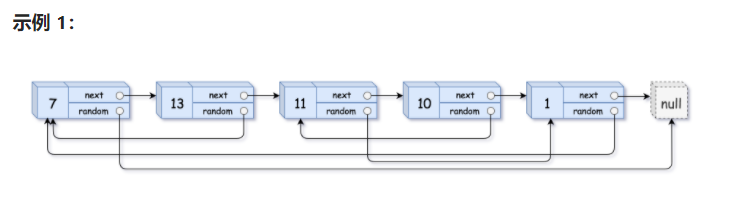
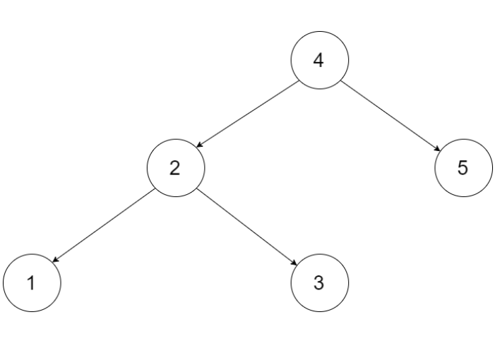
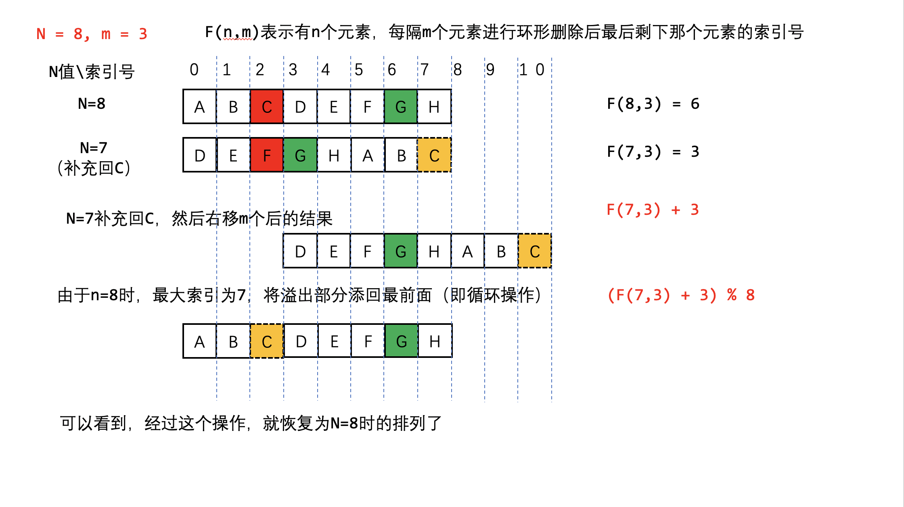
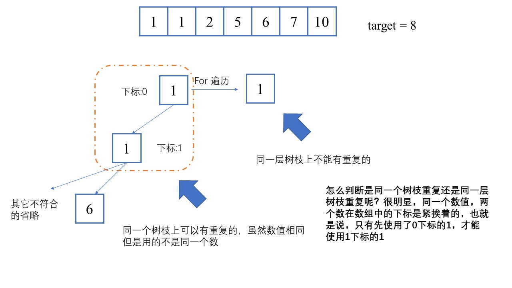

# ACM模式

ACM模式需要自己导包

格式：

```java
import java.io.*;//IO的包
import java.util.*;//像一般的集合，List,Deque,Map在这个包里
//import java.lang; StringBuilder在lang包中，不需要手动导入
public class Main {
    public static void main(String[] args)throws Exception {
        //用这个来构造输入数据
        BufferedReader in = new BufferedReader(new InputStreamReader(System.in));
        //BufferedReader.readLine()返回字符串，如果是数字，还需要用Integer.parseInt()转换
        String orgin = in.readLine();
    }  
    //然后像核心模式那样，写一个static或者普通函数
}
```

# 剑指offer

## 03 [数组中重复的数字](https://leetcode-cn.com/problems/shu-zu-zhong-zhong-fu-de-shu-zi-lcof/)

找出数组中重复的数字。

在一个长度为 n 的数组 nums 里的所有数字都在 0～n-1 的范围内。数组中某些数字是重复的，但不知道有几个数字重复了，也不知道每个数字重复了几次。请找出数组中任意一个重复的数字。

**示例 1：**

```
输入：
[2, 3, 1, 0, 2, 5, 3]
输出：2 或 3 
```

解：注意到数组长度为n，且所有数字都在0~n-1范围内，因此可以手动让数组中每个数字i都归位到nums[i]，比如nums[n - 1] = n - 1，若当前位置nums[i] != i，则交换nums[nums[i]]的数字，交换过程中若发现nums[nums[i]] == nums[i]，则找到了重复数字
这道题与TOP100中的重复数字比较像，数字与位置的关系有略微不同，那道题可以用找环形链表入口的方法去解决

```java
class Solution {
    public int findRepeatNumber(int[] nums) {
        for (int i = 0; i < nums.length; i++) {
            if (nums[i] != i) {
                if (nums[nums[i]] == nums[i]) {
                    return nums[i];
                }
                int tmp = nums[nums[i]];
                nums[nums[i]] = nums[i];
                nums[i] = tmp;
            }
        }
        return -1;
    }
}
```

## 04 [二维数组中的查找](https://leetcode-cn.com/problems/er-wei-shu-zu-zhong-de-cha-zhao-lcof/)

在一个 n * m 的二维数组中，每一行都按照从左到右递增的顺序排序，每一列都按照从上到下递增的顺序排序。请完成一个高效的函数，输入这样的一个二维数组和一个整数，判断数组中是否含有该整数。

示例:

现有矩阵 matrix 如下：

```
[
  [1,   4,  7, 11, 15],
  [2,   5,  8, 12, 19],
  [3,   6,  9, 16, 22],
  [10, 13, 14, 17, 24],
  [18, 21, 23, 26, 30]
]
```


给定 target = 5，返回 true。

给定 target = 20，返回 false。


解：最简单的暴力解法就是整体遍历一遍，但是没有用到题目给出的条件。看看条件，发现可以用到类似二叉搜索树的原理
如图所示，很明了，从左下角18开始搜素，就能用到二叉搜索树的查找特性

```java
class Solution {
    public boolean findNumberIn2DArray(int[][] matrix, int target) {
        int row, col;
        if (matrix == null || (row = matrix.length) < 1 || (col = matrix[0].length) < 1) return false;
        int i = row - 1, j = 0;
        while (i >= 0 && j < col) {
            int root = matrix[i][j];
            if (root == target) {
                return true;
            } else if (root > target) {
                i--;
            } else {
                j++;
            }
        }
        return false;
    }
}
```

PS：不知道之前怎么回事，这道题提交竟然好多错误。。。


## 05 [替换空格](https://leetcode-cn.com/problems/ti-huan-kong-ge-lcof/)

请实现一个函数，把字符串 `s` 中的每个空格替换成"%20"。

**示例 1：**

```
输入：s = "We are happy."
输出："We%20are%20happy."
```

这道题目在网络中还是有实际运用的，之前在哪看到过，%20也是网络中某种标记

解：Java中String是不可变的，因此不能直接在s中修改，可以用一个StringBuilder，循环遍历，遇到空格时就替换

```java
class Solution {
    public String replaceSpace(String s) {
        StringBuilder str = new StringBuilder();
        if (s == null || s.length() < 1) return str.toString();
        for (char c : s.toCharArray()) {
            if (c == ' ') {
                str.append("%20");
            } else {
                str.append(c);
            }
        }
        return str.toString();
    }
}
```

## 06 [从尾到头打印链表](https://leetcode-cn.com/problems/cong-wei-dao-tou-da-yin-lian-biao-lcof/)

输入一个链表的头节点，从尾到头反过来返回每个节点的值（用数组返回）。

**示例 1：**

```
输入：head = [1,3,2]
输出：[2,3,1]
```

解：这道题属于简单题，可以直接利用递归

```java
class Solution {
    int[] ans;
    int len;
    public int[] reversePrint(ListNode head) {
        if (head == null) return new int[0];
        len = 0;
        recur(head);
        return ans;
    }
    private void recur(ListNode head) {
        if (head == null) {
            ans = new int[len];
            len = 0;
            return;
        }
        len++;
        recur(head.next);
        ans[len++] = head.val;
    }
}
```


## 07 [重建二叉树](https://leetcode-cn.com/problems/zhong-jian-er-cha-shu-lcof/)

输入某二叉树的前序遍历和中序遍历的结果，请重建该二叉树。假设输入的前序遍历和中序遍历的结果中都不含重复的数字。

    例如，给出
    
    前序遍历 preorder = [3,9,20,15,7]
    中序遍历 inorder = [9,3,15,20,7]
    返回如下的二叉树：	
                    3
                   / \
                  9  20
                    /  \
                   15   7
解：这道题目算是比较经典的递归题目了，主要是熟悉二叉树遍历的性值：前序遍历中从左至右每一个元素都是树（子树）的根节点，根据这个根节点在中序遍历中的位置，可以继续划分为左树和右树，进行递归

```java
class Solution {
    public TreeNode buildTree(int[] preorder, int[] inorder) {
        Map<Integer, Integer> map = new HashMap<>();
        for (int i = 0; i < inorder.length; i++) {
            map.put(inorder[i], i);
        }
        return buildTree(preorder, inorder, 0, preorder.length -1, 0, inorder.length -1, map);
    }
    private TreeNode buildTree(int[] preorder, int[] inorder, int pStart, int Pend, int iStart, int iEnd, Map<Integer, Integer> map) {
        if (iStart == iEnd) {
            return new TreeNode(inorder[iStart]);
        } else if (iStart > iEnd) {
            return null;
        }
        TreeNode root = new TreeNode(preorder[pStart]);
        int index = map.get(root.val);
        int leftTree = index - iStart;
        root.left = buildTree(preorder, inorder, pStart + 1, pStart + leftTree, iStart, index - 1, map);
        root.right = buildTree(preorder, inorder, pStart + leftTree + 1, Pend, index + 1, iEnd, map);
        return root;
    }
}
```

## 09 [用两个栈实现队列](https://leetcode-cn.com/problems/yong-liang-ge-zhan-shi-xian-dui-lie-lcof/)

用两个栈实现一个队列。队列的声明如下，请实现它的两个函数 appendTail 和 deleteHead ，分别完成在队列尾部插入整数和在队列头部删除整数的功能。(若队列中没有元素，deleteHead 操作返回 -1 )

示例 1：

```
输入：
["CQueue","appendTail","deleteHead","deleteHead"]
[[],[3],[],[]]
输出：[null,null,3,-1]
```

解：队列：先入先出；栈：先入后出；结合栈和队列的特点，声明一个主要用于取的栈和一个保存数据的栈，注意时机移动两个栈内的数据即可

```java
class CQueue {
    Deque<Integer> stack;
    Deque<Integer> helper; 
    public CQueue() {
        stack = new ArrayDeque<>();
        helper = new ArrayDeque<>();
    }
    
    public void appendTail(int value) {
        if (stack.isEmpty()) {
            stack.push(value);
        } else {
            helper.push(value);
        }
    }
    
    public int deleteHead() {
        int ans = -1;
        if (!stack.isEmpty()) {
            ans = stack.pop();
        }
        if (stack.isEmpty()) {
            while (!helper.isEmpty()) {
                stack.push(helper.pop());
            }
        }
        return ans;
    }
}
```


## 10-1 [斐波那契数列](https://leetcode-cn.com/problems/fei-bo-na-qi-shu-lie-lcof/)

写一个函数，输入 n ，求斐波那契（Fibonacci）数列的第 n 项（即 F(N)）。斐波那契数列的定义如下：

F(0) = 0,   F(1) = 1
F(N) = F(N - 1) + F(N - 2), 其中 N > 1.
斐波那契数列由 0 和 1 开始，之后的斐波那契数就是由之前的两数相加而得出。

答案需要取模 1e9+7（1000000007），如计算初始结果为：1000000008，请返回 1。

**示例 2：**

```
输入：n = 5
输出：5
```

解：这道题也是递归的入门题，采用递归的从第向上方式，求解即可

```java
class Solution {
    public int fib(int n) {
        if (n < 2) return n;
        int f0 = 0, f1 = 1, ans = 0;
        for (int i = 2; i <= n; i++) {
            ans = (f0 + f1) % 1000000007;
            f0 = f1;
            f1 = ans;
        }
        return ans;
    }
}
```


## 10-2 [青蛙跳台阶问题](https://leetcode-cn.com/problems/qing-wa-tiao-tai-jie-wen-ti-lcof/)

一只青蛙一次可以跳上1级台阶，也可以跳上2级台阶。求该青蛙跳上一个 n 级的台阶总共有多少种跳法。

答案需要取模 1e9+7（1000000007），如计算初始结果为：1000000008，请返回 1。

**示例 2：**

```
输入：n = 7
输出：21
```

解：和斐波那契数列一样，只是初始值变化了

```java
class Solution {
    public int numWays(int n) {
        if (n == 0) return 1;
        if (n <= 2) return n;
        int f1 = 1, f2 = 2, ans = 0;
        for (int i = 3; i <= n; i++) {
            ans = (f1 + f2) % 1000000007;
            f1 = f2;
            f2 = ans;
        }
        return ans;
    }
}
```

## 11 [旋转数组的最小数字](https://leetcode-cn.com/problems/xuan-zhuan-shu-zu-de-zui-xiao-shu-zi-lcof/) ⭐二分法

把一个数组最开始的若干个元素搬到数组的末尾，我们称之为数组的旋转。输入一个递增排序的数组的一个旋转，输出旋转数组的最小元素。例如，数组 [3,4,5,1,2] 为 [1,2,3,4,5] 的一个旋转，该数组的最小值为1。 

**示例 1：**

```
输入：[3,4,5,1,2]
输出：1
```

解：这个题给出的数组也是升序排序的（二分法不一定要升序，只要是有序的，就能使用），只不过可能含有两个部分的升序；所谓二分法，就是每次利用一个中间值，去与某个值比较，从而快速确定下一次的搜索范围

利用这道题的特点，可以始终用nums[high]来作为比较值

```java
class Solution {
    public int minArray(int[] numbers) {
        int low = 0, high = numbers.length - 1;
        while (low <= high) {
            int mid = (low + high) >>> 1;
            if (numbers[mid] > numbers[high]) {
                low = mid + 1;
            } else if (numbers[mid] < numbers[high]) {
                high = mid;
            } else {
                high--;
            }
        }
        return numbers[low];
    }
}
```


## 12 [矩阵中的路径](https://leetcode-cn.com/problems/ju-zhen-zhong-de-lu-jing-lcof/)

给定一个 m x n 二维字符网格 board 和一个字符串单词 word 。如果 word 存在于网格中，返回 true ；否则，返回 false 。

单词必须按照字母顺序，通过相邻的单元格内的字母构成，其中“相邻”单元格是那些水平相邻或垂直相邻的单元格。同一个单元格内的字母不允许被重复使用。


示例 1：

输入：board = [["A","B","C","E"],["S","F","C","S"],["A","D","E","E"]], word = "ABCCED"
输出：true

解：这道题算是我的dfs/回溯的入门题了

```java
class Solution {
    public boolean exist(char[][] board, String word) {
        for (int i = 0; i < board.length; i++) {
            for (int j = 0; j < board[0].length; j++) {
                if (find(board, i, j, 0, word)) return true;
            }
        }
        return false;
    }
    private boolean find(char[][] board, int i, int j, int step, String word) {
        if (i < 0 || i >= board.length || j < 0 || j >= board[0].length || board[i][j] != word.charAt(step)) return false;
        if (step == word.length() - 1) return true;
        char tmp = board[i][j];
        board[i][j] = '~';
        boolean ans = find(board, i + 1, j, step + 1, word) || find(board, i - 1, j, step + 1, word) || find(board, i, j + 1, step + 1, word) || find(board, i, j - 1, step + 1, word);
        board[i][j] = tmp;
        return ans;
    }
}
```


## 13 [机器人的运动范围](https://leetcode-cn.com/problems/ji-qi-ren-de-yun-dong-fan-wei-lcof/)

地上有一个m行n列的方格，从坐标 [0,0] 到坐标 [m-1,n-1] 。一个机器人从坐标 [0, 0] 的格子开始移动，它每次可以向左、右、上、下移动一格（不能移动到方格外），也不能进入行坐标和列坐标的数位之和大于k的格子。例如，当k为18时，机器人能够进入方格 [35, 37] ，因为3+5+3+7=18。但它不能进入方格 [35, 38]，因为3+5+3+8=19。请问该机器人能够到达多少个格子？

**示例 1：**

```
输入：m = 2, n = 3, k = 1
输出：3
```

解：这道题现在看来比较简单，当时也是我的入门题

```java
class Solution {
    int ans, row, col;
    boolean[][] isVisted;
    public int movingCount(int m, int n, int k) {
        if (m < 0 || n < 0 || k < 0) return 0;
        ans = 0;
        row = m;
        col = n;
        isVisted = new boolean[row][col];
        recur(0, 0, k);
        return ans;
    }
    private void recur(int i, int j, int k) {
        if (i >= row || j >= col || isVisted[i][j] || sum(i) + sum(j) > k) return;
        ans++;
        isVisted[i][j] = true;
        recur(i + 1, j, k);
        recur(i, j + 1, k);
    }
    private int sum(int i) {
        int ans = 0;
        while (i != 0) {
            ans += i % 10;
            i /= 10;
        }
        return ans;
    }
}
```


## 14-1 [剪绳子](https://leetcode-cn.com/problems/jian-sheng-zi-lcof/) ⭐动态规划

给你一根长度为 n 的绳子，请把绳子剪成整数长度的 m 段（m、n都是整数，n>1并且m>1），每段绳子的长度记为 k[0],k[1]...k[m-1] 。请问 k[0]*k[1]*...*k[m-1] 可能的最大乘积是多少？例如，当绳子的长度是8时，我们把它剪成长度分别为2、3、3的三段，此时得到的最大乘积是18。

**示例 2:**

```
输入: 10
输出: 36
解释: 10 = 3 + 3 + 4, 3 × 3 × 4 = 36
```

解：dp[i]表示长度为i的绳子，可以得到的最大值，因此由底向上，可以让i分别减1 - i / 2的绳子长度，通过比较求得最大值

比较简洁的代码：

```java
class Solution {
    //动态规划的题目，不一定就是找dp[i]和dp[i-1]之间的关系；
    //总的来说，是dp[i]和dp[j]（j < i）的关系，可是一个dp[j]，也可是多个dp[j]；
    //本题就是dp[i]和dp[j]和dp[k]的关系，但是j, k 均<i，并且j,k两数与i在数值上存在某种关系；
    //本题中的dp[1],dp[2],dp[3]与n=2，n=3的情况不同，dp[2],dp[3],dp[1]作为dp[i]推导的数值时，需要
    //单独考虑。
    public int cuttingRope(int n) {
        if (n < 4) return n - 1;
        int[] dp = new int[n + 1];
        dp[1] = 1;
        dp[2] = 2;
        dp[3] = 3;
        int tmp = 0;
        for (int i = 4; i <= n; i++) {
            for (int j = 2; j <= i / 2; j++) {
            //这里的j可以直接从2开始算，因为dp[1] = 1,结果不会产生变化,但是我感觉形式不美观
            // for (int j = 1; j <= i / 2; j++) {
                tmp = Math.max(tmp, dp[i - j] * dp[j]);
            }
            dp[i] = tmp;
        }
        return dp[n];
    }
}
```

更通用，纸面上看起来更详细的代码：

```java
class Solution {
    public int cuttingRope(int n) {
        if (n < 2) return 0;
        int[] dp = new int[n + 1];
        dp[1] = 1;
        for (int i = 2; i <= n; i++) {
            for (int j = 1; j <= i >>> 1; j++) {
                int max1 = Math.max((i - j) * dp[j], dp[i - j] * j);
                int max2 = Math.max((i - j) * j, dp[i - j] * dp[j]);
                int max = Math.max(max1, max2);
                dp[i] = Math.max(max, dp[i]);
            }
        }
        return dp[n];
    }
}
```


## 14-2 [剪绳子 II](https://leetcode-cn.com/problems/jian-sheng-zi-ii-lcof/)

给你一根长度为 n 的绳子，请把绳子剪成整数长度的 m 段（m、n都是整数，n>1并且m>1），每段绳子的长度记为 k[0],k[1]...k[m - 1] 。请问 k[0]*k[1]*...*k[m - 1] 可能的最大乘积是多少？例如，当绳子的长度是8时，我们把它剪成长度分别为2、3、3的三段，此时得到的最大乘积是18。

答案需要取模 1e9+7（1000000007），如计算初始结果为：1000000008，请返回 1。

解：可以通过数学求解得知最优解为每段都切成3段

```java
class Solution {
    public int cuttingRope(int n) {
        //已知尽量将每段绳子切成3是最优解
        if (n < 4) return n - 1;
        return getAns(n / 3, n % 3);
    }
    private int getAns(int num, int yuShu) {
        long tmp = 1;
        //只计算到倒数第二段3，最后一段3要根据余数，讨论绳子划分情况
        for (int i = 1; i <= num - 1; i++) {
            tmp = tmp * 3 % 1000000007;
        }
        if (yuShu == 0) return (int) (tmp * 3 % 1000000007);
        if (yuShu == 1) return (int) (tmp * 4 % 1000000007);
        if (yuShu == 2) return (int) (tmp * 6 % 1000000007);
        return -1;
    }
}
```

## 15 [二进制中1的个数](https://leetcode-cn.com/problems/er-jin-zhi-zhong-1de-ge-shu-lcof/) ⭐ 二进制

请实现一个函数，输入一个整数（以二进制串形式），输出该数二进制表示中 1 的个数。例如，把 9 表示成二进制是 1001，有 2 位是 1。因此，如果输入 9，则该函数输出 2。

示例 1：

```

输入：00000000000000000000000000001011
输出：3
解释：输入的二进制串 00000000000000000000000000001011 中，共有三位为 '1'。
```

解：方法很容易想到，一次遍历就可以了（之前在TOP100看到的，有O(1)的方法得到，只不过要利用底层的数字向上计算才行，利用i和i-1的性值）

O(logN)

```java
public class Solution {
    // you need to treat n as an unsigned value
    public int hammingWeight(int n) {
        int num = 0;
        while (n != 0) {
            num += n & 1;
            n >>>= 1;
        }
        return num;
    }
}
```

O(M)：M为二进制中1的个数

n - 1将n的二进制中最右边那个1变为0，1之后的0变为1，因此n & n - 1实际上就是将n最右边的1变为0

```java
public class Solution {
    // you need to treat n as an unsigned value
    public int hammingWeight(int n) {
        int num = 0;
        while (n != 0) {
            num++;
            n &= n - 1;
        }
        return num;
    }
}
```


## 16 [数值的整数次方](https://leetcode-cn.com/problems/shu-zhi-de-zheng-shu-ci-fang-lcof/)

实现 [pow(*x*, *n*)](https://www.cplusplus.com/reference/valarray/pow/) ，即计算 x 的 n 次幂函数（即，xn）。不得使用库函数，同时不需要考虑大数问题。

**示例 3：**

```
输入：x = 2.00000, n = -2
输出：0.25000
解释：2-2 = 1/22 = 1/4 = 0.25
```

解：这道题可用递归的方法，实现时间复杂度O(logN)

```java
class Solution {
    public double myPow(double x, int n) {
        if (n == 0) return 1;
        if (n == 1) return x;//这行代码写不写都行，因为最后都会计算到x * (x * x, 1 / 2 == 0)的情况，直接返回x
        //-n-1，是为了Integer.MIN_VALUE乘以-1变为Inter.MAX_VALUE+1时不出现越界的情况
        if (n < 0) return 1 / x * myPow(1 / x, -n - 1);
        //n为奇数和偶数的情况得区分考虑
        return (n & 1) == 0 ? myPow(x * x, n / 2) : x * myPow(x * x, n / 2); 
    }
}
```


## 17 [打印从1到最大的n位数](https://leetcode-cn.com/problems/da-yin-cong-1dao-zui-da-de-nwei-shu-lcof/)

输入数字 `n`，按顺序打印出从 1 到最大的 n 位十进制数。比如输入 3，则打印出 1、2、3 一直到最大的 3 位数 999。

**示例 1:**

```
输入: n = 1
输出: [1,2,3,4,5,6,7,8,9]
```

解：这道题目虽然leetcode是简单题，但实际上没有那么简单，这是考虑大数序列生成的问题，用到了回溯

参考：https://leetcode-cn.com/problems/da-yin-cong-1dao-zui-da-de-nwei-shu-lcof/solution/mian-shi-ti-17-da-yin-cong-1-dao-zui-da-de-n-wei-2/

以我现在对回溯的理解，生成固定的n位数，问题不大，这道题目关键是要生成int类型的数字，即每个数前面的0要省略掉，不能是001，002,而是1，2···

首先放一个我自己写的生成01，02···不规范序列的函数

回溯生成的树形图（回溯问题最好画树形图思考）：


```java
public class _171生成至n位数的数字 {
    private final char[] c = {'0', '1', '2', '3', '4', '5', '6', '7', '8', '9'};
    private int n;
    char[] tmp;
    List<String> path;
    public void printNumbers(int n) {
        tmp = new char[n];
        path = new ArrayList<String>();
        this.n = n;
        int index = 0;
        dfs(0);
        for (String str : path) {
            System.out.print(str + " ");
            if (++index == 10) {
                System.out.println();
                index = 0;
            }
        }
    }
    private void dfs(int index) {
        if (index == n) {
            path.add(new String(tmp));
            return;
        }
        for (char ch : c) {
            tmp[index] = ch;
            dfs(index + 1);
        }
    }

    @Test
    public void test() {
        printNumbers(2);
    }
}
```

这是标准写法：

```java
class Solution {
    int n, nine, start, index;
    int[] ans;
    char[] tmp, loop = {'0', '1', '2', '3', '4', '5', '6', '7', '8', '9'};
    public int[] printNumbers(int n) {
        this.n = n;
        start = n - 1;
        tmp = new char[n];
        ans = new int[(int) Math.pow(10, n) - 1];
        dfs(0);
        return ans;
    }
    private void dfs(int x) {
        if (x == n) {
            String add = String.valueOf(tmp).substring(start);
            if (add.equals("0")) return;
            ans[index++] = Integer.valueOf(add);
            if (n - start == nine) start--;
            return;
        }
        for (char c : loop) {
            tmp[x] = c;
            if (c == '9') nine++;
            dfs(x + 1);
        }
        //在回溯前恢复nine的数量为nine = nine - 1
        //这里还有一点没想明白
        nine--;
    }
}
```

## 18 [删除链表的节点](https://leetcode-cn.com/problems/shan-chu-lian-biao-de-jie-dian-lcof/)

给定单向链表的头指针和一个要删除的节点的值，定义一个函数删除该节点。

返回删除后的链表的头节点。

示例 1:

```
输入: head = [4,5,1,9], val = 5
输出: [4,1,9]
解释: 给定你链表中值为 5 的第二个节点，那么在调用了你的函数之后，该链表应变为 4 -> 1 -> 9.
```

解：这道题是[移除链表元素](https://leetcode-cn.com/problems/remove-linked-list-elements/)的简单版本，只需要移除一个元素即可；遇到链表的问题，首先考虑引入虚拟头节点

```java
class Solution {
    public ListNode deleteNode(ListNode head, int val) {
        ListNode pre = new ListNode(0), ans = pre;
        pre.next = head;
        while (head != null) {
            if (head.val == val) {
                pre.next = head.next;
                break;
            } else {
                pre = pre.next;
                head = head.next;
            }
        }
        return ans.next;
    }
}
```

## 19 [正则表达式匹配](https://leetcode-cn.com/problems/zheng-ze-biao-da-shi-pi-pei-lcof/)

请实现一个函数用来匹配包含'. '和'*'的正则表达式。模式中的字符'.'表示任意一个字符，而'*'表示它前面的字符可以出现任意次（含0次）。在本题中，匹配是指字符串的所有字符匹配整个模式。例如，字符串"aaa"与模式"a.a"和"ab*ac*a"匹配，但与"aa.a"和"ab*a"均不匹配。

**示例 3:**

```
输入:
s = "ab"
p = ".*"
输出: true
解释: ".*" 表示可匹配零个或多个（'*'）任意字符（'.'）。
```

解：之前已经在TOP100种写过一次，还是出了点小错误

```java
class Solution {
    public boolean isMatch(String s, String p) {
        if (s == null) return true;
        if (p == null) return false;
        int lens = s.length(), lenp = p.length();
        boolean[][] dp = new boolean[lens + 1][lenp + 1];
        //s为“”时，需要判断p才能得到结果
        //当s和p都为""的时候，可以匹配
        dp[0][0] = true;
        for (int i = 0; i <= lens; i++) {
            //p为“”时，一定无法匹配s串，因此p直接从长度1开始计算
            for (int j = 1; j <= lenp; j++) {
                //p的末尾需要分两种情况讨论，*和其他，.和正常字符一样判断
                if (p.charAt(j - 1) == '*') {
                    //1直接用*忽略掉p的倒数第二个字符，用dp[i][j - 2]去和i, j匹配
                    if (j >= 2) dp[i][j] = dp[i][j - 2];
                    //若p的倒数第二个字符==s的最后一个字符，或者p的倒数第二个字符=='.'，可以连续匹配多个
                    //s的尾字符，例如 s = ```aaa, p = ```.* 或者 p = ```a*，这种情况可以用.*（a*）匹配
                    //s末尾的3个a
                    if (j >= 2 && i >= 1 && (p.charAt(j - 2) == '.' || p.charAt(j - 2) == s.charAt(i - 1))) dp[i][j] |= dp[i - 1][j];
                } else {
                    if (i >= 1 && (p.charAt(j - 1) == '.' || p.charAt(j - 1) == s.charAt(i - 1)))
                        // dp[i][j] = true;这里写错了
                        dp[i][j] = dp[i - 1][j - 1];

                }
            }
        }
        return dp[lens][lenp];
    }
}
```


## 20 [表示数值的字符串](https://leetcode-cn.com/problems/biao-shi-shu-zhi-de-zi-fu-chuan-lcof/) ⭐有限状态自动机

请实现一个函数用来判断字符串是否表示数值（包括整数和小数）。例如，字符串"+100"、"5e2"、"-123"、"3.1416"、"-1E-16"、"0123"都表示数值，但"12e"、"1a3.14"、"1.2.3"、"+-5"及"12e+5.4"都不是。

解：有限状态自动机，比较麻烦的是填写每个状态可以达到的下一个状态，遍历结束后，判断最终状态符合出口状态不


```java
class Solution {
    public boolean isNumber(String s) {
        if (s == null || s.length() < 1) return false;
        //states中的下标，达标状态值
        Map[] states = {
            new HashMap<Character, Integer>() {{
                //状态0,首位空格,可以跳转到0,1,2,3
                put(' ', 0); put('s', 1); put('d', 2); put('.', 3);
            }},
            new HashMap<Character, Integer>() {{
                //状态1，符号位，可以跳转到2,3
                put('d', 2); put('.', 3);
            }},
            new HashMap<Character, Integer>() {{
                //状态2，整数部分，可以跳转到2,4,6,9
                put('d', 2); put('.', 4); put('e', 6); put(' ', 9);
            }},
            new HashMap<Character, Integer>() {{
                //状态3，小数点，左边无整数，可以跳转到5
                put('d', 5);
            }},
            new HashMap<Character, Integer>() {{
                //状态4，小数点，左边有整数，可以跳转到5,6,9
                put('d', 5); put('e', 6); put(' ', 9);
            }},
            new HashMap<Character, Integer>() {{
                //状态5，小数部分,可以跳转到5,6,9
                put('d', 5); put('e', 6); put(' ', 9);
            }},
            new HashMap<Character, Integer>() {{
                //状态6，e,E，可以跳转到7,8
                put('s', 7); put('d', 8);
            }},
            new HashMap<Character, Integer>() {{
                //状态7，指数部分符号，可以跳转到8
                put('d', 8);
            }},
            new HashMap<Character, Integer>() {{
                //状态8，指数部分数字，可以跳转到8,9
                put('d', 8); put(' ', 9);
            }},
            new HashMap<Character, Integer>() {{
                //状态9，末尾空格,可以跳转到9
                put(' ', 9);
            }}
        };
        int state = 0;
        char tmp = ' ';
        for (char c : s.toCharArray()) {
            if (c == ' ') tmp = c;
            else if (c >= '0' && c <= '9') tmp = 'd';
            else if (c == '+' || c == '-') tmp = 's';
            else if (c == 'e' || c == 'E') tmp = 'e';
            else if (c == '.') tmp = c;
            else tmp = '?';
            if (!states[state].containsKey(tmp)) return false;
            state = (int) states[state].get(tmp);
        }
        return state == 2 || state == 4 || state == 5 || state == 8 || state == 9;
    }
}
```

## 21 [调整数组顺序使奇数位于偶数前面](https://leetcode-cn.com/problems/diao-zheng-shu-zu-shun-xu-shi-qi-shu-wei-yu-ou-shu-qian-mian-lcof/)

输入一个整数数组，实现一个函数来调整该数组中数字的顺序，使得所有奇数位于数组的前半部分，所有偶数位于数组的后半部分。

**示例：**

```
输入：nums = [1,2,3,4]
输出：[1,3,2,4] 
注：[3,1,2,4] 也是正确的答案之一。
```

解：简单题，采用双指针，前后搜素交换就行

```java
class Solution {
    public int[] exchange(int[] nums) {
        int i = 0, j = nums.length - 1;
        while (i < j) {
            while (i < j && (nums[i] & 1) == 1) i++;
            while (i < j && (nums[j] & 1) == 0) j--;
            if (i < j) {
                int tmp = nums[i];
                nums[i] = nums[j];
                nums[j] = tmp;
            }
        }
        return nums;
    }
}
```

## 22 [链表中倒数第k个节点](https://leetcode-cn.com/problems/lian-biao-zhong-dao-shu-di-kge-jie-dian-lcof/)

输入一个链表，输出该链表中倒数第k个节点。为了符合大多数人的习惯，本题从1开始计数，即链表的尾节点是倒数第1个节点。

例如，一个链表有 6 个节点，从头节点开始，它们的值依次是 1、2、3、4、5、6。这个链表的倒数第 3 个节点是值为 4 的节点。

解：简单题，用快慢指针或者递归都行

快慢指针：

```java
class Solution {
    public ListNode getKthFromEnd(ListNode head, int k) {
        ListNode fast = head, ans = head;
        for (int i = 0; i < k; i++) fast = fast.next;
        while (fast != null) {
            fast = fast.next;
            ans = ans.next;
        }
        return ans;
    }
}
```

递归：

```java
class Solution {
    int helper;
    public ListNode getKthFromEnd(ListNode head, int k) {
        if (k < 1 || head == null) {
            helper = 0;
            return null;
        };
        ListNode ans = getKthFromEnd(head.next, k);
        if (++helper == k) ans = head;
        return ans;
    }
}
```

## 24 [反转链表](https://leetcode-cn.com/problems/fan-zhuan-lian-biao-lcof/)

定义一个函数，输入一个链表的头节点，反转该链表并输出反转后链表的头节点。

**示例:**

```
输入: 1->2->3->4->5->NULL
输出: 5->4->3->2->1->NULL
```

解：递归的方法

```java
class Solution {
    public ListNode reverseList(ListNode head) {
        if (head == null || head.next == null) return head;
        ListNode root = reverseList(head.next);
        head.next.next = head;
        head.next = null;
        return root;    
    }
}
```

## 25 [合并两个排序的链表](https://leetcode-cn.com/problems/he-bing-liang-ge-pai-xu-de-lian-biao-lcof/)

输入两个递增排序的链表，合并这两个链表并使新链表中的节点仍然是递增排序的。

**示例1：**

```
输入：1->2->4, 1->3->4
输出：1->1->2->3->4->4
```

解：双指针，虚拟头结点

```java
class Solution {
    public ListNode mergeTwoLists(ListNode l1, ListNode l2) {
        ListNode start = new ListNode(0);
        ListNode ans = start;
        while (l1 != null && l2 != null) {
            if (l1.val <= l2.val) {
                start.next = l1;
                l1 = l1.next;
                start = start.next;
            } else {
                start.next = l2;
                l2 = l2.next;
                start = start.next;
            }
        }
        if (l1 == null) start.next = l2;
        if (l2 == null) start.next = l1;
        return ans.next;
    }
}
```

## 26 [树的子结构](https://leetcode-cn.com/problems/shu-de-zi-jie-gou-lcof/)

输入两棵二叉树A和B，判断B是不是A的子结构。(约定空树不是任意一个树的子结构)

B是A的子结构， 即 A中有出现和B相同的结构和节点值。

例如:
给定的树 A:

     3
    / \
       4   5
      / \
     1   2
    给定的树 B：
```
   4 
  /
 1
```

返回 true，因为 B 与 A 的一个子树拥有相同的结构和节点值。

解：二叉树通常情况下就是遍历二叉树（递归和广度）方法的基础上改进

```java
class Solution {
    public boolean isSubStructure(TreeNode A, TreeNode B) {
        if (A == null || B == null) return false;
        //B是A的子树，可能存在于A的某一部分，相当于调用了两个递归
        return isSub(A, B) || isSubStructure(A.left, B) || isSubStructure(A.right, B);
    }
    private boolean isSub(TreeNode A, TreeNode B) {
        if (B == null) return true;
        if (A == null || A.val != B.val) return false;
        return isSub(A.left, B.left) && isSub(A.right, B.right);
    }
}
```

## 27 [二叉树的镜像](https://leetcode-cn.com/problems/er-cha-shu-de-jing-xiang-lcof/)

请完成一个函数，输入一个二叉树，该函数输出它的镜像。

例如输入：

          4
        /   \
      2     7
     / \   / \
    1   3 6   9

镜像输出：

          4
        /   \
      7     2
     / \   / \
    9   6 3   1
解：二叉树的问题一定要结合二叉树的遍历（递归、迭代、层序）方法

这道题目可以用递归的前序或者后序遍历做，我这里采用的后序，由底向上，比较好直观

```java
class Solution {
    public TreeNode mirrorTree(TreeNode root) {
        if (root == null) return root;
        mirrorTree(root.left);
        mirrorTree(root.right);
        TreeNode tmp = root.left;
        root.left = root.right;
        root.right = tmp;
        return root;
    }
}
```

## 28 [对称的二叉树](https://leetcode-cn.com/problems/dui-cheng-de-er-cha-shu-lcof/)

请实现一个函数，用来判断一棵二叉树是不是对称的。如果一棵二叉树和它的镜像一样，那么它是对称的。

例如，二叉树 [1,2,2,3,4,4,3] 是对称的。

        1
       / \
      2   2
     / \ / \
    3  4 4  3
但是下面这个 [1,2,2,null,3,null,3] 则不是镜像对称的:

        1
       / \
      2   2
       \   \
       3    3
解：也是用到了递归，以此判断处于对称位置上的两个元素是否相等，只等判断到都是NULL（表明全部判断完都没问题）

```java
class Solution {
    public boolean isSymmetric(TreeNode root) {
        return root == null || isSymmetric(root.left, root.right);    
    }
    private boolean isSymmetric(TreeNode leftT, TreeNode rightT) {
        if (leftT == null && rightT == null) return true;
        if (leftT == null || rightT == null) return false;
        if (leftT.val != rightT.val) return false;
        return isSymmetric(leftT.left, rightT.right) && isSymmetric(leftT.right, rightT.left);
    }
}
```

## 29 [顺时针打印矩阵](https://leetcode-cn.com/problems/shun-shi-zhen-da-yin-ju-zhen-lcof/)

输入一个矩阵，按照从外向里以顺时针的顺序依次打印出每一个数字。

**示例 1：**

```
输入：matrix = [[1,2,3],[4,5,6],[7,8,9]]
输出：[1,2,3,6,9,8,7,4,5]
```

解：

```java
class Solution {
    public int[] spiralOrder(int[][] matrix) {
        int row, col, index = 0;
        if (matrix == null || (row = matrix.length) < 1 || (col = matrix[0].length) < 1) return new int[0];
        int[] ans = new int[row * col];
        int rowStart = 0, rowEnd = row - 1, colStart = 0, colEnd = col - 1;
        while (index < ans.length) {
            for (int i = colStart; index < ans.length && i <= colEnd; i++) {
                ans[index++] = matrix[rowStart][i];
            }
            rowStart++;
            for (int i = rowStart; index < ans.length && i <= rowEnd; i++) {
                ans[index++] = matrix[i][colEnd];
            }
            colEnd--;
            for (int i = colEnd; index < ans.length && i >= colStart; i--) {
                ans[index++] = matrix[rowEnd][i];
            }
            rowEnd--;
            for (int i = rowEnd; index < ans.length && i>= rowStart; i--) {
                ans[index++] = matrix[i][colStart];
            }
            colStart++;
        }
        return ans;
    }
}
```

## 30 [包含min函数的栈](https://leetcode-cn.com/problems/bao-han-minhan-shu-de-zhan-lcof/)

定义栈的数据结构，请在该类型中实现一个能够得到栈的最小元素的 min 函数在该栈中，调用 min、push 及 pop 的时间复杂度都是 O(1)。

示例:

```
MinStack minStack = new MinStack();
minStack.push(-2);
minStack.push(0);
minStack.push(-3);
minStack.min();   --> 返回 -3.
minStack.pop();
minStack.top();      --> 返回 0.
minStack.min();   --> 返回 -2.
```

解：用两个栈去实现，一个正常使用，一个用于保存当前最小的值，是不严格单调递减栈

```java
class MinStack {
    Deque<Integer> stack;
    Deque<Integer> helper;
    /** initialize your data structure here. */
    public MinStack() {
        stack = new ArrayDeque<>();
        helper = new ArrayDeque<>();
    }
    
    public void push(int x) {
        stack.push(x);
        if (helper.isEmpty() || x <= helper.peek()) helper.push(x);
    }
    
    public void pop() {
        if (stack.isEmpty()) return;
        int ans = stack.pop();
        if (helper.peek() == ans) helper.pop();
    }
    
    public int top() {
        if (stack.isEmpty()) return -1;
        return stack.peek();
    }
    
    public int min() {
        if (helper.isEmpty()) return -1;
        return helper.peek();
    }
}
```

## 31 [栈的压入、弹出序列](https://leetcode-cn.com/problems/zhan-de-ya-ru-dan-chu-xu-lie-lcof/)

输入两个整数序列，第一个序列表示栈的压入顺序，请判断第二个序列是否为该栈的弹出顺序。假设压入栈的所有数字均不相等。例如，序列 {1,2,3,4,5} 是某栈的压栈序列，序列 {4,5,3,2,1} 是该压栈序列对应的一个弹出序列，但 {4,3,5,1,2} 就不可能是该压栈序列的弹出序列。

示例 1：

```
输入：pushed = [1,2,3,4,5], popped = [4,5,3,2,1]
输出：true
解释：我们可以按以下顺序执行：
push(1), push(2), push(3), push(4), pop() -> 4,
push(5), pop() -> 5, pop() -> 3, pop() -> 2, pop() -> 1
```

解：用一个栈实际去模拟压入和弹出，最后判断栈是否为空

```java
class Solution {
    public boolean validateStackSequences(int[] pushed, int[] popped) {
        if (pushed.length != popped.length) return false;
        Deque<Integer> stack = new ArrayDeque<>();
        int index = 0;
        for (int i = 0; i < pushed.length; i++) {
            stack.push(pushed[i]);
            while (!stack.isEmpty() && stack.peek() == popped[index]) {
                stack.pop();
                index++;
            }
        }
        return stack.isEmpty();
    }
}
```

## 32-1 [从上到下打印二叉树](https://leetcode-cn.com/problems/cong-shang-dao-xia-da-yin-er-cha-shu-lcof/)

从上到下打印出二叉树的每个节点，同一层的节点按照从左到右的顺序打印。

例如:
给定二叉树: [3,9,20,null,null,15,7],

        3
       / \
      9  20
        /  \
       15   7

返回：

```
[3,9,20,15,7]
```

解：二叉树的遍历方式之一——层序遍历，也是广度优先问题，一般用队列解决

PS：Deque接口，既可以实现队列（ArrayDeque）、栈（ArrayDeque）、还有双端队列（LinkedList）

```java
class Solution {
    public int[] levelOrder(TreeNode root) {
        List<Integer> list = new ArrayList<>();
        Deque<TreeNode> queue = new ArrayDeque<>();
        if (root != null) queue.offer(root);
        while (!queue.isEmpty()) {
            TreeNode head = queue.poll();
            list.add(head.val);
            if (head.left != null) queue.offer(head.left);
            if (head.right != null) queue.offer(head.right);
        }
        int index = 0;
        int[] ans = new int[list.size()];
        for (int n : list) {
            ans[index] = n;
            index++;
        }
        return ans;
    }
}
```

## 32-2 [从上到下打印二叉树 II](https://leetcode-cn.com/problems/cong-shang-dao-xia-da-yin-er-cha-shu-ii-lcof/)

从上到下按层打印二叉树，同一层的节点按从左到右的顺序打印，每一层打印到一行。

例如:
给定二叉树: [3,9,20,null,null,15,7],

       3
      / \
      9  20
        /  \
       15   7

返回其层次遍历结果：

```
[
  [3],
  [9,20],
  [15,7]
]
```

解：这道题在32-1基础上，增加了每一层单独一个List去装，因此可以引入当前一层的数量，控制一层一层的输出

```java
class Solution {
    public List<List<Integer>> levelOrder(TreeNode root) {
        List<List<Integer>> list = new ArrayList<>();
        Deque<TreeNode> queue = new ArrayDeque<>();
        if (root != null) queue.offer(root);
        while (!queue.isEmpty()) {
            List<Integer> tmp = new ArrayList<>();
            for (int i = queue.size(); i > 0; i--) {
                TreeNode head = queue.poll();
                tmp.add(head.val);
                if (head.left != null) queue.offer(head.left);
                if (head.right != null) queue.offer(head.right);
            }
            list.add(tmp);
        }
        return list;
    }
}
```

## 32-3 [从上到下打印二叉树 III](https://leetcode-cn.com/problems/cong-shang-dao-xia-da-yin-er-cha-shu-iii-lcof/)

请实现一个函数按照之字形顺序打印二叉树，即第一行按照从左到右的顺序打印，第二层按照从右到左的顺序打印，第三行再按照从左到右的顺序打印，其他行以此类推。

例如:
给定二叉树: [3,9,20,null,null,15,7],

        3
       / \
      9  20
        /  \
       15   7
返回其层次遍历结果：

```
[
  [3],
  [20,9],
  [15,7]
]
```

解：这道题在32-2基础上，又新增了一个条件，要求交错逆序输出，用双端队列即可解决，或者用Colletctions.reverse()反转

```java
class Solution {
    public List<List<Integer>> levelOrder(TreeNode root) {
        if (root == null) return new ArrayList<List<Integer>>();
        Queue<TreeNode> queue = new LinkedList<>() {{add(root);}};
        List<List<Integer>> ans = new ArrayList<>();
        boolean flag = false;
        while (!queue.isEmpty()) {
            List<Integer> tmp = new ArrayList<>();
            for (int i = queue.size(); i > 0; i--) {
                TreeNode node = queue.poll();
                tmp.add(node.val);
                if (node.left != null) queue.offer(node.left);
                if (node.right != null) queue.offer(node.right);
            }
            if (flag) Collections.reverse(tmp);
            flag = !flag;
            ans.add(tmp);
        }
        return ans;
    }
}
```

## 33 [二叉搜索树的后序遍历序列](https://leetcode-cn.com/problems/er-cha-sou-suo-shu-de-hou-xu-bian-li-xu-lie-lcof/)

输入一个整数数组，判断该数组是不是某二叉搜索树的后序遍历结果。如果是则返回 `true`，否则返回 `false`。假设输入的数组的任意两个数字都互不相同。

参考以下这颗二叉搜索树：

         5
        / \
       2   6
      / \
     1   3
示例 1：

```
输入: [1,6,3,2,5]
输出: false
```

示例 2：

```
输入: [1,3,2,6,5]
输出: true
```

解：给一个后序遍历，我们一定能知道的信息，就是后序遍历的最后一个，一定是根节点，因此可以根据大小关系，先划分左右子树，然后根据左右子树和根节点的大小关系，去判断是否满足二叉搜索树的性值；

（判断为true的条件一定要 start >= end，也就是说，start有大于end的情况出现，比如[1,2,5,10,6,9,4,3]）

```java
class Solution {
    public boolean verifyPostorder(int[] postorder) {
        return verifyPostorder(postorder, 0, postorder.length - 1);
    }
    private boolean verifyPostorder(int[] postorder, int start, int end) {
        if (start >= end) return true;
        //划分左右区间
        boolean haveRight = postorder[end - 1] > postorder[end];
        int index;
        if (haveRight) {
            for (index = end - 1; index >= start; index--) {
                //此时index为左树的end
                if (postorder[index] < postorder[end]) break;
            }
        //判断一下，是否有左树
        if (index >= 0) {
            //检查左区间是否满足大小关系
            for (int i = start; i <= index; i++) {
                if (postorder[i] > postorder[end]) return false;
                }
                //左右子树都有
            return verifyPostorder(postorder, start, index) && verifyPostorder(postorder, index + 1, end - 1);
            } else {
                //只有右子树
                return verifyPostorder(postorder, start, end - 1);
            }
        } else {
            //没有右子树
            for (int i = start; i < end; i++) {
                if (postorder[i] > postorder[end]) return false;
            }
            return verifyPostorder(postorder, start, end - 1);
        }
    }
}
```

之前写的这个代码，更简洁！是从左子树开始判断的，省去了讨论情况（这种写法更容易理解start >= end）

```java
class Solution {
    public boolean verifyPostorder(int[] postorder) {
       if (postorder == null) return false;
       return getAns(postorder, 0, postorder.length - 1);          
    }
    private boolean getAns(int[] postorder, int i, int j) {
        if (i >= j) return true;
        int tmp =j;
        for (int left = i; left <= j - 1; left++) {
            if (postorder[left] > postorder[j]) {
                tmp = left;
                break;
            }
        }
        //验证右端数组是否满足要求
        for (int left = tmp + 1; left <= j - 1; left++) {
            if (postorder[left] < postorder[j]) return false;
        }     
        return getAns(postorder, i, tmp - 1) && getAns(postorder, tmp, j - 1);
    }
}
```

## 34 [二叉树中和为某一值的路径](https://leetcode-cn.com/problems/er-cha-shu-zhong-he-wei-mou-yi-zhi-de-lu-jing-lcof/)

输入一棵二叉树和一个整数，打印出二叉树中节点值的和为输入整数的所有路径。从树的根节点开始往下一直到叶节点所经过的节点形成一条路径。

示例:
给定如下二叉树，以及目标和 target = 22，

              5
             / \
            4   8
           /   / \
          11  13  4
         /  \    / \
        7    2  5   1


返回:

```
[
   [5,4,11,2],
   [5,8,4,5]
]
```

解：经典的回溯问题，需要处理好叶子节点

这道题还有一道难度更高的，求任意路径满足target，需要用到前缀和的技巧

这种写法是在函数入口中判断，较为臃肿

```java
class Solution {
    List<List<Integer>> ans;
    Deque<Integer> path;
    public List<List<Integer>> pathSum(TreeNode root, int target) {
        ans = new ArrayList<>();
        if (root == null) return ans;
        path = new LinkedList<>();
        backTracking(root, target, 0);
        return ans;
    }
    private void backTracking(TreeNode root, int target, int cur) {
        if (root == null) return;
        if (root.left == null && root.right == null) {
            if (cur + root.val == target) {
                path.add(root.val);
                ans.add(new ArrayList<Integer>(path));
                path.removeLast();
            }
            return;
        }
        path.add(root.val);
        backTracking(root.left, target, cur + root.val);
        backTracking(root.right, target, cur + root.val);
        path.removeLast();
    }
}
```

这种写法将叶子节点判断放在函数内部，实现起来比较简洁

```java
class Solution {
    List<List<Integer>> ans;
    Deque<Integer> path;
    public List<List<Integer>> pathSum(TreeNode root, int target) {
        ans = new ArrayList<>();
        if (root == null) return ans;
        path = new LinkedList<>();
        backTracking(root, target, 0);
        return ans;
    }
    private void backTracking(TreeNode root, int target, int cur) {
        if (root == null) return;
        path.add(root.val);
        if (cur + root.val == target && root.left == null && root.right == null) ans.add(new ArrayList<Integer>(path));
        backTracking(root.left, target, cur + root.val);
        backTracking(root.right, target, cur + root.val);
        path.removeLast();
    }
}
```

## 35 [复杂链表的复制](https://leetcode-cn.com/problems/fu-za-lian-biao-de-fu-zhi-lcof/)

请实现 copyRandomList 函数，复制一个复杂链表。在复杂链表中，每个节点除了有一个 next 指针指向下一个节点，还有一个 random 指针指向链表中的任意节点或者 null。



```
输入：head = [[7,null],[13,0],[11,4],[10,2],[1,0]]
输出：[[7,null],[13,0],[11,4],[10,2],[1,0]]
```

解：利用HashMap<Node, Node>挨个复制就行，注意random指向自身的特殊情况

标准答案，直接先把每个复制的节点放入Map中，很简洁

```java
class Solution {
    public Node copyRandomList(Node head) {
        if (head == null) return null;
        Map<Node, Node> map = new HashMap<>();
        Node cur = head;
        while (cur != null) {
            map.put(cur, new Node(cur.val));
            cur = cur.next;
        }
        cur = head;
        while (cur != null) {
            map.get(cur).next = map.get(cur.next);
            map.get(cur).random = map.get(cur.random);
            cur = cur.next;
        }
        return map.get(head);
    }
}
```

重做时写的代码，很繁琐，每遇到一个节点，进行一次复制

```java
class Solution {
    public Node copyRandomList(Node head) {
        if (head == null) return head;
        Node pre = new Node(head.val), cur = head, ans = pre;
        Map<Node, Node> map = new HashMap<>();
        while (cur != null) {
            if (cur.next != null) {
                Node nextNode = map.get(cur.next);
                if (nextNode == null) {
                    nextNode = new Node(cur.next.val);
                    map.put(cur.next, nextNode);
                }
                    pre.next = nextNode;
            }

            if (cur.random != null) {
                if (cur.random != cur) {
                    Node randomNext = map.get(cur.random);
                    if (randomNext == null) {
                        randomNext = new Node(cur.random.val);
                        map.put(cur.random, randomNext);
                    }
                    pre.random = randomNext;
                } else {
                    pre.random = pre;
                }
            }
            map.put(cur, pre);
            pre = pre.next;
            cur = cur.next;
        }
        return ans;
    }
}
```

## 36 [二叉搜索树与双向链表](https://leetcode-cn.com/problems/er-cha-sou-suo-shu-yu-shuang-xiang-lian-biao-lcof/)

输入一棵二叉搜索树，将该二叉搜索树转换成一个排序的循环双向链表。要求不能创建任何新的节点，只能调整树中节点指针的指向。

为了让您更好地理解问题，以下面的二叉搜索树为例：



我们希望将这个二叉搜索树转化为双向循环链表。链表中的每个节点都有一个前驱和后继指针。对于双向循环链表，第一个节点的前驱是最后一个节点，最后一个节点的后继是第一个节点。

下图展示了上面的二叉搜索树转化成的链表。“head” 表示指向链表中有最小元素的节点。


特别地，我们希望可以就地完成转换操作。当转化完成以后，树中节点的左指针需要指向前驱，树中节点的右指针需要指向后继。还需要返回链表中的第一个节点的指针。

解：二叉搜索树升序排列，其实就是中序遍历，关键在于遍历过程中调整指针的左右关系，同时还得保存head节点和tail节点，便于形成首尾循环链表和返回head节点

```java
class Solution {
    Node head, pre, tail;
    public Node treeToDoublyList(Node root) {
        if (root == null) return root;
        getList(root);
        head.left = tail;
        tail.right = head;
        return head;
    }
    private void getList(Node root) {
        if (root == null) {
            tail = pre;
            return;
        }
        getList(root.left);
        if (head == null) head = root;
        root.left = pre;
        if (pre != null) pre.right = root;
        pre = root;
        getList(root.right);
    }
}
```

比较简洁的代码：

```java
class Solution {
    Node head, pre;
    public Node treeToDoublyList(Node root) {
        if (root == null) return null;
        recur(root);
        head.left = pre;
        pre.right = head;
        return head;
    }
    private void recur(Node root) {
        if (root == null) return;
        recur(root.left);
        if (pre != null) pre.right = root;
        else head = root;
        root.left = pre;
        pre = root;
        recur(root.right);
    }
}
```

## 37 [序列化二叉树](https://leetcode-cn.com/problems/xu-lie-hua-er-cha-shu-lcof/)

请实现两个函数，分别用来序列化和反序列化二叉树。

示例: 

你可以将以下二叉树：

        1
       / \
      2   3
         / \
        4   5
序列化为 "[1,2,3,null,null,4,5]"

解：


## 38 [字符串的排列](https://leetcode-cn.com/problems/zi-fu-chuan-de-pai-lie-lcof/)

输入一个字符串，打印出该字符串中字符的所有排列。

你可以以任意顺序返回这个字符串数组，但里面不能有重复元素。

**示例:**

```
输入：s = "abc"
输出：["abc","acb","bac","bca","cab","cba"]
```

解：排列的问题，还是用数组交换比较好写

这个代码写的不错

```java
class Solution {
    List<String> ans;
    char[] tmp;
    public String[] permutation(String s) {
        if (s == null || s.length() < 1) return new String[0];
        ans = new ArrayList<>();
        tmp = s.toCharArray();
        dfs(0);
        //这个返回方式是重点
        return ans.toArray(new String[ans.size()]);
    }
    private void dfs(int index) {
        //只需要递归到tmp.length - 1，因为都是c[i]与>=i的下标进行交换
        if (index == tmp.length - 1) {
            ans.add(new String(tmp));
            return;
        }
        Set<Character> set = new HashSet<>();
        for (int i = index; i < tmp.length; i++) {
            if (set.contains(tmp[i])) continue;
            set.add(tmp[i]);
            swap(i, index);
            dfs(index + 1);
            swap(index, i);
        }
    }
    private void swap(int i, int j) {
        char t = tmp[i];
        tmp[i] = tmp[j];
        tmp[j] = t;
    }   
}
```

## 39 [数组中出现次数超过一半的数字](https://leetcode-cn.com/problems/shu-zu-zhong-chu-xian-ci-shu-chao-guo-yi-ban-de-shu-zi-lcof/)

数组中有一个数字出现的次数超过数组长度的一半，请找出这个数字。

你可以假设数组是非空的，并且给定的数组总是存在多数元素。

**示例 1:**

```
输入: [1, 2, 3, 2, 2, 2, 5, 4, 2]
输出: 2
```

解：ans出现的次数超过一半的数字，相当于投票的话，一个党派总是能获得多于半数的票，在其他党派全部给该党派投反对票的情况下也是

```java
class Solution {
    public int majorityElement(int[] nums) {
        int ans = nums[0], vote = 1;
        for (int i = 1; i < nums.length; i++) {
            //判断只能放在入口
            if (vote <= 0) ans = nums[i];
            if (nums[i] != ans) vote--;
            else vote++;
        }
        return ans;
    }
}
```

## 40 [最小的k个数](https://leetcode-cn.com/problems/zui-xiao-de-kge-shu-lcof/)

输入整数数组 `arr` ，找出其中最小的 `k` 个数。例如，输入4、5、1、6、2、7、3、8这8个数字，则最小的4个数字是1、2、3、4。

**示例 1：**

```
输入：arr = [3,2,1], k = 2
输出：[1,2] 或者 [2,1]
```

解：就是利用快排，但是不是全部排序，只排前k个就行

```java
class Solution {
    public int[] getLeastNumbers(int[] arr, int k) {
        int[] ans = new int[k];
        if (arr == null || arr.length < 1 || k == 0) return ans;
        quick(arr, 0, arr.length - 1, k);
        for (int i = 0; i < k; i++) {
            ans[i] = arr[i];
        }
        return ans;
    }
    private void quick(int[] arr, int low, int high, int k) {
        if (low >= high) return;
        int index = sort(arr, low, high);
        if (index == k) return;
        else if (index > k) quick(arr, low, index - 1, k);
        else quick(arr, index + 1, high, k);
    }
    private int sort(int[] arr, int low, int high) {
        int tmp = arr[low];
        while (low < high) {
            while (low < high && arr[high] >= tmp) high--;
            arr[low] = arr[high];
            while (low < high && arr[low] <= tmp) low++;
            arr[high] = arr[low]; 
        }
        arr[low] = tmp;
        return high;
    }
}
```

## 41 [数据流中的中位数](https://leetcode-cn.com/problems/shu-ju-liu-zhong-de-zhong-wei-shu-lcof/)

如何得到一个数据流中的中位数？如果从数据流中读出奇数个数值，那么中位数就是所有数值排序之后位于中间的数值。如果从数据流中读出偶数个数值，那么中位数就是所有数值排序之后中间两个数的平均值。

例如，

[2,3,4] 的中位数是 3

[2,3] 的中位数是 (2 + 3) / 2 = 2.5

设计一个支持以下两种操作的数据结构：

void addNum(int num) - 从数据流中添加一个整数到数据结构中。
double findMedian() - 返回目前所有元素的中位数。

示例 1：

```
输入：
["MedianFinder","addNum","addNum","findMedian","addNum","findMedian"]
[[],[1],[2],[],[3],[]]
输出：[null,null,null,1.50000,null,2.00000]
```

解：这道题需要用到大顶堆小顶堆数据结构，利用大小顶堆的特性，将整个数据流分成两部分，可以直接得到中间部分的数值，进而求得中位数


```java
class MedianFinder {
    int size;
    PriorityQueue<Integer> big;
    PriorityQueue<Integer> small;
    /** initialize your data structure here. */
    public MedianFinder() {
        big = new PriorityQueue<>((v1, v2) -> v2 - v1);//大顶堆
        small = new PriorityQueue<>();//默认小顶堆
        size = 0;
    }
    
    public void addNum(int num) {
        if (big.size() == small.size()) {
            small.offer(num);
            big.offer(small.poll());
        } else {
            big.offer(num);
            small.offer(big.poll());
        }
        size++;
    }
    
    public double findMedian() {
        if ((size & 1) == 1) return big.peek();
        return (big.peek() + small.peek()) / 2.0;
    }
}
```

## 42 [连续子数组的最大和](https://leetcode-cn.com/problems/lian-xu-zi-shu-zu-de-zui-da-he-lcof/)

输入一个整型数组，数组中的一个或连续多个整数组成一个子数组。求所有子数组的和的最大值。

要求时间复杂度为O(n)。

**示例1:**

```
输入: nums = [-2,1,-3,4,-1,2,1,-5,4]
输出: 6
解释: 连续子数组 [4,-1,2,1] 的和最大，为 6。
```

解：动态规划，使用贪心的思想

```java
class Solution {
    public int maxSubArray(int[] nums) {
        int ans = nums[0];
        int[] dp = new int[nums.length];
        dp[0] = nums[0];
        for (int i = 1; i < nums.length; i++) {
            if (dp[i-1] > 0) dp[i] = nums[i] + dp[i-1];
            else dp[i] = nums[i];
            ans = Math.max(ans, dp[i]);
        }
        return ans;
    }
}
```

也可以用常量来代替dp数组

```java
class Solution {
    public int maxSubArray(int[] nums) {
        int ans = nums[0], tmp = ans;
        for (int i = 1; i < nums.length; i++) {
            if (tmp > 0) tmp += nums[i];
            else tmp = nums[i];
            ans = Math.max(ans, tmp);
        }
        return ans;
    }
}
```

## 43 [1～n 整数中 1 出现的次数](https://leetcode-cn.com/problems/1nzheng-shu-zhong-1chu-xian-de-ci-shu-lcof/) ⭐规律

输入一个整数 n ，求1～n这n个整数的十进制表示中1出现的次数。

例如，输入12，1～12这些整数中包含1 的数字有1、10、11和12，1一共出现了5次。

**示例 2：**

```
输入：n = 13
输出：6
```

解：这道题可以联系到滚动的密码锁


```java
class Solution {
    public int countDigitOne(int n) {
        int cur = n % 10, high = n / 10, low = 0, digit = 1, ans = 0;
        while (high != 0 || cur != 0) {
            if (cur == 0) ans += high * digit;
            else if (cur == 1) ans += high * digit + low + 1;
            else ans += (high + 1) * digit;
            low += cur * digit;
            cur = high % 10;
            high /= 10;
            digit *= 10;
        }
        return ans;
    }
}
```

## 44 [数字序列中某一位的数字](https://leetcode-cn.com/problems/shu-zi-xu-lie-zhong-mou-yi-wei-de-shu-zi-lcof/) ⭐规律

数字以0123456789101112131415…的格式序列化到一个字符序列中。在这个序列中，第5位（从下标0开始计数）是5，第13位是1，第19位是4，等等。

请写一个函数，求任意第n位对应的数字。

**示例 1：**

```
输入：n = 3
输出：3
```

解：

将 101112⋯ 中的每一位称为 数位 ，记为 nn ；
将 10, 11, 12,⋯ 称为 数字 ，记为 num ；
数字 10 是一个两位数，称此数字的 位数 为 2 ，记为 digit ；
每 digit 位数的起始数字（即：1, 10, 100⋯），记为 start 。


至于代码里面2,3步没有真正搞懂···

```java
class Solution {
public int findNthDigit(int n) {
        int digit = 1;
        long start = 1;
        long count = 9;
        while (n > count) { // 1.
            n -= count;
            digit += 1;
            start *= 10;
            count = digit * start * 9;
        }
        long num = start + (n - 1) / digit; // 2.
        return Long.toString(num).charAt((n - 1) % digit) - '0'; // 3.
    }
}
```

## 45 [把数组排成最小的数](https://leetcode-cn.com/problems/ba-shu-zu-pai-cheng-zui-xiao-de-shu-lcof/)

输入一个非负整数数组，把数组里所有数字拼接起来排成一个数，打印能拼接出的所有数字中最小的一个。

**示例 1:**

```
输入: [10,2]
输出: "102"
```

解：这道题其实就是排序，比如210 > 102，因此应该排序为10,2，自定义一个排序规则就可以

另外，String有compareTo（String str）的方法，和自己手写一个差不多的

```java
class Solution {
    public String minNumber(int[] nums) {
        sort(nums, 0, nums.length - 1);
        StringBuilder str = new StringBuilder();
        for (int n : nums) str.append(n);
        return new String(str);
    }
    private void sort(int[] nums, int low, int high) {
        if (low >= high) return;
        int i = low, j = high;
        int povit = new Random().nextInt(high - low + 1) + low;
        int tmp = nums[low];nums[low] = nums[povit];nums[povit] = tmp;
        povit = nums[low];
        while (i < j) {
            while (i < j && minus(nums[j], povit) >= 0) j--;
            nums[i] = nums[j];
            while (i < j && minus(nums[i], povit) <= 0) i++;
            nums[j] = nums[i];
        }
        nums[i] = povit;
        sort(nums, low, i - 1);
        sort(nums, i + 1, high);
    }
    private int minus(int i, int j) {
        StringBuilder s1 = new StringBuilder(), s2 = new StringBuilder();
        s1.append(i).append(j);
        s2.append(j).append(i);
        String str1 = new String(s1);
        String str2 = new String(s2);
        for (int index = 0; index < str1.length(); index++) {
            if (str1.charAt(index) > str2.charAt(index)) return 1;
            if (str1.charAt(index) < str2.charAt(index)) return -1;
        }
        return 0;
    }
}
```

## 46 [把数字翻译成字符串](https://leetcode-cn.com/problems/ba-shu-zi-fan-yi-cheng-zi-fu-chuan-lcof/) ⭐动态规划

给定一个数字，我们按照如下规则把它翻译为字符串：0 翻译成 “a” ，1 翻译成 “b”，……，11 翻译成 “l”，……，25 翻译成 “z”。一个数字可能有多个翻译。请编程实现一个函数，用来计算一个数字有多少种不同的翻译方法。

 

示例 1:

```
输入: 12258
输出: 5
解释: 12258有5种不同的翻译，分别是"bccfi", "bwfi", "bczi", "mcfi"和"mzi"
```

解：经典的动态规划，其实不要被这道题给吓住了，和爬楼梯、斐波那契数列的转移方程差不多的

首先定义dp[i]：长度为i的数，可以翻译的方法

然后推dp[i]在其他dp[]已知的情况下，怎么推出来；这道题的关键是两个数字组合能否在10和25之间


是不是就和爬楼梯、斐波那契数列一样呢？只不过多了一个判断条件而已

另外，从左向右判断，从右向左判断一样的（这种用数字处理更方便，%）

**从左向右，字符串处理**

```java
class Solution {
    public int translateNum(int num) {
        if (num < 10) return 1;
        int dp0 = 1, dp1 = 1, ans = 0;
        String tmp = String.valueOf(num);
        for (int i = 2; i <= tmp.length(); i++) {
            // int check = 10 * (tmp.charAt(i - 1) - 48)+ tmp.charAt(i) - 48;
            String check = tmp.substring(i - 2, i);
            ans = check.compareTo("25") <= 0 && check.compareTo("10") >= 0 ? dp0 + dp1 : dp1;
            dp0 = dp1;
            dp1 = ans;
        }
        return ans;
    }
}
```

**从右向左，数字处理**

```java
class Solution {
    public int translateNum(int num) {
        int dp0 = 1, dp1= 1, ans = 1;
        int pre = num % 10;
        num /= 10;
        int cur = num % 10;
        while (num != 0) {
            int check = pre + cur * 10;
            if (check >= 10 && check <= 25) ans = dp0 + dp1;
            else ans = dp1;
            num /= 10;
            pre = cur;
            cur = num % 10;
            dp0 = dp1;
            dp1 = ans;
        }
        return ans;
    }
}
```

**递归处理**

```java
class Solution {
    public int translateNum(int num) {
        if (num < 10) return 1;
        int tmp = num % 100;
        if (tmp < 10 || tmp > 25) return translateNum(num / 10);
        else return translateNum(num / 10) + translateNum(num / 100);
    }
}
```

## 47 [礼物的最大价值](https://leetcode-cn.com/problems/li-wu-de-zui-da-jie-zhi-lcof/)

在一个 m*n 的棋盘的每一格都放有一个礼物，每个礼物都有一定的价值（价值大于 0）。你可以从棋盘的左上角开始拿格子里的礼物，并每次向右或者向下移动一格、直到到达棋盘的右下角。给定一个棋盘及其上面的礼物的价值，请计算你最多能拿到多少价值的礼物？

示例 1:

```
输入: 
[
  [1,3,1],
  [1,5,1],
  [4,2,1]
]
输出: 12
解释: 路径 1→3→5→2→1 可以拿到最多价值的礼物
```

解：动态规划，想清楚`dp[i][j]`的含义，以及`dp[i][j]`可以 由哪几个方向推出来，想出转移方程即可

```java
class Solution {
    public int maxValue(int[][] grid) {
        int row = grid.length, col = grid[0].length;
        for (int i = 1; i < col; i++) grid[0][i] += grid[0][i - 1];
        for (int i = 1; i < row; i++) grid[i][0] += grid[i - 1][0];
        for (int i = 1; i < row; i++) {
            for (int j = 1; j < col; j++) {
                grid[i][j] += Math.max(grid[i - 1][j], grid[i][j - 1]);
            }
        }
        return grid[row -1][col - 1];
    }
}
```

## 48 [最长不含重复字符的子字符串](https://leetcode-cn.com/problems/zui-chang-bu-han-zhong-fu-zi-fu-de-zi-zi-fu-chuan-lcof/)

请从字符串中找出一个最长的不包含重复字符的子字符串，计算该最长子字符串的长度。

 

示例 1:

```
输入: "abcabcbb"
输出: 3 
解释: 因为无重复字符的最长子串是 "abc"，所以其长度为 3。
```

解：这次换了种变更tmp的条件，更容易理解，但是遗漏了一行代码，导致不能AC

```java
class Solution {
    public int lengthOfLongestSubstring(String s) {
           int maxLen = 0, tmp = 0, len;
           if (s == null || (len = s.length()) < 1) return 0;
           Map<Character, Integer> map = new HashMap<>();
           for (int i = 0; i < len; i++) {
               char cur = s.charAt(i);
               if (map.containsKey(cur)) {
                   int index = map.get(cur);
                   if (index >= i - tmp) tmp = i - index;
                   //这里没写
                   else tmp++;
               } else {
                   tmp++;
               }
               map.put(cur, i);
               maxLen = Math.max(maxLen, tmp);               
           }
           return maxLen;
    }
}
```

## 49 [丑数](https://leetcode-cn.com/problems/chou-shu-lcof/)

我们把只包含质因子 2、3 和 5 的数称作丑数（Ugly Number）。求按从小到大的顺序的第 n 个丑数。

 

示例:

```
输入: n = 10
输出: 12
解释: 1, 2, 3, 4, 5, 6, 8, 9, 10, 12 是前 10 个丑数。
```

解：动态规划，用三个指针分别去模拟求最小数的过程

```java
    public int nthUglyNumber(int n) {
        int[] dp = new int[n + 1];
        dp[1] = 1;
        int a = 1, b = 1, c = 1;
        for (int i = 2; i <= n; i++) {
            int tmpA = dp[a] * 2, tmpB = dp[b] * 3, tmpC = dp[c] *5;
            dp[i] = Math.min(Math.min(tmpA, tmpB), tmpC);
            //注意这里不能用if else
            //要对全部指针更新，因为 *2,*6会在6处相遇，不更新的话导致下一轮会产生错误的最小数
            if (dp[i] == tmpA) a++;
            if (dp[i] == tmpB) b++;
            if (dp[i] == tmpC) c++;
        }
        return dp[n];
    }
```

## 50 [第一个只出现一次的字符](https://leetcode-cn.com/problems/di-yi-ge-zhi-chu-xian-yi-ci-de-zi-fu-lcof/)

在字符串 s 中找出第一个只出现一次的字符。如果没有，返回一个单空格。 s 只包含小写字母。

示例:

```
s = "abaccdeff"
返回 "b"

s = "" 
返回 " "
```

解：虽然是到简单题，其实内容还真不简单

**LinkedHashMap**

```java
class Solution {
    public char firstUniqChar(String s) {
        if (s == null || s.length() < 1) return ' ';
        Map<Character, Integer> map = new LinkedHashMap<>();
        for (char c : s.toCharArray()) {
            map.put(c, map.getOrDefault(c, 0) + 1);
        }
        for (Map.Entry<Character, Integer> entry : map.entrySet()) {
            if (entry.getValue() == 1) return entry.getKey();
        }
        return ' ';
    }
}
```

**HashMap**

```java
class Solution {
    public char firstUniqChar(String s) {
        char[] chars = s.toCharArray();
        HashMap<Character, Boolean> map = new HashMap<>();
        for (char c : chars) {
            map.put(c, !map.containsKey(c));
        }
        //这里是从数组遍历的，做到了找第一个
        for (char c : chars) {
            if (map.get(c)) return c;
        }
        return ' ';
    }
}
```

**也可以不用统计次数，用Boolean就行**

```java
class Solution {
    public char firstUniqChar(String s) {
        Map<Character, Boolean> map = new LinkedHashMap<>();
        for (int i = 0; i < s.length(); i++) {
            map.put(s.charAt(i), !map.containsKey(s.charAt(i)));
        }
        for (Map.Entry<Character, Boolean> entry : map.entrySet()) {
            if (entry.getValue()) return entry.getKey();
        }
        return ' ';
    }
}
```

## 51 [数组中的逆序对](https://leetcode-cn.com/problems/shu-zu-zhong-de-ni-xu-dui-lcof/)

在数组中的两个数字，如果前面一个数字大于后面的数字，则这两个数字组成一个逆序对。输入一个数组，求出这个数组中的逆序对的总数。

示例 1:

```
输入: [7,5,6,4]
输出: 5
```

解：这道题目首先可以想到暴力解法，然后应用归并排序进行优化


```java
class Solution {
    int ans;
    public int reversePairs(int[] nums) {
        ans = 0;
        sort(nums, 0, nums.length - 1, new int[nums.length]);
        return ans;
    }
    private void sort(int[] nums, int i, int j, int[] tmp) {
        if (i >= j) return;
        int mid = (i + j) >>> 1;
        sort(nums, i, mid, tmp);
        sort(nums, mid + 1, j, tmp);
        merge(nums, i, mid, j, tmp);
    }
    private void merge(int[] nums, int low, int mid, int high, int[] tmp) {
        int i = low, j = mid + 1, index = 0;
        while (i <= mid && j <= high) {
            if (nums[i] <= nums[j]) {
                tmp[index++] = nums[i++];
            } else {
                //核心是这里
                ans += mid + 1 - i;
                tmp[index++] = nums[j++];
            }
        }
        while (i <= mid) tmp[index++] = nums[i++];
        while (j <= high) tmp[index++] = nums[j++];
        index = 0;
        i = low;
        while (i <= high) nums[i++] = tmp[index++];
    }
}
```

## 52 [两个链表的第一个公共节点](https://leetcode-cn.com/problems/liang-ge-lian-biao-de-di-yi-ge-gong-gong-jie-dian-lcof/)

输入两个链表，找出它们的第一个公共节点。

如下面的两个链表**：**


在节点 c1 开始相交。


```
输入：intersectVal = 0, listA = [2,6,4], listB = [1,5], skipA = 3, skipB = 2
输出：null
输入解释：从各自的表头开始算起，链表 A 为 [2,6,4]，链表 B 为 [1,5]。由于这两个链表不相交，所以 intersectVal 必须为 0，而 skipA 和 skipB 可以是任意值。
解释：这两个链表不相交，因此返回 null。
```

解：分别让两个指针指向headA，headB，如果指向headA的指针为null了，则下次指向headB，指向headB的指针同理，这样总会找到相遇的指针（如果两个链表没有相遇，则最后两个指针都会指向null，也即是==了）

```java
public class Solution {
    public ListNode getIntersectionNode(ListNode headA, ListNode headB) {
        ListNode l1 = headA, l2 = headB;
        while (l1 != l2) {
            l1 = l1 == null ? headB : l1.next;
            l2 = l2 == null ? headA : l2.next;
        }
        return l1;
    }
}
```

## 53-1 [在排序数组中查找数字 I](https://leetcode-cn.com/problems/zai-pai-xu-shu-zu-zhong-cha-zhao-shu-zi-lcof/) ⭐二分法

统计一个数字在排序数组中出现的次数。

 

示例 1:

```
输入: nums = [5,7,7,8,8,10], target = 8
输出: 2
```

示例 2:

```
输入: nums = [5,7,7,8,8,10], target = 6
输出: 0
```

解：要求某一个数的个数，只需要知道这个数的左边界和右边界，相减就是个数，同时这道题是排序的，要用二分法

```java
class Solution {
    public int search(int[] nums, int target) {
        return searchLeft(nums, target + 1) -  searchLeft(nums, target);
    }
    private int searchLeft(int[] nums, int target) {
        int i = 0, j = nums.length - 1;
        while (i <= j) {
            int mid = (i + j) >>> 1;
            if (nums[mid] >= target) j = mid - 1;
            else i = mid + 1;
        }
        return i;
    }
}
```

## 53-2 [0～n-1中缺失的数字](https://leetcode-cn.com/problems/que-shi-de-shu-zi-lcof/) ⭐二分法

一个长度为n-1的递增排序数组中的所有数字都是唯一的，并且每个数字都在范围0～n-1之内。在范围0～n-1内的n个数字中有且只有一个数字不在该数组中，请找出这个数字。

 

示例 1:

```
输入: [0,1,3]
输出: 2
```

示例 2:

```
输入: [0,1,2,3,4,5,6,7,9]
输出: 8
```

解：这道题的关键是，nums[i] = i，且如果nums[i] != i，那么在nums[i]前面一定发生了错位，即前面有缺失的数字，然后利用二分查找就行；如果nums[i] = i，那说明缺失的数字在nums[i]的后面

```java
class Solution {
    public int missingNumber(int[] nums) {
        int i = 0, j = nums.length - 1;
        while (i <= j) {
            int mid = (i + j) >>> 1;
            if (nums[mid] != mid) j = mid - 1;
            else i = mid + 1;
        }
        return i;
    }
}
```

## 54 [二叉搜索树的第k大节点](https://leetcode-cn.com/problems/er-cha-sou-suo-shu-de-di-kda-jie-dian-lcof/)

给定一棵二叉搜索树，请找出其中第k大的节点。

示例 2:

```
输入: root = [5,3,6,2,4,null,null,1], k = 3
       5
      / \
     3   6
    / \
   2   4
  /
 1
输出: 4
```

解：这道题明现要从最大值到最小值的方向遍历，因为从最小到最大值遍历，并不知道树中总结点的个数

确定了遍历顺序之后，就要弄清楚这是怎样的遍历顺序了，经分析，这刚好是右中左形式的中序遍历（刚好和最小到醉倒的传统中序，左右交换了下顺序）

这道题采用的是void 递归，理论上讲要遍历完全部节点后才返回，所以这里的精髓是如何剪枝返回，需要对递归的认识到位

```java
class Solution {
    int t, ans;
    public int kthLargest(TreeNode root, int k) {
        t = 0;ans = 0;
        recur(root, k);
        return ans;
    }
    private void recur(TreeNode root, int k) {
        if (root == null) return;
        recur(root.right, k);
        //当右下层的函数返回后，需要在这里判断一下是否找到，否则t还会更改
        //导致第二处判断失效
        if (t == -1) return;
        if (++t == k) {
            ans = root.val;
            t = -1;
        }
        //之前是只在这里加了个判断，如果仅用数字判断是不可行的，因为上面的++k总是会执行
        //才走到这里的判断出
        //用boolean判断，则只需要这层判断
        if (t == -1) return;
        recur(root.left, k);
    }
}
```

## 55-1 [二叉树的深度](https://leetcode-cn.com/problems/er-cha-shu-de-shen-du-lcof/)

输入一棵二叉树的根节点，求该树的深度。从根节点到叶节点依次经过的节点（含根、叶节点）形成树的一条路径，最长路径的长度为树的深度。

例如：

给定二叉树 [3,9,20,null,null,15,7]，

        3
       / \
      9  20
        /  \
       15   7
返回它的最大深度 3 。

解：后序遍历，返回左右子树深度的最大值+1（1是本层的贡献）

```java
class Solution {
    public int maxDepth(TreeNode root) {
        if (root == null) return 0;
        return Math.max(maxDepth(root.left), maxDepth(root.right)) + 1;
    }
}
```

## 55-2 [平衡二叉树](https://leetcode-cn.com/problems/ping-heng-er-cha-shu-lcof/)

输入一棵二叉树的根节点，判断该树是不是平衡二叉树。如果某二叉树中任意节点的左右子树的深度相差不超过1，那么它就是一棵平衡二叉树。

 

示例 1:

给定二叉树 [3,9,20,null,null,15,7]

```
    3
   / \
  9  20
    /  \
   15   7
```

返回 `true` 。

解：这道题也是后续遍历，然后对左右子树深度的处理，和55-1 二叉树深度 差不多，只是处理的方式变了

```java
class Solution {
    public boolean isBalanced(TreeNode root) {
        return recur(root) != -1 ? true : false;
    }
    private int recur(TreeNode root) {
        if (root == null) return 0;
        int leftDepth = recur(root.left);
        int rightDepth = recur(root.right);
        if (leftDepth == -1 || rightDepth == -1) return -1;
        return Math.abs(leftDepth - rightDepth) <= 1 ? Math.max(leftDepth, rightDepth) + 1 : -1;
    }
}
```

## 56-1 [数组中数字出现的次数](https://leetcode-cn.com/problems/shu-zu-zhong-shu-zi-chu-xian-de-ci-shu-lcof/) ⭐位运算

一个整型数组 nums 里除两个数字之外，其他数字都出现了两次。请写程序找出这两个只出现一次的数字。要求时间复杂度是O(n)，空间复杂度是O(1)。

示例 1：

```
输入：nums = [4,1,4,6]
输出：[1,6] 或 [6,1]
```

解：这道题重点是^（异或），两个一样数异或，最终结果会是0

如果将所有的数全异或一下，那么最终的结果就是两个出现一次的数a异或b；怎么怎么分离a和b呢？如果能够将a、b分别放在两个数组中，那么分别异或，得到的就是a、b；因此可以找到sum中一个为1的位置，用这个位置去分离两个组

```java
class Solution {
    public int[] singleNumbers(int[] nums) {
        if (nums == null || nums.length < 1) return new int[0];
        int sum = 0, a = 0, b = 0;
        for (int n : nums) sum ^= n;
        int mask = 1;
        //这里判断结果不能用1，因为mask可能是2的整数次幂
        while ((sum & mask) == 0) mask <<= 1;
        for (int n : nums) {
            //此处判断同理
            if ((n & mask) != 0) a ^= n;
            else b ^= n;
        }
        return new int[] {a, b};
    }
}
```

## 56-2 [数组中数字出现的次数 II](https://leetcode-cn.com/problems/shu-zu-zhong-shu-zi-chu-xian-de-ci-shu-ii-lcof/) ⭐位运算

在一个数组 nums 中除一个数字只出现一次之外，其他数字都出现了三次。请找出那个只出现一次的数字。

示例 1：

```
输入：nums = [3,4,3,3]
输出：4
```

解：这里就和56-1 有所不同了，并不是用异或的知识；记只出现一次的数为ans

这道题可以发现，其他数字都出现了3次，那么如果不看ans，数组中所有数字，32位上的每一位加起来，结果都能被3整除，这是再加上ans的位，结果就是ans了；为此，可以将整个数组的数字32位上每一位加起来，每一位再%3，那么最后得到的1或者0，就是ans上对应的位

这种方法还可以解决ans只出现1次，其他数字出现N次的问题

```java
class Solution {
    public int singleNumber(int[] nums) {
        if (nums == null || nums.length < 1) return -1;
        //这里是为了不更改原来的数字
        int[] tmp =nums;
        int[] bit = new int[32];
        for (int n : tmp) {
            for (int i = 31; i >= 0; i--) {
                bit[i] += n & 1;
                n >>>= 1;
            }
        }
        for (int i = 0; i < 32; i++) {
            bit[i] %= 3;
        }
        int ans = 0;
        for (int i = 0; i < 32; i++) {
            if (i == 31) ans |= bit[i];
            else {
                ans |= bit[i];
                ans <<= 1;
            }
        }
        return ans;
    }
}
```

## 57 [和为s的两个数字](https://leetcode-cn.com/problems/he-wei-sde-liang-ge-shu-zi-lcof/)

输入一个递增排序的数组和一个数字s，在数组中查找两个数，使得它们的和正好是s。如果有多对数字的和等于s，则输出任意一对即可。

示例 1：

```
输入：nums = [2,7,11,15], target = 9
输出：[2,7] 或者 [7,2]
```

解：用双指针，一个在低位，一个在高位

```java
class Solution {
    public int[] twoSum(int[] nums, int target) {
        int i = 0, j = nums.length - 1;
        while (i < j) {
            int sum = nums[i] + nums[j];
            if (sum == target) {
                return new int[] {nums[i], nums[j]};
            } else if (sum > target) {
                j--;
            } else {
                i++;
            }
        }
        return new int[0];
    }
}
```

## 57-2 [和为s的连续正数序列](https://leetcode-cn.com/problems/he-wei-sde-lian-xu-zheng-shu-xu-lie-lcof/) ⭐滑动窗口

输入一个正整数 target ，输出所有和为 target 的连续正整数序列（至少含有两个数）。

序列内的数字由小到大排列，不同序列按照首个数字从小到大排列。

示例 1：

```
输入：target = 9
输出：[[2,3,4],[4,5]]
```

解：滑动窗口

这道题目还有一个点是：List<int[]>，List.toArray(new int`[][]`)可以返回一个二维数组

滑动窗口我这里采用的之前的模板

```java
class Solution {
    public int[][] findContinuousSequence(int target) {
        int left = 1, sum = 0;
        List<int[]> list = new ArrayList<>();
        for (int i = 1; i <= (target + 1) / 2; i++) {
            sum += i;
            while (sum >= target) {
                if (sum == target) {
                    int[] tmp = new int[i + 1 - left];
                    for (int j = left; j <= i; j++) {
                        tmp[j - left] = j;
                    }
                    list.add(tmp);
                }
                sum -= left;
                left++;
            }
        }
        return list.toArray(new int[list.size()][]);
    }
}
```

## 58-1 [翻转单词顺序](https://leetcode-cn.com/problems/fan-zhuan-dan-ci-shun-xu-lcof/)

输入一个英文句子，翻转句子中单词的顺序，但单词内字符的顺序不变。为简单起见，标点符号和普通字母一样处理。例如输入字符串"I am a student. "，则输出"student. a am I"。

示例 1：

```
输入: "the sky is blue"
输出: "blue is sky the"
```

解：双指针

```java
class Solution {
    public String reverseWords(String s) {
        s = s.trim();
        StringBuilder str = new StringBuilder();
        int i = s.length() - 1, j = i;
        while (i >= 0) {
            while (i >= 0 && s.charAt(i) != ' ') i--;
            str.append(s.substring(i + 1, j + 1)).append(" ");
            while (i >= 0 && s.charAt(i) == ' ') i--;
            j = i;
        }
        return str.toString().trim();
    }
}
```

## 58-2 [左旋转字符串](https://leetcode-cn.com/problems/zuo-xuan-zhuan-zi-fu-chuan-lcof/)

字符串的左旋转操作是把字符串前面的若干个字符转移到字符串的尾部。请定义一个函数实现字符串左旋转操作的功能。比如，输入字符串"abcdefg"和数字2，该函数将返回左旋转两位得到的结果"cdefgab"。

**示例 1：**

```
输入: s = "abcdefg", k = 2
输出: "cdefgab"
```

解：直接用StringBuilder和substring()函数即可

```java
class Solution {
    public String reverseLeftWords(String s, int n) {
        return new StringBuilder().append(s.substring(n)).append(s.substring(0, n)).toString();
    }
}
```

## 59-1 [滑动窗口的最大值](https://leetcode-cn.com/problems/hua-dong-chuang-kou-de-zui-da-zhi-lcof/)

给定一个数组 `nums` 和滑动窗口的大小 `k`，请找出所有滑动窗口里的最大值。

**示例:**

```
输入: nums = [1,3,-1,-3,5,3,6,7], 和 k = 3
输出: [3,3,5,5,6,7] 
解释: 

  滑动窗口的位置                最大值
---------------               -----
[1  3  -1] -3  5  3  6  7       3
 1 [3  -1  -3] 5  3  6  7       3
 1  3 [-1  -3  5] 3  6  7       5
 1  3  -1 [-3  5  3] 6  7       5
 1  3  -1  -3 [5  3  6] 7       6
 1  3  -1  -3  5 [3  6  7]      7
```

解：单调队列的使用

```java
class Solution {
    public int[] maxSlidingWindow(int[] nums, int k) {
        if (nums == null || nums.length < 1 || k < 1) return new int[0];
        int[] ans = new int[nums.length - k + 1];
        Deque<Integer> queue = new ArrayDeque<>();
        for (int i = 0; i < k; i++) {
            while (!queue.isEmpty() && nums[i] > queue.peekLast()) queue.pollLast();
            queue.offer(nums[i]);
        }
        ans[0] = queue.peekFirst();
        for (int i = k; i < nums.length; i++) {
            if (nums[i - k] == queue.peekFirst()) queue.pollFirst();
            while (!queue.isEmpty() && nums[i] > queue.peekLast()) queue.pollLast();
            queue.offer(nums[i]);
            ans[i - k + 1] = queue.peekFirst();
        }
        return ans;
    }
}
```

## 59-2 [队列的最大值](https://leetcode-cn.com/problems/dui-lie-de-zui-da-zhi-lcof/)

请定义一个队列并实现函数 max_value 得到队列里的最大值，要求函数max_value、push_back 和 pop_front 的均摊时间复杂度都是O(1)。

若队列为空，pop_front 和 max_value 需要返回 -1

```
输入: 
["MaxQueue","push_back","push_back","max_value","pop_front","max_value"]
[[],[1],[2],[],[],[]]
输出: [null,null,null,2,1,2]
```

解：也是单调队列的应用

```java
class MaxQueue {
    Deque<Integer> queue;
    Deque<Integer> helper;
    public MaxQueue() {
        queue = new ArrayDeque<>();
        helper = new ArrayDeque<>();
    }
    
    public int max_value() {
        if (helper.isEmpty()) return -1;
        else return helper.peek();
    }
    
    public void push_back(int value) {
        queue.offer(value);
        while (!helper.isEmpty() && value > helper.peekLast()) helper.pollLast();
        helper.offer(value);
    }
    
    public int pop_front() {
        if (queue.isEmpty()) return -1;
        int ans = queue.poll();
        if (ans == helper.peek()) helper.poll();
        return ans;
    }
}
```

## 60 [n个骰子的点数](https://leetcode-cn.com/problems/nge-tou-zi-de-dian-shu-lcof/) ⭐背包问题

把n个骰子扔在地上，所有骰子朝上一面的点数之和为s。输入n，打印出s的所有可能的值出现的概率。

你需要用一个浮点数数组返回答案，其中第 i 个元素代表这 n 个骰子所能掷出的点数集合中第 i 小的那个的概率。

**示例 1:**

```
输入: 1
输出: [0.16667,0.16667,0.16667,0.16667,0.16667,0.16667]
```

解：这道题其实也可以算作背包问题，骰子的值作为容量，骰子的个数作为商品

我只通过了二维数组，想改写成一维滚动数组的没有AC

背包类型判断：应该是一个组合问题（因此要先遍历骰子，即商品），是01还是完全背包呢？应该是一个01背包，因为骰子点数的组合数，严格依赖于减少一枚骰子的个数

但是这道题还真不能写成一维滚动数组的样子，因为有3层for，在3层for循环里面即使是从大到小的顺序，回退到第2个for循环时，也重复选取了

```java
class Solution {
    public double[] dicesProbability(int n) {
        int[][] kinds = new int[n + 1][6 * n + 1];
        for (int i = 1; i <= 6; i++) kinds[1][i] = 1;
        for (int i = 2; i <= n; i++) {
            for (int j = i; j <= 6 * n; j++) {
                for (int k = j - 1; k >= 1 && k >= j - 6; k--) {
                    kinds[i][j] += kinds[i - 1][k];
                }
            }
        }
        //每个骰子有6种结果，那么n个骰子就有6^n种组合
        double total = Math.pow(6, n);
        double[] ans = new double[6 + (n - 1) * 5];
        for (int i = 0; i < ans.length; i++) {
            ans[i] = kinds[n][i + n] / total;
        } 
        return ans;
    }
}
```

**一维滚动数组不能AC的代码，以后再看看哪不行**

```java
class Solution {
    public double[] dicesProbability(int n) {
        int[] kinds = new int[6 * n + 1];
        for (int i = 1; i <= 6; i++) kinds[i] = 1;
        for (int i = 2; i <= n; i++) {
            for (int j = 6 * n; j >= i; j--) {
                for (int k = j - 1; k >= 1 && k >= j - 6; k--) {
                    kinds[j] += kinds[k];
                }
            }
        }
        double total = Math.pow(6, n);
        double[] ans = new double[6 + (n - 1) * 5];
        for (int i = 0; i < ans.length; i++) {
            ans[i] = kinds[i + n] / total;
        } 
        return ans;
    }
}
```

## 61 [扑克牌中的顺子](https://leetcode-cn.com/problems/bu-ke-pai-zhong-de-shun-zi-lcof/)

从扑克牌中随机抽5张牌，判断是不是一个顺子，即这5张牌是不是连续的。2～10为数字本身，A为1，J为11，Q为12，K为13，而大、小王为 0 ，可以看成任意数字。A 不能视为 14。

**示例 1:**

```
输入: [1,2,3,4,5]
输出: True
```

**示例 2:**

```
输入: [0,0,1,2,5]
输出: True
```

解：首先要明白如何判断是一个顺子，比如`1,2,3,4,5`，最大的5，最大的1，差值 <= 4，此时就是一个顺子；为了排除有0的情况，先要进行排序，另外，如果有重复的数字，则肯定不能成为一个顺子

```java
class Solution {
    public boolean isStraight(int[] nums) {
        int index = 0;
        Arrays.sort(nums);
        //先找到排除0的最小的那个数字
        for (int i = 0; i < nums.length && nums[i] == 0; i++, index++);
        //检查一下，是否有重复的数字
        for (int i = index; i < nums.length - 1; i++) {
            if (nums[i] == nums[i + 1]) return false;
        }
        //传统判断
        return nums[nums.length - 1] - nums[index] <= 4;
    }
}
```

## 62 [圆圈中最后剩下的数字](https://leetcode-cn.com/problems/yuan-quan-zhong-zui-hou-sheng-xia-de-shu-zi-lcof/) ⭐找规律

0,1,···,n-1这n个数字排成一个圆圈，从数字0开始，每次从这个圆圈里删除第m个数字（删除后从下一个数字开始计数）。求出这个圆圈里剩下的最后一个数字。

例如，0、1、2、3、4这5个数字组成一个圆圈，从数字0开始每次删除第3个数字，则删除的前4个数字依次是2、0、4、1，因此最后剩下的数字是3。

示例 1：

```
输入: n = 5, m = 3
输出: 3
```

解：这道题有两种解法，1.用List去模拟删除，2.根据最后剩余的数字下标肯定为0，去反推初始时刻剩余数字的下标

**List模拟**

```java
class Solution {
    public int lastRemaining(int n, int m) {
        List<Integer> list = new ArrayList<>();
        for (int i = 0; i < n; i++) {
            list.add(i);
        }
        int delete = 0;
        while (list.size() > 1) {
            delete = (delete + m - 1) % list.size();
            list.remove(delete);
        }
        return list.get(0);
    }
}
```

**找规律**



```java
class Solution {
    public int lastRemaining(int n, int m) {
        int pos = 0;
        for (int i = 2; i <= n; i++) {
            pos = (pos + m) % i;
        }
        return pos;
    }
}
```

## 63 [股票的最大利润](https://leetcode-cn.com/problems/gu-piao-de-zui-da-li-run-lcof/)

假设把某股票的价格按照时间先后顺序存储在数组中，请问买卖该股票一次可能获得的最大利润是多少？

示例 1:

```
输入: [7,1,5,3,6,4]
输出: 5
解释: 在第 2 天（股票价格 = 1）的时候买入，在第 5 天（股票价格 = 6）的时候卖出，最大利润 = 6-1 = 5 。
     注意利润不能是 7-1 = 6, 因为卖出价格需要大于买入价格。
```

解：贪心和动态规划

**贪心，始终维护一个最小购买价，但是并不实际购买，遍历完整个数组过程中计算最大利润，最后购买**

```java
class Solution {
    public int maxProfit(int[] prices) {
        if (prices == null || prices.length < 1) return 0;
        int minBuy = prices[0], profit = 0;
        for (int i = 1; i < prices.length; i++) {
            if (prices[i - 1] < minBuy) {
                minBuy = prices[i - 1];
            }
            profit = Math.max(profit, prices[i] - minBuy);
        }
        return profit;
    }
}
```

**动态规划**

```java
class Solution {
    public int maxProfit(int[] prices) {
        if (prices == null || prices.length < 1) return 0;
        //dp[0]：持有股票，dp[1]：不持有股票
        int[] dp = new int[2];
        dp[0] = -prices[0];
        for (int i = 1; i < prices.length; i++) {
            //注意这里都是求max
            int tmp0 = Math.max(dp[0], -prices[i]);
            int tmp1 = Math.max(dp[1], dp[0] + prices[i]);
            dp[0] = tmp0;
            dp[1] = tmp1;
        }
        return dp[1];
    }
}
```

## 64 [求1+2+…+n](https://leetcode-cn.com/problems/qiu-12n-lcof/) ⭐递归

求 1+2+...+n ，要求不能使用乘除法、for、while、if、else、switch、case等关键字及条件判断语句（A?B:C）。

示例 1：

```
输入: n = 3
输出: 6
```

解：主要还是递归的运用

**异常处理**

```java
class Solution {
    int ans = 0;
    int[] a = new int[1];
    public int sumNums(int n) {
        try {
            ans += n;
            //一直加到1，此时a的下标为1-1=0，没有异常抛出
            int i = a[n - 1];
        } catch (Exception e) {
            sumNums(n - 1);
        }
        return ans;
    }
}
```

采用&&递归，利用&&的短路特性

```java
class Solution {
    int ans = 0;
    public int sumNums(int n) {
        boolean tmp =  n > 0 && (n += sumNums(n - 1)) > 0;
        return n;
    }
}
```

## 65 [不用加减乘除做加法](https://leetcode-cn.com/problems/bu-yong-jia-jian-cheng-chu-zuo-jia-fa-lcof/) ⭐二进制

写一个函数，求两个整数之和，要求在函数体内不得使用 “+”、“-”、“*”、“/” 四则运算符号。

示例:

```
输入: a = 1, b = 1
输出: 2
```

解：就是求二进制的非进位和与进位和


**迭代**

```java
class Solution {
    public int add(int a, int b) {
        while (b != 0) {
            int fakeSum = a ^ b, addSum = (a & b) << 1;
            a = fakeSum;
            b = addSum;
        }
        return a;
    }
}
```

**递归**

```java
class Solution {
    public int add(int a, int b) {
        if (b == 0) return a;
        int n1 = a ^ b, n2 = (a & b) << 1;
        return add(n1, n2);
    }
}
```

## 66 [构建乘积数组](https://leetcode-cn.com/problems/gou-jian-cheng-ji-shu-zu-lcof/)

给定一个数组 A[0,1,…,n-1]，请构建一个数组 B[0,1,…,n-1]，其中 B[i] 的值是数组 A 中除了下标 i 以外的元素的积, 即 B[i]=A[0]×A[1]×…×A[i-1]×A[i+1]×…×A[n-1]。不能使用除法。

**示例:**

```
输入: [1,2,3,4,5]
输出: [120,60,40,30,24]
```

解：必须要新建一个ans数组，因为原数组的值不能修改，需要前后遍历各一次

```java
class Solution {
    public int[] constructArr(int[] a) {
        if (a == null || a.length < 1) return new int[0];
        int tmp = 1;
        int[] ans = new int[a.length];
        for (int i = 1; i < a.length; i++) {
            tmp *= a[i - 1];
            ans[i] = tmp;
        }
        tmp = 1;
        ans[0] = 1;
        for (int i = a.length - 2; i >= 0; i--) {
            tmp *= a[i + 1];
            ans[i] *= tmp;
        }
        return ans;
    }
}
```

## 67 [把字符串转换成整数](https://leetcode-cn.com/problems/ba-zi-fu-chuan-zhuan-huan-cheng-zheng-shu-lcof/)

写一个函数 StrToInt，实现把字符串转换成整数这个功能。不能使用 atoi 或者其他类似的库函数。

**示例 1:**

```
输入: "42"
输出: 42
```

**示例 2:**

```
输入: "   -42"
输出: -42
解释: 第一个非空白字符为 '-', 它是一个负号。
     我们尽可能将负号与后面所有连续出现的数字组合起来，最后得到 -42 。
```

**示例 3:**

```
输入: "4193 with words"
输出: 4193
解释: 转换截止于数字 '3' ，因为它的下一个字符不为数字。
```

**示例 4:**

```
输入: "words and 987"
输出: 0
解释: 第一个非空字符是 'w', 但它不是数字或正、负号。
     因此无法执行有效的转换。
```

**示例 5:**

```
输入: "-91283472332"
输出: -2147483648
解释: 数字 "-91283472332" 超过 32 位有符号整数范围。 
     因此返回 INT_MIN (−231) 。
```

解：就是写一个Integer.parseInt()方法，按照题目的要求来即可，有必要看看Integer.parseInt()的源码

如果记不住Integer.MAX_VALUE的具体数值，就用long类型来暂存结果，并进行出界判断

**利用Long来判断出界**

```java
class Solution {
    public int strToInt(String str) {
        if (str == "" || str.length() < 1) return 0;
        char[] c = str.toCharArray();
        int index = 0;
        boolean flag = false;
        long ans = 0;
        char tmp;
        for (; index < c.length; index++) {
            tmp = c[index];
            if (tmp == ' ') continue;
            else if (tmp == '-') {
                flag = true;
                index++;
                break;
            }
            else if (tmp == '+') {
                index++;
                break;
            }
            else if (tmp >= '0' && tmp <= '9') break;
            else return 0;
        }
        if (index < c.length && c[index] >= '0' && c[index] <= '9') ans = c[index] - '0';
        else return 0;
        index++;
        for (; index < c.length; index++) {
            if (ans >= Integer.MAX_VALUE) return check(ans, flag);
            tmp = c[index];
            if (tmp < '0' || tmp > '9') break;
            ans *= 10;
            ans += c[index] - '0';
        }
        if (ans >= Integer.MAX_VALUE) return check(ans, flag);
        int res = (int) ans;
        return flag ?  -res : res;
    }
    private int check(long n, boolean flag) {
        if (n >= Integer.MAX_VALUE) {
            //正数
            if (!flag) {
                return Integer.MAX_VALUE;
            } else {
                if (n >= (long) (Integer.MAX_VALUE) + 1) return Integer.MIN_VALUE;
                return (int) -n;
            }
        }
        return -1;
    }
}
```

**记住Integer.MAX_VALUE的具体数值来判断**

其实也不用记出完整的，记出最后一位是7就行了

```java
class Solution {
    public int strToInt(String str) {
        int ans = 0, start = 0, check = Integer.MAX_VALUE / 10;
        if (str == null || str.length() < 1) return ans;
        boolean flag = true;
        while (start < str.length() && str.charAt(start) == ' ') start++;
        if (start == str.length()) return ans;
        if (str.charAt(start) == '+') start++;
        else if (str.charAt(start) == '-') {
            start++;
            flag = false;
        } else if (str.charAt(start) < '0' || str.charAt(start) > '9') return ans;
        while (start < str.length() && str.charAt(start) == '0') start++;        
        for (int i = start; i < str.length(); i++) {
            if (str.charAt(i) < '0' || str.charAt(i) > '9') break;
            if ((ans == check && str.charAt(i) > '7') || ans > check) return flag == true ? Integer.MAX_VALUE : Integer.MIN_VALUE;
            ans = ans * 10 + str.charAt(i) - '0';
        }
        return flag == true ? ans : ans * (-1);
    }
}
```

## 68-1 [二叉搜索树的最近公共祖先](https://leetcode-cn.com/problems/er-cha-sou-suo-shu-de-zui-jin-gong-gong-zu-xian-lcof/)

给定一个二叉搜索树, 找到该树中两个指定节点的最近公共祖先。

百度百科中最近公共祖先的定义为：“对于有根树 T 的两个结点 p、q，最近公共祖先表示为一个结点 x，满足 x 是 p、q 的祖先且 x 的深度尽可能大（一个节点也可以是它自己的祖先）。”

例如，给定如下二叉搜索树:  root = [6,2,8,0,4,7,9,null,null,3,5]


示例 1:

```
输入: root = [6,2,8,0,4,7,9,null,null,3,5], p = 2, q = 8
输出: 6 
解释: 节点 2 和节点 8 的最近公共祖先是 6。
```

解：二叉搜索树的公共祖先，其值一定在查找的两个节点中间，利用这个特性去查找即可

```java
class Solution {
    public TreeNode lowestCommonAncestor(TreeNode root, TreeNode p, TreeNode q) {
        if (root == null || p == null || q == null) return root;
        TreeNode find = root;
        int max = Math.max(p.val, q.val), min = Math.min(p.val, q.val);
        while (find != null) {
            if (find.val > max) find = find.left;
            else if (find.val < min) find = find.right;
            else break;
        }
        return find;
    }
}
```

## 68-2 [二叉树的最近公共祖先](https://leetcode-cn.com/problems/er-cha-shu-de-zui-jin-gong-gong-zu-xian-lcof/) ⭐二叉树

给定一个二叉树, 找到该树中两个指定节点的最近公共祖先。

百度百科中最近公共祖先的定义为：“对于有根树 T 的两个结点 p、q，最近公共祖先表示为一个结点 x，满足 x 是 p、q 的祖先且 x 的深度尽可能大（一个节点也可以是它自己的祖先）。”

例如，给定如下二叉树:  root = [3,5,1,6,2,0,8,null,null,7,4]


示例 1:

```
输入: root = [3,5,1,6,2,0,8,null,null,7,4], p = 5, q = 1
输出: 3
解释: 节点 5 和节点 1 的最近公共祖先是节点 3。
```

解：利用后序遍历查找

首先查找到root == null 时肯定返回root

因为其中一个节点可能就是公共祖先，因此遍历到root == q || root == p时就返回root

递归返回到当前层后：

1. 如果left == null 就返回right（right可能为空或者找到了一个），但是root肯定不是两个节点的公共节点
2. 如果right == null 就返回 left （left不为空，因为left == null 的情况已经返回）
3. 上面两个步骤是为了筛选出left != null 和 right != null的情况，这种情况root就是公共祖先，返回root即可

```java
class Solution {
    public TreeNode lowestCommonAncestor(TreeNode root, TreeNode p, TreeNode q) {
        if (root == null || root == p || root == q) return root;
        TreeNode left = lowestCommonAncestor(root.left, p, q);
        TreeNode right = lowestCommonAncestor(root.right, p, q);
        if (left == null) return right;
        if (right == null) return left;
        return root;
    }
}
```


# Top100

## 1 [两数之和](https://leetcode-cn.com/problems/two-sum/)

给定一个整数数组 nums 和一个整数目标值 target，请你在该数组中找出 和为目标值 的那 两个 整数，并返回它们的数组下标。

你可以假设每种输入只会对应一个答案。但是，数组中同一个元素在答案里不能重复出现。

你可以按任意顺序返回答案。

示例 1：

```
输入：nums = [2,7,11,15], target = 9
输出：[0,1]
解释：因为 nums[0] + nums[1] == 9 ，返回 [0, 1] 
```

解：使用一个HashMap即可，遍历到当前nums[i]时，寻找map中是否含有(target - nums[i])，与前缀和有点类似

```java
class Solution {
    public int[] twoSum(int[] nums, int target) {
        Map<Integer, Integer> map = new HashMap<>();
        for (int i = 0; i < nums.length; i++) {
            int tmp = target - nums[i];
            if (map.containsKey(tmp)) {
                return new int[] {i, map.get(tmp)};
            }
            map.put(nums[i], i);
        }
        return new int[0];
    }
}
```

## 2 [两数相加](https://leetcode-cn.com/problems/add-two-numbers/)

给你两个 非空 的链表，表示两个非负的整数。它们每位数字都是按照 逆序 的方式存储的，并且每个节点只能存储 一位 数字。

请你将两个数相加，并以相同形式返回一个表示和的链表。

你可以假设除了数字 0 之外，这两个数都不会以 0 开头。


```
输入：l1 = [2,4,3], l2 = [5,6,4]
输出：[7,0,8]
解释：342 + 465 = 807.
```

这道题目是逆序相加，其实难度降低了，因为数字相加的问题，都是从低位开始相加到最高位的

解：就是采用小学数学相加的办法，处理好进位问题即可

```java
class Solution {
    public ListNode addTwoNumbers(ListNode l1, ListNode l2) {
        ListNode cur = new ListNode(), head = cur;
        int carry = 0;
        while (l1 != null || l2 != null || carry != 0) {
            int v1 = l1 == null ? 0 : l1.val;
            int v2 = l2 == null ? 0 : l2.val;
            int sum = (v1 + v2 + carry) % 10;
            carry = (v1 + v2 + carry) / 10;
            cur.next = new ListNode(sum);
            cur = cur.next;
            if (l1 != null) l1 = l1.next;
            if (l2 != null) l2 = l2.next;
        } 
        return head.next;
    }
}
```

这道题之前的提交情况也是惨不忍睹。。。


## 3 [无重复字符的最长子串](https://leetcode-cn.com/problems/longest-substring-without-repeating-characters/)

给定一个字符串，请你找出其中不含有重复字符的 **最长子串** 的长度。

**示例 1:**

```
输入: s = "abcabcbb"
输出: 3 
解释: 因为无重复字符的最长子串是 "abc"，所以其长度为 3。
```

解：用HashMap记录当前字符出现的位置下标，当遍历到s[i]时，查看map中是否包含了s[i]，但是不是说包含了就一定是当前字串中的重复字符，需要判断s[i]出现的下标，和当前字串的位置关系


```java
class Solution {
    public int lengthOfLongestSubstring(String s) {
        int len, ans = 0, tmp = 0;
        if (s == null || (len = s.length()) < 1) return 0;
        Map<Character, Integer> map = new HashMap<>();
        for (int i = 0; i < len; i++) {
            char c = s.charAt(i);
            int left = map.getOrDefault(c, -1);
            tmp = tmp < i - left ? tmp + 1 : i - left;
            map.put(c, i);
            ans = Math.max(ans, tmp);
        }
        return ans;
    }
}
```

## 4 [寻找两个正序数组的中位数](https://leetcode-cn.com/problems/median-of-two-sorted-arrays/) ⭐ 二分法

给定两个大小分别为 `m` 和 `n` 的正序（从小到大）数组 `nums1` 和 `nums2`。请你找出并返回这两个正序数组的 **中位数** 。

**示例 1：**

```
输入：nums1 = [1,3], nums2 = [2]
输出：2.00000
解释：合并数组 = [1,2,3] ，中位数 2
```

解：这道题目我采用的和剑指offer里面类似的一道求中位数的解法，即用一个大顶堆和小顶堆确定中位数，时间复杂度为O(m + n)，官方题解不是用的这种解法，因为题目中的两个数组都是升序排列的，这个条件没有用上；如果题目没有给出两个数组都是升序的，我感觉大小顶堆的解法还算可以

除了大小顶堆的解法，双指针合并数组（归并排序中的归并步骤）同样也是O(m + n)，并且比大小顶堆更好

```java
class Solution {
    public double findMedianSortedArrays(int[] nums1, int[] nums2) {
        Queue<Integer> big = new PriorityQueue<>((v1, v2) -> v2 > v1 ? 1 : -1);//大顶堆
        Queue<Integer> small = new PriorityQueue<>();//小顶堆
        //按什么顺序添加元素呢？
        //直接分两次添加
        addNum(nums1, big, small);
        addNum(nums2, big, small);
        if (big.size() == small.size()) return (big.peek() + small.peek()) / 2.0;
        else return big.peek() * 1.0;
    }
    private void addNum(int[] nums, Queue<Integer> big, Queue<Integer> small) {
        for (int n : nums) {
            if (big.size() == small.size()) {
                small.offer(n);
                big.offer(small.poll());
            } else {
                big.offer(n);
                small.offer(big.poll());
            }
        }
    }
}
```

官方解法：首先要清楚中位数的含义：若数组长度是奇数时，中位数就是位置中间的那一个数字；数组长度为偶数时，中位数是中间两个数字的平均数

利用i，j两个分割点分别分割两个数组，使得两个分割线左边的数值个数满足中位数的要求，同时还要满足交叉的大小关系，使得逻辑上分割线左边紧邻的两个数字和分割线右边紧邻的两个数字，在逻辑上是“同一个升序数组”

题目主要用二分法确定i在短数组中的位置，j可用数量的关系求得

**这道题目前的二分查找没搞懂，跟我日常使用的左闭右闭而分叉不一样**

```java
class Solution {
    public double findMedianSortedArrays(int[] nums1, int[] nums2) {
        int len1 = nums1.length, len2 = nums2.length;
        if (len1 > len2) {
            return findMedianSortedArrays(nums2, nums1);
        }
        int leftNum = (len1 + len2 + 1) >>> 1;
        int left = 0, right = len1;
        while (left < right) {
            int i = left + (right - left) / 2;
            int j = leftNum - i;
            if (nums2[j - 1] > nums1[i]) {
                // 下一轮搜索的区间 [i + 1, right]
                left = i + 1;
            } else {
                // 下一轮搜索的区间 [left, i]
                right = i;
            }
        }
        int i = left, j = leftNum - i;
        int max1 = i - 1 >= 0 ? nums1[i - 1] : Integer.MIN_VALUE, max2 = j - 1 >= 0 ? nums2[j - 1] : Integer.MIN_VALUE;
        double max = Math.max(max1, max2) * 1.0;
        int min1 = i < len1 ? nums1[i] : Integer.MAX_VALUE, min2 = j < len2 ? nums2[j] : Integer.MAX_VALUE;
        double min = Math.min(min1, min2) * 1.0;
        return (len1 + len2 & 1) == 1 ? max : (max + min) / 2;
    }
}
```


## 5 [最长回文子串](https://leetcode-cn.com/problems/longest-palindromic-substring/) ⭐ 回文问题

给你一个字符串 `s`，找到 `s` 中最长的回文子串。

**示例 1：**

```
输入：s = "babad"
输出："bab"
解释："aba" 同样是符合题意的答案。
```

这道题目与[647. 回文子串](https://leetcode-cn.com/problems/palindromic-substrings/)一个类型

解：回文子串的问题有两个方法：1动态规划；2中心扩散法；中心扩散法更好

中心扩散见：https://leetcode-cn.com/problems/palindromic-substrings/solution/liang-dao-hui-wen-zi-chuan-de-jie-fa-xiang-jie-zho/

1. 动态规划：遍历中判断起始位置i，尾位置j的字串是否是回文串，若是回文串则判断长度是否当前最大，是的话就记录起始位置和尾位置，遍历结束后返回

   ```java
   class Solution {
       public String longestPalindrome(String s) {
           int start = 0, maxLen = 0, len;
           if (s == null || (len = s.length()) < 1) return "";
           //表示从[i, j]的字串是否是回文串，且i <= j
           boolean[][] dp = new boolean[len][len];
           //注意dp的含义，这里的for循环与一般的有所区别
           //先确定末尾位置，再从首位置出发
           for (int j = 0; j < len; j++) {
               for (int i = 0; i <= j; i++) {
                   if (s.charAt(j) == s.charAt(i)) {
                       if (j - i < 3) {
                           dp[i][j] = true;
                       } else {
                           dp[i][j] = dp[i + 1][j - 1];
                       }
                   } else {
                       dp[i][j] = false;
                   }
                   if (dp[i][j] && j + 1 - i > maxLen) {
                       maxLen = j + 1 - i;
                       start = i;
                   }
               }
           }
           //注意s.substring(start, end)两个形参代表s中的下标，并不是(start, len)
           return s.substring(start, start + maxLen);
       }
   }
   ```

2. 中心扩散法：重点是找到字符串的每个中心，进行扩散并判断是不是回文串

   ```java
   class Solution {
       public String longestPalindrome(String s) {
           int len;
           String ans = "";
           if (s == null || (len = s.length()) < 1) return "";
           for (int i = 0; i < 2 * len - 1; i++) {
               int left = i / 2;
               int right = left + i % 2;
               String tmp = getStr(s, left, right);
               if (tmp.length() > ans.length()) {
                   ans = tmp;
               }
           }
           return ans;
       }
       private String getStr(String s, int left, int right) {
           while (left >= 0 && right < s.length() && s.charAt(left) == s.charAt(right)) {
               left--;
               right++;
           }
           return s.substring(left + 1, right);
       }
   }
   ```

## 10 [正则表达式匹配](https://leetcode-cn.com/problems/regular-expression-matching/) ⭐ 动态规划

给你一个字符串 s 和一个字符规律 p，请你来实现一个支持 '.' 和 '*' 的正则表达式匹配。

'.' 匹配任意单个字符
'*' 匹配零个或多个前面的那一个元素
所谓匹配，是要涵盖 整个 字符串 s的，而不是部分字符串。

**示例 3：**

```
输入：s = "ab" p = ".*"
输出：true
解释：".*" 表示可匹配零个或多个（'*'）任意字符（'.'）。
```

一道很有意思的动态规划题目，感觉难一点的动态规划，都是二维数组形式的比较多

可以参考https://leetcode-cn.com/problems/zheng-ze-biao-da-shi-pi-pei-lcof/solution/zhu-xing-xiang-xi-jiang-jie-you-qian-ru-shen-by-je/

解：弄清楚'.'和'*'的作用就行

```java
class Solution {
    public boolean isMatch(String s, String p) {
        int lens = s.length(), lenp = p.length();
        boolean[][] dp = new boolean[lens + 1][lenp + 1];
        dp[0][0] = true;
        for (int i = 0; i <= lens; i++) {
            for (int j = 1; j <= lenp; j++) {
                if (p.charAt(j - 1) == '*') {
                    if (j >= 2) dp[i][j] = dp[i][j - 2];
                    if (j >= 2 && i >= 1 && (p.charAt(j - 2) == '.' || p.charAt(j - 2) == s.charAt(i - 1))) dp[i][j] |= dp[i - 1][j]; 
                } else {
                    if (i >= 1 && (s.charAt(i - 1) == p.charAt(j - 1) || p.charAt(j - 1) == '.')) dp[i][j] = dp[i - 1][j - 1];
                }
            }
        }
        return dp[lens][lenp];
    }
}
```


## 11 [盛最多水的容器](https://leetcode-cn.com/problems/container-with-most-water/) ⭐ 双指针

给你 n 个非负整数 a1，a2，...，an，每个数代表坐标中的一个点 (i, ai) 。在坐标内画 n 条垂直线，垂直线 i 的两个端点分别为 (i, ai) 和 (i, 0) 。找出其中的两条线，使得它们与 x 轴共同构成的容器可以容纳最多的水。

说明：你不能倾斜容器。


```
输入：[1,8,6,2,5,4,8,3,7]
输出：49 
解释：图中垂直线代表输入数组 [1,8,6,2,5,4,8,3,7]。在此情况下，容器能够容纳水（表示为蓝色部分）的最大值为 49。
```

解：暴力法就是在遍历每一个垂直线的时候，再去遍历它后面的垂直线，同时计算面积并更新返回值

```java
class Solution {
    public int maxArea(int[] height) {
        int ans = 0;
        for (int i = 0; i < height.length; i++) {
            for (int j = i + 1; j < height.length; j++) {
                ans = Math.max(ans, Math.min(height[i], height[j]) * (j - i));
            }
        }
        return ans;
    }
}
```

时间复杂度为O(n^2)，像这种暴力法时间复杂度为O(n^2)的，一般可以用双指针或者数据结构来降低复杂度

容水量，由两个因素决定：短板，宽度；因此采用双指针的方式计算

```java
class Solution {
    public int maxArea(int[] height) {
        int left = 0, right = height.length - 1, ans = 0;
        while (left < right) {
            ans = Math.max(ans, Math.min(height[left], height[right]) * (right - left));
            if (height[left] < height[right]) left++;
            else right--;
        }
        return ans;
    }
}
```


## 15 [三数之和](https://leetcode-cn.com/problems/3sum/) ⭐ 双指针

给你一个包含 n 个整数的数组 nums，判断 nums 中是否存在三个元素 a，b，c ，使得 a + b + c = 0 ？请你找出所有和为 0 且不重复的三元组。

注意：答案中不可以包含重复的三元组。

**示例 1：**

```
输入：nums = [-1,0,1,2,-1,-4]
输出：[[-1,-1,2],[-1,0,1]]
```

解：先来看一下暴力解法， 就是用三层for循环，遍历每一种情况，但是怎么过滤掉重复的三元组呢？可以借鉴标准解法，先对数组排序，然后for循环中跳过与之前相同的数字

当时间复杂度大于O(nlogn)时，可以直接上排序了，反正不对最大时间复杂度有影响

标准解法是基于暴力解法的，减少了一次遍历的复杂度，为O(n^2)，因此先对数组进行排序，然后遍历单个起始元素。对后面的两个元素位置，就可以采用双指针的方法，从而降低一次遍历的时间复杂度了

```java
class Solution {
    public List<List<Integer>> threeSum(int[] nums) {
        int len;
        List<List<Integer>> ans = new ArrayList<>();
        if (nums == null || (len = nums.length) < 3) return ans;
        Arrays.sort(nums);
        for (int i = 0; i < len - 2; i++) {
            //跳过重复数字
            if (i > 0 && nums[i] == nums[i - 1]) continue;
            //对大小判断，进行剪枝
            //加上最大的2个数值，还小，说明需要增大其实数值
            if (nums[i] + nums[len - 1] + nums[len - 2] < 0) continue;
            //3个目前最小的和比0还大，说明后续没有满足条件的组合了
            if (nums[i] + nums[i + 1] + nums[i + 2] > 0) break;
            //双指针寻找答案
            int low = i + 1, high = len - 1;
            while (low < high) {
                int sum = nums[low] + nums[high] + nums[i];
                if (sum == 0) {
                    ans.add(Arrays.asList(nums[i], nums[low], nums[high]));
                    //移动两个指针，跳过重复数字，进行下一次寻找
                    high--;
                    while (low < high && nums[high] == nums[high + 1]) high--;
                    low++;
                    while (low < high && nums[low] == nums[low - 1]) low++;
                } else if (sum > 0) {
                    high--;
                    while (low < high && nums[high] == nums[high + 1]) high--;
                } else {
                    low++;
                    while (low < high && nums[low] == nums[low - 1]) low++;
                }
            }
        }
        return ans;
    }
}
```


## 17 [电话号码的字母组合](https://leetcode-cn.com/problems/letter-combinations-of-a-phone-number/) ⭐回溯

给定一个仅包含数字 2-9 的字符串，返回所有它能表示的字母组合。答案可以按 任意顺序 返回。

给出数字到字母的映射如下（与电话按键相同）。注意 1 不对应任何字母。


**示例 1：**

```
输入：digits = "23"
输出：["ad","ae","af","bd","be","bf","cd","ce","cf"]
```

解：这道题目是回溯的经典题目了

这道题目递归部分不用双重循环，用传参去表示当前是哪一位数字即可

```java
class Solution {
    List<String> ans;
    StringBuilder tmp;
    Map<Character, String> map;
    public List<String> letterCombinations(String digits) {
        ans = new ArrayList<>();
        if (digits == null || digits.length() < 1) return ans;
        tmp = new StringBuilder();
        map = new HashMap<>() {{
            put('2', "abc");
            put('3', "def");
            put('4', "ghi");
            put('5', "jkl");
            put('6', "mno");
            put('7', "pqrs");
            put('8', "tuv");
            put('9', "wxyz");
        }};
        recur(digits, 0);
        return ans;
    }
    private void recur(String digits, int index) {
        if (tmp.length() == digits.length()) {
            ans.add(tmp.toString());
            return;
        }
        String string = map.get(digits.charAt(index));
        for (int i = 0; i < string.length(); i++) {
            tmp.append(string.charAt(i));
            recur(digits, index + 1);
            tmp.deleteCharAt(tmp.length() - 1);
        }
    }
}
```

## 19  [删除链表的倒数第 N 个结点](https://leetcode-cn.com/problems/remove-nth-node-from-end-of-list/)

给你一个链表，删除链表的倒数第 `n` 个结点，并且返回链表的头结点。

**进阶：**你能尝试使用一趟扫描实现吗？


解：**链表的问题首先考虑引入虚拟头节点！**

比较简单，使用递归或者迭代均可，关键是找到到数第n个节点，（其实可以转化为找到到数第n + 1个节点，用它去删除倒n的节点）

递归：

```java
class Solution {
    int index, t;
    public ListNode removeNthFromEnd(ListNode head, int n) {
        index = 0;
        t = n;
        ListNode root = new ListNode(0, head);
        removeNthFromEnd(root);
        return root.next;
    }
    private void removeNthFromEnd(ListNode head) {
        if (head == null || head.next == null) return;
        removeNthFromEnd(head.next);
        if (++index == t) head.next = head.next.next;
    }
}
```

迭代：用双指针去寻找目标节点

```java
class Solution {
    public ListNode removeNthFromEnd(ListNode head, int n) {
        ListNode root = new ListNode(0, head);
        ListNode fast = head, slow = root;
        for (int i = 0; i < n; i++) {
            fast = fast.next;
        }
        while (fast != null) {
            fast = fast.next;
            slow = slow.next;
        }
        slow.next = slow.next.next;
        return root.next;
    }
}
```


## 20 [有效的括号](https://leetcode-cn.com/problems/valid-parentheses/) ⭐括号问题

给定一个只包括 '('，')'，'{'，'}'，'['，']' 的字符串 s ，判断字符串是否有效。

有效字符串需满足：

左括号必须用相同类型的右括号闭合。
左括号必须以正确的顺序闭合。

**示例 2：**

```
输入：s = "()[]{}"
输出：true
```

解：括号匹配问题，主要有两种思想：1栈的先入后出，左括号和右括号的数量大小关系

此题运用到了栈的思想，每遇到一个右括号时，要求栈顶要有一个可以与之匹配的左括号，且遍历完成时，要求全部匹配，因此栈为空才满足要求

```java
class Solution {
    public boolean isValid(String s) {
        int len;
        if (s == null || (len = s.length()) < 1) return false;
        if ((len & 1) == 1) return false;
        Map<Character, Character> map = new HashMap<>() {{
            put(')', '(');
            put('}', '{');
            put(']', '[');
        }};
        Deque<Character> stack = new ArrayDeque<>();
        for (char c : s.toCharArray()) {
            if (!map.containsKey(c)) {
                stack.push(c);
            } else {
                if (stack.isEmpty() || stack.peek() != map.get(c)) return false;
                stack.pop();
            }
        }
        return stack.isEmpty();
    }
}
```


## 21 [合并两个有序链表](https://leetcode-cn.com/problems/merge-two-sorted-lists/)

将两个升序链表合并为一个新的 **升序** 链表并返回。新链表是通过拼接给定的两个链表的所有节点组成的。 


```
输入：l1 = [1,2,4], l2 = [1,3,4]
输出：[1,1,2,3,4,4]
```

解：链表的问题首先考虑引入头结点，然后用双指针逐个选取就行

```java
class Solution {
    public ListNode mergeTwoLists(ListNode l1, ListNode l2) {
        ListNode cur = new ListNode(), ans = cur;
        while (l1 != null && l2 != null) {
            if (l1.val < l2.val) {
                cur.next = l1;
                l1 = l1.next;
            } else {
                cur.next = l2;
                l2 = l2.next;
            }
            cur = cur.next;
        }
        if (l1 != null) cur.next = l1;
        if (l2 != null) cur.next = l2;
        return ans.next;
    }
}
```


## 31 [下一个排列](https://leetcode-cn.com/problems/next-permutation/)

实现获取 下一个排列 的函数，算法需要将给定数字序列重新排列成字典序中下一个更大的排列。

如果不存在下一个更大的排列，则将数字重新排列成最小的排列（即升序排列）。

必须 原地 修改，只允许使用额外常数空间。

**示例 3：**

```
输入：nums = [1,1,5]
输出：[1,5,1]
```

解：更大的数字，说明低位的数字要挪到较高位去，这样数字会更大，与此同时还要是最小的更大数字

因此需要从最低为开始寻找，找到需要挪位置的数字之后，在这个数字的右边寻找最小大于它的数字，进行交换，然后让交换位的数字后面成最小数列

```java
class Solution {
    public void nextPermutation(int[] nums) {
        int len = nums.length;
        for (int i = len - 1; i > 0; i--) {
            if (nums[i] > nums[i - 1]) {
                Arrays.sort(nums, i, len);
                for (int j = i; j < len; j++) {
                    if (nums[j] > nums[i - 1]) {
                        int tmp = nums[j];
                        nums[j] = nums[i - 1];
                        nums[i - 1] = tmp;
                        return;
                    }
                }
            }
        }
        Arrays.sort(nums);
    }
}
```

## 32 [最长有效括号](https://leetcode-cn.com/problems/longest-valid-parentheses/) ⭐括号问题

给你一个只包含 `'('` 和 `')'` 的字符串，找出最长有效（格式正确且连续）括号子串的长度。

**示例 2：**

```
输入：s = ")()())"
输出：4
解释：最长有效括号子串是 "()()"
```

解：栈的问题还是要想到用栈或者左右括号记数的方法，这道题还有动态规划的解法，后面再看吧，暂时不想看

用栈的解法：和之前括号匹配类似，用一个栈去判断当前遍历到的可以组合为一个括号，为了边界好处理，在栈底始终放一个无法匹配右括号的下标，初始时刻在栈里放-1，每次匹配成功则更新最大长度

```java
class Solution {
    public int longestValidParentheses(String s) {
        int len, ans = 0;
        if (s == null || (len = s.length()) < 2) return 0;
        Deque<Integer> stack = new ArrayDeque<>();
        stack.push(-1);
        for (int i = 0; i < len; i++) {
            if (s.charAt(i) == '(') {
                stack.push(i);
            } else {
                //如果栈里只包含一个')'，更新此时')'的下标
                if (stack.size() == 1) {
                    stack.pop();
                    stack.push(i);
                } else {
                    stack.pop();
                    ans = Math.max(ans, i - stack.peek());
                }
            }
        }
        return ans;
    }
}
```

左右括号记数法：记left和right分别为当前遍历过的左右括号数目，当left >= right且right > 0时，可能有匹配的括号出现，但是当right > left时，当前位置下一定不会有括号成对

这个解法还有一个重点时，不仅要从左向右遍历一次，还要从右向左遍历一次，因为只从左向右遍历一次，会漏掉一种情况，遍历的时候左括号的数量始终大于右括号的数量，即 `(()` ，这种时候最长有效括号是求不出来的

```java
class Solution {
    public int longestValidParentheses(String s) {
        int left = 0, right = 0, ans = 0;
        for (int i = 0; i < s.length(); i++) {
            char tmp = s.charAt(i);
            if (tmp == '(') {
                left++;
            } else {
                right++;
            }
            if (left == right) ans = Math.max(ans, left * 2);
            else if (right > left) {
                right = 0;
                left = 0;
            }
        }
        left = 0;
        right = 0;
        for (int i = s.length() - 1; i >= 0; i--) {
            char tmp = s.charAt(i);
            if (tmp == '(') {
                left++;
            } else {
                right++;
            }
            if (left == right) ans = Math.max(ans, right * 2);
            else if (right < left) {
                right = 0;
                left = 0;
            }
        }
        return ans;
    }
}
```

## 33 [搜索旋转排序数组](https://leetcode-cn.com/problems/search-in-rotated-sorted-array/) ⭐二分法

整数数组 nums 按升序排列，数组中的值 互不相同 。

在传递给函数之前，nums 在预先未知的某个下标 k（0 <= k < nums.length）上进行了 旋转，使数组变为 [nums[k], nums[k+1], ..., nums[n-1], nums[0], nums[1], ..., nums[k-1]]（下标 从 0 开始 计数）。例如， [0,1,2,4,5,6,7] 在下标 3 处经旋转后可能变为 [4,5,6,7,0,1,2] 。

给你 旋转后 的数组 nums 和一个整数 target ，如果 nums 中存在这个目标值 target ，则返回它的下标，否则返回 -1 。

**示例 1：**

```
输入：nums = [4,5,6,7,0,1,2], target = 0
输出：4
```

解：典型的而发查找，这道题有点类似于11 [旋转数组的最小数字](https://leetcode-cn.com/problems/xuan-zhuan-shu-zu-de-zui-xiao-shu-zi-lcof/)，稍微好想一点，因为这道题中数字都是唯一的，不用考虑相等的情况

弄清楚这点就很好写而发查找了：target是在左区间还是右区间，当前nums[mid]是在左区间还是右区间

```java
class Solution {
    public int search(int[] nums, int target) {
        if (nums == null || nums.length < 1) return -1;
        //当前查找的target在左区间还是右区间
        boolean inLeft = target >= nums[0] ? true : false;
        int i = 0, j = nums.length - 1;
        while (i <= j) {
            int mid = (i + j) >>> 1;
            if (inLeft) {
                if (nums[mid] >= nums[0]) {
                    if (nums[mid] == target) return mid;
                    else if (nums[mid] > target) j = mid - 1;
                    else i = mid + 1;
                } else {
                    j = mid - 1;
                }
            } else {
                if (nums[mid] >= nums[0]) {
                    i = mid + 1;
                } else {
                    if (nums[mid] == target) return mid;
                    else if (nums[mid] > target) j = mid - 1;
                    else i = mid + 1;
                }
            }
        }
        return -1;
    }
}
```

## 34 [在排序数组中查找元素的第一个和最后一个位置](https://leetcode-cn.com/problems/find-first-and-last-position-of-element-in-sorted-array/) ⭐二分法

给定一个按照升序排列的整数数组 nums，和一个目标值 target。找出给定目标值在数组中的开始位置和结束位置。

如果数组中不存在目标值 target，返回 [-1, -1]。

**进阶：**

- 你可以设计并实现时间复杂度为 `O(log n)` 的算法解决此问题吗？

**示例 1：**

```
输入：nums = [5,7,7,8,8,10], target = 8
输出：[3,4]
```

解：排序数组，首先要联想到二分查找；利用两次二分查找，分别找到target- 1的末尾位置和target的末尾位置-1，就是答案


```java
class Solution {
    public int[] searchRange(int[] nums, int target) {
        if (nums == null || nums.length < 1) return new int[] {-1, -1};
        int[] ans = new int[2];
        int start = findtail(nums, target - 1);
        //用于判断该数是否存在于数组中
        if (start >= nums.length || nums[start] != target) return new int[] {-1,-1};
        ans[0] = start;
        ans[1] = findtail(nums, target) - 1;
        return ans;
    }
    private int findtail(int[] nums, int target) {
        int i = 0, j = nums.length - 1;
        while (i <= j) {
            int mid = (i + j) >>> 1;
            if (nums[mid] <= target) i = mid + 1;
            else j = mid - 1;
        }
        return i;
    }
}
```

## 39 [组合总和](https://leetcode-cn.com/problems/combination-sum/) ⭐回溯

给定一个无重复元素的数组 candidates 和一个目标数 target ，找出 candidates 中所有可以使数字和为 target 的组合。

candidates 中的数字可以无限制重复被选取。

说明：

所有数字（包括 target）都是正整数。
解集不能包含重复的组合。 

**示例 1：**

```
输入：candidates = [2,3,6,7], target = 7,
所求解集为：
[
  [7],
  [2,2,3]
]
```

解：这道回溯的特点是：组合（不能有一样的排列），元素可重复选取（需要预先排序），没有重复元素（不需要对重复元素进行判断）

```java
class Solution {
    List<List<Integer>> ans;
    Deque<Integer> path;
    public List<List<Integer>> combinationSum(int[] candidates, int target) {
        ans = new ArrayList<>();
        if (candidates == null || candidates.length < 1) return ans;
        path = new LinkedList<>();
        //需要预先进行排序
        Arrays.sort(candidates);
        backTracking(candidates, 0, 0, target);
        return ans;
    }
    private void backTracking(int[] nums, int start, int cur, int target) {
        if (cur > target) return;
        if (cur == target) {
            ans.add(new ArrayList<Integer>(path));
            return;
        }
        //&&进行了剪枝操作
        for (int i = start; i < nums.length && cur + nums[i] <= target; i++) {
            path.add(nums[i]);
            //因为可以重复选取，所以下一次回溯的起点，依旧是i
            backTracking(nums, i, cur + nums[i], target);
            path.removeLast();
        }
    }
}
```

## 42 [接雨水](https://leetcode-cn.com/problems/trapping-rain-water/) ⭐双指针、单调栈

给定 *n* 个非负整数表示每个宽度为 1 的柱子的高度图，计算按此排列的柱子，下雨之后能接多少雨水。


```
输入：height = [0,1,0,2,1,0,1,3,2,1,2,1]
输出：6
解释：上面是由数组 [0,1,0,2,1,0,1,3,2,1,2,1] 表示的高度图，在这种情况下，可以接 6 个单位的雨水（蓝色部分表示雨水）。 
```

解：首先可以想一下暴力解法，暴力解法对应于求每一个坐标，竖向的接水情况，如图所示


由此可以写出代码：

```java
class Solution {
    public int trap(int[] height) {
        if (height == null || height.length < 3) return 0;
        int ans = 0;
        for (int i = 0; i < height.length; i++) {
            int leftMax = Integer.MIN_VALUE, rightMax = leftMax;
            for (int j = 0; j < i; j++) {
                if (height[j] > leftMax) leftMax = height[j];
            }
            for (int j = i + 1; j < height.length; j++) {
                if (height[j] > rightMax) rightMax = height[j];
            }
            if (leftMax == Integer.MIN_VALUE || rightMax == Integer.MIN_VALUE) continue;
            int add = Math.min(leftMax, rightMax) - height[i];
            if (add > 0) ans += add;
        }
        return ans;
    }
}
```


动态规划：从暴力解法可以看出，耗费时间的操作在于寻找左右两端最大高度的柱子，可以采用动态规划，提前存储好H[i]对应的leftMax，rightMax，此时复杂度降到了O(n)

```java
class Solution {
    public int trap(int[] height) {
        if (height == null || height.length < 3) return 0;
        int ans = 0;
        int[] leftMax = new int[height.length], rightMax = new int[height.length];
        leftMax[0] = Integer.MIN_VALUE;
        rightMax[height.length - 1] = Integer.MIN_VALUE;
        for (int i = 1; i < height.length; i++) {
            leftMax[i] = Math.max(height[i - 1], leftMax[i - 1]);
        }
        for (int i = height.length - 2; i >= 0; i--) {
            rightMax[i] = Math.max(height[i + 1], rightMax[i + 1]);
        }
        for (int i = 1; i < height.length - 1; i++) {
            int add = Math.min(leftMax[i], rightMax[i]) - height[i];
            if (add > 0) ans += add;
        }
        return ans;
    }
}
```


双指针：从上面的分析可以看出，一个柱的积水情况，是由左右边界最矮的柱决定的（木桶效应），因此可以固定住高的边界柱，让矮边界变化，从而计算出每个柱的积水大小

```java
class Solution {
    public int trap(int[] height) {
        int ans = 0;
        if (height == null || height.length < 3) return ans;
        int left = 0, right = height.length - 1, leftMax = height[left], rightMax = height[right];
        //计算时并不会出现负值，因为每次都会更新Max = Math.max(Max,height[]);
        while (left < right) {
            if (leftMax < rightMax) {
                ans += leftMax - height[left++];
                leftMax = Math.max(leftMax, height[left]);
            } else {
                ans += rightMax - height[right--];
                rightMax = Math.max(rightMax, height[right]);
            }
        }
        return ans;
    }
}
```

单调栈：这道题是经典的单调栈问题；每次形成低洼地时，才会有积水，因此单调栈只存储小于等于当前栈顶高度的柱子，每次遇到比栈顶高的柱，就会形成低洼地，此时弹栈计算；单调栈计算积水的方式于前面的方式不一样，是水平方向计算的，会有跨度，而前面的方法只是计算当前柱的积水高度


```java
class Solution {
    public int trap(int[] height) {
        if (height == null || height.length < 3) return 0;
        int ans = 0;
        Deque<Integer> stack = new ArrayDeque<>();
        for (int i = 0; i < height.length; i++) {
            //这里一定要用while
            while (!stack.isEmpty() && height[i] > height[stack.peek()]) {
                //栈不为空，且此时有可形成低洼地的可能性
                int high = height[stack.pop()];
                if (stack.isEmpty()) break;
                int h = Math.min(height[stack.peek()], height[i]) - high, w = i - stack.peek() - 1;
                ans += h * w;
            }
            stack.push(i);
        }
        return ans;
    }
}
```

## 46 [全排列](https://leetcode-cn.com/problems/permutations/)

给定一个 **没有重复** 数字的序列，返回其所有可能的全排列。

示例:

```
输入: [1,2,3]
输出:
[
  [1,2,3],
  [1,3,2],
  [2,1,3],
  [2,3,1],
  [3,1,2],
  [3,2,1]
]
```

解：像这种排列问题，在原数组基础上交换，比较好实现

```java
class Solution {
    List<List<Integer>> ans;
    public List<List<Integer>> permute(int[] nums) {
        ans = new ArrayList<>();
        if (nums == null || nums.length < 1) return ans;
        backTracking(nums, 0);
        return ans;
    }
    private void backTracking(int[] nums, int index) {
        if (index == nums.length) {
            List<Integer> tmp = new ArrayList<>();
            for (int n : nums) tmp.add(n);
            ans.add(tmp);
            return;
        }
        //用于去重，这道题写不写都没关系
        Set<Integer> set = new HashSet<>();
        for (int i = index; i < nums.length; i++) {
            if (set.contains(nums[i])) continue;
            set.add(nums[i]);
            swap(nums, index, i);
            backTracking(nums, index + 1);
            swap(nums, i, index);
        }
    }
    private void swap(int[] nums, int i, int j) {
        int tmp = nums[i];
        nums[i] = nums[j];
        nums[j] = tmp;
    }
}
```

## 48 [旋转图像](https://leetcode-cn.com/problems/rotate-image/)

给定一个 n × n 的二维矩阵 matrix 表示一个图像。请你将图像顺时针旋转 90 度。

你必须在 原地 旋转图像，这意味着你需要直接修改输入的二维矩阵。请不要 使用另一个矩阵来旋转图像。


```
输入：matrix = [[1,2,3],[4,5,6],[7,8,9]]
输出：[[7,4,1],[8,5,2],[9,6,3]]
```

解：题目要求不能使用额外数组，只能在原数组上进行修改，但是先看一看使用额外数组的情况，便于后续思路的分析

**使用额外数组：**


```java
class Solution {
    public void rotate(int[][] matrix) {
        int row, col;
        if (matrix == null || (row = matrix.length) < 1 || (col = matrix[0].length) < 1) return;
        int[][] tmp = new int[row][col];
        for (int i = 0; i < row; i++) {
            for (int j = 0; j < col; j++) {
                tmp[j][col - 1 - i] = matrix[i][j];
            }
        }
        for (int i = 0; i < row; i++) {
            for (int j = 0; j < col; j++) {
                matrix[i][j] = tmp[i][j];
            }
        }
    }
}
```

**原地修改：**

根据前面推出的关系，可以得出原地修改的方法，就像交换两个数一样，引入中间变量


这里还有一个问题，不能对全部元素遍历并交换，因为遍历全部元素交换相当于重复旋转了，最后结果没有变化

因此需要确认哪些区域需要交换


通过上述两图分析，可以确定旋转范围，综合奇数偶数的情况

```java
class Solution {
    public void rotate(int[][] matrix) {
        int row, col;
        if (matrix == null || (row = matrix.length) < 1 || (col = matrix[0].length) < 1) return;
        for (int i = 0; i < row / 2; i++) {
            for (int j = 0; j < (col + 1) / 2; j++) {
                int tmp = matrix[i][j];
                matrix[i][j] = matrix[col-1-j][i];
                matrix[col-1-j][i] = matrix[col-1-i][col-1-j];
                matrix[col-1-i][col-1-j] = matrix[j][col-1-i];
                matrix[j][col-1-i] = tmp;
            }
        }
    }
}
```

**规律**


```java
class Solution {
    public void rotate(int[][] matrix) {
        int row, col;
        if (matrix == null || (row = matrix.length) < 1 || (col = matrix[0].length) < 1) return;
        //上下翻转
        for (int i = 0; i < row / 2; i++) {
            for (int j = 0; j < col; j++) {
                swap(matrix, i, j, row - 1- i, j);
            }
        }
        //沿对角线翻转
        for (int i = 1; i < row; i++) {
            for (int j = 0; j < i; j++) {
                swap(matrix, i, j, j, i);
            }
        }

    }
    private void swap(int[][] matrix, int i, int j, int m, int n) {
        int tmp = matrix[i][j];
        matrix[i][j] = matrix[m][n];
        matrix[m][n] = tmp;
    }
}
```

## 49 [字母异位词分组](https://leetcode-cn.com/problems/group-anagrams/)

给定一个字符串数组，将字母异位词组合在一起。字母异位词指字母相同，但排列不同的字符串。

示例:

```
输入: ["eat", "tea", "tan", "ate", "nat", "bat"]
输出:
[
  ["ate","eat","tea"],
  ["nat","tan"],
  ["bat"]
]
```

解：遍历每一个str，进行排序，这样就确立了一类字符串的规则，用排序后的字符串作为key，str作为value，保存到Map中

自己手写了个快排

```java
class Solution {
    public List<List<String>> groupAnagrams(String[] strs) {
        Map<String, List<String>> map = new HashMap<>();
        for (String str : strs) {
            String tmp = sort(str);
            List<String> list = map.getOrDefault(tmp, new ArrayList<String>());
            list.add(str);
            map.put(tmp, list);
        }
        List<List<String>> ans = new ArrayList<>();
        for (Map.Entry<String, List<String>> entry : map.entrySet()) {
            ans.add(entry.getValue());
        }
        return ans;
    }
    private String sort(String str) {
        char[] c = str.toCharArray();
        quickSort(c, 0, c.length - 1);
        return new String(c);
    }
    private void quickSort(char[] c, int low, int high) {
        if (low >= high) return;
        char tmp = c[low];
        int i = low, j = high;
        while (i < j) {
            while (i < j && c[j] >= tmp) j--;
            c[i] = c[j];
            while (i < j && c[i] <= tmp) i++;
            c[j] = c[i];
        }
        c[i] = tmp;
        quickSort(c, low, i - 1);
        quickSort(c, i + 1, high);
    }
}
```

简洁代码：

```java
class Solution {
    public List<List<String>> groupAnagrams(String[] strs) {
        Map<String, List<String>> map = new HashMap<>();
        for (String str : strs) {
            char[] tmp = str.toCharArray();
            Arrays.sort(tmp);
            String key = new String(tmp);
            List<String> list = map.getOrDefault(key, new ArrayList<>());
            list.add(str);
            map.put(key, list);
        }
        return new ArrayList<List<String>>(map.values());
    }
}
```

## 53 [最大子序和](https://leetcode-cn.com/problems/maximum-subarray/)

给定一个整数数组 `nums` ，找到一个具有最大和的连续子数组（子数组最少包含一个元素），返回其最大和。

**示例 1：**

```
输入：nums = [-2,1,-3,4,-1,2,1,-5,4]
输出：6
解释：连续子数组 [4,-1,2,1] 的和最大，为 6 。
```

解：动态规划（贪心），只求之前对自己有正影响的数，同时用一个ans在每次遍历中更新

```java
class Solution {
    public int maxSubArray(int[] nums) {
        int ans = nums[0];
        int[] dp = new int[nums.length];
        dp[0] = nums[0];
        for (int i = 1; i < nums.length; i++) {
            if (dp[i - 1] > 0) dp[i] = dp[i-1] + nums[i];
            else dp[i] = nums[i];
            ans = Math.max(ans, dp[i]);
        }
        return ans;
    }
}
```

## 55 [跳跃游戏](https://leetcode-cn.com/problems/jump-game/)

给定一个非负整数数组 `nums` ，你最初位于数组的 **第一个下标** 。

数组中的每个元素代表你在该位置可以跳跃的最大长度。

判断你是否能够到达最后一个下标。

示例 1：

```
输入：nums = [2,3,1,1,4]
输出：true
解释：可以先跳 1 步，从下标 0 到达下标 1, 然后再从下标 1 跳 3 步到达最后一个下标。
```

解：

**暴力法双重循环（动态规划）**

```java
class Solution {
    public boolean canJump(int[] nums) {
        boolean[] dp = new boolean[nums.length];
        dp[0] = true;
        for (int i = 1; i < nums.length; i++) {
            for (int j = 0; j < i; j++) {
                if (dp[j] && nums[j] + j >= i) {
                    dp[i] = true;
                    break;
                }
            }
        }
        return dp[nums.length - 1];
    }
}
```

**一次遍历**

用一个int始终保持当前能够跳到的最远距离，遍历到i时，若int无法覆盖到i，则返回false

```java
class Solution {
    public boolean canJump(int[] nums) {
        int cover = 0;
        for (int i = 0; i < nums.length; i++) {
            if (cover < i) return false;
            cover = Math.max(cover, i + nums[i]);
        }
        return true;
    }
}
```

## 56 [合并区间](https://leetcode-cn.com/problems/merge-intervals/)

以数组 intervals 表示若干个区间的集合，其中单个区间为 intervals[i] = [starti, endi] 。请你合并所有重叠的区间，并返回一个不重叠的区间数组，该数组需恰好覆盖输入中的所有区间。

示例 1：

```
输入：intervals = [[1,3],[2,6],[8,10],[15,18]]
输出：[[1,6],[8,10],[15,18]]
解释：区间 [1,3] 和 [2,6] 重叠, 将它们合并为 [1,6].
```

解：首先按照每个区间的起始位置，从小到大排序，然后用一个check区间，挨个遍历，遇到可以合并的区间则和合并，不能合并的则让check=该区间，继续遍历，并将老的check加入到list中

这道题有两个知识点：**1 利用lambda表达式设置排序规则，2 List.toArray(T[] t) 可以将<int[]>转化为一个二维数组`[][]`**

```java
class Solution {
    public int[][] merge(int[][] intervals) {
        if (intervals == null || intervals.length < 1) return new int[0][];
        Arrays.sort(intervals, (v1, v2) -> v1[0]  -v2[0]);
        List<int[]> list = new ArrayList<>();
        int[] check = intervals[0];
        for (int i = 1; i < intervals.length; i++) {
            if (intervals[i][0] <= check[1]) {
                check[1] = Math.max(check[1], intervals[i][1]);
            } else {
                list.add(check);
                check = intervals[i];
            }
        }
        list.add(check);
        return list.toArray(new int[list.size()][]);
    }
}
```

## 62 [不同路径](https://leetcode-cn.com/problems/unique-paths/)

一个机器人位于一个 m x n 网格的左上角 （起始点在下图中标记为 “Start” ）。

机器人每次只能向下或者向右移动一步。机器人试图达到网格的右下角（在下图中标记为 “Finish” ）。

问总共有多少条不同的路径？


```
输入：m = 3, n = 7
输出：28
```

解：这道题目是一道比较简单的动态规划

已知机器人只能向右或者向下走，那么再中间的一个格子[i,j]，到达此位置只能由[i - 1, j]和[i, j - 1]两处走到，因此求出[i - 1, j]和[i, j - 1]处到达的数量，就可以求得[i,  j]的到达数量，即[i - 1, j] + [i, j - 1]

边界条件：第一行和第一列只能单向到达，因此到达数量均为1

```java
class Solution {
    public int uniquePaths(int m, int n) {
        int[][] dp = new int[m][n];
        for (int i = 0; i < n; i++) {
            dp[0][i] = 1;
        }
        for (int i = 0; i < m; i++) {
            dp[i][0] = 1;
        }
        for (int i = 1; i < m; i++) {
            for (int j = 1; j < n; j++) {
                dp[i][j] = dp[i - 1][j] + dp[i][j - 1];
            }
        }
        return dp[m - 1][n - 1];
    }
}
```

## 64 [最小路径和](https://leetcode-cn.com/problems/minimum-path-sum/)

给定一个包含非负整数的 `*m* x *n*` 网格 `grid` ，请找出一条从左上角到右下角的路径，使得路径上的数字总和为最小。

**说明：**每次只能向下或者向右移动一步。


```
输入：grid = [[1,3,1],[1,5,1],[4,2,1]]
输出：7
解释：因为路径 1→3→1→1→1 的总和最小。
```

解：动态规划，因为每次只能向右或者向下走，因此[i,j]只能由[i-1,j]或者[i,j-1]走到，根据这点可以写出转移方程

```java
class Solution {
    public int minPathSum(int[][] grid) {
        int row = grid.length, col = grid[0].length;
        int[][] tmp = grid;
        for (int i = 1; i < row; i++) {
            tmp[i][0] += tmp[i-1][0];
        }
        for (int i = 1; i < col; i++) {
            tmp[0][i] += tmp[0][i-1];
        }
        for (int i = 1; i < row; i++) {
            for (int j = 1; j < col; j++) {
                tmp[i][j] += Math.min(tmp[i-1][j], tmp[i][j-1]);
            }
        }
        return tmp[row-1][col-1];
    }
}
```

## 70 [爬楼梯](https://leetcode-cn.com/problems/climbing-stairs/)

假设你正在爬楼梯。需要 *n* 阶你才能到达楼顶。

每次你可以爬 1 或 2 个台阶。你有多少种不同的方法可以爬到楼顶呢？

**注意：**给定 *n* 是一个正整数。

**示例 1：**

```
输入： 2
输出： 2
解释： 有两种方法可以爬到楼顶。
1.  1 阶 + 1 阶
2.  2 阶
```

解：递归，动态规划的简单题

刚刚做的时候竟然还卡了一下。。。

```java
class Solution {
    public int climbStairs(int n) {
        if (n <= 2) return n;
        int pre2 = 1, pre1 = 2, ans = 0;
        for (int i = 3; i <= n; i++) {
            ans = pre1 + pre2;
            pre2 = pre1;
            pre1 = ans;
        }
        return ans;
    }
}
```

## 72 [编辑距离](https://leetcode-cn.com/problems/edit-distance/) ⭐动态规划

给你两个单词 word1 和 word2，请你计算出将 word1 转换成 word2 所使用的最少操作数 。

你可以对一个单词进行如下三种操作：

插入一个字符
删除一个字符
替换一个字符

示例 1：

```
输入：word1 = "horse", word2 = "ros"
输出：3
解释：
horse -> rorse (将 'h' 替换为 'r')
rorse -> rose (删除 'r')
rose -> ros (删除 'e')
```

解：动态规划的经典题，弄懂了之后其实还挺简单的，比正则表达式匹配那道题简单

```java
class Solution {
    public int minDistance(String word1, String word2) {
        int len1 = word1.length(), len2 = word2.length();
        //只要有一个长度0，另一个全部删除
        if (len1 * len2 == 0) return len1 + len2;
        //dp[i][j]，表示长度i和长度j的字符串，修改成一样的次数
        int[][] dp = new int[len1 + 1][len2 + 1];
        //边界初始化，对于任意一个字符串长度0，另外一个全部删除
        for (int i = 1; i <= len1; i++) {
            dp[i][0] = i;
        }
        for (int i = 1; i <= len2; i++) {
            dp[0][i] = i;
        }
        for (int i = 1; i <= len1; i++) {
            for (int j = 1; j <= len2; j++) {
                //word1第i个字符和word2第j个字符相等
                if (word1.charAt(i - 1) == word2.charAt(j - 1)) {
                    dp[i][j] = Math.min(Math.min(dp[i-1][j] + 1, dp[i][j-1] + 1), dp[i-1][j-1]);
                } else {
                    dp[i][j] = Math.min(Math.min(dp[i-1][j] + 1, dp[i][j-1] + 1), dp[i-1][j-1] + 1);
                }
            }
        }
        return dp[len1][len2];
    }
}
```

## 75 [颜色分类](https://leetcode-cn.com/problems/sort-colors/) ⭐双指针

给定一个包含红色、白色和蓝色，一共 n 个元素的数组，原地对它们进行排序，使得相同颜色的元素相邻，并按照红色、白色、蓝色顺序排列。

此题中，我们使用整数 0、 1 和 2 分别表示红色、白色和蓝色。

**示例 1：**

```
输入：nums = [2,0,2,1,1,0]
输出：[0,0,1,1,2,2]
```

解：原地交换问题，只需要将0移动到最前一部分（0区域），将2移动到最后一部分（2区域），这样1自动就会在中间部分（1区域）

zero代表当前放置0的下标，two表示当前已经放置了2的下标（所以把2移动到末尾时，two--，在交换）,用index去扫描数组

```java
class Solution {
    public void sortColors(int[] nums) {
        int zero = 0, two = nums.length, index = 0;
        while (index < two) {
            if (nums[index] == 0) {
                swap(nums, zero, index);
                zero++;
                index++;
            } else if (nums[index] == 1) {
                index++;
            } else {
                //交换之后还要判断，所以index不变化
                two--;
                swap(nums, index, two);
            }
        }
    }
    private void swap(int[] nums, int i, int j) {
        int tmp = nums[i];
        nums[i] = nums[j];
        nums[j] = tmp;
    }
}
```

## 76 [最小覆盖子串](https://leetcode-cn.com/problems/minimum-window-substring/) ⭐滑动窗口

给你一个字符串 s 、一个字符串 t 。返回 s 中涵盖 t 所有字符的最小子串。如果 s 中不存在涵盖 t 所有字符的子串，则返回空字符串 "" 。

注意：如果 s 中存在这样的子串，我们保证它是唯一的答案。

 

示例 1：

```
输入：s = "ADOBECODEBANC", t = "ABC"
输出："BANC"
```

解：滑动窗口

其实我发现滑动窗口问题求长度最小问题有一个大概的模板

```java
//这种滑动窗口，是左闭右闭的！！！
for (int i = 0; i < len; i++) {
    添加新元素
    while (条件满足) {
        更新最小窗口长度
        左边界右移，缩小窗口
        更改条件
    }
}
```

关键问题在于如何判定条件满足，以及更改条件

```java
class Solution {
    public String minWindow(String s, String t) {
        char[] need = new char[128], have = new char[128];
        for (char c : t.toCharArray()) need[c]++;
        //left：左边界，minLen :最小长度，count：用于记录条件信息
        /**
        count用于判断条件是否满足，当count == t.length()时，说明全部覆盖了
        并且have[cur] > need[cur]时，count并不做更新，并不对多于的have记数，count表示满足的临界条件
        同理，更新条件时，只有have[cur] == need[cur]时，count才-1，刚好突破满足的临界条件
        **/
        int left = 0, count = 0, start = 0, minLen = Integer.MAX_VALUE;
        //这种方式的滑动窗口，是左闭右闭的
        for (int i = 0; i < s.length(); i++) {
            char cur = s.charAt(i);
            //t中没有这个字符，直接跳过
            if (need[cur] == 0) continue;
            if (have[cur] < need[cur]) count++;
            have[cur]++;
            while (count == t.length()) {
                //更新最小长度，并记录起点
                if (i + 1 - left < minLen) {
                    start = left;
                    minLen = i - left + 1;
                }
                cur = s.charAt(left);
                //左边界字符根本不需要，直接右移左边界
                if (need[cur] == 0) {
                    left++;
                    continue;
                }
                if (have[cur] == need[cur]) count--;
                have[cur]--;
                left++;
            }
        }
        return minLen == Integer.MAX_VALUE ? "" : s.substring(start, start + minLen);
    }
}
```

## 78 [子集](https://leetcode-cn.com/problems/subsets/)

给你一个整数数组 `nums` ，数组中的元素 **互不相同** 。返回该数组所有可能的子集（幂集）。

解集 **不能** 包含重复的子集。你可以按 **任意顺序** 返回解集。

**示例 1：**

```
输入：nums = [1,2,3]
输出：[[],[1],[2],[1,2],[3],[1,3],[2,3],[1,2,3]]
```

解：回溯里面的组合

```java
class Solution {
    List<List<Integer>> ans;
    Deque<Integer> path;
    public List<List<Integer>> subsets(int[] nums) {
        ans = new ArrayList<>();
        if (nums == null || nums.length < 1) return ans;
        path = new ArrayDeque<>();
        backTracking(0, nums);
        return ans;
    }
    private void backTracking(int index, int[] nums) {
        ans.add(new ArrayList<>(path));
        for (int i = index; i < nums.length; i++) {
            path.add(nums[i]);
            backTracking(i + 1, nums);
            path.removeLast();
        }
    }
}
```

## 79 [单词搜索](https://leetcode-cn.com/problems/word-search/)

给定一个 m x n 二维字符网格 board 和一个字符串单词 word 。如果 word 存在于网格中，返回 true ；否则，返回 false 。

单词必须按照字母顺序，通过相邻的单元格内的字母构成，其中“相邻”单元格是那些水平相邻或垂直相邻的单元格。同一个单元格内的字母不允许被重复使用。


```
输入：board = [["A","B","C","E"],["S","F","C","S"],["A","D","E","E"]], word = "ABCCED"
输出：true
```

解：典型的深搜回溯

```java
class Solution {
    boolean[][] isVisted;
    public boolean exist(char[][] board, String word) {
        if (board == null || board.length < 1) return false;
        isVisted = new boolean[board.length][board[0].length];
        for (int i = 0; i < board.length; i++) {
            for (int j = 0; j < board[0].length; j++) {
                if (recur(board, i, j, 0, word)) return true;
            }
        }
        return false;
    }
    private boolean recur(char[][] board, int i, int j, int step, String word) {
        if (step == word.length()) {
            return true;
        }
        if (i < 0 || i >= board.length || j < 0 || j >= board[0].length || isVisted[i][j] || board[i][j] != word.charAt(step)) return false;
        isVisted[i][j] = true;
        boolean isFound = recur(board, i - 1, j, step + 1,word) || recur(board, i + 1, j, step + 1, word) || recur(board, i, j - 1, step + 1, word) || recur(board, i, j + 1, step + 1, word);
        isVisted[i][j] = false;
        return isFound;
    }
}
```

## 84 [柱状图中最大的矩形](https://leetcode-cn.com/problems/largest-rectangle-in-histogram/) ⭐单调栈

给定 *n* 个非负整数，用来表示柱状图中各个柱子的高度。每个柱子彼此相邻，且宽度为 1 。

求在该柱状图中，能够勾勒出来的矩形的最大面积。


以上是柱状图的示例，其中每个柱子的宽度为 1，给定的高度为 `[2,1,5,6,2,3]`。


图中阴影部分为所能勾勒出的最大矩形面积，其面积为 `10` 个单位。

解：经典的单调栈问题，一定要深刻理解

**暴力解法**

这道题目很直观，对应于遍历到的每一根柱子，都要找到左边界和右边界，暴力法可直接寻找

```java
class Solution {
    public int largestRectangleArea(int[] heights) {
        if (heights == null || heights.length < 1) return 0;
        int ans = 0;
        for (int i = 0; i < heights.length; i++) {
            int low = i - 1, high = i + 1;
            while (low >= 0 && heights[low] >= heights[i]) low--;
            while (high < heights.length && heights[high] >= heights[i]) high++;
            int h = heights[i], len = high - low - 1;
            ans = Math.max(ans, h * len); 
        }
        return ans;
    }
}
```

**单调栈**

对于暴力解法的优化，就是如何快速找到左右边界，因此可以用单调栈，只将高度<=栈顶高度的坐标入栈，这样遇到一个比栈顶矮的柱子时，就能O(1)的获得左右边界了，除此之外，第一个柱子和最后一柱子不好处理，因此加了两个高度0的哨兵柱子，并且这两个柱子不会被弹出，因为不会有高度为负数的柱子

```java
class Solution {
    public int largestRectangleArea(int[] heights) {
        int len, ans = 0;
        if (heights == null || (len = heights.length) < 1) return 0;
        int[] tmp = new int[len + 2];
        for (int i = 1; i <= len; i++) tmp[i] = heights[i - 1];
        Deque<Integer> stack = new ArrayDeque<>();
        for (int i = 0; i < len + 2; i++) {
            while (!stack.isEmpty() && tmp[stack.peek()] > tmp[i]) {
                int h = tmp[stack.pop()];
                //不用判断栈是否为空，因为第一个0高度哨兵柱，肯定不会弹出的
                // if (stack.isEmpty()) {
                //     ans = Math.max(h, ans);
                //     continue;
                // }
                int w = i - 1 - stack.peek();
                ans = Math.max(ans, h * w);
            }
            stack.push(i);
        }
        return ans;
    }
}
```

**动态规划的思考**

这道题能不能够像接雨水那道题一样，用两个数组分别表示左右边界呢，我感觉不行，因为接雨水那道题左右边界始终都是求得最大值，而这道题左右边界是，从当前柱子出发，第一个小于柱高的柱子

## 85 [最大矩形](https://leetcode-cn.com/problems/maximal-rectangle/)

给定一个仅包含 `0` 和 `1` 、大小为 `rows x cols` 的二维二进制矩阵，找出只包含 `1` 的最大矩形，并返回其面积。


```
输入：matrix = [["1","0","1","0","0"],["1","0","1","1","1"],["1","1","1","1","1"],["1","0","0","1","0"]]
输出：6
解释：最大矩形如上图所示。
```

解：如果真的搞懂了84题，那么这道题就没啥问题了：一层一层的构建柱状图，利用84题的解法，一层一层的求解就行了

```java
class Solution {
    public int maximalRectangle(char[][] matrix) {
        if (matrix == null || matrix.length < 1) return 0;
        int ans = 0;
        int[][] m = new int[matrix.length][matrix[0].length];
        for (int i = 0; i < matrix.length; i++) {
            for (int j = 0; j < matrix[0].length; j++) {
                m[i][j] = (matrix[i][j] - '0');
            }
        }
        //先计算每一层对应的高度
        for (int i = 1; i < m.length; i++) {
            for (int j = 0; j < m[0].length; j++) {
                if (m[i][j] == 1) m[i][j] += m[i - 1][j];
            }
        }
        //利用maxArea函数，计算每一层对应的柱形图矩形面积
        for (int i = 0; i < m.length; i++) {
            ans = Math.max(ans, maxArea(m[i]));
        }
        return ans;
    }
    //84题的解法
    private int maxArea(int[] nums) {
        int[] high = new int[nums.length + 2];
        int ans = 0;
        for (int i = 1; i < high.length - 1; i++) {
            high[i] =  nums[i - 1];
        }
        Deque<Integer> stack = new ArrayDeque<>();
        stack.push(0);
        for (int i = 1; i < high.length; i++) {
            if (high[i] < high[stack.peek()]) {
                while (high[stack.peek()] > high[i]) {
                    int h = high[stack.pop()], w = i - stack.peek() - 1;
                    ans = Math.max(ans, h * w);
                }
            }
            stack.push(i);
        }
        return ans;
    }
}
```

## 94 [二叉树的中序遍历](https://leetcode-cn.com/problems/binary-tree-inorder-traversal/)

给定一个二叉树的根节点 `root` ，返回它的 **中序** 遍历。

解：这道题的递归形式没什么，主要是要掌握二叉树遍历的迭代遍历

```java
class Solution {
    List<Integer> list;
    public List<Integer> inorderTraversal(TreeNode root) {
        list = new ArrayList<>();
        if (root == null) return list;
        recur(root);
        return list;
    }
    private void recur(TreeNode root) {
        if (root == null) return;
        recur(root.left);
        list.add(root.val);
        recur(root.right);
    }
}
```

迭代形式：

```java
class Solution {
    public List<Integer> inorderTraversal(TreeNode root) {
        List<Integer> list = new ArrayList<>();
        Deque<TreeNode> stack = new ArrayDeque<>();
        while (!stack.isEmpty() || root != null) {
            while (root != null) {
                stack.push(root);
                root = root.left;
            }
            //这里一定要用root，注意while的条件root != null
            root = stack.pop();
            list.add(root.val);
            root = root.right;
        }
        return list;
    }
}
```

## 96 [不同的二叉搜索树](https://leetcode-cn.com/problems/unique-binary-search-trees/)

给你一个整数 `n` ，求恰由 `n` 个节点组成且节点值从 `1` 到 `n` 互不相同的 **二叉搜索树** 有多少种？返回满足题意的二叉搜索树的种数。


```
输入：n = 3
输出：5
```

解：这道题一看就不能用什么方法直接求解，所以这个时候应该想到用动态规划

注意，比如n = 3，那么1,2,3三个节点都可以作为头结点，并且树的的左子节点个数可以从0-n-1，右子树对应着变化，因此可以找到左右子树的组合关系

```java
class Solution {
    public int numTrees(int n) {
        int[] dp = new int[n + 1];
        dp[1] = 1;
        dp[0] = 1;
        for (int i = 2; i <= n; i++) {
            for (int j = 0; j <= i - 1; j++) {
                //左右子节点的总个数为i -1
                dp[i] += dp[j] * dp[i - 1 - j];
            }
        }
        return dp[n];
    }
}
```

## 98 [验证二叉搜索树](https://leetcode-cn.com/problems/validate-binary-search-tree/)

给定一个二叉树，判断其是否是一个有效的二叉搜索树。

假设一个二叉搜索树具有如下特征：

节点的左子树只包含小于当前节点的数。
节点的右子树只包含大于当前节点的数。
所有左子树和右子树自身必须也是二叉搜索树。
示例 1:

```
输入:
    2
   / \
  1   3
输出: true
```

解：二叉搜索树一个很重要的性值，中序遍历为递增的数列，可根据这个来判断

**中序遍历，生成List，然后判断**

```java
class Solution {
    List<Integer> list = new ArrayList<>();
    public boolean isValidBST(TreeNode root) {
        if (root == null) return true;
        recur(root);
        for (int i = 0; i < list.size() - 1; i++) {
            if (list.get(i) >= list.get(i + 1)) return false;
        }
        return true;
    }
    private void recur(TreeNode root) {
        if (root == null) return;
        recur(root.left);
        list.add(root.val);
        recur(root.right);
    }
}
```

**在递归的中序遍历中判断**

```java
class Solution {
    TreeNode pre;
    public boolean isValidBST(TreeNode root) {
        if (root == null) return true;
        boolean left = isValidBST(root.left);
        if (!left || (pre != null && root.val <= pre.val)) return false;
        pre = root;
        boolean right = isValidBST(root.right);
        return left && right;
    }
}
```

**void返回类型**

```java
class Solution {
    TreeNode pre;
    boolean isTrue;
    public boolean isValidBST(TreeNode root) {
        isTrue = true;
        recur(root);
        return isTrue;
    }
    private void recur(TreeNode root) {
        if (root == null) return;
        recur(root.left);
        if (pre != null && pre.val >= root.val) isTrue = false;
        if (!isTrue) return;
        pre = root;
        recur(root.right);
    }
}
```

**！这是一种错误的写法，因为root的右子树的左子节点，可能大于root.val**

```java
class Solution {
    TreeNode pre;
    public boolean isValidBST(TreeNode root) {
        if (root == null) return true;
        if (root.left != null && root.left.val >= root.val) return false;
        if (root.right != null && root.right.val <= root.val) return false;
        return isValidBST(root.left) && isValidBST(root.right);
    }
}
```

## 101 [对称二叉树](https://leetcode-cn.com/problems/symmetric-tree/)

给定一个二叉树，检查它是否是镜像对称的。

例如，二叉树 [1,2,2,3,4,4,3] 是对称的。

        1
       / \
      2   2
     / \ / \
    3  4 4  3
解：利用递归、结合对称的性值，挨个节点判断就行

```java
class Solution {
    public boolean isSymmetric(TreeNode root) {
        if (root == null) return true;
        return isSymmetric(root.left, root.right);
    }
    private boolean isSymmetric(TreeNode l, TreeNode r) {
        if (l == null && r == null) return true;
        if (l == null || r == null) return false;
        if (l.val != r.val) return false;
        return isSymmetric(l.left, r.right) && isSymmetric(l.right, r.left);
    }
}
```

## 102 [二叉树的层序遍历](https://leetcode-cn.com/problems/binary-tree-level-order-traversal/)

给你一个二叉树，请你返回其按 层序遍历 得到的节点值。 （即逐层地，从左到右访问所有节点）。

 

示例：
二叉树：[3,9,20,null,null,15,7],

      3
     / \
      9  20
        /  \
       15   7
解：利用队列层序遍历，做过好多次了

```java
class Solution {
    public List<List<Integer>> levelOrder(TreeNode root) {
        List<List<Integer>> list = new ArrayList<>();
        Deque<TreeNode> queue = new ArrayDeque<>();
        if (root != null) queue.offer(root);
        while (!queue.isEmpty()) {
            List<Integer> tmp = new ArrayList<>();
            for (int i = queue.size(); i >= 1; i--) {
                TreeNode cur = queue.poll();
                tmp.add(cur.val);
                if (cur.left != null) queue.offer(cur.left);
                if (cur.right != null) queue.offer(cur.right);
            }
            list.add(tmp);
        }
        return list;
    }
}
```

## 104 [二叉树的最大深度](https://leetcode-cn.com/problems/maximum-depth-of-binary-tree/)

给定一个二叉树，找出其最大深度。

二叉树的深度为根节点到最远叶子节点的最长路径上的节点数。

说明: 叶子节点是指没有子节点的节点。

示例：
给定二叉树 [3,9,20,null,null,15,7]，

       3
      / \
      9  20
        /  \
       15   7
返回它的最大深度 3 。

解：利用后序遍历，即可

比较简练的是这种写法，但是不推荐对递归部不熟练时使用

```java
class Solution {
    public int maxDepth(TreeNode root) {
        if (root == null) return 0;
        return Math.max(maxDepth(root.left), maxDepth(root.right)) + 1;
    }
}
```

传统的后续遍历

```java
class Solution {
    public int maxDepth(TreeNode root) {
        if (root == null) return 0;
        int left = maxDepth(root.left);
        int right = maxDepth(root.right);
        return Math.max(left, right) + 1;
    }
}
```

## 105 [从前序与中序遍历序列构造二叉树](https://leetcode-cn.com/problems/construct-binary-tree-from-preorder-and-inorder-traversal/)

根据一棵树的前序遍历与中序遍历构造二叉树。

注意:
你可以假设树中没有重复的元素。

例如，给出

前序遍历 preorder = [3,9,20,15,7]
中序遍历 inorder = [9,3,15,20,7]
返回如下的二叉树：

        3
       / \
      9  20
        /  \
       15   7
解：这道题也做过不少次了，用递归就行

关键的数据结构用到了Map，来定位前序数组中，根节点在中序数组中的位置，从而确定左子树和右子树的个数，进行递归

```java
class Solution {
    public TreeNode buildTree(int[] preorder, int[] inorder) {
        if (preorder == null || inorder == null || preorder.length != inorder.length) return null;
        Map<Integer, Integer> map = new HashMap<>();
        for (int i = 0; i < inorder.length; i++) {
            map.put(inorder[i], i);
        }
        TreeNode root = recur(preorder, 0, preorder.length - 1, inorder, 0, inorder.length - 1, map);
        return root;
    }
    private TreeNode recur(int[] preorder, int preStart, int preEnd, int[] inorder, int inStart, int inEnd, Map<Integer, Integer> map) {
        if (inStart > inEnd) return null;
        if (inStart == inEnd) return new TreeNode(inorder[inStart]);
        TreeNode root = new TreeNode(preorder[preStart]);
        int index = map.get(preorder[preStart]);
        int left = index - inStart;
        root.left = recur(preorder, preStart + 1, preStart + left, inorder, inStart, index - 1, map);
        root.right = recur(preorder, preStart + left + 1, preEnd, inorder, index + 1, inEnd, map);
        return root;
    }
}
```

## 114 [二叉树展开为链表](https://leetcode-cn.com/problems/flatten-binary-tree-to-linked-list/)

给你二叉树的根结点 root ，请你将它展开为一个单链表：

展开后的单链表应该同样使用 TreeNode ，其中 right 子指针指向链表中下一个结点，而左子指针始终为 null 。
展开后的单链表应该与二叉树 先序遍历 顺序相同。


```
输入：root = [1,2,5,3,4,null,6]
输出：[1,null,2,null,3,null,4,null,5,null,6]
```

解：这道题我今天21.5.7做只想到用list在前序遍历中保存每个节点，然后依次构造，并没有想出递归的做法

```java
class Solution {
    List<TreeNode> list;
    public void flatten(TreeNode root) {
        if (root == null) return;
        list = new ArrayList<>();
        recur(root);
        for (int i = 1; i < list.size(); i++) {
            list.get(i - 1).left = null;
            list.get(i - 1).right = list.get(i);
        }
    }
    private void recur(TreeNode root) {
        if (root == null) return;
        list.add(root);
        recur(root.left);
        recur(root.right);
        
    }
}
```

**迭代**

## 121 [买卖股票的最佳时机](https://leetcode-cn.com/problems/best-time-to-buy-and-sell-stock/)

给定一个数组 prices ，它的第 i 个元素 prices[i] 表示一支给定股票第 i 天的价格。

你只能选择 某一天 买入这只股票，并选择在 未来的某一个不同的日子 卖出该股票。设计一个算法来计算你所能获取的最大利润。

返回你可以从这笔交易中获取的最大利润。如果你不能获取任何利润，返回 0 。

**示例 1：**

```
输入：[7,1,5,3,6,4]
输出：5
解释：在第 2 天（股票价格 = 1）的时候买入，在第 5 天（股票价格 = 6）的时候卖出，最大利润 = 6-1 = 5 。
     注意利润不能是 7-1 = 6, 因为卖出价格需要大于买入价格；同时，你不能在买入前卖出股票。
```

解：贪心和动态规划都可以，动态规划在解决买股票的一系列问题中，更强大

**贪心**

始终维持一个最小购买价格

```java
class Solution {
    public int maxProfit(int[] prices) {
        int preMinBuy = prices[0], maxProfit = 0;
        for (int i = 1; i < prices.length; i++) {
            if (prices[i - 1] < preMinBuy) preMinBuy = prices[i - 1];
            maxProfit = Math.max(maxProfit, prices[i] - preMinBuy);
        }
        return maxProfit;
    }
}
```

**动态规划**

```java
class Solution {
    public int maxProfit(int[] prices) {
        int[] dp = new int[2];
        //dp[0]代表持有股票的钱，dp[1]代表不持有股票的钱
        dp[0] = -prices[0];
        for (int i = 1; i < prices.length; i++) {
            int tmp0 = Math.max(dp[0], -prices[i]);
            int tmp1 = Math.max(dp[1], dp[0] + prices[i]);
            dp[0] = tmp0;
            dp[1] = tmp1;
        }
        return dp[1];
    }
}
```

## 124 [二叉树中的最大路径和](https://leetcode-cn.com/problems/binary-tree-maximum-path-sum/)

路径 被定义为一条从树中任意节点出发，沿父节点-子节点连接，达到任意节点的序列。同一个节点在一条路径序列中 至多出现一次 。该路径 至少包含一个 节点，且不一定经过根节点。

路径和 是路径中各节点值的总和。

给你一个二叉树的根节点 root ，返回其 最大路径和 。

**示例 1：**


```
输入：root = [1,2,3]
输出：6
解释：最优路径是 2 -> 1 -> 3 ，路径和为 2 + 1 + 3 = 6
```

**示例 2：**


```
输入：root = [-10,9,20,null,null,15,7]
输出：42
解释：最优路径是 15 -> 20 -> 7 ，路径和为 15 + 20 + 7 = 42
```

解：通过后续遍历，用一个max记录最大值，因为这个最大值可能会包含左右中三个节点，往上传的时候必须舍弃一个节点（左或右），才能让上面的节点与下面的节点联通，这就是每一层的返回值

```java
class Solution {
    int max;
    public int maxPathSum(TreeNode root) {
        max = Integer.MIN_VALUE;
        if (root == null) return 0;
        recur(root);
        return max;
    }
    private int recur(TreeNode root) {
        if (root == null) return 0;
        //舍弃和为负数的路径
        int left = Math.max(0, recur(root.left));
        int right = Math.max(0, recur(root.right));
        //更新最大值
        max = Math.max(max, left + right + root.val);
        //返回中左或者中右的路径
        return Math.max(left, right) + root.val;
    }
}
```

## 128 [最长连续序列](https://leetcode-cn.com/problems/longest-consecutive-sequence/)

给定一个未排序的整数数组 nums ，找出数字连续的最长序列（不要求序列元素在原数组中连续）的长度。

进阶：你可以设计并实现时间复杂度为 O(n) 的解决方案吗？

**示例 1：**

```
输入：nums = [100,4,200,1,3,2]
输出：4
解释：最长数字连续序列是 [1, 2, 3, 4]。它的长度为 4。
```

解：首先比较容易想到基础解法，即先排序，然后根据连续的规则，进行求解，需要注意的是遇到重复的数字可以跳过

难点在于O(n)的解法

```java
class Solution {
    public int longestConsecutive(int[] nums) {
        if (nums == null || nums.length < 1) return 0;
        int len = 1, ans = len;
        Arrays.sort(nums);
        for (int i = 1; i < nums.length; i++) {
            if (nums[i] - 1 == nums[i - 1]){
                len++;
            } else if (nums[i] == nums[i - 1]){
                //遇到重复的数字可以跳过
                continue;
            } else {
                len = 1;
            }
            ans = Math.max(ans, len);
        }
        return ans;
    }
}
```

**O(n)解法**

利用了HashSet查找的O(1)，找到一段序列的最小值，然后像找路径一样查找下一个数，并更新长度

```java
class Solution {
    public int longestConsecutive(int[] nums) {
        if (nums == null || nums.length < 1) return 0;
        int len = 0, ans = 0;
        Set<Integer> set = new HashSet<>();
        for (int n : nums) set.add(n);
        for (int n : set) {
            //找到序列的最小值，即起点
            if (set.contains(n - 1)) continue;
            //起点算1个长度
            len = 1;
            while (set.contains(n + 1)) {
                n++;
                len++;
            }
            ans = Math.max(ans, len);
        }
        return ans;
    }
}
```

## 136 [只出现一次的数字](https://leetcode-cn.com/problems/single-number/)

给定一个非空整数数组，除了某个元素只出现一次以外，其余每个元素均出现两次。找出那个只出现了一次的元素。

说明：

你的算法应该具有线性时间复杂度。 你可以不使用额外空间来实现吗？

示例 1:

```
输入: [2,2,1]
输出: 1
```

解：利用位运算异或的性值，a ^ a = 0，比之前有2个的数，那道题目简单

```java
class Solution {
    public int singleNumber(int[] nums) {
        int ans = 0;
        for (int n : nums) ans ^= n;
        return ans;
    }
}
```

## 139 [单词拆分](https://leetcode-cn.com/problems/word-break/) ⭐动态规划

给定一个非空字符串 s 和一个包含非空单词的列表 wordDict，判定 s 是否可以被空格拆分为一个或多个在字典中出现的单词。

说明：

拆分时可以重复使用字典中的单词。
你可以假设字典中没有重复的单词。
示例 1：

```
输入: s = "leetcode", wordDict = ["leet", "code"]
输出: true
解释: 返回 true 因为 "leetcode" 可以被拆分成 "leet code"。
```

解：代码随想录里把它归到了背包问题一类，也即是动态规划问题

```java
class Solution {
    public boolean wordBreak(String s, List<String> wordDict) {
        if (s == null || s.length() < 1 || wordDict.size() < 1) return false;
        Set<String> set = new HashSet<>();
        int maxLen = 0;
        for (String str : wordDict) {
            maxLen = Math.max(str.length(), maxLen);
            set.add(str);
        }
        boolean[] dp = new boolean[s.length() + 1];
        dp[0] = true;
        for (int i = 1; i <= s.length(); i++) {
            //这里不要忘记了j的两个下限，一个是i - maxLen，另一个是j >= 0
            for (int j = i - 1; j >= i - maxLen && j >= 0; j--) {
                if (dp[j] && set.contains(s.substring(j, i))) {
                    dp[i] = true;
                    break;
                }
            }
        }
        return dp[s.length()];
    }
}
```

## 141 [环形链表](https://leetcode-cn.com/problems/linked-list-cycle/)

给定一个链表，判断链表中是否有环。

如果链表中有某个节点，可以通过连续跟踪 next 指针再次到达，则链表中存在环。 为了表示给定链表中的环，我们使用整数 pos 来表示链表尾连接到链表中的位置（索引从 0 开始）。 如果 pos 是 -1，则在该链表中没有环。注意：pos 不作为参数进行传递，仅仅是为了标识链表的实际情况。

如果链表中存在环，则返回 true 。 否则，返回 false 。

进阶：

你能用 O(1)（即，常量）内存解决此问题吗？


**示例 1：**

```
输入：head = [3,2,0,-4], pos = 1
输出：true
解释：链表中有一个环，其尾部连接到第二个节点。
```

解：这道题稍微简单一些，另外一道题还要找环的入口，这个只需要判断环

双指针

```java
public class Solution {
    public boolean hasCycle(ListNode head) {
        //注意判断一下空head
        if (head == null) return false;
        ListNode slow = head, fast = head;
        while (true) {
            for (int i = 0; i < 2; i++) {
                if (fast.next != null) fast = fast.next;
                else return false;
            }
            slow = slow.next;
            if (slow == fast) break;
        }
        return true;
    }
}
```

这个代码看起来更舒服，while循环里面没有for循环

```java
public class Solution {
    public boolean hasCycle(ListNode head) {
        if (head == null || head.next == null) {
        return false;
    }
    ListNode slow = head;
    ListNode fast = head.next;
    while (slow != fast) {
        if (fast == null || fast.next == null) {
            return false;
        }
        slow = slow.next;
        fast = fast.next.next;
    }
    return true;
    }
}
```

## 142 [环形链表 II](https://leetcode-cn.com/problems/linked-list-cycle-ii/)

给定一个链表，返回链表开始入环的第一个节点。 如果链表无环，则返回 null。

为了表示给定链表中的环，我们使用整数 pos 来表示链表尾连接到链表中的位置（索引从 0 开始）。 如果 pos 是 -1，则在该链表中没有环。注意，pos 仅仅是用于标识环的情况，并不会作为参数传递到函数中。

说明：不允许修改给定的链表。

进阶：

你是否可以使用 O(1) 空间解决此题？

**示例 1：**


```
输入：head = [3,2,0,-4], pos = 1
输出：返回索引为 1 的链表节点
解释：链表中有一个环，其尾部连接到第二个节点。
```

解：这道题做过不少次了，理论推导也没问题，没想到今早做的时候又出了问题

需要注意两个点：

1. slow和fast必须都从head出发，这样才能满足fast走过的路程是slow的两倍
2. 初始时刻slow == fast == head，因此while循环只能用while（true）进入，不能是while（slow != fast）

```java
public class Solution {
    public ListNode detectCycle(ListNode head) {
        ListNode slow = head, fast = head;
        //今天的错误就在这，写的是while (fast != slow)，因为初始时刻 fast == slow == head，因此无法进入循环
        while (true) {
            if (fast == null || fast.next == null) return null;
            fast = fast.next.next;
            slow = slow.next;
            if (fast == slow) break;
        }
        slow = head;
        while (slow != fast) {
            slow = slow.next;
            fast = fast.next;
        }
        return slow;
    }
}
```

## 146 [LRU 缓存机制](https://leetcode-cn.com/problems/lru-cache/) ⭐LinkedHashMapHashMap源码

运用你所掌握的数据结构，设计和实现一个  LRU (最近最少使用) 缓存机制 。
实现 LRUCache 类：

LRUCache(int capacity) 以正整数作为容量 capacity 初始化 LRU 缓存
int get(int key) 如果关键字 key 存在于缓存中，则返回关键字的值，否则返回 -1 。
void put(int key, int value) 如果关键字已经存在，则变更其数据值；如果关键字不存在，则插入该组「关键字-值」。当缓存容量达到上限时，它应该在写入新数据之前删除最久未使用的数据值，从而为新的数据值留出空间。

进阶：你是否可以在 O(1) 时间复杂度内完成这两种操作？

解：LinkedHashMap和HashMap的源码有必要看看

**直接继承LinkedHashMap**

```java
class LRUCache extends LinkedHashMap<Integer, Integer> {
    int capacity;
    public LRUCache(int capacity) {
        //accessOrder是final修饰的，只能通过super构造函数赋值
        super(capacity, 0.75f, true);
        this.capacity = capacity;
    }

    public int get(int key) {
        return getOrDefault(key, -1);
    }

    public void put(int key, int value) {
        super.put(key, value);
    }

    protected boolean removeEldestEntry(Map.Entry<Integer, Integer> eldest) {
        //size() > capaticy才移除，因为总时先添加，再执行删除
        return size() > capacity;
    }
}
```

**手写一个**


# 代码随想录

## 数组

### 35 [搜索插入位置](https://leetcode-cn.com/problems/search-insert-position/) ⭐ 二分法

给定一个排序数组和一个目标值，在数组中找到目标值，并返回其索引。如果目标值不存在于数组中，返回它将会被按顺序插入的位置。

你可以假设数组中无重复元素。

**示例 1:**

```
输入: [1,3,5,6], 5
输出: 2
```

这道题目方法在[300. 最长递增子序列](https://leetcode-cn.com/problems/longest-increasing-subsequence/)中用到了，还是很重要的

解：就是二分法改进一下，我是这么写的，算是很传统的二分法了，c++版本的我觉得比较美观

```java
class Solution {
    public int searchInsert(int[] nums, int target) {
        if (nums == null || nums.length < 1) return -1;
        int i = 0, j = nums.length - 1;
        while (i <= j) {
            int mid = (i + j) >>> 1;
            if (nums[mid] == target) return mid;
            else if (nums[mid] > target) j = mid - 1;
            else i = mid + 1;
        }
        return i;
    }
}
```

```c++
class Solution {
public:
    int searchInsert(vector<int>& nums, int target) {
        int n = nums.size();
        int l=0,r=n-1;
        while(l<=r){
            int mid=l+(r-l)/2;
            if(nums[mid]<target)
                l=mid+1;
            else r=mid-1;
        }
        return l;
    }
};
```

### 27 [移除元素](https://leetcode-cn.com/problems/remove-element/)

给你一个数组 nums 和一个值 val，你需要 原地 移除所有数值等于 val 的元素，并返回移除后数组的新长度。

不要使用额外的数组空间，你必须仅使用 O(1) 额外空间并 原地 修改输入数组。

元素的顺序可以改变。你不需要考虑数组中超出新长度后面的元素。

**示例 1：**

```
输入：nums = [3,2,2,3], val = 3
输出：2, nums = [2,2]
解释：函数应该返回新的长度 2, 并且 nums 中的前两个元素均为 2。你不需要考虑数组中超出新长度后面的元素。例如，函数返回的新长度为 2 ，而 nums = [2,2,3,3] 或 nums = [2,2,0,0]，也会被视作正确答案。
```

解：这道题也是简单题，直接填写一遍数组就可以了

```java
class Solution {
    public int removeElement(int[] nums, int val) {
        int len = 0;
        for (int n : nums) {
            if (n != val) {
                nums[len] = n;
                len++;
            }
        }
        return len;
    }
}
```

### 209 [长度最小的子数组](https://leetcode-cn.com/problems/minimum-size-subarray-sum/) ⭐ 滑动窗口

给定一个含有 n 个正整数的数组和一个正整数 target 。

找出该数组中满足其和 ≥ target 的长度最小的 连续子数组 [numsl, numsl+1, ..., numsr-1, numsr] ，并返回其长度。如果不存在符合条件的子数组，返回 0 。

**示例 1：**

```
输入：target = 7, nums = [2,3,1,2,4,3]
输出：2
解释：子数组 [4,3] 是该条件下的长度最小的子数组。
```

这道题目是经典的滑动窗口（双指针）法，希望通过这道题，确定滑动窗口题目的模板

解：滑动窗口右边界实际只能取到nums.length - 1，不断调整左边界的情况即可，不需要像以前写while循环，太麻烦了，直接用for，然后在迭代中用while移动左边界

```java
class Solution {
    public int minSubArrayLen(int target, int[] nums) {
        int sum = 0, i = 0, ans = Integer.MAX_VALUE;
        if (nums == null || nums.length < 1) return 0;
        for (int j = 0; j < nums.length; j++) {
            sum += nums[j];
            while (sum >= target) {
                if (j + 1 - i < ans) {
                    ans = j + 1 - i;
                }
                sum -= nums[i];
                i++;
            }
        }
        return ans == Integer.MAX_VALUE ? 0 : ans;
    }
}
```

### 59 [螺旋矩阵 II](https://leetcode-cn.com/problems/spiral-matrix-ii/)

给你一个正整数 `n` ，生成一个包含 `1` 到 `n^2` 所有元素，且元素按顺时针顺序螺旋排列的 `n x n` 正方形矩阵 `matrix` 。


```
输入：n = 3
输出：[[1,2,3],[8,9,4],[7,6,5]]
```

解：这道题目考的是java代码的基本功，用循环即可，同时定义4个变量，分别表示：行起始位置、行结束位置、列起始位置、列结束位置；每填完一行/一列时，就修改这四个变量的边界

```java
class Solution {
    public int[][] generateMatrix(int n) {
        if (n < 1) return new int[0][0];
        int[][] ans = new int[n][n];
        int colStart = 0, colEnd = n - 1, rowStart = 0, rowEnd = n - 1;
        int num = 1;
        while (num <= n * n) {
            for (int i = colStart; i <= colEnd; i++) {
                ans[rowStart][i] = num;
                num++;
            }
            rowStart++;
            for (int i = rowStart; i <= rowEnd; i++) {
                ans[i][colEnd] = num;
                num++;
            }
            colEnd--;
            for (int i = colEnd; i >= colStart; i--) {
                ans[rowEnd][i] = num;
                num++;
            }
            rowEnd--;
            for (int i = rowEnd; i >= rowStart; i--) {
                ans[i][colStart] = num;
                num++;
            }
            colStart++;
        }
        return ans;
    }
}
```

## 链表

### 203 [移除链表元素](https://leetcode-cn.com/problems/remove-linked-list-elements/)

给你一个链表的头节点 `head` 和一个整数 `val` ，请你删除链表中所有满足 `Node.val == val` 的节点，并返回 **新的头节点** 。


```
输入：head = [1,2,6,3,4,5,6], val = 6
输出：[1,2,3,4,5]
```

解：链表的问题一般引入一个虚拟头结点，便于处理；这道题除了引入虚拟头结点之外，还引入了两个指针，一个指向当前节点，一个指向当前节点的前一个节点，便于做删除动作

```java
class Solution {
    public ListNode removeElements(ListNode head, int val) {
        ListNode root = new ListNode(0, head), ans = root;
        ListNode pre = root, cur = root.next;
        while (cur != null) {
            if (cur.val == val) {
                pre.next = cur.next;
                cur = pre.next;
            } else {
                pre = pre.next;
                cur = cur.next;
            }
        }
        return ans.next;
    }
}
```

### 707 设计链表

设计链表的实现。您可以选择使用单链表或双链表。单链表中的节点应该具有两个属性：val 和 next。val 是当前节点的值，next 是指向下一个节点的指针/引用。如果要使用双向链表，则还需要一个属性 prev 以指示链表中的上一个节点。假设链表中的所有节点都是 0-index 的。

在链表类中实现这些功能：

get(index)：获取链表中第 index 个节点的值。如果索引无效，则返回-1。
addAtHead(val)：在链表的第一个元素之前添加一个值为 val 的节点。插入后，新节点将成为链表的第一个节点。
addAtTail(val)：将值为 val 的节点追加到链表的最后一个元素。
addAtIndex(index,val)：在链表中的第 index 个节点之前添加值为 val  的节点。如果 index 等于链表的长度，则该节点将附加到链表的末尾。如果 index 大于链表长度，则不会插入节点。如果index小于0，则在头部插入节点。
deleteAtIndex(index)：如果索引 index 有效，则删除链表中的第 index 个节点。

示例：

```
MyLinkedList linkedList = new MyLinkedList();
linkedList.addAtHead(1);
linkedList.addAtTail(3);
linkedList.addAtIndex(1,2);   //链表变为1-> 2-> 3
linkedList.get(1);            //返回2
linkedList.deleteAtIndex(1);  //现在链表是1-> 3
linkedList.get(1);            //返回3
```

解：这道题考察基本功，注意空指针的特殊情形，就行了；**需要重点学习下内部类访问权限，修饰符的知识**

```java
class MyLinkedList {

    private int size;
    ListNode head;
    ListNode tail;

    //采用与HashMap中Node一样的定义方式
    static class ListNode {
        int val;
        ListNode next;
        ListNode(int val) {this.val = val;}
    }

    /** Initialize your data structure here. */
    public MyLinkedList() {
        size = 0;
        head = new ListNode(0);
        tail = new ListNode(0);
    }
    
    /** Get the value of the index-th node in the linked list. If the index is invalid, return -1. */
    public int get(int index) {
        ListNode ans = find(index);
        return ans == null ? -1 : ans.val;
    }
    
    /** Add a node of value val before the first element of the linked list. After the insertion, the new node will be the first node of the linked list. */
    public void addAtHead(int val) {
        ListNode tmp = head.next;
        ListNode insert = new ListNode(val);
        head.next = insert;
        if (tmp == null) {
            tail.next = insert;
        } else {
            insert.next = tmp;
        }
        size++;
    }
    
    /** Append a node of value val to the last element of the linked list. */
    public void addAtTail(int val) {
        ListNode insert = new ListNode(val);
        ListNode pre = tail.next;
        if (pre == null) {
            head.next = insert;
        } else {
            pre.next = insert;
        }
        tail.next = insert;
        size++;
    }
    
    /** Add a node of value val before the index-th node in the linked list. If index equals to the length of linked list, the node will be appended to the end of linked list. If index is greater than the length, the node will not be inserted. */
    public void addAtIndex(int index, int val) {
        if (index <= 0) {
            addAtHead(val);
        } else if (index == size) {
            addAtTail(val);
        } else if (index > size) {
            return;
        } else {
            ListNode pre = find(index - 1);
            ListNode insert = new ListNode(val);
            ListNode tmp = pre.next;
            pre.next = insert;
            insert.next = tmp;
            size++;
        }
    }
    
    /** Delete the index-th node in the linked list, if the index is valid. */
    public void deleteAtIndex(int index) {
        if (index < 0 || index >= size) return;
        if (index == 0) {
            head.next = head.next.next;
        } else {
            //删除尾节点的情况得特殊处理
            ListNode pre = find(index - 1);
            if (pre.next.next == null) {
                pre.next = null;
                tail.next = pre;
            } else {
                pre.next = pre.next.next;
            }
        }
        size--;
    }

    private ListNode find(int index) {
        if (index == 0) return head.next;
        if (index == size - 1) return tail.next;
        if (index < 0 || index >= size) return null;
        ListNode cur = head;
        for (int i = 0; i < index + 1; i++) {
            cur = cur.next;
        }
        return cur;
    }
}
```

### 206 [反转链表](https://leetcode-cn.com/problems/reverse-linked-list/)

反转一个单链表。

**示例:**

```
输入: 1->2->3->4->5->NULL
输出: 5->4->3->2->1->NULL
```

解：用递归比较好解决（还可以解决翻转链表的到数第K个节点及后面的节点问题，当然迭代也可以）

```java
class Solution {
    public ListNode reverseList(ListNode head) {
        if (head == null || head.next == null) return head;
        ListNode root = reverseList(head.next);
        head.next.next = head;
        head.next = null;
        return root;
    }
}
```

迭代的方式：

```java
class Solution {
    public ListNode reverseList(ListNode head) {
        if (head == null) return head;
        ListNode pre = null, cur = head, tmp;
        while (cur != null) {
            tmp = cur.next;
            cur.next = pre;
            pre = cur;
            cur = tmp;
        }
        return pre;
    }
}
```


### 19  [删除链表的倒数第 N 个结点](https://leetcode-cn.com/problems/remove-nth-node-from-end-of-list/)

给你一个链表，删除链表的倒数第 `n` 个结点，并且返回链表的头结点。

**进阶：**你能尝试使用一趟扫描实现吗？


解：**链表的问题首先考虑引入虚拟头节点！**

比较简单，使用递归或者迭代均可，关键是找到到数第n个节点，（其实可以转化为找到到数第n + 1个节点，用它去删除倒n的节点）

递归：

```java
class Solution {
    int index, t;
    public ListNode removeNthFromEnd(ListNode head, int n) {
        index = 0;
        t = n;
        ListNode root = new ListNode(0, head);
        removeNthFromEnd(root);
        return root.next;
    }
    private void removeNthFromEnd(ListNode head) {
        if (head == null || head.next == null) return;
        removeNthFromEnd(head.next);
        if (++index == t) head.next = head.next.next;
    }
}
```

迭代：用双指针去寻找目标节点

```java
class Solution {
    public ListNode removeNthFromEnd(ListNode head, int n) {
        ListNode root = new ListNode(0, head);
        ListNode fast = head, slow = root;
        for (int i = 0; i < n; i++) {
            fast = fast.next;
        }
        while (fast != null) {
            fast = fast.next;
            slow = slow.next;
        }
        slow.next = slow.next.next;
        return root.next;
    }
}
```

### 142 [环形链表 II](https://leetcode-cn.com/problems/linked-list-cycle-ii/)

给定一个链表，返回链表开始入环的第一个节点。 如果链表无环，则返回 null。

为了表示给定链表中的环，我们使用整数 pos 来表示链表尾连接到链表中的位置（索引从 0 开始）。 如果 pos 是 -1，则在该链表中没有环。注意，pos 仅仅是用于标识环的情况，并不会作为参数传递到函数中。

说明：不允许修改给定的链表。


```
输入：head = [3,2,0,-4], pos = 1
输出：返回索引为 1 的链表节点
解释：链表中有一个环，其尾部连接到第二个节点。
```

解：重点是弄清楚入口位置的关系


slow指针每次只走一步，fast指针走两步，根据操场跑步经验，当别人比你跑的快时，他总会在多跑几圈的情况下追到你。同理fast指针在圆环内总会追到slow指针，设fast指针多跑n圈，在节点2处追到slow指针。

假设此时slow指针此时走过的路程 L1 = S, 则此时快指针走过的路程 L2 = 2L1, 且 L2 = S + nB，两式联立解得S = NB；如果我们让一个新指针从链表头走到节点1，那么slow指针此时走过的路径可以是：A + xB（x为任意整数），而此时L1 = S = NB，所以slow指针在相遇节点2再走A步，就可以找到环的入口A。但是此时并不知道A的具体数值，但是我们可以一个新指针从头节点出发，当新指针和slow指针相遇时，就是环的入口节点1.

```java
public class Solution {
    public ListNode detectCycle(ListNode head) {
        ListNode slow = head, fast = head;
        while (true) {
            if (fast == null || fast.next == null) return null;
            fast = fast.next.next;
            slow = slow.next;
            if (fast == slow) break;
        }
        slow = head;
        while (slow != fast) {
            slow = slow.next;
            fast = fast.next;
        }
        return slow;
    }
}
```


## 哈希表

### 242 [有效的字母异位词](https://leetcode-cn.com/problems/valid-anagram/)

给定两个字符串 *s* 和 *t* ，编写一个函数来判断 *t* 是否是 *s* 的字母异位词。

**示例 1:**

```
输入: s = "anagram", t = "nagaram"
输出: true
```

解：这类问题用不上HashMap，用一个int[]数组就能满足需求了

实际上是在统计字符串s和t的每一个字符的数量是否相等

```java
class Solution {
    public boolean isAnagram(String s, String t) {
        int[] check = new int[26];
        if (s.length() != t.length()) return false;
        for (int i = 0; i < s.length(); i++) {
            check[s.charAt(i) - 'a']++;
            check[t.charAt(i) - 'a']--;
        }
        for (int n : check) {
            if (n != 0) return false;
        }
        return true;
    }
}
```


### 349 [两个数组的交集](https://leetcode-cn.com/problems/intersection-of-two-arrays/)

给定两个数组，编写一个函数来计算它们的交集。

**示例 2：**

```
输入：nums1 = [4,9,5], nums2 = [9,4,9,8,4]
输出：[9,4]
```

解：简单题，直接用HashSet，即可

```java
class Solution {
    public int[] intersection(int[] nums1, int[] nums2) {
        HashSet<Integer> set1 = new HashSet<>(), set2 = new HashSet<>();
        for (int n : nums1) {
            set1.add(n);
        }
        for (int n : nums2) {
            if (set1.contains(n)) {
                set2.add(n);
            }
        }
        int[] ans = new int[set2.size()];
        int index = 0;
        for (int n : set2) {
            ans[index] = n;
            index++;
        }
        return ans;
    }
}
```


### 202 [快乐数](https://leetcode-cn.com/problems/happy-number/)

编写一个算法来判断一个数 n 是不是快乐数。

「快乐数」定义为：

对于一个正整数，每一次将该数替换为它每个位置上的数字的平方和。
然后重复这个过程直到这个数变为 1，也可能是 无限循环 但始终变不到 1。
如果 可以变为  1，那么这个数就是快乐数。
如果 n 是快乐数就返回 true ；不是，则返回 false 。

解：这道题用上了HashSet的不可重复性，当一个数是快乐数的时候，最终会变成1，如果不是快乐数，则无限循环或者始终不为1，因此在这个循环过程中，势必会有重复的数字生成，因此可用HashSet去判断是否出现了重复的数字，若出现了重复的数字，则为false

迭代版本：

```java
class Solution {
    public boolean isHappy(int n) {
        Set<Integer> set = new HashSet<>();
        while (n != 1) {
            if (set.contains(n)) return false;
            set.add(n);
            n = getNext(n);
        }
        return true;
    }
    private int getNext(int n) {
        int ans = 0;
        while (n != 0) {
            ans += Math.pow(n % 10, 2);
            n /= 10;
        }
        return ans;
    }
}
```

递归版本：

```java
class Solution {
    HashSet<Integer> set = new HashSet<>();
    public boolean isHappy(int n) {
        if (n == 1) return true;
        if (set.contains(n)) return false;
        set.add(n);
        return isHappy(next(n));
    }
    private int next(int n) {
        int ans = 0;
        if (n < 0) n = -n;
        while (n != 0) {
            ans += Math.pow(n % 10, 2);
            n /= 10;
        }
        return ans;
    }
}
```


### 1 [两数之和](https://leetcode-cn.com/problems/two-sum/)

给定一个整数数组 nums 和一个整数目标值 target，请你在该数组中找出 和为目标值 的那 两个 整数，并返回它们的数组下标。

你可以假设每种输入只会对应一个答案。但是，数组中同一个元素在答案里不能重复出现。

你可以按任意顺序返回答案。

解：用HashMap即可

```java
class Solution {
    public int[] twoSum(int[] nums, int target) {
        Map<Integer, Integer> map = new HashMap<>();
        for (int i = 0; i < nums.length; i++) {
            int tmp = target - nums[i];
            if (map.containsKey(tmp)) {
                return new int[] {i, map.get(tmp)};
            }
            map.put(nums[i], i);
        }
        return new int[0];
    }
}
```

### 454 [四数相加 II](https://leetcode-cn.com/problems/4sum-ii/)

给定四个包含整数的数组列表 A , B , C , D ,计算有多少个元组 (i, j, k, l) ，使得 A[i] + B[j] + C[k] + D[l] = 0。

为了使问题简单化，所有的 A, B, C, D 具有相同的长度 N，且 0 ≤ N ≤ 500 。所有整数的范围在 -2^28 到 2^28 - 1 之间，最终结果不会超过 2^31 - 1 。

解：这是用HashMap的经典题目，四个数组暴力解法需要O(n^4)，使用了HashMap之后能降到O(n^2)

```java
class Solution {
    public int fourSumCount(int[] nums1, int[] nums2, int[] nums3, int[] nums4) {
        int ans = 0;
        Map<Integer, Integer> map = new HashMap<>();
        for (int a : nums1) {
            for (int b : nums2) {
                int sum = a + b;
                map.put(sum, map.getOrDefault(sum, 0) + 1);
            }
        }
        for (int c : nums3) {
            for (int d : nums4) {
                int target = - (c + d);
                if (map.containsKey(target)) ans += map.get(target);
            }
        }
        return ans;
    }
}
```

### 383 [赎金信](https://leetcode-cn.com/problems/ransom-note/)

给定一个赎金信 (ransom) 字符串和一个杂志(magazine)字符串，判断第一个字符串 ransom 能不能由第二个字符串 magazines 里面的字符构成。如果可以构成，返回 true ；否则返回 false。

(题目说明：为了不暴露赎金信字迹，要从杂志上搜索各个需要的字母，组成单词来表达意思。杂志字符串中的每个字符只能在赎金信字符串中使用一次。)

**示例 2：**

```
输入：ransomNote = "aa", magazine = "ab"
输出：false
```

解：简单题，属于HashMap问题，但是可以简化为用数组去表示HashMap

```java
class Solution {
    public boolean canConstruct(String ransomNote, String magazine) {
        int[] have = new int[26];
        for (char c : magazine.toCharArray()) {
            have[c - 'a']++;
        }
        for (char c : ransomNote.toCharArray()) {
            if (have[c - 'a'] < 1) return false;
            have[c - 'a']--;
        }
        return true;
    }
}
```

## 字符串

### 344 [反转字符串](https://leetcode-cn.com/problems/reverse-string/) ⭐双指针

编写一个函数，其作用是将输入的字符串反转过来。输入字符串以字符数组 char[] 的形式给出。

不要给另外的数组分配额外的空间，你必须原地修改输入数组、使用 O(1) 的额外空间解决这一问题。

你可以假设数组中的所有字符都是 ASCII 码表中的可打印字符。

解：虽然说是字符串问题，其实用双指针

```java
class Solution {
    public void reverseString(char[] s) {
        int i = 0, j = s.length - 1;
        while (i < j) {
            swap(s, i, j);
            i++;
            j--;
        }
    }
    private void swap(char[] s, int i, int j) {
        char tmp = s[i];
        s[i] = s[j];
        s[j] = tmp;
    }
}
```

### 541 [反转字符串 II](https://leetcode-cn.com/problems/reverse-string-ii/)

给定一个字符串 s 和一个整数 k，你需要对从字符串开头算起的每隔 2k 个字符的前 k 个字符进行反转。

如果剩余字符少于 k 个，则将剩余字符全部反转。
如果剩余字符小于 2k 但大于或等于 k 个，则反转前 k 个字符，其余字符保持原样。

**示例:**

```
输入: s = "abcdefg", k = 2
输出: "bacdfeg"
```

解：没啥技巧，就是根据条件判断，然后采用双指针交换即可，因为java中字符串不能修改，所以需要在char[]上修改，然后返回字符串

```java
class Solution {
    public String reverseStr(String s, int k) {
        int i = 0, start = 0, end = 0;
        char[] c = s.toCharArray();
        while (start < s.length()) {
            end = start + 2 * k - 1;
            if (end >= s.length()) end = s.length() - 1;
            if (end - start + 1 < k) {
                swap(c, start, end);
            } else {
                swap(c, start, start + k - 1);
            }
            start = end + 1;
        }
        return new String(c);
    }
    private void swap(char[] c, int i, int j) {
        while (i < j) {
            char tmp = c[i];
            c[i] = c[j];
            c[j] = tmp;
            i++;
            j--;
        }
    }
}
```

### 05 [替换空格](https://leetcode-cn.com/problems/ti-huan-kong-ge-lcof/)

请实现一个函数，把字符串 `s` 中的每个空格替换成"%20"。

**示例 1：**

```
输入：s = "We are happy."
输出："We%20are%20happy."
```

这道题目在网络中还是有实际运用的，之前在哪看到过，%20也是网络中某种标记

解：Java中String是不可变的，因此不能直接在s中修改，可以用一个StringBuilder，循环遍历，遇到空格时就替换

```java
class Solution {
    public String replaceSpace(String s) {
        StringBuilder str = new StringBuilder();
        if (s == null || s.length() < 1) return str.toString();
        for (char c : s.toCharArray()) {
            if (c == ' ') {
                str.append("%20");
            } else {
                str.append(c);
            }
        }
        return str.toString();
    }
}
```

### 151 [翻转字符串里的单词](https://leetcode-cn.com/problems/reverse-words-in-a-string/)

给定一个字符串，逐个翻转字符串中的每个单词。

说明：

无空格字符构成一个 单词 。
输入字符串可以在前面或者后面包含多余的空格，但是反转后的字符不能包括。
如果两个单词间有多余的空格，将反转后单词间的空格减少到只含一个。

**示例 1：**

```
输入："the sky is blue"
输出："blue is sky the"
```

解：用双指针，从后面向前面寻找单词即可

```java
class Solution {
    public String reverseWords(String s) {
        if (s == null || s.length() < 1) return s;
        s = s.trim();
        int i = s.length() - 1, j = i;
        StringBuilder path = new StringBuilder();
        while (i >= 0) {
            while (i >= 0 && s.charAt(i) != ' ') i--;
            path.append(s.substring(i + 1, j + 1)).append(" ");
            while (i >= 0 && s.charAt(i) == ' ') i--;
            j = i;
        }
        return path.toString().trim();
    }
}
```

### 剑指58-2 [左旋转字符串](https://leetcode-cn.com/problems/zuo-xuan-zhuan-zi-fu-chuan-lcof/)

字符串的左旋转操作是把字符串前面的若干个字符转移到字符串的尾部。请定义一个函数实现字符串左旋转操作的功能。比如，输入字符串"abcdefg"和数字2，该函数将返回左旋转两位得到的结果"cdefgab"。

**示例 1：**

```
输入: s = "abcdefg", k = 2
输出: "cdefgab"
```

解：也能一行写出来了，hhh

```java
class Solution {
    public String reverseLeftWords(String s, int n) {
        return new StringBuilder().append(s.substring(n)).append(s.substring(0, n)).toString();
    }
}
```

### 28 [实现 strStr()](https://leetcode-cn.com/problems/implement-strstr/) ⭐KMP

实现 strStr() 函数。

给你两个字符串 haystack 和 needle ，请你在 haystack 字符串中找出 needle 字符串出现的第一个位置（下标从 0 开始）。如果不存在，则返回  -1 。

说明：

当 needle 是空字符串时，我们应当返回什么值呢？这是一个在面试中很好的问题。

对于本题而言，当 needle 是空字符串时我们应当返回 0 。这与 C 语言的 strstr() 以及 Java 的 indexOf() 定义相符。

解：

**这道题是KMP的经典题目，给出模板**

求next数组的模板

```java
    private int[] getNext(String s) {
        int[] ans = new int[s.length()];
        int j = 0;
        for (int i = 1; i < ans.length; i++) {
            while (j > 0 && s.charAt(i) != s.charAt(j)) j = ans[j-1];
            if (s.charAt(i) == s.charAt(j)) j++;
            ans[i] = j;
        }
        return ans;
    }
```

实际使用：

```java
class Solution {
    public int strStr(String haystack, String needle) {
        if (needle == null || needle.length() < 1) return 0;
        int[] next = getNext(needle);
        int j = 0;
        for (int i = 0; i < haystack.length(); i++) {
            while (j > 0 && haystack.charAt(i) != needle.charAt(j)) j = next[j-1];
            if (haystack.charAt(i) == needle.charAt(j)) j++;
            if (j == needle.length()) return i - needle.length() + 1;
        }
        return -1;
    }
}
```

**传统解法**

```java
class Solution {
    public int strStr(String haystack, String needle) {
        if (needle == "") return 0;//根据说明来的
        for (int i = 0; i <= haystack.length() - needle.length(); i++) {
            if (judge(haystack.substring(i, i + needle.length()), needle)) return i;
        }
        return -1;
    }
    private boolean judge(String biger, String small) {
        if (biger.length() != small.length()) return false;
        int index = 0;
        while (index < biger.length()) {
            if (biger.charAt(index) != small.charAt(index)) return false;
            index++;
        }
        return true;
    }
}
```

### 459 [重复的子字符串](https://leetcode-cn.com/problems/repeated-substring-pattern/)

给定一个非空的字符串，判断它是否可以由它的一个子串重复多次构成。给定的字符串只含有小写英文字母，并且长度不超过10000。

示例 3:

```
输入: "abcabcabcabc"

输出: True

解释: 可由子字符串 "abc" 重复四次构成。 (或者子字符串 "abcabc" 重复两次构成。)
```

解：判断此题，关键是找到**最小**重复单元，比如"abcabcabcabc"串中最小重复单元是"abc"，那么如何找到呢？可以利用KMP算法

KMP算法中next数组，每个下标对应当前相等的最长前缀和最长后缀串的长度，用s.length() - next[s.length() - 1]就是最小单元串的长度，然后判断字符串的长度是否可由整数个最小字串组成

为什么s.length() - next[s.length() - 1]就是最小单元串的长度？见下图


经过上述分析，此题就转化为求KMP算法中的next数组了

```java
class Solution {
    public boolean repeatedSubstringPattern(String s) {
        //需要先判断getNext(s)[s.length() - 1] > 0，满足这个条件的情况下，才会有重复单元串
        return  getNext(s)[s.length() - 1] > 0 && s.length() % (s.length() - getNext(s)[s.length() - 1]) == 0;
    }
    private int[] getNext(String s) {
        int[] ans = new int[s.length()];
        int j = 0;
        for (int i = 1; i < s.length(); i++) {
            while (j > 0 && s.charAt(i) != s.charAt(j)) j = ans[j-1];
            if (s.charAt(i) == s.charAt(j)) j++;
            ans[i] = j;
        }
        return ans;
    }
}
```

## 双指针法

### 27 [移除元素](https://leetcode-cn.com/problems/remove-element/)

给你一个数组 nums 和一个值 val，你需要 原地 移除所有数值等于 val 的元素，并返回移除后数组的新长度。

不要使用额外的数组空间，你必须仅使用 O(1) 额外空间并 原地 修改输入数组。

元素的顺序可以改变。你不需要考虑数组中超出新长度后面的元素。

示例 1：

```
输入：nums = [3,2,2,3], val = 3
输出：2, nums = [2,2]
解释：函数应该返回新的长度 2, 并且 nums 中的前两个元素均为 2。你不需要考虑数组中超出新长度后面的元素。例如，函数返回的新长度为 2 ，而 nums = [2,2,3,3] 或 nums = [2,2,0,0]，也会被视作正确答案。
```

解：双指针，进行原地拷贝，有点类似于删除链表中每一个node.val == target 那道题

```java
class Solution {
    public int removeElement(int[] nums, int val) {
        int len = 0;
        for (int j = 0; j < nums.length; j++) {
            if (nums[j] != val) {
                nums[len] = nums[j];
                len++;
            }
        }
        return len;
    }
}
```

### 344 [反转字符串](https://leetcode-cn.com/problems/reverse-string/)

编写一个函数，其作用是将输入的字符串反转过来。输入字符串以字符数组 char[] 的形式给出。

不要给另外的数组分配额外的空间，你必须原地修改输入数组、使用 O(1) 的额外空间解决这一问题。

你可以假设数组中的所有字符都是 ASCII 码表中的可打印字符。

**示例 1：**

```
输入：["h","e","l","l","o"]
输出：["o","l","l","e","h"]
```

解：简单题，直接双指针原地交换即可

```java
class Solution {
    public void reverseString(char[] s) {
        int i = 0, j = s.length - 1;
        while (i < j) {
            swap(s, i, j);
            i++;
            j--;
        }
    }
    private void swap(char[] s, int i, int j) {
        char tmp = s[i];
        s[i] = s[j];
        s[j] = tmp;
    }
}
```

## 栈与队列

### 232 [用栈实现队列](https://leetcode-cn.com/problems/implement-queue-using-stacks/)

请你仅使用两个栈实现先入先出队列。队列应当支持一般队列支持的所有操作（push、pop、peek、empty）：

实现 MyQueue 类：

void push(int x) 将元素 x 推到队列的末尾
int pop() 从队列的开头移除并返回元素
int peek() 返回队列开头的元素
boolean empty() 如果队列为空，返回 true ；否则，返回 false

解：主要是用栈维护好队列先进先出的性值，让stack队列始终保持队列的FIFO顺序，利用help进行LILO顺序的反转

```java
class MyQueue {
    Deque<Integer> stack;
    Deque<Integer> help;
    /** Initialize your data structure here. */
    public MyQueue() {
        stack = new ArrayDeque<>();
        help = new ArrayDeque<>();
    }
    
    /** Push element x to the back of queue. */
    public void push(int x) {
        if (stack.isEmpty()) stack.push(x);
        else help.push(x);
    }
    
    /** Removes the element from in front of queue and returns that element. */
    public int pop() {
        if (stack.isEmpty()) return -1;
        int ans = stack.pop();
        if (stack.isEmpty()) {
            while (!help.isEmpty()) {
                stack.push(help.pop());
            }
        }
        return ans;
    }
    
    /** Get the front element. */
    public int peek() {
        if (stack.isEmpty()) return -1;
        return stack.peek();
    }
    
    /** Returns whether the queue is empty. */
    public boolean empty() {
        return stack.isEmpty();
    }
}
```

### 225 [用队列实现栈](https://leetcode-cn.com/problems/implement-stack-using-queues/)

请你仅使用两个队列实现一个后入先出（LIFO）的栈，并支持普通队列的全部四种操作（push、top、pop 和 empty）。

实现 MyStack 类：

void push(int x) 将元素 x 压入栈顶。
int pop() 移除并返回栈顶元素。
int top() 返回栈顶元素。
boolean empty() 如果栈是空的，返回 true ；否则，返回 false 。

解：每次pop()的时候，移走queue中的元素，只剩最后一个（栈顶元素），用help接住，然后再把help中的元素放回queue中

```java
class MyStack {
    Deque<Integer> queue;
    Deque<Integer> help;
    /** Initialize your data structure here. */
    public MyStack() {
        queue = new ArrayDeque<>();
        help = new ArrayDeque<>();
    }
    
    /** Push element x onto stack. */
    public void push(int x) {
        queue.offer(x);
    }
    
    /** Removes the element on top of the stack and returns that element. */
    public int pop() {
        while (queue.size() > 1) {
            help.offer(queue.poll());
        }
        int ans = queue.poll();
        while (help.size() > 0) {
            queue.offer(help.poll());
        }
        return ans;
    }
    
    /** Get the top element. */
    public int top() {
        int ans = pop();
        queue.offer(ans);
        return ans;
    }
    
    /** Returns whether the stack is empty. */
    public boolean empty() {
        return queue.isEmpty();
    }
}
```

### 20 [有效的括号](https://leetcode-cn.com/problems/valid-parentheses/)

给定一个只包括 '('，')'，'{'，'}'，'['，']' 的字符串 s ，判断字符串是否有效。

有效字符串需满足：

左括号必须用相同类型的右括号闭合。
左括号必须以正确的顺序闭合。

**示例 2：**

```
输入：s = "()[]{}"
输出：true
```

解：栈的经典应用

```java
class Solution {
    public boolean isValid(String s) {
        if (s == null || s.length() < 1) return true;
        Map<Character, Character> map = new HashMap() {{
            put(')', '(');
            put(']', '[');
            put('}', '{');
        }};
        Deque<Character> stack = new ArrayDeque<>();
        for (char c : s.toCharArray()) {
            if (!map.containsKey(c)) {
                stack.push(c);
            } else {
                if (stack.isEmpty() || stack.pop() != map.get(c)) return false;
            }
        }
        return stack.isEmpty();
    }
}
```

### 1047 [删除字符串中的所有相邻重复项](https://leetcode-cn.com/problems/remove-all-adjacent-duplicates-in-string/)

给出由小写字母组成的字符串 S，重复项删除操作会选择两个相邻且相同的字母，并删除它们。

在 S 上反复执行重复项删除操作，直到无法继续删除。

在完成所有重复项删除操作后返回最终的字符串。答案保证唯一。

示例：

```
输入："abbaca"
输出："ca"
解释：
例如，在 "abbaca" 中，我们可以删除 "bb" 由于两字母相邻且相同，这是此时唯一可以执行删除操作的重复项。之后我们得到字符串 "aaca"，其中又只有 "aa" 可以执行重复项删除操作，所以最后的字符串为 "ca"。
```

解：用栈实现即可，注意Deque中的push，pop是针对数组的第一个元素的

```java
class Solution {
    public String removeDuplicates(String S) {
        Deque<Character> stack = new ArrayDeque<>();
        for (char c : S.toCharArray()) {
            if (stack.isEmpty() || stack.peek() != c) {
                stack.push(c);
                continue;
            }
            while (!stack.isEmpty() && stack.peek() == c) stack.pop();
        } 
        StringBuilder str = new StringBuilder();
        while (!stack.isEmpty()) str.append(stack.removeLast());
        return str.toString();
    }
}
```

### 150 [逆波兰表达式求值](https://leetcode-cn.com/problems/evaluate-reverse-polish-notation/)

根据 逆波兰表示法，求表达式的值。

有效的算符包括 +、-、*、/ 。每个运算对象可以是整数，也可以是另一个逆波兰表达式。

说明：

整数除法只保留整数部分。
给定逆波兰表达式总是有效的。换句话说，表达式总会得出有效数值且不存在除数为 0 的情况。

示例 1：

```
输入：tokens = ["2","1","+","3","*"]
输出：9
解释：该算式转化为常见的中缀算术表达式为：((2 + 1) * 3) = 9
```

解：用栈解决即可

没想到这次做的时候竟然不能一次AC，数字可能是两位数，三位数，而我刚开始只当作char类型，1~9的范围判断了，应该直接判断符号，else就是数字，另外还看了下Integer.parseInt()方法，没什么高深的，就是挨个算

```java
class Solution {
    public int evalRPN(String[] tokens) {
        Deque<Integer> stack = new ArrayDeque<>();
        for (String c : tokens) {
            if (c.equals("+") || c.equals("-") || c.equals("*") || c.equals("/")) {
                int num2 = stack.pop(), num1 = stack.pop(), ans;
                if (c.equals("+")) ans = num1 + num2;
                else if (c.equals("-")) ans = num1 - num2;
                else if (c.equals("/")) ans = num1 / num2;
                else ans = num1 * num2;
                stack.push(ans);
            } else {
                stack.push(Integer.parseInt(c));
            }
        }
        return stack.peek();
    }
}
```

### 239 [滑动窗口最大值](https://leetcode-cn.com/problems/sliding-window-maximum/) ⭐单调队列

给你一个整数数组 nums，有一个大小为 k 的滑动窗口从数组的最左侧移动到数组的最右侧。你只可以看到在滑动窗口内的 k 个数字。滑动窗口每次只向右移动一位。

返回滑动窗口中的最大值。

**示例 1：**

```
输入：nums = [1,3,-1,-3,5,3,6,7], k = 3
输出：[3,3,5,5,6,7]
解释：
滑动窗口的位置                最大值
---------------               -----
[1  3  -1] -3  5  3  6  7       3
 1 [3  -1  -3] 5  3  6  7       3
 1  3 [-1  -3  5] 3  6  7       5
 1  3  -1 [-3  5  3] 6  7       5
 1  3  -1  -3 [5  3  6] 7       6
 1  3  -1  -3  5 [3  6  7]      7
```

解：双端队列的应用，当队列整体成不严格单调递减，即队头始终是滑动窗口最大的元素

```java
class Solution {
    public int[] maxSlidingWindow(int[] nums, int k) {
        if (nums == null || k < 1 || nums.length < k) return new int[0];
        Deque<Integer> deque = new LinkedList<>();
        for (int i = 0; i < k; i ++) {
            while (!deque.isEmpty() && deque.peekLast() < nums[i]) deque.pollLast();
            deque.add(nums[i]);
        }
        int[] ans = new int[nums.length + 1 - k];
        ans[0] = deque.peek();
        for (int i = k; i < nums.length; i++) {
            if (nums[i - k] == deque.peek()) deque.poll();
            while (!deque.isEmpty() && deque.peekLast() < nums[i]) deque.pollLast();
            deque.add(nums[i]);
            ans[i - k + 1] = deque.peek();
        }
        return ans;
    }
}
```

### 347 [前 K 个高频元素](https://leetcode-cn.com/problems/top-k-frequent-elements/) ⭐TopK问题

给你一个整数数组 nums 和一个整数 k ，请你返回其中出现频率前 k 高的元素。你可以按 任意顺序 返回答案。

示例 1:

```
输入: nums = [1,1,1,2,2,3], k = 2
输出: [1,2]
```

解：据说这道题是高频考题

也不难，用排序和小顶堆即可（如果不要求严格按照降序输出，则不需要完全排好序，这种问题和求第K大的排序一样的）

**排序**

```java
class Solution {
    public int[] topKFrequent(int[] nums, int k) {
        Map<Integer, Integer> map = new HashMap<>();
        for (int n : nums) {
            map.put(n, map.getOrDefault(n, 0) + 1);
        }
        Set<Integer> set = new HashSet<>();
        for (int n : nums) set.add(n);
        int[] tmp = new int[set.size()];
        int index = 0;
        for (int n : set) {
            tmp[index++] = n;
        }
        sort(tmp, 0, tmp.length - 1, map, k - 1);
        int[] ans = new int[k];
        for (int i = 0; i < k; i++) {
            ans[i] = tmp[i];
        }
        return ans;
    }
    private void sort(int[] nums, int low, int high, Map<Integer, Integer> map, int k) {
        if (low >= high) return;
        int povit = low + new Random().nextInt(high - low + 1);
        int tmp = nums[low], i = low, j = high;
        nums[low] = nums[povit];
        nums[povit] = tmp;
        povit = nums[low];
        while (i < j) {
            while (i < j && map.get(nums[j]) <= map.get(povit)) j--;
            nums[i] = nums[j];
            while (i < j && map.get(nums[i]) >= map.get(povit)) i++;
            nums[j] = nums[i];
        }
        nums[i] = povit;
        if (i == k) return;
        else if (i < k) sort(nums, i + 1, high, map, k);
        else sort(nums, low, i - 1, map, k);
    }
}
```

**小顶堆**

```java
class Solution {
    public int[] topKFrequent(int[] nums, int k) {
        Map<Integer, Integer> map = new HashMap<>();
        PriorityQueue<Integer> queue = new PriorityQueue<>((v1, v2) -> {return map.get(v1) - map.get(v2);});
        for (int n : nums) map.put(n, map.getOrDefault(n, 0) + 1);
        for (Map.Entry<Integer, Integer> entry : map.entrySet()) {
            if (queue.size() < k) {
                queue.offer(entry.getKey());
            } else if (map.get(queue.peek()) < entry.getValue()) {
                queue.poll();
                queue.offer(entry.getKey());
            }
        }
        int[] ans = new int[k];
        int index = 0;
        for (int n : queue) ans[index++] = n;
        return ans;
    }
}
```

## 二叉树

关于二叉树的三种遍历及其迭代形式，可以参考我之前写的这篇博客 [二叉树遍历](https://blog.csdn.net/qq_32816723/article/details/109875637?spm=1001.2014.3001.5501)

### 层序遍历

#### 102 [二叉树的层序遍历](https://leetcode-cn.com/problems/binary-tree-level-order-traversal/)

给你一个二叉树，请你返回其按 层序遍历 得到的节点值。 （即逐层地，从左到右访问所有节点）。

 

示例：
二叉树：[3,9,20,null,null,15,7],

       3
      / \
      9  20
        /  \
       15   7

返回其层序遍历结果：

```
[
  [3],
  [9,20],
  [15,7]
]
```

解：层序遍历也做过不少次了，用栈就行，广度优先

如果是每一层都要单独用一个List的话，则在每一次while循环，加一个for（当前队列长度）即可

```java
class Solution {
    public List<List<Integer>> levelOrder(TreeNode root) {
        List<List<Integer>> list = new ArrayList<>();
        Deque<TreeNode> queue = new ArrayDeque<>();
        if (root != null) queue.offer(root);
        while (!queue.isEmpty()) {
            List<Integer> tmp = new ArrayList<>();
            for (int i = queue.size(); i >= 1; i--) {
                TreeNode cur = queue.poll();
                tmp.add(cur.val);
                if (cur.left != null) queue.offer(cur.left);
                if (cur.right != null) queue.offer(cur.right);
            }
            list.add(tmp);
        }
        return list;
    }
}
```

#### 107 [二叉树的层序遍历 II](https://leetcode-cn.com/problems/binary-tree-level-order-traversal-ii/)

给定一个二叉树，返回其节点值自底向上的层序遍历。 （即按从叶子节点所在层到根节点所在的层，逐层从左向右遍历）

例如：
给定二叉树 [3,9,20,null,null,15,7],

        3
       / \
      9  20
        /  \
       15   7

返回其自底向上的层序遍历为：

```
[
  [15,7],
  [9,20],
  [3]
]
```

解：像这种在基础的层序遍历上，对添加顺序有要求的，用双端队列即可

```java
class Solution {
    public List<List<Integer>> levelOrderBottom(TreeNode root) {
        LinkedList<List<Integer>> ans = new LinkedList<>();
        Deque<TreeNode> queue = new ArrayDeque<>();
        if (root != null) queue.offer(root);
        while (!queue.isEmpty()) {
            List<Integer> tmp = new ArrayList<>();
            for (int i = queue.size(); i >= 1; i--) {
                TreeNode cur = queue.poll();
                tmp.add(cur.val);
                if (cur.left != null) queue.offer(cur.left);
                if (cur.right != null) queue.offer(cur.right);
            }
            //用双端队列
            ans.addFirst(tmp);
        }
        return ans;
    }
}
```

#### 199 [二叉树的右视图](https://leetcode-cn.com/problems/binary-tree-right-side-view/)

给定一棵二叉树，想象自己站在它的右侧，按照从顶部到底部的顺序，返回从右侧所能看到的节点值。

示例:

```
输入: [1,2,3,null,5,null,4]
输出: [1, 3, 4]
解释:
  1            <---
 /   \
2     3         <---
 \     \
  5     4       <---
```

解：也是层序遍历问题，不过是要输出每一层的最右边节点，其实也不难，最右边节点对应于每一层的for()循环，i == 1的时候

```java
class Solution {
    public List<Integer> rightSideView(TreeNode root) {
        List<Integer> ans = new ArrayList<>();
        Deque<TreeNode> queue = new ArrayDeque<>();
        if (root != null) queue.offer(root);
        while (!queue.isEmpty()) {
            for (int i = queue.size(); i >= 1; i--) {
                TreeNode cur = queue.poll();
                if (cur.left != null) queue.offer(cur.left);
                if (cur.right != null) queue.offer(cur.right);
                if (i == 1) ans.add(cur.val);
            }
        }
        return ans;
    }
}
```

#### 637 [二叉树的层平均值](https://leetcode-cn.com/problems/average-of-levels-in-binary-tree/)

给定一个非空二叉树, 返回一个由每层节点平均值组成的数组。

 

示例 1：

```
输入：
    3
   / \
  9  20
    /  \
   15   7
输出：[3, 14.5, 11]
解释：
第 0 层的平均值是 3 ,  第1层是 14.5 , 第2层是 11 。因此返回 [3, 14.5, 11] 。
```

解：遍历每一层的时候记录下总和和长度，for（）遍历完后，再添加进去即可

```java
class Solution {
    public List<Double> averageOfLevels(TreeNode root) {
        List<Double> ans = new ArrayList<>();
        Deque<TreeNode> queue = new ArrayDeque<>();
        if (root != null) queue.offer(root);
        while (!queue.isEmpty()) {
            double tmp = 0;
            int len = queue.size();
            for (int i = 0; i < len; i++) {
                TreeNode cur = queue.poll();
                if (cur.left != null) queue.offer(cur.left);
                if (cur.right != null) queue.offer(cur.right);
                tmp += cur.val;
            }
            ans.add(tmp / len);
        }
        return ans;
    }
}
```

#### 429 [N 叉树的层序遍历](https://leetcode-cn.com/problems/n-ary-tree-level-order-traversal/)

给定一个 N 叉树，返回其节点值的*层序遍历*。（即从左到右，逐层遍历）。

树的序列化输入是用层序遍历，每组子节点都由 null 值分隔（参见示例）。


```
输入：root = [1,null,3,2,4,null,5,6]
输出：[[1],[3,2,4],[5,6]]
```

解：碰见N叉树的问题也不要怕，联想一下二叉树是怎么处理的

二叉树中，层序的从左到右，通过先添加当前节点的左子树，然后添加右子树，那么遍历N叉树的时候，从左到右遍历该节点的children节点即可

```java
class Solution {
    public List<List<Integer>> levelOrder(Node root) {
        List<List<Integer>> ans = new ArrayList<>();
        Deque<Node> queue = new ArrayDeque<>();
        if (root != null) queue.offer(root);
        while (!queue.isEmpty()) {
            List<Integer> tmp = new ArrayList<>();
            for (int i = queue.size(); i >= 1; i--) {
                Node cur = queue.poll();
                tmp.add(cur.val);
                for (Node n : cur.children) queue.offer(n);
            }
            ans.add(tmp);
        }
        return ans;
    }
}
```

#### 515 [在每个树行中找最大值](https://leetcode-cn.com/problems/find-largest-value-in-each-tree-row/)

您需要在二叉树的每一行中找到最大的值。

```
输入: 

          1
         / \
        3   2
       / \   \  
      5   3   9 

输出: [1, 3, 9]
```

解：要求每一层的最大值，那就在for（）遍历每一层时，保存一个最大值就行，遍历完后添加

```java
class Solution {
    public List<Integer> largestValues(TreeNode root) {
        List<Integer> ans = new ArrayList<>();
        Deque<TreeNode> queue = new ArrayDeque<>();
        if (root != null) queue.offer(root);
        while (!queue.isEmpty()) {
            int max = Integer.MIN_VALUE;
            for (int i = queue.size(); i >= 1; i--) {
                TreeNode cur = queue.poll();
                if (cur.left != null) queue.offer(cur.left);
                if (cur.right != null) queue.offer(cur.right);
                max = Math.max(max, cur.val);
            }
            ans.add(max);
        }
        return ans;
    }
}
```

#### 116 [填充每个节点的下一个右侧节点指针](https://leetcode-cn.com/problems/populating-next-right-pointers-in-each-node/)

给定一个 **完美二叉树** ，其所有叶子节点都在同一层，每个父节点都有两个子节点。二叉树定义如下：

```
struct Node {
  int val;
  Node *left;
  Node *right;
  Node *next;
}
```

填充它的每个 next 指针，让这个指针指向其下一个右侧节点。如果找不到下一个右侧节点，则将 next 指针设置为 NULL。

初始状态下，所有 next 指针都被设置为 NULL。

**进阶：**

- 你只能使用常量级额外空间。
- 使用递归解题也符合要求，本题中递归程序占用的栈空间不算做额外的空间复杂度。


```
输入：root = [1,2,3,4,5,6,7]
输出：[1,#,2,3,#,4,5,6,7,#]
解释：给定二叉树如图 A 所示，你的函数应该填充它的每个 next 指针，以指向其下一个右侧节点，如图 B 所示。序列化的输出按层序遍历排列，同一层节点由 next 指针连接，'#' 标志着每一层的结束。
```

解：别看这道题花里胡哨的，其实也就是层序遍历，在for（）遍历时记录一个pre指针，用于构造pre.next

只不过要求用常数的额外空间，直接声明一个Deque肯定不是O(1)的，如果我先递归求出深度，然后就知道了最大的一层的二叉树个数（满二叉树），在声明一个最大的Deque，这样是不是就相当于常数空间了呢

**O(N)常数空间**

```java
class Solution {
    public Node connect(Node root) {
        Node ans = root;
        Deque<Node> queue = new ArrayDeque<>();
        if (root != null) queue.offer(root);
        while (!queue.isEmpty()) {
            Node pre = null;
            for (int i = queue.size(); i >= 1; i--) {
                Node cur = queue.poll();
                if (pre != null) pre.next = cur;
                if (cur.left != null) queue.offer(cur.left);
                if (cur.right != null) queue.offer(cur.right);
                pre = cur;
            }
        }
        return ans;
    }
}
```

**常数空间做法**

因为有了next指针，那么就可以复用这个next指针，来进行每一层的遍历


```java
class Solution {
    public Node connect(Node root) {
        if (root == null) return root;
        Node cur = root;
        while (cur.left != null) {
            Node nextNode = cur.left;
            //利用while循环来进行层序遍历
            while (cur != null) {
                cur.left.next = cur.right;
                if (cur.next != null) cur.right.next = cur.next.left;
                cur = cur.next;
            }
            cur = nextNode;
        }
        return root;
    }
}
```

**递归**

上面的做法还能用到递归（前序遍历）

```java
class Solution {
    public Node connect(Node root) {
        //这一个判断条件仅针对root的入参检验，并不是递归的逻辑
        if (root == null) return root;
        //下面才是递归的逻辑
        if (root.left != null) {
            root.left.next = root.right;
            if (root.next != null) root.right.next = root.next.left;
            connect(root.left);
            connect(root.right);
        }
        return root;
    }
}
```

#### 117 [填充每个节点的下一个右侧节点指针 II](https://leetcode-cn.com/problems/populating-next-right-pointers-in-each-node-ii/)

给定一个二叉树

struct Node {
  int val;
  Node *left;
  Node *right;
  Node *next;
}
填充它的每个 next 指针，让这个指针指向其下一个右侧节点。如果找不到下一个右侧节点，则将 next 指针设置为 NULL。

初始状态下，所有 next 指针都被设置为 NULL。

**进阶：**

- 你只能使用常量级额外空间。
- 使用递归解题也符合要求，本题中递归程序占用的栈空间不算做额外的空间复杂度。


```
输入：root = [1,2,3,4,5,null,7]
输出：[1,#,2,3,#,4,5,7,#]
解释：给定二叉树如图 A 所示，你的函数应该填充它的每个 next 指针，以指向其下一个右侧节点，如图 B 所示。序列化输出按层序遍历顺序（由 next 指针连接），'#' 表示每层的末尾。
```

解：根据第i层去构造第i + 1层的next，这样就成功利用了每一层的关系，而不用队列去手动维护每一层，实现了常数的空间

```java
class Solution {
    Node pre, nextLayer;
    public Node connect(Node root) {
        if (root == null) return root;
        Node cur = root;
        //这里的判断条件是必须是cur != null,不同于116完美二叉树，可以根据cur.left判断是否到了最后一层
        //就算cur.left,cur.right == null，也能通过下面的for循环寻找到下一个同一层节点，不影响
        while (cur != null) {
            //每一层都必须重新确定nextLayer和pre
            nextLayer = null;      
            pre = null; 
            //这里用for遍历，和前面的层序遍历形式贴近，体现一层的概念
            for (; cur != null; cur = cur.next) {
                if (cur.left != null) handle(cur.left);
                if (cur.right != null) handle(cur.right);  
            }
            // while (cur != null) {
            //     if (cur.left != null) handle(cur.left);
            //     if (cur.right != null) handle(cur.right);
            //     cur = cur.next;
            // }
            cur = nextLayer;     
        }
        return root;
    }
    private void handle(Node root) {
        if (pre != null) pre.next = root;
        if (nextLayer == null) nextLayer = root;
        pre = root;
    }
}
```


# TAG

## 二分法


## 二进制

### 15 [二进制中1的个数](https://leetcode-cn.com/problems/er-jin-zhi-zhong-1de-ge-shu-lcof/) 

请实现一个函数，输入一个整数（以二进制串形式），输出该数二进制表示中 1 的个数。例如，把 9 表示成二进制是 1001，有 2 位是 1。因此，如果输入 9，则该函数输出 2。

示例 1：

```
输入：00000000000000000000000000001011
输出：3
解释：输入的二进制串 00000000000000000000000000001011 中，共有三位为 '1'。
```

解：方法很容易想到，一次遍历就可以了（之前在TOP100看到的，有O(1)的方法得到，只不过要利用底层的数字向上计算才行，利用i和i-1的性值）

O(logN)

```java
public class Solution {
    // you need to treat n as an unsigned value
    public int hammingWeight(int n) {
        int num = 0;
        while (n != 0) {
            num += n & 1;
            n >>>= 1;
        }
        return num;
    }
}
```

O(M)：M为二进制中1的个数

n - 1将n的二进制中最右边那个1变为0，1之后的0变为1，因此n & n - 1实际上就是将n最右边的1变为0

```java
public class Solution {
    // you need to treat n as an unsigned value
    public int hammingWeight(int n) {
        int num = 0;
        while (n != 0) {
            num++;
            n &= n - 1;
        }
        return num;
    }
}
```

### 231 [2的幂](https://leetcode-cn.com/problems/power-of-two/)

给定一个整数，编写一个函数来判断它是否是 2 的幂次方。

**示例 2:**

```
输入: 16
输出: true
解释: 24 = 16
```

解：如果是2的幂，则二进制中只有一个1，因此利用n & n - 1的性值，移除最右边的1，如果此时为0，则说明是2的幂

```java
class Solution {
    public boolean isPowerOfTwo(int n) {
        return n > 0 && (n & n - 1) == 0;
    }
}
```

## 括号问题

### 20 [有效的括号](https://leetcode-cn.com/problems/valid-parentheses/)

给定一个只包括 '('，')'，'{'，'}'，'['，']' 的字符串 s ，判断字符串是否有效。

有效字符串需满足：

左括号必须用相同类型的右括号闭合。
左括号必须以正确的顺序闭合。

**示例 2：**

```
输入：s = "()[]{}"
输出：true
```

解：括号匹配问题，主要有两种思想：1栈的先入后出，左括号和右括号的数量大小关系

此题运用到了栈的思想，每遇到一个右括号时，要求栈顶要有一个可以与之匹配的左括号，且遍历完成时，要求全部匹配，因此栈为空才满足要求

```java
class Solution {
    public boolean isValid(String s) {
        int len;
        if (s == null || (len = s.length()) < 1) return false;
        if ((len & 1) == 1) return false;
        Map<Character, Character> map = new HashMap<>() {{
            put(')', '(');
            put('}', '{');
            put(']', '[');
        }};
        Deque<Character> stack = new ArrayDeque<>();
        for (char c : s.toCharArray()) {
            if (!map.containsKey(c)) {
                stack.push(c);
            } else {
                if (stack.isEmpty() || stack.peek() != map.get(c)) return false;
                stack.pop();
            }
        }
        return stack.isEmpty();
    }
}
```


### 32 [最长有效括号](https://leetcode-cn.com/problems/longest-valid-parentheses/)

给你一个只包含 `'('` 和 `')'` 的字符串，找出最长有效（格式正确且连续）括号子串的长度。

**示例 2：**

```
输入：s = ")()())"
输出：4
解释：最长有效括号子串是 "()()"
```

解：栈的问题还是要想到用栈或者左右括号记数的方法，这道题还有动态规划的解法，后面再看吧，暂时不想看

用栈的解法：和之前括号匹配类似，用一个栈去判断当前遍历到的可以组合为一个括号，为了边界好处理，在栈底始终放一个无法匹配右括号的下标，初始时刻在栈里放-1，每次匹配成功则更新最大长度

```java
class Solution {
    public int longestValidParentheses(String s) {
        int len, ans = 0;
        if (s == null || (len = s.length()) < 2) return 0;
        Deque<Integer> stack = new ArrayDeque<>();
        stack.push(-1);
        for (int i = 0; i < len; i++) {
            if (s.charAt(i) == '(') {
                stack.push(i);
            } else {
                //如果栈里只包含一个')'，更新此时')'的下标
                if (stack.size() == 1) {
                    stack.pop();
                    stack.push(i);
                } else {
                    stack.pop();
                    ans = Math.max(ans, i - stack.peek());
                }
            }
        }
        return ans;
    }
}
```

左右括号记数法：记left和right分别为当前遍历过的左右括号数目，当left >= right且right > 0时，可能有匹配的括号出现，但是当right > left时，当前位置下一定不会有括号成对

这个解法还有一个重点时，不仅要从左向右遍历一次，还要从右向左遍历一次，因为只从左向右遍历一次，会漏掉一种情况，遍历的时候左括号的数量始终大于右括号的数量，即 `(()` ，这种时候最长有效括号是求不出来的

```java
class Solution {
    public int longestValidParentheses(String s) {
        int left = 0, right = 0, ans = 0;
        for (int i = 0; i < s.length(); i++) {
            char tmp = s.charAt(i);
            if (tmp == '(') {
                left++;
            } else {
                right++;
            }
            if (left == right) ans = Math.max(ans, left * 2);
            else if (right > left) {
                right = 0;
                left = 0;
            }
        }
        left = 0;
        right = 0;
        for (int i = s.length() - 1; i >= 0; i--) {
            char tmp = s.charAt(i);
            if (tmp == '(') {
                left++;
            } else {
                right++;
            }
            if (left == right) ans = Math.max(ans, right * 2);
            else if (right < left) {
                right = 0;
                left = 0;
            }
        }
        return ans;
    }
}
```

## 回溯 ⭐

### 组合问题

回溯有一套大概的模板

```java
backTracking() {
    if (条件成立) {
        处理逻辑
        return;
    }
    //遍历一个区间
    //如果是这种循环。则回溯的关键在于确定递归的下一个index参数
    //在后面的例题中重点讲解
    for (int i = index; i < lenl i++) {
        处理逻辑
        //递归
        backTracking();
        回退逻辑
    }
}
```

#### 77 [组合](https://leetcode-cn.com/problems/combinations/)

给定两个整数 n 和 k，返回 1 ... n 中所有可能的 k 个数的组合。

示例:

```
输入: n = 4, k = 2
输出:
[
  [2,4],
  [3,4],
  [2,3],
  [1,2],
  [1,3],
  [1,4],
]
```

解：组合问题，不能有重复出现，比如[2,4]和[4,2]就是一样的，因此在递归调用时，index = i + 1（下次不能选取i，去重了）

```java
class Solution {
    List<List<Integer>> ans;
    LinkedList<Integer> list;
    public List<List<Integer>> combine(int n, int k) {
        ans = new ArrayList<>();
        list = new LinkedList<>();
        recur(n, k, 1);
        return ans;
    }
    private void recur(int n, int k, int index) {
        if (list.size() == k) {
            ans.add(new ArrayList<>(list));
            return;
        }
        for (int i = index; i <= n + 1 - (k - list.size()); i++) {
            list.add(i);
            recur(n, k, i + 1);
            list.removeLast();
        }
    }
}
```

#### 216 [组合总和 III](https://leetcode-cn.com/problems/combination-sum-iii/)

找出所有相加之和为 n 的 k 个数的组合。组合中只允许含有 1 - 9 的正整数，并且每种组合中不存在重复的数字。

说明：

所有数字都是正整数。
解集不能包含重复的组合。 

**示例 2:**

```
输入: k = 3, n = 9
输出: [[1,2,6], [1,3,5], [2,3,4]]
```

解：也是组合问题，像77，只不过在for循环中加入了剪枝操作

```java
class Solution {
    List<List<Integer>> list;
    Deque<Integer> path;
    public List<List<Integer>> combinationSum3(int k, int n) {
        list = new ArrayList<>();
        path = new LinkedList<>();
        backTraking(k, n, 1, 0);
        return list;
    }
    private void backTraking(int k, int n, int index, int sum) {
        if (path.size() == k && sum == n) {
            list.add(new ArrayList<Integer>(path));
            return;
        }
        //剪枝操作
        for (int i = index; i <= 10-(k-path.size()) && sum + i <= n; i++) {
            path.add(i);
            backTraking(k, n, i + 1, sum + i);
            path.removeLast();
        }
    }
}
```

#### 17 [电话号码的字母组合](https://leetcode-cn.com/problems/letter-combinations-of-a-phone-number/)

给定一个仅包含数字 2-9 的字符串，返回所有它能表示的字母组合。答案可以按 任意顺序 返回。

给出数字到字母的映射如下（与电话按键相同）。注意 1 不对应任何字母。


**示例 1：**

```
输入：digits = "23"
输出：["ad","ae","af","bd","be","bf","cd","ce","cf"]
```

解：这道题其实也是组合的问题，递归的参数为index + 1

```java
class Solution {
    List<String> list;
    StringBuilder path;
    Map<Character, String> map;
    public List<String> letterCombinations(String digits) {
        list = new ArrayList<>();
        if (digits == null || digits.length() < 1) return list;
        path = new StringBuilder();
        map = new HashMap<>() {{
            put('2', "abc");
            put('3', "def");
            put('4', "ghi");
            put('5', "jkl");
            put('6', "mno");
            put('7', "pqrs");
            put('8', "tuv");
            put('9', "wxyz");
        }};
        backTracking(digits, 0);
        return list;
    }
    private void backTracking(String s, int index) {
        if (path.length() == s.length()) {
            list.add(new String(path));
            return;
        }
        for (char c : map.get(s.charAt(index)).toCharArray()) {
            path.append(c);
            backTracking(s, index + 1);
            path.deleteCharAt(path.length() - 1);
        }
    }
}
```

#### 39 [组合总和](https://leetcode-cn.com/problems/combination-sum/)

给定一个无重复元素的数组 candidates 和一个目标数 target ，找出 candidates 中所有可以使数字和为 target 的组合。

candidates 中的数字可以无限制重复被选取。

说明：

所有数字（包括 target）都是正整数。
解集不能包含重复的组合。 

示例 1：

```
输入：candidates = [2,3,6,7], target = 7,
所求解集为：
[
  [7],
  [2,2,3]
]
```

解：注意这道题数字是可以重复选取的，也是组合问题，这种情况递归的index为i **注意不是index!**

```java
class Solution {
    List<List<Integer>> list;
    Deque<Integer> path;
    public List<List<Integer>> combinationSum(int[] candidates, int target) {
        list = new ArrayList<>();
        path = new LinkedList<>();
        //使用排序，回溯可以剪枝
        Arrays.sort(candidates);
        backTracking(candidates, target, 0, 0);
        return list;
    }
    private void backTracking(int[] candidates , int target, int sum, int index) {
        if (sum > target) return;
        if (sum == target) {
            list.add(new ArrayList<Integer>(path));
            return;
        }
        for (int i = index; i < candidates.length && sum + candidates[i] <= target; i++) {
            path.add(candidates[i]);
            backTracking(candidates, target, sum + candidates[i], i);
            path.removeLast();
        }
    }
}
```

#### 40 [组合总和 II](https://leetcode-cn.com/problems/combination-sum-ii/)

给定一个数组 candidates 和一个目标数 target ，找出 candidates 中所有可以使数字和为 target 的组合。

candidates 中的每个数字在每个组合中只能使用一次。

**说明：**

- 所有数字（包括目标数）都是正整数。
- 解集不能包含重复的组合。 

示例 1:

```java
输入: candidates = [10,1,2,7,6,1,5], target = 8,
所求解集为:
[
  [1, 7],
  [1, 2, 5],
  [2, 6],
  [1, 1, 6]
]
```

解：这道题目关键点在于：数组中有重复的数字，且每个数字只能用一次，还是组合；这就涉及到去重了，首先是先排序，这样重复的数字会挨在一起，这样去重处理就更好判断了

在代码中使用了`if (i > index && candidates[i] == candidates[i-1]) continue;`来去重，要弄懂这行代码，首先要明白回溯中重复的形式




```java
class Solution {
    List<List<Integer>> list;
    Deque<Integer> path;
    public List<List<Integer>> combinationSum2(int[] candidates, int target) {
        list = new ArrayList<>();
        path = new LinkedList<>();
        Arrays.sort(candidates);
        backTracking(candidates, target, 0, 0);
        return list;
    }
    private void backTracking(int[] candidates, int target, int sum, int index) {
        if (sum > target) return;
        if (sum == target) {
            list.add(new ArrayList<Integer>(path));
            return;
        }
        for (int i = index; i < candidates.length && sum + candidates[i] <= target; i++) {
            if (i > index && candidates[i] == candidates[i-1]) continue;
            path.add(candidates[i]);
            backTracking(candidates, target, sum + candidates[i], i + 1);
            path.removeLast();
        }
    }
}
```

#### 131 [分割回文串](https://leetcode-cn.com/problems/palindrome-partitioning/)

给你一个字符串 `s`，请你将 `s` 分割成一些子串，使每个子串都是 **回文串** 。返回 `s` 所有可能的分割方案。

**示例 1：**

```
输入：s = "aab"
输出：[["a","a","b"],["aa","b"]]
```

解：递归的过程中也是用到了组合的形式，index = i + 1；所谓分割，就是用Index和i去截取一段字符串，并判断是不是回文即可

```java
class Solution {
    List<List<String>> list;
    Deque<String> path;
    public List<List<String>> partition(String s) {
        list = new ArrayList<>();
        if (s == null || s.length() < 1) return list;
        path = new LinkedList<>();
        backTacking(s, 0);
        return list;
    }
    private void backTacking(String s, int index) {
        if (index == s.length()) {
            list.add(new ArrayList<String>(path));
            return;
        }
        for (int i = index; i < s.length(); i++) {
            if (!check(s, index, i)) continue;
            path.add(s.substring(index, i + 1));
            backTacking(s, i + 1);
            path.removeLast();
        }
    }
    private boolean check(String s, int i, int j) {
        while (i < j) {
            if (s.charAt(i) != s.charAt(j)) return false;
            i++;
            j--;
        }
        return true;
    }
}
```

#### 93 [复原 IP 地址](https://leetcode-cn.com/problems/restore-ip-addresses/)

给定一个只包含数字的字符串，用以表示一个 IP 地址，返回所有可能从 s 获得的 有效 IP 地址 。你可以按任何顺序返回答案。

有效 IP 地址 正好由四个整数（每个整数位于 0 到 255 之间组成，且不能含有前导 0），整数之间用 '.' 分隔。

例如："0.1.2.201" 和 "192.168.1.1" 是 有效 IP 地址，但是 "0.011.255.245"、"192.168.1.312" 和 "192.168@1.1" 是 无效 IP 地址。

**示例 1：**

```
输入：s = "25525511135"
输出：["255.255.11.135","255.255.111.35"]
```

解：这道题目其实和131 分割回文子串有点类似，只不过此题需要根据IP地址的特性，增添一些剪枝操作

```java
class Solution {
    List<String> list;
    //之前直接用的StringBuilder作为path，但是回退的时候太麻烦了
    Deque<String> path;
    public List<String> restoreIpAddresses(String s) {
        list = new ArrayList<>();
        if (s == null || s.length() < 1) return list;
        path = new LinkedList();
        backTracking(s, 0);
        return list;
    }
    private void backTracking(String s, int index) {
        if (index == s.length()) {
            if (path.size() == 4) {
                StringBuilder str = new StringBuilder();
                for (String ss : path) {
                    str.append(ss).append('.');
                }
                list.add(new String(str.deleteCharAt(str.length() - 1)));
            }
            return;
        }
        for (int i = index; i < s.length() && i - index <= 2; i++) {
            if (i < s.length() - 10 + path.size() || i > s.length() - 4 + path.size()) continue;
            if (!check(s, index, i)) continue;
            path.add(s.substring(index, i + 1));
            backTracking(s, i + 1);
            path.removeLast();
        }
    }
    private boolean check(String s, int i, int j) {
        int len = j + 1 - i;
        if (len < 1 || len > 3) return false;
        if (len > 1 && s.charAt(i) == '0') return false;
        int val = Integer.parseInt(s.substring(i, j + 1));
        if (val < 0 || val > 255) return false;
        return true;
    }
}
```

#### 78 [子集](https://leetcode-cn.com/problems/subsets/)

给你一个整数数组 `nums` ，数组中的元素 **互不相同** 。返回该数组所有可能的子集（幂集）。

解集 **不能** 包含重复的子集。你可以按 **任意顺序** 返回解集。

**示例 1：**

```
输入：nums = [1,2,3]
输出：[[],[1],[2],[1,2],[3],[1,3],[2,3],[1,2,3]]
```

解：也是组合的类型，只不过没有条件判断添加，每次进入递归直接添加

```java
class Solution {
    List<List<Integer>> list;
    Deque<Integer> path;
    public List<List<Integer>> subsets(int[] nums) {
        list = new ArrayList<>();
        if (nums == null || nums.length < 1) return list;
        path = new LinkedList<>();
        backTracking(nums, 0);
        return list;
    }
    private void backTracking(int[] nums, int index) {
        //没有条件判断，每次进入直接添加
        list.add(new ArrayList<Integer>(path));
        for (int i = index; i < nums.length; i++) {
            path.add(nums[i]);
            backTracking(nums, i + 1);
            path.removeLast();
        }
    }
}
```

#### 491 [递增子序列](https://leetcode-cn.com/problems/increasing-subsequences/)

给定一个整型数组, 你的任务是找到所有该数组的递增子序列，递增子序列的长度至少是 2 。

示例：

```
输入：[4, 6, 7, 7]
输出：[[4, 6], [4, 7], [4, 6, 7], [4, 6, 7, 7], [6, 7], [6, 7, 7], [7,7], [4,7,7]]
```

解：也是组合的递归方式（index = i + 1），但是去重不能用排序，可以用HashSet实现层间去重（允许同一树枝上的重复，因为不是同一个数）

```java
class Solution {
    List<List<Integer>> list;
    Deque<Integer> path;
    public List<List<Integer>> findSubsequences(int[] nums) {
        list = new ArrayList<>();
        if (nums == null || nums.length < 1) return list;
        path = new LinkedList<>();
        backTracking(nums, 0);
        return list;
    }
    private void backTracking(int[] nums, int index) {
        if (path.size() >= 2) list.add(new ArrayList<Integer>(path));
        //要不要这个检查无所谓，因为index >= nums.length的时候不能进入for循环
        // if (index >= nums.length) return;
        //在这里加Set判断重复，其实是同一层的判断重复
        Set<Integer> set = new HashSet<>();
        for (int i = index; i < nums.length; i++) {
            if ((!path.isEmpty() && nums[i] < path.peekLast()) || set.contains(nums[i])) continue;
            path.add(nums[i]);
            set.add(nums[i]);
            backTracking(nums, i + 1);
            path.pollLast();
        }
    }
}
```

### 排列

#### 46 [全排列](https://leetcode-cn.com/problems/permutations/)

给定一个 没有重复 数字的序列，返回其所有可能的全排列。

示例:

```
输入: [1,2,3]
输出:
[
  [1,2,3],
  [1,3,2],
  [2,1,3],
  [2,3,1],
  [3,1,2],
  [3,2,1]
]
```

解：这是属于排列的问题，每个数字的位置不同，都是一种新的排列，对于这种问题，我目前最擅长用交换数组种的位置来做

组合之前递归 index = i + 1，这里改成了index = index + 1，很明显的区别，需要依次交换每一层的数值

```java
class Solution {
    List<List<Integer>> list;
    public List<List<Integer>> permute(int[] nums) {
        list = new ArrayList<>();
        if (nums == null || nums.length < 1) return list;
        backTacking(nums, 0);
        return list;
    }
    private void backTacking(int[] nums, int index) {
        if (index == nums.length - 1) {
            List<Integer> tmp = new ArrayList<>();
            for (int n : nums) tmp.add(n);
            list.add(tmp);
            return;
        }
        for (int i = index; i < nums.length; i++) {
            swap(nums, index, i);
            //注意这里很明显与组合问题的区别
            backTacking(nums, index + 1);
            swap(nums, i, index);
        }
    }
    private void swap(int[] nums, int i, int j) {
        int tmp = nums[i];
        nums[i] = nums[j];
        nums[j] = tmp;
    }
}
```

当然用path去挨个添加也是可行的，但是并没有了index形参，每次都从头开始遍历，并且跳过当前path中已有的数

**这道题没有重复数，所以可以这么做**

```java
class Solution {
    List<List<Integer>> list;
    Deque<Integer> path;
    boolean[] used;
    public List<List<Integer>> permute(int[] nums) {
        list = new ArrayList<>();
        if (nums == null || nums.length < 1) return list;
        path = new LinkedList<>();
        used = new boolean[nums.length];
        backTracking(nums);
        return list;
    }
    private void backTracking(int[] nums) {
        if (path.size() == nums.length) {
            list.add(new ArrayList<>(path));
            return;
        }
        for (int i = 0; i < nums.length; i++) {
            if (used[i]) continue;
            used[i] = true;
            path.add(nums[i]);
            backTracking(nums);
            used[i] = false;
            path.pollLast();
        }
    }
}
```

#### 47 [全排列 II](https://leetcode-cn.com/problems/permutations-ii/)

给定一个可包含重复数字的序列 `nums` ，**按任意顺序** 返回所有不重复的全排列。

**示例 1：**

```
输入：nums = [1,1,2]
输出：
[[1,1,2],
 [1,2,1],
 [2,1,1]]
```

解：此题再46 全排列 基础上增加了数字有重复的条件，其实就是去除同一层的重复，在每一层添加一个HashSet去重即可

**交换写法**

```java
class Solution {
    List<List<Integer>> list;
    public List<List<Integer>> permuteUnique(int[] nums) {
        list = new ArrayList<>();
        if (nums == null || nums.length < 1) return list;
        backTacking(nums, 0);
        return list;
    }
    private void backTacking(int[] nums, int index) {
        if (index == nums.length - 1) {
            List<Integer> tmp = new ArrayList<>();
            for (int n : nums) tmp.add(n);
            list.add(tmp);
            return;
        }
        //添加层间去重
        HashSet<Integer> set = new HashSet<>();
        for (int i = index; i < nums.length; i++) {
            if (set.contains(nums[i])) continue;
            set.add(nums[i]);
            swap(nums, index, i);
            backTacking(nums, index + 1);
            swap(nums, i, index);
        }
    }
    private void swap(int[] nums, int i, int j) {
        int tmp = nums[i];
        nums[i] = nums[j];
        nums[j] = tmp;
    }
}
```

**path添加写法**

```java
class Solution {
    List<List<Integer>> list;
    Deque<Integer> path;
    boolean[] used;
    public List<List<Integer>> permuteUnique(int[] nums) {
        list = new ArrayList<>();
        if (nums == null || nums.length < 1) return list;
        path = new LinkedList<>();
        used = new boolean[nums.length];
        backTracking(nums);
        return list;
    }
    private void backTracking(int[] nums) {
        if (path.size() == nums.length) {
            list.add(new ArrayList<>(path));
            return;
        }
        //添加层间去重
        HashSet<Integer> set = new HashSet<>();
        for (int i = 0; i < nums.length; i++) {
            if (used[i] || set.contains(nums[i])) continue;
            used[i] = true;
            set.add(nums[i]);
            path.add(nums[i]);
            backTracking(nums);
            used[i] = false;
            path.pollLast();
        }
    }
}
```

### 应用题

#### 332 [重新安排行程](https://leetcode-cn.com/problems/reconstruct-itinerary/)

给定一个机票的字符串二维数组 [from, to]，子数组中的两个成员分别表示飞机出发和降落的机场地点，对该行程进行重新规划排序。所有这些机票都属于一个从 JFK（肯尼迪国际机场）出发的先生，所以该行程必须从 JFK 开始。

提示：

如果存在多种有效的行程，请你按字符自然排序返回最小的行程组合。例如，行程 ["JFK", "LGA"] 与 ["JFK", "LGB"] 相比就更小，排序更靠前
所有的机场都用三个大写字母表示（机场代码）。
假定所有机票至少存在一种合理的行程。
所有的机票必须都用一次 且 只能用一次。

示例 2：

```
输入：[["JFK","SFO"],["JFK","ATL"],["SFO","ATL"],["ATL","JFK"],["ATL","SFO"]]
输出：["JFK","ATL","JFK","SFO","ATL","SFO"]
解释：另一种有效的行程是 ["JFK","SFO","ATL","JFK","ATL","SFO"]。但是它自然排序更大更靠后。
```

解：此题的递归形式类似于全排列交换方法，每一次递归都进入到下一层树枝，同时也和电话号码组合类似

```java
class Solution {
    //外层Map存储出发机场、可以到达的机场的集合
    //内层Map存储到达机场、及其数量（就是该机票的数量）
    //之所以要添加数量属性，因为会有重复的机票，比如重庆->到南京的机票有两张
    Map<String, Map<String, Integer>> map;
    //在回溯中标记是否找到了符合条件的path
    boolean found;
    //做末尾判断
    int target;
    //需要显示声明LinkedList的类型，因为返回的List类型、Deque并不是List类型
    //LinkedList<E>extends AbstractSequentialList<E> implements List<E>, Deque<E>, Cloneable, java.io.Serializable
    //同理显示声明ArrayDeque也不行，不算List类型
    //ArrayDeque<E> extends AbstractCollection<E> implements Deque<E>, Cloneable, Serializable
    LinkedList<String> path;
    public List<String> findItinerary(List<List<String>> tickets) {
        path = new LinkedList<>();
        if (tickets== null || tickets.size() < 1) return path;
        found = false;
        //最终path中的机场数=票数+1
        target = tickets.size() + 1;
        //构造图
        map = new HashMap<>();
        for (List<String> tmp : tickets) {
            //使用TreeMap对key进行排序
            Map<String, Integer> treeMap =  map.getOrDefault(tmp.get(0), new TreeMap<>());
            treeMap.put(tmp.get(1), treeMap.getOrDefault(tmp.get(1), 0) + 1);
            map.put(tmp.get(0), treeMap);
        }
        //回溯
        path.add("JFK");
        backTracking();
        return path;
    }
    //不需要参数，因为是根据path的末尾节点进行递归的
    private void backTracking() {
        if (path.size() == target) {
            found = true;
            return;
        }
        Map<String, Integer> pathMap = map.get(path.peekLast());
        //最后一个机场，没有目的地
        if (pathMap == null) return;
        for (Map.Entry<String, Integer> entry : pathMap.entrySet()) {
            //当前已经使用过这张机票
            if (entry.getValue() == 0) continue;
            entry.setValue(entry.getValue() - 1);
            //添加机场
            path.add(entry.getKey());
            backTracking();
            //如果完成任务，直接返回
            if (found) return;
            entry.setValue(entry.getValue() + 1);
            path.removeLast();
        }
    }
}
```

#### 51 [N 皇后](https://leetcode-cn.com/problems/n-queens/)

n 皇后问题 研究的是如何将 n 个皇后放置在 n×n 的棋盘上，并且使皇后彼此之间不能相互攻击。

给你一个整数 n ，返回所有不同的 n 皇后问题 的解决方案。

每一种解法包含一个不同的 n 皇后问题 的棋子放置方案，该方案中 'Q' 和 '.' 分别代表了皇后和空位。


```
输入：n = 4
输出：[[".Q..","...Q","Q...","..Q."],["..Q.","Q...","...Q",".Q.."]]
解释：如上图所示，4 皇后问题存在两个不同的解法。
```

**提示：**

- `1 <= n <= 9`
- 皇后彼此不能相互攻击，也就是说：任何两个皇后都不能处于同一条横行、纵行或斜线上。

解：

回溯是必要的耗时就不说了，还有一个耗时的操作就是检验Q皇后是否可以放置在当前位置，根据题意，在同一行，同一列，同一条斜线都不能有重复的Q；同一行去重很简单，直接让每层固定一个Q就行了，关键在于如何快速去重同一列和同一斜线的，同一列可以用一个Set存储已经放置Q的下标，那么同一斜线呢？

同一斜线，即k = 1或者k = -1的线
$$
y = x + c	->	y - x = c
$$

$$
y = -x +c	->	y + x = c
$$

因此，k = 1时y - x = const，k = -1时y + x = const，可以用这两个条件构造两个Set，进行斜线的去重

此外，可以只用一维数组表示棋盘，用Q[j] = i，表示第i行，Q放置在j列这个位置

```java
class Solution {
    List<List<String>> ans;
    Set<Integer> colSet, k1Set, k2Set;
    int[] Q;//Q[j] = i 存储第i行皇后的列坐标j
    public List<List<String>> solveNQueens(int n) {
        ans = new ArrayList<>();
        if (n < 1) return ans;
        colSet = new HashSet<>();//取出同一列的重复，同一行肯定不行，递归操作直接去重了
        k1Set = new HashSet<>();//去除k=1的重复
        k2Set = new HashSet<>();//取出k=-1的重复
        Q = new int[n];
        Arrays.fill(Q, -1);//避免和第1行的下标0冲突
        backTacking(0, n);//从第0行开始，一直到达到第n-1行
        return ans;
    }
    private void backTacking(int row, int n) {
        if (row == n) {
            List<String> tmp = new ArrayList<>();
            //这里也可以用双端队列，offerLast()
            for (int i = n-1; i >= 0; i--) {
                StringBuilder str = new StringBuilder();
                for (int j = 0; j < n; j++) {
                    if (Q[j] == i) str.append('Q');
                    else str.append('.');
                }
                tmp.add(new String(str));
            }
            ans.add(tmp);
            return;
        }
        for (int i = 0; i < n; i++) {
            if (colSet.contains(i) || k1Set.contains(row - i) || k2Set.contains(row + i)) continue;
            Q[i] = row;
            colSet.add(i);
            k1Set.add(row - i);
            k2Set.add(row + i);
            backTacking(row + 1, n);//进入到上一行棋盘，放置Q
            Q[i] = -1;
            colSet.remove(i);
            k1Set.remove(row - i);
            k2Set.remove(row + i);
        }
    }
}
```

#### 37 [解数独](https://leetcode-cn.com/problems/sudoku-solver/)

编写一个程序，通过填充空格来解决数独问题。

数独的解法需 遵循如下规则：

数字 1-9 在每一行只能出现一次。
数字 1-9 在每一列只能出现一次。
数字 1-9 在每一个以粗实线分隔的 3x3 宫内只能出现一次。（请参考示例图）
数独部分空格内已填入了数字，空白格用 '.' 表示。


```
输入：board = [["5","3",".",".","7",".",".",".","."],["6",".",".","1","9","5",".",".","."],[".","9","8",".",".",".",".","6","."],["8",".",".",".","6",".",".",".","3"],["4",".",".","8",".","3",".",".","1"],["7",".",".",".","2",".",".",".","6"],[".","6",".",".",".",".","2","8","."],[".",".",".","4","1","9",".",".","5"],[".",".",".",".","8",".",".","7","9"]]
输出：[["5","3","4","6","7","8","9","1","2"],["6","7","2","1","9","5","3","4","8"],["1","9","8","3","4","2","5","6","7"],["8","5","9","7","6","1","4","2","3"],["4","2","6","8","5","3","7","9","1"],["7","1","3","9","2","4","8","5","6"],["9","6","1","5","3","7","2","8","4"],["2","8","7","4","1","9","6","3","5"],["3","4","5","2","8","6","1","7","9"]]
解释：输入的数独如上图所示，唯一有效的解决方案如下所示：
```


解：

这道题可以用void或者boolean的返回形式，一个意思

**void返回类型**

```java
class Solution {
    boolean finished;
    public void solveSudoku(char[][] board) {
        finished = false;
        backTracking(board);
    }
    private void backTracking(char[][] board) {
        for (int i = 0; i < board.length; i++) {
            for (int j = 0; j < board[0].length; j++) {
                if (board[i][j] != '.') continue;
                for (char num = '1'; num <= '9'; num++) {
                    if (!check(board, i, j, num)) continue;
                    board[i][j] = num;
                    //难点在于如何向下一层递归
                    //直接递归
                    //会直接在两个for循环中查找，遇到已经填了数字的，会直接continue
                    backTracking(board);
                    //返回，同时避免回溯将char[][]已经填好的数字，还原为'.'
                    if (finished) return;
                    board[i][j] = '.';
                }
                //如果num在1-9中都不符合，则需要回溯到上一层，让让一层更改数值
                return;
            }
        }
        //整个char[][]遍历完，说明数字填完了，比较置为true
        finished = true;
    }
}
```

**boolean返回，返回true和false，和void标记一样的道理**

```java
class Solution {
    // boolean finished;
    public void solveSudoku(char[][] board) {
        // finished = false;
        backTracking(board);
    }
    private boolean backTracking(char[][] board) {
        for (int i = 0; i < board.length; i++) {
            for (int j = 0; j < board[0].length; j++) {
                if (board[i][j] != '.') continue;
                for (char num = '1'; num <= '9'; num++) {
                    if (!check(board, i, j, num)) continue;
                    board[i][j] = num;
                    //直接递归
                    if (backTracking(board)) return true;
                    board[i][j] = '.';
                }
                return false;
            }
        }
        return true;
    }
}
```


判断重复的公共代码：

```java
    private boolean check(char[][] board, int row, int col, char num) {
        for (int i = 0; i < board.length; i++) {//对一列的进行判断
            if (i == row) continue;//跳过自己
            if (board[i][col] == num) return false;
        }
        for (int i = 0; i < board[0].length; i++) {//对一行的进行判断
            if (i == col) continue;
            if (board[row][i] == num) return false;
        }
        //对同一块进行判读，首先算处该块的左下角下标
        int rowStart = row / 3 * 3, colStart = col / 3 * 3;
        for (int i = rowStart; i < rowStart + 3; i++) {
            if (i == row) continue;//之前已经判断过同一行
            for (int j = colStart; j < colStart + 3; j++) {
                if (j == col) continue;//之前已经判断过同一列
                if (board[i][j] == num) return false;
            }
        }
        return true;
    }
```

## 背包问题 ⭐

### 01背包

基础的背包问题解释，可以参考背包九讲

如果采用二维数组，那么先遍历物品还是先遍历容量，都可以；如果是一维数组，只能先遍历物品，在遍历容量，并且遍历容量时得从大到小遍历（这个好理解，避免重复添加物品）

背包九讲还说明了这一个问题，我觉得还比较关键，不少题其实要求是恰好装满背包，且物品的重量和价值大小一样


#### 416 [分割等和子集](https://leetcode-cn.com/problems/partition-equal-subset-sum/)

给你一个 **只包含正整数** 的 **非空** 数组 `nums` 。请你判断是否可以将这个数组分割成两个子集，使得两个子集的元素和相等。

**示例 1：**

```
输入：nums = [1,5,11,5]
输出：true
解释：数组可以分割成 [1, 5, 5] 和 [11] 。
```

解：经典的01背包问题

如何转换成01背包问题？

首先target作为容量，需要把这个背包容量敲好装满，其实物品的重量才是关键，价值无所谓，但是这里价值和重量数值是一样的，最后可以用总价值判断和需要的重量是否相等，即是价值在这里仅仅为了记录当前的重量；如果采用严格意义的初始化，如果不能装满，最后的结果应该是一个很小的负数

或者直接跳出01背包的思维局限，nums[i]就是对应的重量，直接舍弃价值这个维度

```java
class Solution {
    public boolean canPartition(int[] nums) {
        if (nums == null || nums.length < 2) return false;
        int target = 0;
        for (int n : nums) target += n;
        //数组和应该是偶数，不然无法平分
        if ((target & 1) == 1) return false;
        target >>>= 1;
        
        //按照题意，严格意义来说应该是恰好装满背包容量
        int[] dp = new int[target + 1];
        //下面严格意义的初始化其实无所谓，因为最后会用和重量等价的价值去判断
        //for (int i = 1; i < dp.length; i++) dp[i] = Integer.MIN_VALUE;
        for (int i = 0; i < nums.length; i++) {
            for (int j = target; j >= nums[i]; j--) {
                dp[j] = Math.max(dp[j], dp[j - nums[i]] + nums[i]);
            }
        }
        //因为价值和重量完全一致，用价值去判断重量是否等于背包容量即可
        return dp[target] == target;
    }
}
```

#### 1049 [最后一块石头的重量 II](https://leetcode-cn.com/problems/last-stone-weight-ii/)

有一堆石头，每块石头的重量都是正整数。

每一回合，从中选出任意两块石头，然后将它们一起粉碎。假设石头的重量分别为 x 和 y，且 x <= y。那么粉碎的可能结果如下：

如果 x == y，那么两块石头都会被完全粉碎；
如果 x != y，那么重量为 x 的石头将会完全粉碎，而重量为 y 的石头新重量为 y-x。
最后，最多只会剩下一块石头。返回此石头最小的可能重量。如果没有石头剩下，就返回 0。

示例：

```
输入：[2,7,4,1,8,1]
输出：1
解释：
组合 2 和 4，得到 2，所以数组转化为 [2,7,1,8,1]，
组合 7 和 8，得到 1，所以数组转化为 [2,1,1,1]，
组合 2 和 1，得到 1，所以数组转化为 [1,1,1]，
组合 1 和 1，得到 0，所以数组转化为 [1]，这就是最优值。
```

解：这道题和416 分割等和子集其实差不多，都是舍弃了价值维度，尽可能的将石头分成重量相等的两堆

dp[j] 表示容量位j的背包，最多可以装dp[j]这么重的石头

```java
class Solution {
    public int lastStoneWeightII(int[] stones) {
        int weight = 0;
        for (int n : stones) weight += n;
        int target = weight >> 1;
        int[] dp = new int[weight + 1];
        for (int i = 0; i < stones.length; i++) {
            for (int j = weight; j >= stones[i]; j--) {
                dp[j] = Math.max(dp[j], dp[j - stones[i]] + stones[i]);
            }
        }
        //weight是向下取整的，所以weight - dp[target] >= dp[target]
        return (weight - dp[target]) - dp[target];
    }
}
```

#### 494 [目标和](https://leetcode-cn.com/problems/target-sum/)

给定一个非负整数数组，a1, a2, ..., an, 和一个目标数，S。现在你有两个符号 + 和 -。对于数组中的任意一个整数，你都可以从 + 或 -中选择一个符号添加在前面。

返回可以使最终数组和为目标数 S 的所有添加符号的方法数。

示例：

输入：nums: [1, 1, 1, 1, 1], S: 3
输出：5
解释：

-1+1+1+1+1 = 3
+1-1+1+1+1 = 3
+1+1-1+1+1 = 3
+1+1+1-1+1 = 3
+1+1+1+1-1 = 3

一共有5种方法让最终目标和为3。

解：这道题与前两道有一点不一样，最后要求的是组合的数量，并不是最后达到某一个值

首先还是要将题意转换为01背包的类型，要和为target，那么并且nums重的元素可以加或者减，就和前两到分区域结合起来了，所以题意可以转换为：在nums中划分两个区域，使得两个区域的和相减，结果为target

转换为01背包的题意后，怎么求组合数呢？这里的转移方程和01背包就不同了（排列组合问题）

现在的dp[j]表示，装满容量为j的背包，方法有dp[j]种，那么如果背包里有一个数k，那么装满背包容量为dp[j + k]是不是就等于dp[j] + dp[k]呢

注意这里的初始化dp[0]=1，可以理解为：装满容量为0的背包，恰好有一种方法，即什么物品也不装

```java
class Solution {
    public int findTargetSumWays(int[] nums, int target) {
        int sum = 0;
        for (int n : nums) sum += n;
        if (target > sum) return 0;
        if ((target + sum & 1) == 1) return 0;
        target = (sum + target) >>> 1;
        int[] dp = new int[target + 1];
        dp[0] = 1;
        for (int i = 0; i < nums.length; i++) {
            for (int j = target; j >= nums[i]; j--) {
                dp[j] += dp[j - nums[i]];
            }
        }
        return dp[target];
    }
}
```

#### 474 [一和零](https://leetcode-cn.com/problems/ones-and-zeroes/)

给你一个二进制字符串数组 strs 和两个整数 m 和 n 。

请你找出并返回 strs 的最大子集的大小，该子集中 最多 有 m 个 0 和 n 个 1 。

如果 x 的所有元素也是 y 的元素，集合 x 是集合 y 的 子集 。

示例 1：

```
输入：strs = ["10", "0001", "111001", "1", "0"], m = 5, n = 3
输出：4
解释：最多有 5 个 0 和 3 个 1 的最大子集是 {"10","0001","1","0"} ，因此答案是 4 。
其他满足题意但较小的子集包括 {"0001","1"} 和 {"10","1","0"} 。{"111001"} 不满足题意，因为它含 4 个 1 ，大于 n 的值 3 。
```

解：

之前携程的笔试题之一，只不过改成果盘了

这道题其实是一个01背包，只不过物品的重量是二维的，即0的个数，1的个数；每一个物品的价值是1（其实就是个数）

并且每个物品的重量需要自己算出来

这个想清楚之后，直接套模板都ok了

```java
class Solution {
    public int findMaxForm(String[] strs, int m, int n) {
        int[][] dp = new int[m + 1][n + 1];
        for (int i = 0; i < strs.length; i++) {
            int[] num = count(strs[i]);
            for (int j = m; j >= num[0]; j--) {
                for (int k = n; k >= num[1]; k--) {
                    dp[j][k] = Math.max(dp[j][k], 1 + dp[j - num[0]][k - num[1]]);
                }
            }
        }
        return dp[m][n];
    }
    private int[] count(String s) {
        int zero = 0, one = 0;
        for (char c : s.toCharArray()) {
            if (c == '0') zero++;
            else one++;
        }
        return new int[] {zero, one};
    }
}
```

### 完全背包

完全背包，就是物品的数量无限个，任意选取，因此遍历容量时，应该从小到大遍历

纯理论的完全背包，一维和二维，遍历顺序都可以，但是设计到具体问题时，遍历顺序就有讲究了

比如组合问题，只能是先遍历物品，类似于回溯组合，`index = i + 1`

而排列问题，只能是先遍历容量，这样每次遍历物品，都会完整的遍历一次，类似于回溯排列，`for (int i = 0; i < len; i++)`

#### 518 [零钱兑换 II](https://leetcode-cn.com/problems/coin-change-2/)

给定不同面额的硬币和一个总金额。写出函数来计算可以凑成总金额的硬币组合数。假设每一种面额的硬币有无限个。 

示例 1:

```
输入: amount = 5, coins = [1, 2, 5]
输出: 4
解释: 有四种方式可以凑成总金额:
5=5
5=2+2+1
5=2+1+1+1
5=1+1+1+1+1
```

解：很明显这是一道完全背包、组合问题，套用上述的基本模板，就能完成

```java
class Solution {
    public int change(int amount, int[] coins) {
        int[] dp = new int[amount + 1];
        dp[0] = 1;
        //组合问题，先遍历物品
        for (int i = 0; i < coins.length; i++) {
            for (int j = coins[i]; j <= amount; j++) {
                dp[j] += dp[j - coins[i]];
            }
        }
        return dp[amount];
    }
}
```

#### 377 [ 组合总和 Ⅳ](https://leetcode-cn.com/problems/combination-sum-iv/)

给你一个由 不同 整数组成的数组 nums ，和一个目标整数 target 。请你从 nums 中找出并返回总和为 target 的元素组合的个数。

题目数据保证答案符合 32 位整数范围。

 

示例 1：

```
输入：nums = [1,2,3], target = 4
输出：7
解释：
所有可能的组合为：
(1, 1, 1, 1)
(1, 1, 2)
(1, 2, 1)
(1, 3)
(2, 1, 1)
(2, 2)
(3, 1)
请注意，顺序不同的序列被视作不同的组合。
```

解：很明显这是一道完全背包、排列问题，直接用模板就行

```java
class Solution {
    public int combinationSum4(int[] nums, int target) {
        int[] dp = new int[target + 1];
        dp[0] = 1;
        for (int i = 0; i <= target; i++) {
            for (int j = 0; j < nums.length; j++) {
                if (i >= nums[j]) dp[i] += dp[i - nums[j]];
            }
        }
        return dp[target];
    }
}
```

#### 70 [爬楼梯](https://leetcode-cn.com/problems/climbing-stairs/)

假设你正在爬楼梯。需要 n 阶你才能到达楼顶。

每次你可以爬 1 或 2 个台阶。你有多少种不同的方法可以爬到楼顶呢？

注意：给定 n 是一个正整数。

示例 1：

```
输入： 2
输出： 2
解释： 有两种方法可以爬到楼顶。

1.  1 阶 + 1 阶
2.  2 阶
```

解：这道题目也可以当做一个完全背包、排列问题

每次爬的台阶数相当于重量i的商品，背包总容量是n，并且这道题目可以很轻松解决如果每次可以爬1,2,3···n步台阶的问题

其实普通动态规划里面的转移方程，不就是和背包里面的转移方程一样？

```java
class Solution {
    public int climbStairs(int n) {
        int[] dp = new int[n + 1];
        dp[0] = 1;
        //为了格式和先遍历容量一样，将j改在外层，表示容量
        for (int j = 1; j <= n; j++) {
            for (int i = 1; i <= 2; i++) {
                if (j >= i) dp[j] += dp[j - i];
            }
        }
        return dp[n];
    }
}
```

#### 322 [零钱兑换](https://leetcode-cn.com/problems/coin-change/)

给定不同面额的硬币 coins 和一个总金额 amount。编写一个函数来计算可以凑成总金额所需的最少的硬币个数。如果没有任何一种硬币组合能组成总金额，返回 -1。

你可以认为每种硬币的数量是无限的。

 

示例 1：

```
输入：coins = [1, 2, 5], amount = 11
输出：3 
解释：11 = 5 + 5 + 1
```

解：这道题要求的是最少的硬币个数，因此dp[j]代表的含义变化了，即dp[j]：凑成金额为j的最少硬币个数为dp[j]

dp[j]总共有两个来源，上一轮的dp[j]和这一轮的dp[j - coins[i]] + 1（找到了一个coins[i]，因此加上这1枚硬币，就可以凑成）

因此转移方程dp[j] = Math.min(dp[j], dp[j - coins[i]] + 1)

同时初始化变化了，dp[0] = 0，因为凑成金额0，0枚硬币即可，而其他位置要变为Integer.MAX_VALUE，以免Math.min中被初始值溢出所覆盖了

另外这道题可以当成组合、排列都行，因为最后求的是数量

```java
class Solution {
    public int coinChange(int[] coins, int amount) {
        int[] dp = new int[amount + 1];
        for (int i = 1; i < dp.length; i++) dp[i] = Integer.MAX_VALUE;
        for (int i = 0; i < coins.length; i++) {
            for (int j = coins[i]; j <= amount; j++) {
                //遇到dp[j-coins[i]] == Integer.MAXvALUE时，说明j-coins[i]的金额，没有方案
                //因此dp[j]维持上一轮的即可，不变化，最后返回时和Integer.MAX_VALUE比较即可
                if (dp[j - coins[i]] == Integer.MAX_VALUE) continue;
                dp[j] = Math.min(dp[j], dp[j - coins[i]] + 1);
            }
        }
        return (dp[amount] == Integer.MAX_VALUE) ? -1 : dp[amount];
    }
}
```

#### 279 [完全平方数](https://leetcode-cn.com/problems/perfect-squares/)

给定正整数 n，找到若干个完全平方数（比如 1, 4, 9, 16, ...）使得它们的和等于 n。你需要让组成和的完全平方数的个数最少。

给你一个整数 n ，返回和为 n 的完全平方数的 最少数量 。

完全平方数 是一个整数，其值等于另一个整数的平方；换句话说，其值等于一个整数自乘的积。例如，1、4、9 和 16 都是完全平方数，而 3 和 11 不是。

示例 1：

```
输入：n = 12
输出：3 
解释：12 = 4 + 4 + 4
```

解：这道题和322 零钱兑换类似，只不过商品换成了1,2,3···i * i <= n（重量最大的物品，不能超过背包容量），重量分别为1^2, 2^2, 3^2···,容量是n，组合、排列都行

先遍历背包容量

```java
class Solution {
    public int numSquares(int n) {
        int[] dp = new int[n + 1];
        Arrays.fill(dp, Integer.MAX_VALUE);
        dp[0] = 0;
        //容量从1开始，从0开始没什么意义
        for (int j = 1; j <= n; j++) {
            for (int i = 1; i * i <= j; i++) {
                if (dp[j - i * i] == Integer.MAX_VALUE) continue;
                dp[j] = Math.min(dp[j], dp[j - i * i] + 1);
            }
        }
        return dp[n] == Integer.MAX_VALUE ? -1 : dp[n];
    }
}
```

先遍历物品

```java
class Solution {
    public int numSquares(int n) {
        int[] dp = new int[n + 1];
        Arrays.fill(dp, Integer.MAX_VALUE);
        dp[0] = 0;
        for (int i = 1; i * i <= n; i++) {
            for (int j = i * i; j <= n; j++) {
                if (dp[j - i * i] == Integer.MAX_VALUE) continue;
                dp[j] = Math.min(dp[j], 1 + dp[j - i * i]);
            }
        }
        return dp[n] == Integer.MAX_VALUE ? -1 : dp[n];
    }
}
```

#### 139 [单词拆分](https://leetcode-cn.com/problems/word-break/)


给定一个**非空**字符串 *s* 和一个包含**非空**单词的列表 *wordDict*，判定 *s* 是否可以被空格拆分为一个或多个在字典中出现的单词。

**说明：**

- 拆分时可以重复使用字典中的单词。
- 你可以假设字典中没有重复的单词。

示例 2：

```
输入: s = "applepenapple", wordDict = ["apple", "pen"]
输出: true
解释: 返回 true 因为 "applepenapple" 可以被拆分成 "apple pen apple"。
     注意你可以重复使用字典中的单词。
```

解：这道题算是更抽象的背包问题了，背包的重量为s.length()，物品包含在wordDict中，并且每个物品要我们自己去算，然后去wordDict中查找是否有这个物品

dp[i]，s长度为i的字串，能否由wordDict中的单词组成，如果存在dp[j]（j < i）且s.substring(j, i)存在于wordDict中，那么dp[i]为true，j一直递减遍历到0，还是没有找到，那么dp[i]false

因为j表示长度，所以s.substring(j, i)，完美符合要求


```java
class Solution {
    public boolean wordBreak(String s, List<String> wordDict) {
        //dp[i]，长度为i时，能否用wordDict中的单词组成
        boolean[] dp = new boolean[s.length() + 1];
        dp[0] = true;
        //记录wordDict中长度最长的单词，背包for的时候便于剪枝
        int maxLen = 0;
        Set<String> set = new HashSet<>();
        for (String str : wordDict) {
            set.add(str);
            maxLen = Math.max(maxLen, str.length());
        }
        for (int j = 1; j <= s.length(); j++) {
            //这里用上了前面的maxLen
            for (int i = j - 1; i >= j - maxLen && i >= 0; i--) {
                String tmp = s.substring(i, j);
                if (dp[i] && set.contains(tmp)) {
                    dp[j] = true;
                    //dp[j]已经确定为true,不需要继续查找了
                    break;
                }
            }
        }
        return dp[s.length()];
    }
}
```

### 买股票 ⭐

这一篇都是动态规划问题

#### 121 [买卖股票的最佳时机](https://leetcode-cn.com/problems/best-time-to-buy-and-sell-stock/)

给定一个数组 prices ，它的第 i 个元素 prices[i] 表示一支给定股票第 i 天的价格。

你只能选择 某一天 买入这只股票，并选择在 未来的某一个不同的日子 卖出该股票。设计一个算法来计算你所能获取的最大利润。

返回你可以从这笔交易中获取的最大利润。如果你不能获取任何利润，返回 0 。

示例 1：

```
输入：[7,1,5,3,6,4]
输出：5
解释：在第 2 天（股票价格 = 1）的时候买入，在第 5 天（股票价格 = 6）的时候卖出，最大利润 = 6-1 = 5 。
     注意利润不能是 7-1 = 6, 因为卖出价格需要大于买入价格；同时，你不能在买入前卖出股票。
```

解：主要是维护两个状态`dp[i][0], dp[i][1]`，分别表示：第i天持有股票时的现金（假设初始为0，就是通过差价赚钱的），第i天不持有股票时的现金，因为i之和i-1有关系，所以可以用一个一维滚动数组

```java
class Solution {
    public int maxProfit(int[] prices) {
        int[] dp = new int[2];
        //dp[0]代表持有股票的钱，dp[1]代表不持有股票的钱
        dp[0] = -prices[0];
        for (int i = 1; i < prices.length; i++) {
            int tmp0 = Math.max(dp[0], -prices[i]);
            int tmp1 = Math.max(dp[1], dp[0] + prices[i]);
            dp[0] = tmp0;
            dp[1] = tmp1;
        }
        return dp[1];
    }
}
```

#### 122 [买卖股票的最佳时机 II](https://leetcode-cn.com/problems/best-time-to-buy-and-sell-stock-ii/)

给定一个数组 prices ，其中 prices[i] 是一支给定股票第 i 天的价格。

设计一个算法来计算你所能获取的最大利润。你可以尽可能地完成更多的交易（多次买卖一支股票）。

注意：你不能同时参与多笔交易（你必须在再次购买前出售掉之前的股票）。

示例 1:

```
输入: prices = [7,1,5,3,6,4]
输出: 7
解释: 在第 2 天（股票价格 = 1）的时候买入，在第 3 天（股票价格 = 5）的时候卖出, 这笔交易所能获得利润 = 5-1 = 4 。
     随后，在第 4 天（股票价格 = 3）的时候买入，在第 5 天（股票价格 = 6）的时候卖出, 这笔交易所能获得利润 = 6-3 = 3 。
```

解：这道题和121类似，只不过可以多次买卖股票，dp数组的定义也一致，区别在于转移方程上面

```java
class Solution {
    public int maxProfit(int[] prices) {
        if (prices == null || prices.length < 2) return 0;
        int[] dp = new int[2];
        //dp[0]：持有股票的现金，dp[1]：不持有股票的现金
        dp[0] = -prices[0];
        for (int i = 1; i < prices.length; i++) {
            //这里和121题不同，因为可以多次买卖，所以tmp0可以由前一天卖出
            int tmp0 = Math.max(dp[0], dp[1] - prices[i]);
            int tmp1 = Math.max(dp[1], dp[0] + prices[i]);
            dp[0] = tmp0;
            dp[1] = tmp1;
        }
        return dp[1];
    }
}
```

#### 123 [买卖股票的最佳时机 III](https://leetcode-cn.com/problems/best-time-to-buy-and-sell-stock-iii/)

给定一个数组，它的第 i 个元素是一支给定的股票在第 i 天的价格。

设计一个算法来计算你所能获取的最大利润。你最多可以完成 两笔 交易。

注意：你不能同时参与多笔交易（你必须在再次购买前出售掉之前的股票）。

示例 1:

```
输入：prices = [3,3,5,0,0,3,1,4]
输出：6
解释：在第 4 天（股票价格 = 0）的时候买入，在第 6 天（股票价格 = 3）的时候卖出，这笔交易所能获得利润 = 3-0 = 3 。
     随后，在第 7 天（股票价格 = 1）的时候买入，在第 8 天 （股票价格 = 4）的时候卖出，这笔交易所能获得利润 = 4-1 = 3 。
```

解：动态规划，维护四个状态，第一次持有股票、第一次卖出、第二次持有股票、第二次卖出，根据动态方程求解即可

```java
class Solution {
    public int maxProfit(int[] prices) {
        if (prices == null || prices.length < 1) return 0;
        int buy1 = -prices[0], sell1 = 0;
        int buy2 = -prices[0], sell2 = 0;
        for (int i = 1; i < prices.length; i++) {
            int tmpBuy1 = Math.max(buy1, -prices[i]);
            int tmpSell1 = Math.max(sell1, buy1 + prices[i]);
            int tmpBuy2 = Math.max(buy2, sell1 - prices[i]);
            int tmpSell2 = Math.max(sell2, buy2 + prices[i]);
            buy1 = tmpBuy1;
            sell1 = tmpSell1;
            buy2 = tmpBuy2;
            sell2 = tmpSell2;
        }
        return sell2;
    }
}
```

#### 188 [买卖股票的最佳时机 IV](https://leetcode-cn.com/problems/best-time-to-buy-and-sell-stock-iv/)

给定一个整数数组 prices ，它的第 i 个元素 prices[i] 是一支给定的股票在第 i 天的价格。

设计一个算法来计算你所能获取的最大利润。你最多可以完成 k 笔交易。

注意：你不能同时参与多笔交易（你必须在再次购买前出售掉之前的股票）。

示例 2：

```
输入：k = 2, prices = [3,2,6,5,0,3]
输出：7
解释：在第 2 天 (股票价格 = 2) 的时候买入，在第 3 天 (股票价格 = 6) 的时候卖出, 这笔交易所能获得利润 = 6-2 = 4 。
     随后，在第 5 天 (股票价格 = 0) 的时候买入，在第 6 天 (股票价格 = 3) 的时候卖出, 这笔交易所能获得利润 = 3-0 = 3 。
```

解：做过了第188题之后，这道题只要公式化，就能写出来了

```java
class Solution {
    public int maxProfit(int k, int[] prices) {
        if (k < 1 || prices == null || prices.length < 2) return 0;
        int[][] dp = new int[prices.length][2 * k + 1]; 
        //dp[0]，初始时刻，便于for循环
        //dp[1]，第一次持有，dp[3]第二次持有，dp[k]：k == 2^n - 1，第n次买入
        //dp[2]，第一次卖出，dp[4]第二次卖出，dp[m]：m == 2^n，第n次卖出
        for (int i = 1; i < 2 * k + 1; i += 2) {
            dp[0][i] = -prices[0];
        }
        for (int i = 1; i < prices.length; i++) {
            for (int j = 1; j < 2 * k + 1; j++) {
                //持有的情况
                if ((j & 1) == 1) {
                    dp[i][j] = Math.max(dp[i - 1][j], dp[i - 1][j - 1] - prices[i]);
                } else {
                    //卖出的情况
                    dp[i][j] = Math.max(dp[i - 1][j], dp[i - 1][j - 1] + prices[i]);
                }
            }
        }
        return dp[prices.length - 1][2 * k];
    }
}
```

其中遍历dp的情况，可以优化一下，省略位运算判断

```java
class Solution {
    public int maxProfit(int k, int[] prices) {
        int len;
        if (prices == null || (len = prices.length) < 1) return 0;
        int[][] dp = new int[len][2 * k + 1];
        //奇数对应买入，偶数对应卖出
        for (int i = 1; i < dp[0].length; i = i + 2) {
            dp[0][i] = -prices[0];
        }
        for (int i = 1; i < len; i++) {
            //只选取第1次持有，第2次持有···第n次持有的下标
            //第n次卖出，刚好是第n次持有下标+1
            for (int j = 1; j < dp[0].length - 1; j = j + 2) {
                dp[i][j] = Math.max(dp[i - 1][j], dp[i - 1][j - 1] - prices[i]);//买入状态
                dp[i][j + 1] = Math.max(dp[i - 1][j + 1], dp[i - 1][j] + prices[i]);//卖出状态
            }
        }
        return dp[len - 1][2 * k];
    }
}
```

#### 309 [最佳买卖股票时机含冷冻期](https://leetcode-cn.com/problems/best-time-to-buy-and-sell-stock-with-cooldown/)

给定一个整数数组，其中第 i 个元素代表了第 i 天的股票价格 。

设计一个算法计算出最大利润。在满足以下约束条件下，你可以尽可能地完成更多的交易（多次买卖一支股票）:

你不能同时参与多笔交易（你必须在再次购买前出售掉之前的股票）。
卖出股票后，你无法在第二天买入股票 (即冷冻期为 1 天)。
示例:

```
输入: [1,2,3,0,2]
输出: 3 
解释: 对应的交易状态为: [买入, 卖出, 冷冻期, 买入, 卖出]
```

解：相比122，多了一个冷冻期的概念，那就在dp数组中加一个冷冻期

```java
class Solution {
    public int maxProfit(int[] prices) {
        if (prices == null || prices.length < 2) return 0;
        //dp[][0]：持有股票、dp[][1]：不持有股票，不在冷冻期、dp[][2]：不持有股票，在冷冻期
        int[][] dp = new int[prices.length][3];
        dp[0][0] = -prices[0];
        for (int i = 1; i < prices.length; i++) {
            dp[i][0] = Math.max(dp[i - 1][0], dp[i - 1][1] - prices[i]);
            //这一句算是核心了，不持有股票且不在冷冻期，可以是昨天的不在冷冻期，也可以是昨天在冷冻期
            //因为下一次计算持有股票的时候，在冷冻期的也已经过去了
            //这里是冷冻期1天可行，那么冷冻期为2天，k天呢？ 
            dp[i][1] = Math.max(dp[i - 1][1], dp[i - 1][2]);
            dp[i][2] = Math.max(dp[i - 1][2], dp[i - 1][0] + prices[i]);
        }
        return Math.max(dp[prices.length - 1][1], dp[prices.length - 1][2]);
    }
}
```

#### 714 [买卖股票的最佳时机含手续费](https://leetcode-cn.com/problems/best-time-to-buy-and-sell-stock-with-transaction-fee/)

给定一个整数数组 prices，其中第 i 个元素代表了第 i 天的股票价格 ；非负整数 fee 代表了交易股票的手续费用。

你可以无限次地完成交易，但是你每笔交易都需要付手续费。如果你已经购买了一个股票，在卖出它之前你就不能再继续购买股票了。

返回获得利润的最大值。

注意：这里的一笔交易指买入持有并卖出股票的整个过程，每笔交易你只需要为支付一次手续费。

示例 1:

```
输入: prices = [1, 3, 2, 8, 4, 9], fee = 2
输出: 8
解释: 能够达到的最大利润:  
在此处买入 prices[0] = 1
在此处卖出 prices[3] = 8
在此处买入 prices[4] = 4
在此处卖出 prices[5] = 9
总利润: ((8 - 1) - 2) + ((9 - 4) - 2) = 8.
```

解：交易要付手续费，那么就在转移方程中扣减手续费

```java
class Solution {
    public int maxProfit(int[] prices, int fee) {
        if (prices == null || prices.length < 2) return 0;
        //dp[0]：持有股票，dp[1]：不持有股票
        int[] dp = new int[2];
        dp[0] = -prices[0];
        for (int i = 1; i < prices.length; i++) {
            int tmp0 = Math.max(dp[0], dp[1] - prices[i]);
            int tmp1 = Math.max(dp[0] + prices[i] - fee, dp[1]);
            dp[0] = tmp0;
            dp[1] = tmp1;
        }
        return dp[1];
    }
}
```


## 单调栈、队列

## 双指针

### N数和

#### 18 [四数之和](https://leetcode-cn.com/problems/4sum/)

给定一个包含 n 个整数的数组 nums 和一个目标值 target，判断 nums 中是否存在四个元素 a，b，c 和 d ，使得 a + b + c + d 的值与 target 相等？找出所有满足条件且不重复的四元组。

**注意：**答案中不可以包含重复的四元组。

示例 1：

```
输入：nums = [1,0,-1,0,-2,2], target = 0
输出：[[-2,-1,1,2],[-2,0,0,2],[-1,0,0,1]]
```

解：双指针，两层循环+双指针，注意剪枝条件

```java
class Solution {
    public List<List<Integer>> fourSum(int[] nums, int target) {
        if (nums == null || nums.length < 1) return new ArrayList<List<Integer>>();
        Arrays.sort(nums);
        int len = nums.length;
        List<List<Integer>> ans = new ArrayList<>();
        for (int i = 0; i < len - 3; i++) {
            if (i > 0 && nums[i] == nums[i - 1]) continue;
            if (nums[i] + nums[len - 1] + nums[len - 2] + nums[len - 3] < target) continue;
            if (nums[i] + nums[i + 1] + nums[i + 2] + nums[i + 3] > target) break;;
            for (int j = i + 1; j < len - 2; j++) {
                if (j > i + 1 && nums[j] == nums[j - 1]) continue;
                if (nums[i] + nums[j] + nums[len - 1] + nums[len - 2] < target) continue;
                if (nums[i] + nums[j] + nums[j + 1] + nums[j + 2] > target) break;
                int low = j + 1, high = len - 1;
                while (low < high) {
                    int sum = nums[i] + nums[j] + nums[low] + nums[high];
                    if (sum == target) {
                        ans.add(Arrays.asList(nums[i], nums[j], nums[low], nums[high]));
                        high--;
                        while (low < high && nums[high] == nums[high + 1]) high--;
                        low++;
                        while (low < high && nums[low] == nums[low - 1]) low++;
                    } else if (sum > target) {
                        high--;
                        while (low < high && nums[high] == nums[high + 1]) high--;
                    } else {
                        low++;
                        while (low < high && nums[low] == nums[low - 1]) low++;
                    }
                }
            }
        }
        return ans;
    }
}
```


# 性值

## 二进制数n和n-1的


利用这个性值，可以快读判断二进制中1的个数，或者该数是否是2的整数次幂

## 括号

括号匹配问题一般用栈

括号生成或者括号判断，可以用左括号和右括号的数量关系来判断：遍历过程或者生成过程中左括号的个数一定是大于等于右括号的，否则就匹配不了
